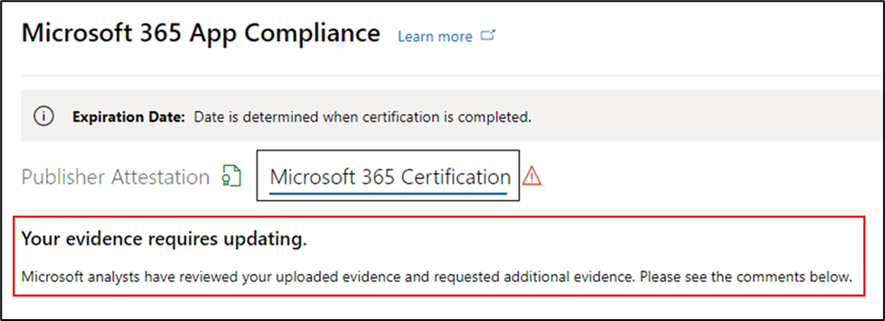
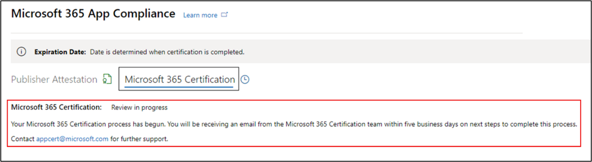
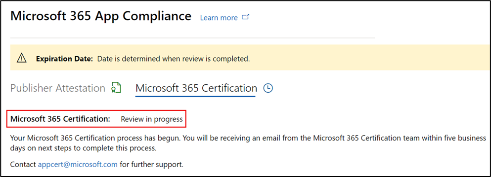
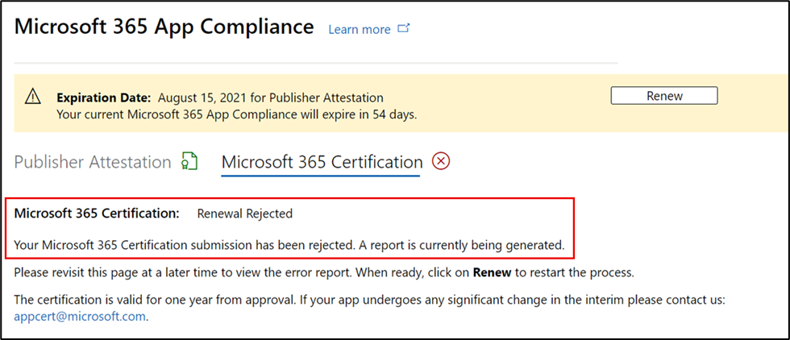

# パートナーのユーザー ガイド for Microsoft 365 コンプライアンス プログラム - SaaS

|段階|タイトル|
|---|---|
|フェーズ 1| Publisher の構成証明|
|フェーズ 2| Microsoft 365 認定|

## 1. 概要 

このドキュメントは、パートナー センター ポータルを通して、saaS アプリの Publisher 構成証明と認定を受けることを目指す Microsoft 365 App Compliance プログラムに登録されているパートナー向けステップバイステップのユーザー ガイドとして機能します。

## 2. 定義&頭字語
|略語 | 定義 |
|----|----|
|[PC (パートナー センター)](https://partner.microsoft.com/)|すべての Microsoft パートナーのポータル。 パートナーがパートナー センターにログインし、自己評価アンケートを送信します。 パートナー センター for Microsoft 365[コンプライアンス](https://partner.microsoft.com/dashboard/home)|
|ISV | 独立したソフトウェア ベンダー a.k.a. パートナーまたは開発者 |
|アプリ ソース | アプリのカタログ |
|例 |[仮想エージェント](https://appsource.microsoft.com/product/office/WA104381816)|

## 3. Publisher構成証明ワークフロー

**ホーム ページ**: パートナーがパートナー センターにログインした後のランディング ページです。

  
**手順 1** : ページの左側のナビゲーション バーで、次の操作を行います。

- [商用マーケットプレースの選択]
- [概要] の選択

  
[概要] を選択すると、パートナーはコンプライアンス プログラムの開始に使用できるアプリMicrosoft 365表示できます。
  
**手順 2:** リストからアプリを選択して、構成証明プロセスPublisher開始します。

アプリを選択すると、別のナビゲーション バーにオプション 'App Compliance' が表示されます。
  
**手順 3:**[アプリコンプライアンス] を選択する
  

  
**手順 4:** 自己評価のアンケートに記入し、Publisherします。

  
**メモ アプリケーションの更新/再送信に戻る場合は、[製品の選択] のドロップダウンをクリックし、アプリを選択して [複製] をクリックします。**

**また、この機能を活用Import/Exportフォームをオフラインで完成し、完了したらインポートすることもできます。**

 
**手順 5:** 完了したら、[送信] をクリックすると、評価は [レビュー中] に設定されます。
 
  
  
**シナリオの承認と拒否:**
  
A. Publisher構成証明の拒否
- 拒否の場合、パートナーは次の機能を使用できます。
     - エラー レポートの表示
          - パートナーは電子メールで通知され、パートナー センターでエラー レポートを表示できます。
     - 自己評価アンケートを更新して再提出します。
        

B.  Publisher構成証明の承認
- 承認を受け、パートナーは次の条件を実行できます。
     - 構成証明の更新と再送信
     - 完了した構成証明Publisher表示する
     - 認定プロセスMicrosoft 365開始する
        
        
  
 
  
**Post Publisher構成証明承認: 発行元が証明したアプリの AppSource のリンクの例。**
  

   
## 4. Microsoft 365認定ワークフロー
  
パートナーが認定プロセスを開始するには、チェック ボックスをオンにして [送信] をクリックします。
  
 
  
**手順 1** : 最初のドキュメント提出

すべての詳細を入力し、関連するドキュメントをアップロードし、[送信] をクリックします。
  
 
 ![ 提出] [最初のドキュメントの提出]](../media/UserGuidePhotos/15.png)
  
[送信] をクリックすると、最初のドキュメントの提出が確認されます。

  
アナリストは、最初のドキュメントが十分または関連性がない場合に、リビジョンを要求します。 アナリストはパートナーと作業を行い、承認に適切なドキュメントを取得します。

アナリストが最初のドキュメント提出を承認したら、パートナーは制御要件を提出する必要があります。
  
**手順 2**: コントロール要件の提出
  
すべての詳細を入力し、関連するドキュメントをアップロードし、[送信] をクリックします。

  

 
[送信] をクリックすると、最初のドキュメントの提出が確認されます。

  
分析者は、制御要件ドキュメントが十分または関連性がない場合に、改訂を要求します。 アナリストはパートナーと作業を行い、承認に適切なドキュメントを取得します。

  
 
 
申請が承認基準を満たしていない場合、アナリストは提出を拒否します。
  
パートナーはアナリストと一緒に関連する情報とドキュメントを提供できます。

  
すべてのセキュリティ基準が満たされた後、アナリストは申請を承認し、パートナーは認定Microsoft 365されます。

  
**認定後の承認: AppSource Microsoft 365認定バッジの例。** 

 
## 5. Microsoft 365ワークフロー:
  
**Microsoft 365Publisher証明と認定更新ワークフロー:**  

Microsoft 365アプリ コンプライアンス プログラムでは、年次更新プロセスが提供されます。 このプロセスの間、アプリ開発者は、既存の認証Publisherおよび認定に必要なドキュメントMicrosoft 365できます。 
 
**利点:** 

- AppSource、Office ストア、Teams管理ポータルで認定バッジを維持して、アプリを他のユーザーと区別します。 
- 認定アプリの使用に関する顧客の信頼を高める。 
- IT 管理者が、更新された認定情報で情報に基づいた意思決定を行う際に役立ちます。

新しい更新プロセスは、シームレスなエクスペリエンス [を提供するためにパートナー](https://partner.microsoft.com/dashboard/home) センターで利用できます。 有効期限の 90 日前からパートナー センターに更新通知が表示されます。 定期的なリマインダーは、有効期限の 90 日前、60 日前、30 日前に電子メールで送信されます。 
 
**フェーズ 1: Publisher構成証明の更新:**
  
アプリの構成証明Publisherは、毎年再送信する必要があります。 構成証明が 1 年のマークに近い場合、構成証明の再送信を促す電子メール リマインダーが送信されます。 
 
**手順 1:**[更新 **] を** 選択して、構成証明Publisher更新します。
  

  
**手順 2:** 以前の構成証明Publisher確認し、必要に応じて最新情報を更新します。 
  
準備ができたらPublisherの構成証明を送信します。 M365 アプリ コンプライアンス アナリストによってレビューされます。

  
**Publisher構成証明の更新が承認されました。**
  

  
**Publisher構成証明の有効期限が切れています。**
  
Microsoft ドキュメントのアプリの [構成証明] ページを維持するには、有効期限の前にアプリのPublisher更新する必要があります。また、さまざまなストアフロントでアプリの継続的なバッドとアイコンが確実に更新されます。 
 

**注**: 有効期限が切れたPublisher[更新] をクリックすると、いつでも構成証明の更新プロセスを開始できます。
 
**フェーズ 2: Microsoft 365の更新**
  
アプリの認定情報は、毎年再送信する必要があります。 これには、現在の環境のスコープ内コントロールを再評価する必要があります。 認定が 1 年近くに達すると、ドキュメントと証拠の再送信を促す電子メール通知が送信されます。
 
 

**認定更新の承認/却下のシナリオ:**

**シナリオ 1:** 

認定の更新が開始され、確認中です。
 
 

シナリオ 1A: 

認定更新の拒否: 
- 次の場合、認定は拒否される場合があります。 
     - アプリには必要なツール、プロセス、または構成が設定されていないので、認定ウィンドウ内で必要な変更を実装できない。 
     - アプリには未解決の脆弱性が存在し、認定ウィンドウ内では修正できません。 
 

シナリオ 1B: 

認定の更新が承認されました

**証明書の有効期限:**

Microsoft ドキュメントでアプリの認定ページを維持するには、有効期限より前にアプリの情報を更新する必要があります。また、AppSource と Team Store でアプリのバッドとアイコンを継続的に更新できます。

  
注: 有効期限が切れたらPublisher[更新] をクリックすると、いつでも構成証明と認定プロセスを開始できます。 
