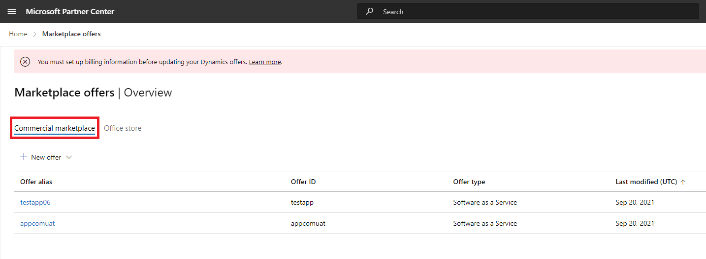

# Microsoft 365 アプリ コンプライアンス プログラムに関するパートナーのユーザー ガイド - SaaS

|段階|タイトル|
|---|---|
|フェーズ 1| Publisher の構成証明|
|フェーズ 2| Microsoft 365 認定|

## 1. 概要 

このドキュメントは、パートナー センター ポータルを使用して、SaaS アプリの構成証明と認定Publisher受けることを目的として、Microsoft 365 アプリ コンプライアンス プログラムに登録された、パートナー向けのステップ バイ ステップ ユーザー ガイドとして機能します。

## 2. 頭字語&定義
|略語 | 定義 |
|----|----|
|[PC (パートナー センター)](https://partner.microsoft.com/)|すべての Microsoft パートナー向けのポータル。 パートナーはパートナー センターにログインし、自己評価アンケートを送信します。 [Microsoft 365 アプリ コンプライアンス](https://partner.microsoft.com/dashboard/home)のパートナー センター|
|ISV | 独立系ソフトウェア ベンダー a.k.a. パートナーまたは開発者 |
|アプリ ソース | アプリのカタログ |
|例 |[今すぐ仮想エージェント](https://appsource.microsoft.com/product/office/WA104381816)|

## 3. Publisher構成証明ワークフロー

**ホーム ページ**: パートナーがパートナー センターにログインした後のランディング ページです。

  
**手順 1** : Marketplace プランを選択する

  
**手順 2**: [Marketplace Offers] を選択した後、[コマーシャル マーケットプレース] に切り替えます。

一覧からアプリを選択すると、別のナビゲーション バーに [アプリ コンプライアンス] オプションが表示されます。
  
**手順 3**: [アプリ コンプライアンス] を選択する
  

  
**手順 4**: Publisher構成証明の自己評価アンケートに記入します。

  
**注: アプリケーションの更新/再送信に戻る場合は、[製品の選択] のドロップダウンをクリックし、アプリを選択して [複製] をクリックします。**

**Import/Export機能を利用して、フォームをオフラインで完了し、完了したらインポートすることもできます。**

 
**手順 5**: 完了したら、[送信] をクリックすると、評価が [確認中] になります。
 
  
  
**承認/拒否のシナリオ:**
  
A. Publisher構成証明の拒否
- 拒否された場合、パートナーは次のことができます。
     - エラー レポートを表示する
          - パートナーは電子メールで通知を受け取り、パートナー センターでエラー レポートを表示できます
     - 自己評価アンケートを更新して再送信します。
        

B.  Publisher構成証明の承認
- パートナーは、承認時に次のことができます。
     - 構成証明を更新して再送信する
     - 完了したPublisher構成証明を表示する
     - Microsoft 365認定プロセスを開始する
        
        
  
 
  
**構成証明の承認Publisher投稿する: 発行元で構成証明されたアプリの AppSource のリンクの例。**
  

   
## 4. Microsoft 365認定ワークフロー
  
パートナーは、チェック ボックスをオンにして [送信] をクリックすることで、認定プロセスを開始できます。
  
 
  
**手順 1**: 最初のドキュメントの提出

すべての詳細を入力し、関連するドキュメントをアップロードし、[送信] をクリックします。
  
 

  
[送信] をクリックすると、最初のドキュメントの送信が確認されます。

  
アナリストは、最初のドキュメントが十分でない場合や関連がない場合に備え、リビジョンを要求します。 アナリストはパートナーと協力して、承認のための適切なドキュメントを取得します。

アナリストが最初のドキュメントの提出を承認したら、パートナーは制御要件を提出する必要があります。
  
**手順 2**: 要件の提出を制御する
  
すべての詳細を入力し、関連するドキュメントをアップロードし、[送信] をクリックします。

  

 
[送信] をクリックすると、最初のドキュメントの送信が確認されます。

  
アナリストは、制御要件ドキュメントが十分でない場合や関連がない場合に備え、リビジョンを要求します。 アナリストはパートナーと協力して、承認のための適切なドキュメントを取得します。

  
 
 
申請が承認基準を満たしていない場合、アナリストは提出を拒否します。
  
パートナーはアナリストと協力して、関連情報とドキュメントを提供できます。

  
すべてのセキュリティ標準が満たされると、アナリストは提出を承認し、パートナーは認定Microsoft 365されます。

  
**認定後の承認: AppSource のMicrosoft 365認定バッジの例。** 

 
## 5. Microsoft 365更新ワークフロー:
  
**Microsoft 365Publisher構成証明と認定更新ワークフロー:**  

Microsoft 365アプリ コンプライアンス プログラムでは、年間更新プロセスが提供されるようになりました。 このプロセスの間、アプリ開発者は、既存のPublisher構成証明アンケートと、Microsoft 365認定に必要なドキュメントを更新できます。 
 
**利点：** 

- AppSource、Office ストア、Teams ストア、さまざまな管理ポータルで認定バッジを保持し、アプリを他のユーザーと区別します。 
- 認定アプリの使用に対する顧客の信頼を高めます。 
- IT 管理者が更新された認定情報を使用して、情報に基づいた意思決定を行うのに役立ちます。

新しい更新プロセスは、シームレスなエクスペリエンスを提供するために [パートナー センター](https://partner.microsoft.com/dashboard/home) で利用できます。 更新通知は、有効期限の 90 日前からパートナー センターに表示されます。 定期的なリマインダーは、有効期限の 90 日前、60 日、30 日前に電子メールで送信されます。 
 
**フェーズ 1: 構成証明の更新Publisher:**
  
アプリのPublisher構成証明の回答は、年単位で再送信する必要があります。 構成証明が 1 年のマークに近づくと、構成証明の再送信を促す電子メール リマインダーが送信されます。 
 
**手順 1**: **[更新]** を選択して、Publisher構成証明を更新します。
  

  
**手順 2**: 前のPublisher構成証明の回答を確認し、必要に応じて最新情報を更新します。 
  
準備ができたら、更新のためにPublisher構成証明を送信します。 M365 アプリ コンプライアンス アナリストによってレビューされます。

  
**Publisher構成証明の更新が承認されています。**
  

  
**Publisher構成証明の有効期限が切れています。**
  
アプリの情報は、有効期限の前に更新して、Microsoft ドキュメントのアプリのPublisher構成証明ページを維持する必要があります。また、タイムリーな更新により、さまざまなネットショップでアプリの継続的な不正使用とアイコンが保証されます。 
 

**注**: 有効期限が切れると、構成証明の更新プロセスPublisherいつでも [更新] をクリックして開始できます。
 
**フェーズ 2: Microsoft 365認定更新**
  
アプリの認定情報は、年単位で再送信する必要があります。 これには、現在の環境のスコープ内コントロールを再検証する必要があります。 認定資格が 1 年に近づくと、ドキュメントと証拠の再送信を促す電子メール通知が送信されます。
 
 

**認定更新の承認/拒否のシナリオ:**

**シナリオ 1:** 

認定の更新が開始され、レビュー中です。
 
 

シナリオ 1A: 

認定更新の拒否: 
- 次の場合、認定は拒否される可能性があります。 
     - アプリには、必要なツール、プロセス、または構成が用意されておらず、認定期間内に必要な変更を実装することはできません。 
     - アプリには未解決の脆弱性があり、認定期間内では修正できません。 
 

シナリオ 1B: 

認定の更新が承認される

**認定資格の有効期限:**

Microsoft ドキュメントでアプリの [認定] ページを維持するには、アプリの情報を有効期限の前に更新する必要があります。また、タイムリーな更新により、AppSource と Team Store でアプリの継続的な不正使用とアイコンが保証されます。

  
注: 有効期限が切れると、Publisher構成証明と認定プロセスはいつでも [更新] をクリックして開始できます。 
