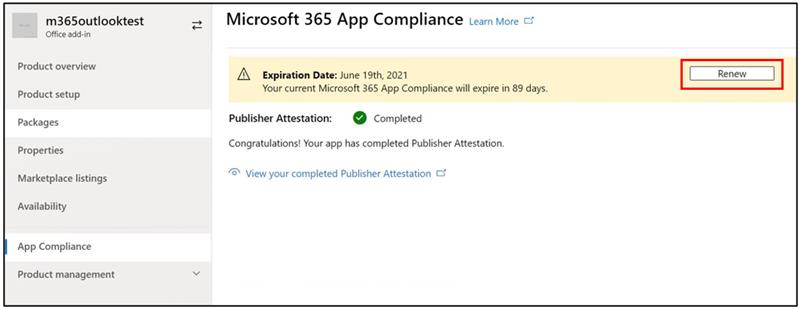

# アプリコンプライアンスプログラムのパートナーユーザーガイドMicrosoft 365Partner's User Guide for Microsoft 365 App Compliance Program

|||
|---|---|
|階層 1Tier 1| Publisher の構成証明Publisher Attestation|
|階層 2Tier 2| Microsoft 365 認定Microsoft 365 Certification|

## 1. 概要1. Overview
このドキュメントは、パートナー センター ポータルを使用してPublisherの構成証明と認定を受けることを目指して、Microsoft 365アプリ コンプライアンス プログラムに登録されたパートナーのステップ バイ ステップ ユーザー ガイドとして機能します。This document acts as a step-by-step user guide for our Partners, enrolled for Microsoft 365 App Compliance Program aiming to undergo Publisher Attestation and Certification though Partner Center portal.

## 2. 頭字語&定義2. Acronyms & Definitions
| | |
|---|----|
|略語Acronym | 定義Definition |
|PC(パートナー センター)PC (Partner Center)|すべてのマイクロソフト パートナー向けのポータル。A portal for all Microsoft Partners. パートナーがパートナー センターにログインし、アンケートSelf-Assessment送信する https://partner.microsoft.com/A Partner logs in to Partner Center and submits Self-Assessment Questionnaire https://partner.microsoft.com/|
|ISVISV|独立系ソフトウェアベンダー A.k.a.Independent Software Vendor A.k.a. パートナーまたは開発者Partner or Developer|
|アプリソースApp Source| アプリのカタログ (https://appsource.microsoft.com/)Catalog of apps (https://appsource.microsoft.com/)
||例: 今すぐ仮想エージェント (https://appsource.microsoft.com/en-us/product/office/WA104381816)Example: Now virtual agent (https://appsource.microsoft.com/en-us/product/office/WA104381816)|

## 3. Publisher構成証明のワークフロー3.   Publisher Attestation Workflow

ホームページ: パートナーがパートナーセンターにログインすると、ランディングページになります。Home Page: This is the landing page once a partner logs in to Partner Center.

**ステップ 1**   : ページの左側にあるナビゲーション バーで、次の操作を行います。**Step 1**   : On the left side of the page, in the navigation bar:
1. ストアOffice選択Select Office store
1. 概要の選択Select Overview

[概要] を選択すると、パートナー はパートナー センターを通じて提出され、Microsoft 365 コンプライアンス プログラムで利用できるアプリの一覧を表示できます。Upon selecting ‘Overview’, partner can see list of apps submitted through Partner Center and available for the Microsoft 365 Compliance program.

**ステップ 2:** リストからアプリを選択して、Publisher構成証明プロセスを開始します。**Step 2** : Select an app from the list to begin the Publisher Attestation process.

アプリを選択すると、別のナビゲーションバーが「アプリコンプライアンス」オプションでポップアップ表示されます。On selecting an app, another navigation bar will pop up with option ‘App Compliance’

**ステップ3:「** アプリのコンプライアンス」を選択**Step 3**: Select ‘App Compliance’

**ステップ4:Publisher** の証明のためのSelf-Assessmentアンケートに記入する**Step 4**: Fill out the Self-Assessment Questionnaire for Publisher Attestation

**注**:アプリケーションの更新/再提出に戻る場合は、「製品を選択」のドロップダウンをクリックし、アプリを選択して「複製」をクリックします。**Note**:If you are coming back to update/re-submit your application, click dropdown for ‘Choose the product’, select the app and click ‘clone’.

 

また、Import/Export機能を利用してフォームをオフラインで完成させ、完了後にインポートすることもできます。You can also leverage the Import/Export feature to complete the form offline and import it once completed. 

**ステップ5:** 完了したら、「送信」をクリックすると、評価は「審査中」になります。**Step 5**: Once completed, click on ‘Submit’, the assessment will now be ‘under review’.

![[合計]をクリックします。](../media/Picture8.png)

### シナリオの承認/却下:Approve/Reject Scenarios:

**A.Publisher証明却下****A.Publisher Attestation Rejection**

この段階で拒否された場合、パートナーは次のことができます。In case of rejection at this stage, an partner can:
-   エラー レポートを表示します。View failure report.
    - パートナーは、パートナー センターと電子メールで通知されます。Partner will be notified in Partner Center and via email.
-   Self-Assessment応答を更新します。Update Self-Assessment responses.
-   自己評価を再提出します。Re-submit Self-Assessment.

**B.Publisher構成証明再提出****B.Publisher Attestation Re-submission**

**C.Publisher認証承認****C.Publisher Attestation Approval**

-   承認されたパートナーは、次のことができます。Upon approval partner can:
    - 認証証明の更新と再送信Update and resubmit attestation
    - 完了したPublisher構成証明を表示して共有するView and share completed Publisher Attestation
    - M365 認証プロセスを開始するStart M365 Certification Process

**投稿Publisher検証承認: パブリッシャーの証明アプリの AppSource でのリンクの例****Post Publisher Verification Approval: Example of link in AppSource for publisher attested apps**

## 4. Microsoft 365認証ワークフロー4. Microsoft 365 Certification Workflow

パートナーが「送信」をクリックし、すべての文書と証拠を提出してレビューを行うと、次の手順を実行します。Once partner clicks on ‘Submit’ and submits all documents and evidence for review: 

### Microsoft 365認定 - 提出Microsoft 365 Certification - Submitted

**Microsoft 365認定 - 拒否****Microsoft 365 certification - Rejected**

**Microsoft 365認定 - 承認済み****Microsoft 365 Certification - Approved**

**認定後の承認: AppSource でMicrosoft 365認定バッジの例****Post Certification Approval: Example of Microsoft 365 certification badge in AppSource**

## 5. 既存の ISV のワークフロー5. Workflow for Existing ISVs

既存の ISV であり、構成証明Publisher更新する場合。If you are an existing ISV and want to Update Publisher Attestation.

**ステップ1:[Publisher** 構成証明を更新して再提出]リンクをクリックします。**Step 1**: Click on ‘Update and re-submit your Publisher Attestation’ link.

**注:** アプリケーションの更新/再提出に戻る場合は、「製品を選択」のドロップダウンをクリックし、アプリを選択して「インポート」をクリックします。**Note:**: If you are coming back to update/re-submit your application, click dropdown for ‘Choose the product’, select the app and click ‘Import’.

![[インポート] をクリックします。](../media/M365%20App%20compliance1.png)

**ステップ 2:** フォームを更新し、[保存/送信] をクリックします。**Step 2**: Make updates to your form and click Save/Submit.

![[保存] または [送信] をクリックします。](../media/existing%20isv%202.png)

提出後、審査中となります。Once submitted, it will be under review.

## 6. Microsoft 365 Publisher認証と認定の更新ワークフロー:6.   Microsoft 365 Publisher Attestation and Certification Renewal Workflow:

Microsoft 365アプリ コンプライアンス プログラムでは、年間更新プロセスが提供されるようになりました。Microsoft 365 App Compliance Program now offers an annual renewal process. このプロセス中に、アプリ開発者は、既存のPublisher構成証明アンケートおよびMicrosoft 365認定に必要な書類を更新できます。During this process, app developers can update their existing Publisher Attestation questionnaire and documents required for Microsoft 365 Certification. 

**利点：****Benefits:**

- アプリを他のアプリと区別するために、AppSource とチーム ストアで認定バッジを管理します。Maintain your certification badge in AppSource and Team Store to differentiate your app from others. 
- 認定アプリの使用に対する顧客の信頼度を高めます。Increase customer confidence in using your certified app. 
- IT 管理者が、最新の認定情報を基に情報に基づいた意思決定を行う手助けをします。Help IT admins make informed decisions with updated certification information. 

[パートナー センター](https://partner.microsoft.com/en-us/dashboard/home)では、シームレスなエクスペリエンスを提供するために、新しい更新プロセスを利用できます。The new renewal process is available in [Partner Center](https://partner.microsoft.com/en-us/dashboard/home) to provide a seamless experience. 有効期限の 90 日前から、パートナー センターに更新のリマインダーが表示されます。A renewal reminder will be shown in Partner Center starting 90 days before the expiration date. 定期的なリマインダーは、有効期限の90、60、30日前に電子メールで送信されます。Periodic reminders will also be sent via email at 90, 60 and 30 days before expiration.

**ティア 1: Publisher構成証明の更新:****Tier 1: Publisher Attestation Renewal:** 

アプリのPublisher構成証明の回答は、年間ベースで再提出する必要があります。The app’s Publisher Attestation answers will need to be resubmitted on an annual basis. 構成証明が1年のマークに近づくと、証明の再提出を促す電子メールリマインダーが送信されます。When the attestation nears 1-year mark, an email reminder will be sent encouraging a resubmission of the attestation. 

**手順 1**: [**更新]** を選択して、Publisher構成証明を更新します。**Step 1**: Select **Renew** to renew the Publisher Attestation. 

**ステップ2:** 以前のPublisher構成証明の回答を確認し、必要に応じて最新情報を更新します。**Step 2**: Review the previous Publisher Attestation answers and update with the latest information as needed. 準備が整ったら、更新のためにPublisher構成証明を提出します。Submit Publisher Attestation for renewal when ready. M365 アプリ コンプライアンス アナリストがレビューします。It will be reviewed by an M365 App Compliance Analyst.

**Publisher構成証明の有効期限が切れています:** アプリの情報は、Microsoft ドキュメントでアプリのPublisher構成証明ページを維持するために、有効期限前に更新する必要があります。タイムリーな更新はまた、AppSourceとチームストアでアプリの継続的なバッジとアイコンを確保します。**Publisher Attestation Expired:** The app’s information needs to be renewed before the expiration date to maintain the app’s Publisher Attestation page on the Microsoft docs. Timely renewal will also ensure continued badging and icons for the app in AppSource and Team Store.

注: 有効期限が切れたら、Publisher認証の更新プロセスは、[更新] をクリックしていつでも開始できます。Note: Once expired, Publisher Attestation renewal process can be started anytime by clicking ‘Renew’. 

**第2層:Microsoft 365認定更新****Tier 2: Microsoft 365 Certification Renewal** 

アプリの認定情報は、年単位で再提出する必要があります。The app’s certification information needs to be resubmitted on an annual basis. この場合、現在の環境のスコープ内コントロールの再検証が必要になります。This will require revalidation of the in-scope controls of your current environment. 認定が1年に近づくと、文書と証拠の再提出を促す電子メール通知が送信されます。When the Certification nears 1-year mark an email notification will be sent encouraging a resubmission of the documents and evidence. 

**認定の更新承認/却下シナリオ:****Certification Renewal Approve/Reject Scenarios:**

**シナリオ 1:****Scenario 1:** 

Publisher構成証明が完了しました。Publisher Attestation  is complete. 認定の更新が開始され、審査中です。Certification renewal has started and under review. 

**シナリオ 1A:****Scenario 1A:**

認定の更新の却下: 次の場合、認定は拒否される場合があります。Certification renewal rejection: Certification may be rejected if: 

 - アプリには、必要なツール、プロセス、または構成が設定されておらず、認定ウィンドウ内で必要な変更を実装できません。The app does not have the required tooling, processes, or configurations in place and will not be able to implement required changes within the certification window. 
 - アプリは、所定の場所に顕著な脆弱性を持っており、認定ウィンドウ内で修正することはできません。The app has outstanding vulnerabilities in place and cannot be fixed within the certification window. 

    
**シナリオ 1B:****Scenario 1B:** 

認定の更新が承認されましたCertification renewal is approved  

**認定期限:****Certification Expiration:**

アプリの情報は、Microsoft ドキュメントでアプリの認定ページを維持するために有効期限前に更新する必要があります。タイムリーな更新はまた、AppSourceとチームストアでアプリの継続的なバッジとアイコンを確保します。The app’s information needs to be renewed before the expiration date to maintain app’s Certification page on the Microsoft docs. Timely renewal will also ensure continued badging and icons for the app in AppSource and Team Store. 

    
**メモ**: 期限切れになると、Publisherの証明と認証プロセスは、[更新] をクリックしていつでも開始できます。**Note**: Once expired, Publisher Attestation and Certification process can be started anytime by clicking ‘Renew’. 

