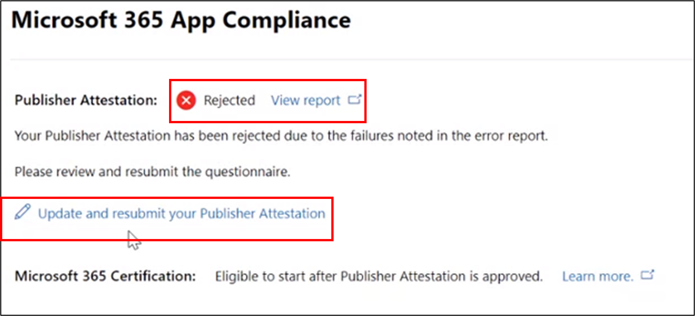

# Microsoft 365 アプリ コンプライアンス プログラムのパートナーのユーザー ガイド

|||
|---|---|
|階層 1| Publisher の構成証明|
|階層 2| Microsoft 365 認定|

## 1. 概要
このドキュメントは、パートナー センター ポータルを通して発行元の構成証明と認定を受けることを目的として、Microsoft 365 アプリ コンプライアンス プログラムに登録されているパートナー向けユーザー ガイドとして機能します。

## 2. 定義&頭字語
| | |
|---|----|
|略語 | 定義 |
|PC (パートナー センター)|すべての Microsoft パートナーのポータル。 パートナーがパートナー センターにログインし、アンケートをSelf-Assessmentする https://partner.microsoft.com/|
|ISV|独立したソフトウェア ベンダー A.k.a. パートナーまたは開発者|
|アプリ ソース| アプリのカタログ (https://appsource.microsoft.com/)
||例: 仮想エージェント (https://appsource.microsoft.com/en-us/product/office/WA104381816)|

## 3. Publisher 構成証明ワークフロー

ホーム ページ: パートナーがパートナー センターにログインすると、ランディング ページが表示されます。

**手順 1**   : ページの左側のナビゲーション バーで、次の操作を行います。
1. [ストアOffice選択]
1. [概要] の選択

[概要] を選択すると、パートナーはパートナー センターを通じて送信され、Microsoft 365 コンプライアンス プログラムで利用できるアプリの一覧を表示できます。

**手順 2:** リストからアプリを選択して、Publisher 構成証明プロセスを開始します。

アプリを選択すると、別のナビゲーション バーが表示されます。オプション 'App Compliance'

**手順 3:**[アプリコンプライアンス] を選択する

![[アプリのコンプライアンス] の選択](../media/App%20compliance%20step%203.png)

**手順 4:** Publisher 構成証明Self-Assessmentアンケートに記入する

**注**:アプリケーションの更新/再送信に戻る場合は、[製品の選択] のドロップダウンをクリックし、アプリを選択して [複製] をクリックします。

 

インポート/エクスポート機能を利用して、フォームをオフラインで完了し、完了したらインポートすることもできます。 

**手順 5:** 完了したら、[送信] をクリックすると、評価は "レビュー中" になされます。

![[Sumbit] をクリックします。](../media/Picture8.png)

### シナリオの承認と拒否:

**A.Publisher 構成証明の拒否**

この段階で拒否された場合、パートナーは次の機能を使用できます。
-   エラー レポートを表示します。
    - パートナーは、パートナー センターと電子メールで通知されます。
-   応答Self-Assessment更新します。
-   自己評価を再送信します。

**B.Publisher 構成証明の再申請**

**C.Publisher 構成証明の承認**

-   承認パートナーは、次の条件を実行できます。
    - 構成証明の更新と再送信
    - 完了した Publisher 構成証明の表示と共有
    - M365 認定プロセスの開始

**発行元検証後の承認: 発行元が証明したアプリの AppSource のリンクの例**

## 4. Microsoft 365 認定ワークフロー

パートナーが [送信] をクリックし、レビューのためにすべてのドキュメントと証拠を提出すると、次の情報が表示されます。 

### Microsoft 365 認定 - 提出済み

**Microsoft 365 認定 - 却下**

**Microsoft 365 認定 - 承認済み**

**認定後の承認: AppSource の Microsoft 365 認定バッジの例**

## 5. 既存の ISV のワークフロー

既存の ISV でパブリッシャー構成証明の更新を行う場合。

**手順 1:**[Publisher 構成証明の更新と再送信] リンクをクリックします。

**注:** アプリケーションの更新/再送信に戻る場合は、[製品の選択] のドロップダウンをクリックし、アプリを選択して [インポート] をクリックします。

![[インポート] をクリックします。](../media/M365%20App%20compliance1.png)

**手順 2:** フォームを更新し、[保存/送信] をクリックします。

![[保存] または [送信] をクリックします。](../media/existing%20isv%202.png)

送信されると、審査中です。

## 6. Microsoft 365 Re-Certificationワークフロー:

アプリが 1 年間の認定記念日に達すると、定期的に認定を更新するリマインダーが表示されます。

**Publisher 構成証明が完了しました。認定 InProgress。**

承認/却下 Secnario: A. 認定が拒否されました

B. 認定認定

有効期限シナリオ: A. Publisher 構成証明の有効期限切れ

B. 証明書の有効期限が切れています

