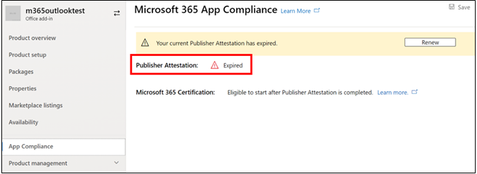
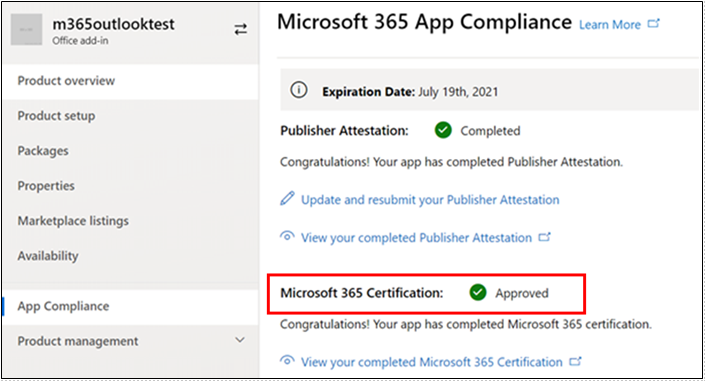

# アプリコンプライアンスプログラムのパートナーユーザーガイドMicrosoft 365

|||
|---|---|
|階層 1| Publisher の構成証明|
|階層 2| Microsoft 365 認定|

## 1. 概要
このドキュメントは、パートナー センター ポータルを使用してPublisherの構成証明と認定を受けることを目指して、Microsoft 365アプリ コンプライアンス プログラムに登録されたパートナーのステップ バイ ステップ ユーザー ガイドとして機能します。

## 2. 頭字語&定義
| | |
|---|----|
|略語 | 定義 |
|PC(パートナー センター)|すべてのマイクロソフト パートナー向けのポータル。 パートナーがパートナー センターにログインし、アンケートSelf-Assessment送信する https://partner.microsoft.com/|
|ISV|独立系ソフトウェアベンダー A.k.a. パートナーまたは開発者|
|アプリソース| アプリのカタログ (https://appsource.microsoft.com/)
||例: 今すぐ仮想エージェント (https://appsource.microsoft.com/en-us/product/office/WA104381816)|

## 3. Publisher構成証明のワークフロー

ホームページ: パートナーがパートナーセンターにログインすると、ランディングページになります。

**ステップ 1**   : ページの左側にあるナビゲーション バーで、次の操作を行います。
1. ストアOffice選択
1. 概要の選択

[概要] を選択すると、パートナー はパートナー センターを通じて提出され、Microsoft 365 コンプライアンス プログラムで利用できるアプリの一覧を表示できます。

**ステップ 2:** リストからアプリを選択して、Publisher構成証明プロセスを開始します。

アプリを選択すると、別のナビゲーションバーが「アプリコンプライアンス」オプションでポップアップ表示されます。

**ステップ3:「** アプリのコンプライアンス」を選択

**ステップ4:Publisher** の証明のためのSelf-Assessmentアンケートに記入する

**注**:アプリケーションの更新/再提出に戻る場合は、「製品を選択」のドロップダウンをクリックし、アプリを選択して「複製」をクリックします。

 

また、Import/Export機能を利用してフォームをオフラインで完成させ、完了後にインポートすることもできます。 

**ステップ5:** 完了したら、「送信」をクリックすると、評価は「審査中」になります。

![[合計]をクリックします。](../media/Picture8.png)

### シナリオの承認/却下:

**A.Publisher証明却下**

この段階で拒否された場合、パートナーは次のことができます。
-   エラー レポートを表示します。
    - パートナーは、パートナー センターと電子メールで通知されます。
-   Self-Assessment応答を更新します。
-   自己評価を再提出します。

**B.Publisher構成証明再提出**

**C.Publisher認証承認**

-   承認されたパートナーは、次のことができます。
    - 認証証明の更新と再送信
    - 完了したPublisher構成証明を表示して共有する
    - M365 認証プロセスを開始する

**投稿Publisher検証承認: パブリッシャーの証明アプリの AppSource でのリンクの例**

## 4. Microsoft 365認証ワークフロー

パートナーが「送信」をクリックし、すべての文書と証拠を提出してレビューを行うと、次の手順を実行します。 

### Microsoft 365認定 - 提出

**Microsoft 365認定 - 拒否**

**Microsoft 365認定 - 承認済み**

**認定後の承認: AppSource でMicrosoft 365認定バッジの例**

## 5. 既存の ISV のワークフロー

既存の ISV であり、構成証明Publisher更新する場合。

**ステップ1:[Publisher** 構成証明を更新して再提出]リンクをクリックします。

**注:** アプリケーションの更新/再提出に戻る場合は、「製品を選択」のドロップダウンをクリックし、アプリを選択して「インポート」をクリックします。

![[インポート] をクリックします。](../media/M365%20App%20compliance1.png)

**ステップ 2:** フォームを更新し、[保存/送信] をクリックします。

![[保存] または [送信] をクリックします。](../media/existing%20isv%202.png)

提出後、審査中となります。

## 6. Microsoft 365 Publisher認証と認定の更新ワークフロー:

Microsoft 365アプリ コンプライアンス プログラムでは、年間更新プロセスが提供されるようになりました。 このプロセス中に、アプリ開発者は、既存のPublisher構成証明アンケートおよびMicrosoft 365認定に必要な書類を更新できます。 

**利点：**

- アプリを他のアプリと区別するために、AppSource とチーム ストアで認定バッジを管理します。 
- 認定アプリの使用に対する顧客の信頼度を高めます。 
- IT 管理者が、最新の認定情報を基に情報に基づいた意思決定を行う手助けをします。 

[パートナー センター](https://partner.microsoft.com/en-us/dashboard/home)では、シームレスなエクスペリエンスを提供するために、新しい更新プロセスを利用できます。 有効期限の 90 日前から、パートナー センターに更新のリマインダーが表示されます。 定期的なリマインダーは、有効期限の90、60、30日前に電子メールで送信されます。

**ティア 1: Publisher構成証明の更新:** 

アプリのPublisher構成証明の回答は、年間ベースで再提出する必要があります。 構成証明が1年のマークに近づくと、証明の再提出を促す電子メールリマインダーが送信されます。 

**手順 1**: [**更新]** を選択して、Publisher構成証明を更新します。 

**ステップ2:** 以前のPublisher構成証明の回答を確認し、必要に応じて最新情報を更新します。 準備が整ったら、更新のためにPublisher構成証明を提出します。 M365 アプリ コンプライアンス アナリストがレビューします。

**Publisher構成証明の有効期限が切れています:** アプリの情報は、Microsoft ドキュメントでアプリのPublisher構成証明ページを維持するために、有効期限前に更新する必要があります。タイムリーな更新はまた、AppSourceとチームストアでアプリの継続的なバッジとアイコンを確保します。

注: 有効期限が切れたら、Publisher認証の更新プロセスは、[更新] をクリックしていつでも開始できます。 

**第2層:Microsoft 365認定更新** 

アプリの認定情報は、年単位で再提出する必要があります。 この場合、現在の環境のスコープ内コントロールの再検証が必要になります。 認定が1年に近づくと、文書と証拠の再提出を促す電子メール通知が送信されます。 

**認定の更新承認/却下シナリオ:**

**シナリオ 1:** 

Publisher構成証明が完了しました。 認定の更新が開始され、審査中です。 

**シナリオ 1A:**

認定の更新の却下: 次の場合、認定は拒否される場合があります。 

 - アプリには、必要なツール、プロセス、または構成が設定されておらず、認定ウィンドウ内で必要な変更を実装できません。 
 - アプリは、所定の場所に顕著な脆弱性を持っており、認定ウィンドウ内で修正することはできません。 

    
**シナリオ 1B:** 

認定の更新が承認されました  

**認定期限:**

アプリの情報は、Microsoft ドキュメントでアプリの認定ページを維持するために有効期限前に更新する必要があります。タイムリーな更新はまた、AppSourceとチームストアでアプリの継続的なバッジとアイコンを確保します。 

    
**メモ**: 期限切れになると、Publisherの証明と認証プロセスは、[更新] をクリックしていつでも開始できます。 

