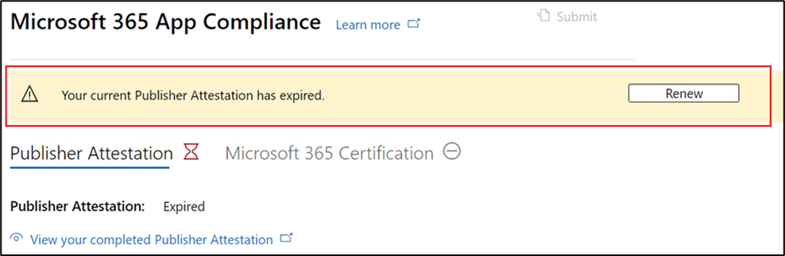

# パートナーのユーザー ガイド for Microsoft 365 コンプライアンス プログラムPartner's User Guide for Microsoft 365 App Compliance Program

|フェーズPhase|タイトルTitle|
|---|---|
|フェーズ 1Phase 1| Publisher の構成証明Publisher Attestation|
|フェーズ 2Phase 2| Microsoft 365 認定Microsoft 365 Certification|

## 1. 概要1. Overview
このドキュメントは、パートナー センター ポータルを通して Publisher 構成証明と認定を受けることを目指す Microsoft 365 アプリ コンプライアンス プログラムに登録されているパートナー向けステップバイステップのユーザー ガイドとして機能します。This document acts as a step-by-step user guide for our partners enrolled in the Microsoft 365 App Compliance program aiming to undergo Publisher Attestation and Certification though the Partner Center portal.

## 2. 定義&頭字語2. Acronyms & Definitions
| 略語Acronym |定義Definition |
|---|----|
|PC [(パートナー センター)](https://partner.microsoft.com/)PC [(Partner Center)](https://partner.microsoft.com/)|すべての Microsoft パートナーのポータル。A portal for all Microsoft partners. パートナーがパートナー センターにログインし、自己評価アンケートを送信します。A partner logs in to Partner Center and submits self-assessment questionnaire. [パートナー センター](https://partner.microsoft.com/dashboard/home) for Microsoft 365 コンプライアンス[Partner Center](https://partner.microsoft.com/dashboard/home) for Microsoft 365 App Compliance|
|ISVISV|独立したソフトウェア ベンダー。Independent Software Vendor. A.k.a.A.k.a. パートナーまたは開発者partner or developer|
|アプリ ソースApp Source| [アプリのカタログCatalog of apps](https://appsource.microsoft.com/)
|例Example|[仮想エージェントNow virtual agent](https://appsource.microsoft.com/product/office/WA104381816)|

## 3. Publisher構成証明ワークフロー3.   Publisher Attestation Workflow

**ホーム ページ** : パートナーがパートナー センターにログインした後のランディング ページです。**Home Page** : This is the landing page once a partner logs in to Partner Center.

**手順 1**   : ページの左側のナビゲーション バーで、次の操作を行います。**Step 1**   : On the left side of the page, in the navigation bar:
- [ストアOfficeを選択するSelect Office store
- [概要] の選択Select Overview

[概要] を選択すると、パートナーはパートナー センターを通じて送信されたアプリの一覧を表示し、コンプライアンス プログラムMicrosoft 365できます。Upon selecting ‘Overview’, partner can see list of apps submitted through Partner Center and available for the Microsoft 365 Compliance program.

**手順 2:** リストからアプリを選択して、構成証明プロセスPublisher開始します。**Step 2** : Select an app from the list to begin the Publisher Attestation process.

アプリを選択すると、別のナビゲーション バーにオプション 'App Compliance' が表示されます。On selecting an app, another navigation bar will pop up with option ‘App Compliance.’

**手順 3:**[アプリコンプライアンス] を選択する**Step 3**: Select ‘App Compliance’

![[アプリのコンプライアンス] の選択](../media/UserGuidePhotos/04.png)

**手順 4**: 自己評価アンケートに記入して、Publisher構成証明**Step 4**: Fill out the self-assessment questionnaire for Publisher Attestation

**メモ アプリケーションの更新/再送信に戻る場合は、[製品の選択] のドロップダウンをクリックし、アプリを選択して [複製] をクリックします。****Note If you are coming back to update/re-submit your application, click dropdown for ‘Choose the product’, select the app and click ‘Clone.’**

また、この機能を活用Import/Exportフォームをオフラインで完成し、完了したらインポートすることもできます。You can also leverage the Import/Export feature to complete the form offline and import it once completed.

**手順 5**: 完了したら、[送信] をクリックすると、評価は [レビュー中] に設定されます。**Step 5**: Once completed, click on ‘Submit’, the assessment will now be ‘Under Review.'

![[Sumbit] をクリックします。](../media/UserGuidePhotos/07.png)

### シナリオの承認と拒否:Approve/Reject Scenarios:

**A. Publisher構成証明の拒否****A. Publisher Attestation Rejection**

- この段階で拒否された場合、パートナーは次の機能を使用できます。In case of rejection at this stage, an partner can:
    - エラー レポートの表示View failure report
         - パートナーは電子メールで通知され、パートナー センターでエラー レポートを表示できます。Partner will be notified via email, and they can view the failure report in Partner Center
    - 構成証明の更新と再送信PublisherするUpdate and re-submit Publisher Attestation

**B. Publisher構成証明の承認****B. Publisher Attestation Approval**

- 承認パートナーは、次の条件を実行できます。Upon approval partner can:
    - 構成証明の更新と再送信Update and resubmit attestation
    - 完了した構成証明を表示Publisher共有するView and share completed Publisher Attestation
    - 認定プロセスMicrosoft 365開始するStart Microsoft 365 Certification process

**Post Publisher構成証明の承認: 発行元の証明されたアプリの AppSource のリンクの例****Post Publisher Attestation Approval: Example of link in AppSource for publisher attested apps**

## 4. Microsoft 365認定ワークフロー4. Microsoft 365 Certification Workflow

パートナーが認定プロセスを開始するには、チェック ボックスをオンにして [送信] をクリックします。A partner can begin the Certification process by selecting the checkbox and clicking ‘Submit’ 

**手順 1:** [最初のドキュメント提出] すべての詳細を入力し、関連するドキュメントをアップロードし、[送信] をクリックします。**Step 1:** Initial Document Submission Fill out all the details, upload relevant documents and Click ‘Submit’

 

[送信] をクリックすると、構成証明の申請が審査中です。On clicking submit, the attestation submission will be under review. 

アナリストは、最初のドキュメントが十分または関連性がない場合に、リビジョンを要求します。An analyst requests a revision in case the initial documents are not sufficient or relevant. アナリストはパートナーと作業を行い、承認に適切なドキュメントを取得します。The analyst will work with the partner to help get the right documents for approval. 

アナリストが最初のドキュメント提出を承認したら、パートナーは制御要件を提出する必要があります。Once the analyst approves the initial document submission, the partner needs to submit the control requirements. 

**手順 2:** Control Requirement Submission すべての詳細を入力し、関連するドキュメントをアップロードし、[送信] をクリックします。**Step 2:** Control Requirement Submission Fill out all the details, upload relevant documents and Click ‘Submit’ 

 
 

[送信] をクリックすると、認定申請が審査中です。On clicking Submit, the certification submission will be under review. 

分析者は、制御要件ドキュメントが十分または関連性がない場合に、改訂を要求します。An analyst requests a revision in case the control requirement documents are not sufficient or relevant. アナリストはパートナーと作業を行い、承認に適切なドキュメントを取得します。The analyst will work with the partner to help get the right documents for approval. 

 
 

申請が承認基準を満たしていない場合、アナリストは提出を拒否します。In case the submission does not satisfy the approval standards, the analyst will reject the submission. パートナーはアナリストと一緒に関連する情報とドキュメントを提供できます。The partner can work with the analyst to provide the relevant information and documents. 

すべてのセキュリティ基準が満たされた後、アナリストは申請を承認し、パートナーは認定Microsoft 365されます。Once all the security standards have been met, the analyst will approve the submission and the partner will be Microsoft 365 Certified. 

**認定後の承認: AppSource Microsoft 365認定バッジの例****Post Certification Approval: Example of Microsoft 365 certification badge in AppSource**

## 5. Microsoft 365ワークフロー:5.   Microsoft 365 Renewal Workflow:
  
**Microsoft 365 Publisher構成** 証明と認定更新ワークフロー: Microsoft 365コンプライアンス プログラムでは、年次更新プロセスが提供されます。**Microsoft 365 Publisher Attestation and Certification Renewal Workflow:** Microsoft 365 App Compliance Program now offers an annual renewal process. このプロセスの間、アプリ開発者は、既存の認証Publisherおよび認定に必要なドキュメントMicrosoft 365できます。During this process, app developers can update their existing Publisher Attestation questionnaire and documents required for Microsoft 365 Certification. 
 
**利点:****Benefits:** 

- アプリを区別するために、AppSource、Teamsストア、Officeストア、その他のストアフロントで認定バッジを維持します。Maintain your certification badge in AppSource, the Teams Store, the Office Store and other storefronts to differentiate the app. 
- 認定アプリの使用に関する顧客の信頼を高める。Increase customer confidence in using your certified app. 
- IT 管理者が、更新された認定情報で情報に基づいた意思決定を行う際に役立ちます。Help IT admins make informed decisions with updated certification information. 

パートナー センターでは、シームレスなエクスペリエンス [を提供](https://partner.microsoft.com/dashboard/home) するために、更新プロセスを利用できます。The renewal process is available in [Partner Center](https://partner.microsoft.com/dashboard/home) to provide a seamless experience. 有効期限の 90 日前からパートナー センターに更新通知が表示されます。A renewal reminder will be shown in Partner Center starting 90 days before the expiration date. 定期的なリマインダーは、有効期限の 90 日前、60 日前、30 日前に電子メールで送信されます。Periodic reminders will also be sent via email at 90, 60 and 30 days before expiration.

**フェーズ 1: Publisher構成証明の更新:****Phase 1: Publisher Attestation Renewal:** 

新しい更新プロセスは、シームレスなエクスペリエンス [を提供するためにパートナー](https://partner.microsoft.com/dashboard/home) センターで利用できます。The new renewal process is available in [Partner Center](https://partner.microsoft.com/dashboard/home) to provide a seamless experience. 有効期限の 90 日前からパートナー センターに更新通知が表示されます。A renewal reminder will be shown in Partner Center starting 90 days before the expiration date. 定期的なリマインダーは、有効期限の 90 日前、60 日前、30 日前に電子メールで送信されます。Periodic reminders will also be sent via email at 90, 60 and 30 days before expiration. 

**手順 1:**[更新 **] を** 選択して、構成証明Publisher更新します。**Step 1**: Select **Renew** to renew the Publisher Attestation. 

**手順 2:** 以前の構成証明Publisher確認し、必要に応じて最新情報を更新します。**Step 2**: Review the previous Publisher Attestation answers and update with the latest information as needed. 準備ができたらPublisherの構成証明を送信します。Submit Publisher Attestation for renewal when ready. これは、アプリコンプライアンスアナリストによってMicrosoft 365されます。It will be reviewed by an Microsoft 365 app compliance analyst.

**Publisher構成証明の更新が承認されました****Publisher Attestation Renewal Approved**

**Publisher構成証明の有効期限が切れています。** Microsoft ドキュメントのアプリの [構成証明] ページを維持するには、有効期限の前にアプリのPublisher更新する必要があります。また、AppSource、Teams ストア、ストア、その他のストアフロントでアプリのOfficeアイコンを継続的に更新します。**Publisher Attestation Expired:** The app’s information needs to be renewed before the expiration date to maintain the app’s Publisher Attestation page on the Microsoft docs. Timely renewal will also ensure continued badging and icons for the app in AppSource, Teams Store, Office Store and other storefronts.

注: 有効期限が切れたPublisher[更新] をクリックすると、いつでも構成証明の更新プロセスを開始できます。Note: Once expired, Publisher Attestation renewal process can be started anytime by clicking ‘Renew’. 

**フェーズ 2: Microsoft 365の更新****Phase 2: Microsoft 365 Certification Renewal** 

アプリの認定情報は、毎年再送信する必要があります。The app’s certification information needs to be resubmitted on an annual basis. これには、現在の環境のスコープ内コントロールを再評価する必要があります。This will require revalidation of the in-scope controls of your current environment. 認定が 1 年近くに達すると、ドキュメントと証拠の再送信を促す電子メール通知が送信されます。When the Certification nears 1-year mark an email notification will be sent encouraging a resubmission of the documents and evidence. 

**認定更新の承認/却下のシナリオ:****Certification Renewal Approve/Reject Scenarios:**
 
**シナリオ 1:****Scenario 1:** 

認定の更新が開始され、確認中です。Certification renewal has started and is under review.

**シナリオ 1A:****Scenario 1A:**

認定更新拒否: 次の場合、認定は拒否される場合があります。Certification renewal rejection: Certification may be rejected if: 
- アプリには必要なツール、プロセス、または構成が設定されていないので、認定ウィンドウ内で必要な変更を実装できない。The app does not have the required tooling, processes, or configurations in place and will not be able to implement required changes within the certification window. 
- アプリには未解決の脆弱性が存在し、認定ウィンドウ内では修正できません。The app has outstanding vulnerabilities in place and cannot be fixed within the certification window. 
 

    
**シナリオ 1B:****Scenario 1B:** 

認定の更新が承認されましたCertification renewal is approved  

**証明書の有効期限:****Certification Expiration:**
 
Microsoft ドキュメントでアプリの認定ページを維持するには、有効期限より前にアプリの情報を更新する必要があります。また、AppSource と Team Store でアプリのバッドとアイコンを継続的に更新できます。The app’s information needs to be renewed before the expiration date to maintain app’s Certification page on the Microsoft docs. Timely renewal will also ensure continued badging and icons for the app in AppSource and Team Store.

Microsoft ドキュメントでアプリの認定ページを維持するには、有効期限より前にアプリの情報を更新する必要があります。また、AppSource、Teams ストア、ストア、その他のストアフロントでアプリのOfficeアイコンを継続的に更新します。The app’s information needs to be renewed before the expiration date to maintain app’s Certification page on the Microsoft docs. Timely renewal will also ensure continued badging and icons for the app in AppSource, Teams Store, Office Store and other storefronts. 

    
**注**: 有効期限が切れたらPublisher[更新] をクリックすると、いつでも認証と認定プロセスを開始できます。**Note**: Once expired, Publisher Attestation and Certification process can be started anytime by clicking ‘Renew’. 

