# Microsoft 365認定 - サンプル証拠ガイド

## 概要

このガイドは、MICROSOFT 365認定管理のそれぞれに必要な証拠の種類と詳細レベルの例を ISV に提供するために作成されました。 このドキュメントで共有されている例は、コントロールが満たされていることを示すために使用できる唯一の証拠ではなく、必要な証拠の種類のガイドラインとしてのみ機能します。 

注: 要件を満たすために使用される実際のインターフェイス、スクリーンショット、ドキュメントは、製品の使用、システムのセットアップ、内部プロセスによって異なります。 さらに、ポリシーまたは手順のドキュメントが必要な場合、ISV は実際のドキュメントを送信する必要があり、例の一部に示されているようにスクリーンショットは送信しません。 

認定には、提出が必要な 2 つのセクションがあります。
1. [**最初のドキュメント提出:**](../docs/initialdocumentsubguide.md) 評価のスコープを設定するために必要な小さな一連の高レベルのドキュメント。
1. **証拠の提出:** 認定評価のスコープ内の各コントロールに必要な証拠の完全なセット。 

## 構造 

このドキュメントは、パートナー センターでの認定時に提示されるコントロールに直接マップされます。 このドキュメントで提供されるガイダンスは、次のように詳しく説明されています。
- セキュリティ ドメイン: すべてのコントロールがグループ化される 3 つのセキュリティ ドメイン(Application Security、Operational Security、Data Security and Privacy)。
- コントロール: = 評価アクティビティの説明 - これらのコントロールと関連する番号 (No.) は、Microsoft 365認定チェックリストから直接取得されます。  
- 意図: = セキュリティ制御がプログラム内に含まれる理由と、軽減を目的とする特定のリスクの意図。  この情報が ISV に対して、収集する必要がある証拠の種類と、ISV が注意を払う必要がある証拠の生成に対する認識と理解を深めるために、コントロールの背後にある理由が ISV に提供されることを願っています。
- 証拠のガイドラインの例: = Microsoft 365認定チェックリスト スプレッドシートの証拠収集タスクをガイドするのに役立ちます。これにより、ISV は、それを使用してコントロールが配置され、維持されていることを確信して判断する認定アナリストが使用できる証拠の種類の例を明確に確認できます。これは、決して本質的に網羅的ではありません。
- 証拠の例: = このセクションでは、Microsoft 365認定チェックリスト スプレッドシート内の各コントロールに対してキャプチャされた潜在的な証拠のスクリーンショットと画像の例を示します。具体的には、運用セキュリティとデータセキュリティとプライバシーのセキュリティ ドメイン (スプレッドシート内のタブ) について説明します。 例の中に赤い矢印とボックスがある情報は、コントロールを満たすために必要な要件を理解するのに役立ちます。

## セキュリティ ドメイン: アプリケーション セキュリティ

**コントロール 1 - コントロール 16**:

Application Security ドメイン コントロールは、アプリに未解決の脆弱性がないことを示す、過去 12 か月以内に発行された侵入テスト レポートで満たすことができます。 唯一必要な提出は、評判の良い独立した会社によるクリーンなレポートです。 

## セキュリティ ドメイン: 運用セキュリティ/セキュリティで保護された開発

"運用セキュリティ/セキュリティ開発" セキュリティ ドメインは、ISV が脅威アクターから直面する無数の脅威に対して強力な一連のセキュリティ軽減手法を実装するように設計されています。  これは、セキュリティで保護された環境を構築するために、オペレーティング環境とソフトウェア開発プロセスを保護するように設計されています。

#### マルウェア対策 - ウイルス対策

**コントロール No 1:** ウイルス対策のプラクティスと手順を管理するポリシー ドキュメントを提供します。
- 意図: このコントロールの目的は、コンピューター ウイルスからの脅威を検討するときに直面する問題に対する ISV の理解を評価することです。 ISV は、ウイルス対策ポリシーとプロセスを開発する際に業界のベスト プラクティスを確立して使用することで、マルウェアが直面するリスクを軽減し、ウイルスの検出と排除に関するベスト プラクティスを一覧表示する組織の能力に合わせたリソースを提供し、文書化されたポリシーが組織とその従業員に推奨されるセキュリティ ガイダンスを提供する証拠を提供します。 ISV がマルウェア対策デセンシーを展開する方法に関するポリシーと手順を文書化することで、マルウェアの環境へのリスクを軽減するために、このテクノロジの一貫したロールアウトとメンテナンスが保証されます。

- 証拠のガイドラインの例: ウイルス対策/マルウェアのベスト プラクティスを促進するために、インフラストラクチャ内に実装されているプロセスと手順を詳しく説明したウイルス対策/マルウェア対策ポリシーのコピーを提供します。
証拠の例

- 証拠の例:

**メモ：** このスクリーンショットはポリシー/プロセス ドキュメントを示しています。ISV は実際のサポート ポリシー/手順ドキュメントを共有し、単にスクリーンショットを提供する必要はありません。

**コントロール番号 2:** サンプリングされたすべてのシステム コンポーネントでウイルス対策ソフトウェアが実行されていることを示す実証可能な証拠を提供します。

- 意図: 環境内でウイルス対策 (AV) (またはマルウェア対策) を実行して、複雑さと数の両方で、潜在的に有害な攻撃が増加していることを認識する可能性のあるサイバー セキュリティ リスクから保護することが重要です。 AV をその使用をサポートするすべてのシステム コンポーネントに展開すると、マルウェア対策が環境に導入されるリスクの一部を軽減するのに役立ちます。 脅威アクターが環境への足掛かりを得るための攻撃のベクトルを提供するには、保護されていないエンドポイントが 1 つだけ必要です。 そのため、AV は、この種の脅威から保護するために、いくつかの防御レイヤーの 1 つとして使用する必要があります。

- 証拠のガイドラインの例: AV のアクティブなインスタンスが評価された環境で実行されていることを証明する。 ウイルス対策プロセスの実行、ウイルス対策ソフトウェアがアクティブであることを示すウイルス対策の使用をサポートするサンプル _内のすべてのデバイス_ のスクリーンショットを提供します。または、ウイルス対策用の一元管理コンソールがある場合は、その管理コンソールからそれをデモンストレーションできる場合があります。 管理コンソールを使用している場合は、サンプリングされたデバイスが接続され、動作していることをスクリーンショットで確認してください。

- 証拠例 1: 次のスクリーンショットはAzure Security Centerから取得されています。これは、MSPGPRODAZUR01&quot; という名前&quot;の VM にマルウェア対策拡張機能がデプロイされていることを示しています。

- 証拠の例 2

次のスクリーンショットは、Windows 10 デバイスから取得されており、ホスト名&quot;の「クララネット-SBU-WM&quot;」のリアルタイム保護&quot;がオンになっていることを&quot;示しています。

**コントロール番号 3:** ウイルス対策シグネチャがすべての環境 (1 日以内) で最新であることを示す証拠を提供します。

- 意図: 毎日、数十万の新しいマルウェアと不要と思われるアプリケーション (PUA) が特定されます。 新しくリリースされたマルウェアに対して適切な保護を提供するには、新しくリリースされたマルウェアを考慮するために AV 署名を定期的に更新する必要があります。

- この制御は、ISV が環境のセキュリティと、古い AV がセキュリティに与える影響を考慮するために存在します。

- 証拠のガイドラインの例: サンプリングされた各デバイスからウイルス対策ログ ファイルを提供し、更新プログラムが毎日適用されることを示します。

- 証拠の例: 次のスクリーンショットは、更新プログラム&#39;イベント 2000 Windows Defender&#39;を示すことによって、Microsoft Defender が少なくとも毎日更新していることを示しています。 ホスト名が表示され、これはスコープ内システム &quot;の INTERNALNET-SBU-WM から取得されたことを示します&quot;。

**メモ：** 提供される証拠には、より長い期間にわたって毎日の更新プログラムを表示するためにログのエクスポートを含める必要があります。 一部のウイルス対策製品では、更新ログ ファイルが生成されるため、これらのファイルを指定するか、イベント ビューアーからログをエクスポートする必要があります。

**コントロール番号 4:** サンプリングされたすべてのシステム コンポーネントで、オンアクセス スキャンまたは定期的なスキャンを実行するようにウイルス対策が構成されていることを示す証拠を提供します。

**メモ：** オンアクセス スキャンが有効になっていない場合は、毎日のスキャンとalerting_最小のスキャンが有効_be必要 **があります** 。

- 意図: このコントロールの目的は、マルウェアが環境に与える影響を最小限に抑えるために、マルウェアを迅速に特定できるようにすることです。 オンアクセス スキャンが実行され、マルウェアが自動的にブロックされる場合、これはウイルス対策ソフトウェアで知られているマルウェア感染を停止するのに役立ちます。 オンアクセス スキャン&#39;、サービスの停止を引き起こす偽陽性のリスクが原因で望ましくない場合は、適切な毎日 (またはそれ以上) のスキャンとアラート メカニズムを実装して、マルウェア感染に対するタイムリーな対応を確保して被害を最小限に抑える必要があります。

- 証拠のガイドラインの例: ウイルス対策をサポートするサンプル _内のすべてのデバイス_ のスクリーンショットを提供し、ウイルス対策がデバイスで実行されており、オンアクセス (リアルタイム スキャン) スキャン用に構成されていることを示すか、定期的なスキャンが毎日のスキャンに有効になっていることを示すスクリーンショットを提供 **するか** 、アラートが構成され、サンプル _内のすべてのデバイス_ の最後のスキャン日を示すスクリーンショットを提供します。

- 証拠の例: 次のスクリーンショットは、 &quot;ホストである、RETRYNET-SBU-WM&quot; に対してリアルタイム保護が有効になっていることを示しています。

**コントロール番号 5:** マルウェアや検疫を自動的にブロックし、サンプリングされたすべてのシステム コンポーネントでアラートを送信するようにウイルス対策が構成されていることを示す証拠を提供します。

- 意図: マルウェアの洗練は、さまざまな程度の破壊的被害と共に常に進化しています。 この制御の目的は、マルウェアの実行を停止し、破壊的な可能性のあるペイロードの実行を停止するか、自動ブロックがオプションでない場合は、マルウェアが潜在的なマルウェア感染を警告してすぐに応答することで大混乱を引き起こす可能性がある時間を制限することです。

- 証拠のガイドラインの例: ウイルス対策をサポートするサンプル _内のすべてのデバイス_ のスクリーンショットを提供します。これは、ウイルス対策がマシン上で実行されており、マルウェア、アラート、検疫、アラートを自動的にブロックするように構成されていることを示します。

- 証拠 1 の例: 次のスクリーンショットは、ホストの、MICROSOFT DEFENDER ウイルス対策に対してリアルタイム保護がオンに構成されている、このホスト&quot;の「クララネット-SBU-WM&quot;」を示しています。 この設定が示すように、これによりマルウェアがデバイスにインストールまたは実行されるのを見つけて停止します。

**Control No.6:** デプロイする前にアプリケーションが承認されたことを示す証拠を提供します。

- 意図: アプリケーション制御を使用すると、組織は、オペレーティング システムでの実行が許可されている各アプリケーション/プロセスを承認します。 このコントロールの目的は、どのアプリケーション/プロセスを実行できるかを承認するために承認プロセスが確実に実行されるようにすることです。

- 証拠ガイドラインの例: 承認プロセスに従っていることを示す証拠を提供できます。 これは、署名されたドキュメント、変更管理システム内での追跡、またはAzure DevOpsや JIRA などを使用してこれらの要求と承認を追跡することによって提供される場合があります。

- 証拠の例: 次のスクリーンショットは、環境内で実行を許可された各アプリケーションが承認プロセスに従う管理による承認を示しています。 これは Contoso の紙ベースのプロセスですが、他のメカニズムが使用される可能性があります。

**Control No.7:** ビジネス上の正当性を持つ承認済みアプリケーションの完全な一覧が存在し、維持されていることを示す証拠を提供します。

- 意図: 承認されたすべてのアプリケーションの一覧と、アプリケーション/プロセスが承認された理由に関する情報を組織が保持することが重要です。 これにより、構成を最新の状態に保ち、ベースラインに対して確認して、承認されていないアプリケーション/プロセスが構成されていないことを確認できます。

- 証拠のガイドラインの例: ビジネス上の理由と共に、承認済みのアプリケーション/プロセスの文書化されたリストを指定します。

- 証拠の例: 次のスクリーンショットは、承認されたアプリケーションとビジネス上の正当な理由を示しています。

**メモ：** このスクリーンショットはドキュメントを示しています。ISV は実際のサポート ドキュメントを共有し、単にスクリーンショットを提供することは期待できません。

**コントロール番号 8:** アプリケーション制御ソフトウェアが特定のアプリケーション制御メカニズムを満たすように構成されていることを詳しく説明するサポート ドキュメントを提供します。

- 意図: アプリケーション制御テクノロジの構成と、テクノロジを維持する方法 (アプリケーション/プロセスの追加と削除) のプロセスと共に文書化する必要があります。 このドキュメントの一環として、使用されるメカニズムの種類は、アプリケーション/プロセスごとに詳しく説明する必要があります。 これにより、次のコントロールに送り込み、テクノロジが文書化されたとおりに構成されていることを確認します。

- 証拠のガイドラインの例: アプリケーション制御のセットアップ方法と、テクノロジ内での各アプリケーション/プロセスの構成方法を詳しく説明するサポート ドキュメントを提供します。

- 証拠の例: 次のスクリーンショットは、アプリケーション コントロールの実装に使用される制御メカニズムを示しています。 以下では、1 つのアプリが証明書コントロールを使用し、他のアプリがファイル パスを使用していることを確認できます。

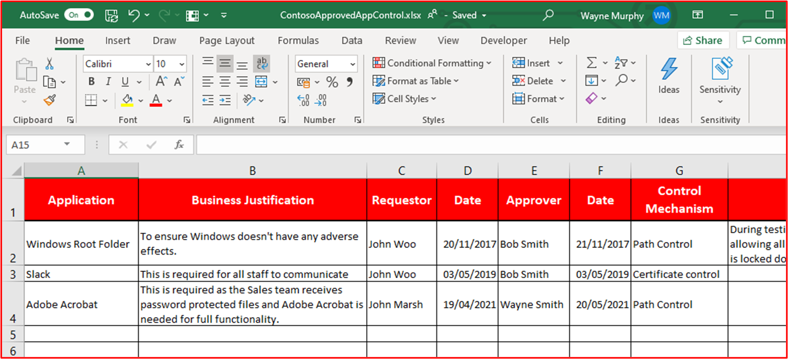

**メモ：** このスクリーンショットはドキュメントを示しています。ISV は実際のサポート ドキュメントを共有し、単にスクリーンショットを提供することは期待できません。

**コントロール番号 9:** アプリケーション制御が、サンプリングされたすべてのシステム コンポーネントから文書化されているように構成されていることを示す証拠を提供します。

- 意図: この目的は、ドキュメントに従ってサンプル全体でアプリケーション制御が構成されていることを検証することです。

- 証拠のガイドラインの例: サンプル内 _のすべてのデバイス_ のスクリーンショットを提供して、アプリケーション コントロールが構成およびアクティブ化されていることを示します。 これには、コンピューター名、所属するグループ、それらのグループとマシンに適用されるアプリケーション制御ポリシーが表示されます。

- 証拠の例: 次のスクリーンショットは、ソフトウェア制限ポリシーが有効になっているグループ ポリシー オブジェクトを示しています。

次のスクリーンショットは、上記のコントロールに沿った構成を示しています。

次のスクリーンショットは、この GPO オブジェクト &#39;ドメイン コンピューター 設定&#39;に適用されているスコープ内に含まれる M365 環境とコンピューターを示しています。

この最後のスクリーンショットは、スコープ内サーバー &quot;DBServer1&quot; が上記のスクリーンショット内の OU 内にあることを示しています。

### パッチ管理 - リスクランク

セキュリティの脆弱性の迅速な識別と修復は、環境またはアプリケーションを侵害する脅威アクターのリスクを最小限に抑えるのに役立ちます。 パッチ管理は、リスクのランク付けと修正プログラムの 2 つのセクションに分かれています。 これら 3 つのコントロールでは、セキュリティの脆弱性の特定と、それらが発生するリスクに応じたランク付けを行います。

このセキュリティ制御グループは、アプリケーション/アドインのサード パーティ製ソフトウェア ライブラリとコード ベースにリスク ランクに基づいて修正プログラムを適用する必要があるため、サービスとしてのプラットフォーム (PaaS) ホスティング環境のスコープ内にあります。

**コントロール番号 10:** 新しいセキュリティの脆弱性を特定し、リスク スコアを割り当てる方法を管理するポリシー ドキュメントを提供します。

- 意図: このコントロールの目的は、脅威アクターがこれらの脆弱性を悪用する機会の期間を短縮するために、セキュリティの脆弱性を迅速に特定するためのサポート ドキュメントを用意することです。 組織で使用されているすべてのシステム コンポーネントをカバーする脆弱性を特定するには、堅牢なメカニズムが用意されている必要があります。たとえば、オペレーティング システム (Windows Server、Ubuntu など)、アプリケーション (Tomcat、MS Exchange、SolarWinds など)、コードの依存関係 (AngularJS、jQuery など)。 組織は、資産内の脆弱性をタイムリーに特定するだけでなく、脆弱性が存在するリスクに基づいて適切な期間内に修復が確実に実行されるように、脆弱性をランク付けする必要があります。

**メモ** 純粋にサービスとしてのプラットフォーム環境内で実行している場合でも、コード ベース内の脆弱性 (サード パーティ 製ライブラリなど) を特定する責任があります。

- 証拠ガイドラインの例: サポート ドキュメントを提供する (スクリーンショットではありません)

- 証拠の例: このスクリーンショットは、リスク ランク付けポリシーのスニペットを示しています。

**メモ：** このスクリーンショットは、ポリシー/プロセス ドキュメントを示しています。ISV は実際のサポート ポリシー/手順ドキュメントを共有し、単にscreenshot._を提供する必要はありません。

**コントロール番号 11:** 新しいセキュリティの脆弱性がどのように識別されるかを示す証拠を提供します。

- 意図: この制御の目的は、プロセスが確実に実行され、環境全体の新しいセキュリティの脆弱性を識別するのに十分な堅牢性&#39;することです。 これはオペレーティング システムだけではない可能性があります。これには、環境内で実行されているアプリケーションと、コードの依存関係が含まれる場合があります。

- 証拠のガイドラインの例: 証拠は、メーリング リストへのサブスクリプションを表示したり、新しくリリースされた脆弱性のセキュリティ ソースを手動で確認したり (アクティビティのタイムスタンプ (JIRA やAzure DevOpsを使用して適切に追跡する必要があります)、古いソフトウェアを見つけるツール (たとえば、古いソフトウェア ライブラリを探すときに Snyk を使用する場合や、認証されたスキャンを使用して Nessus である可能性があります) によって提供される可能性があります。 古いソフトウェア.).

**メモ** Nessus を使用する場合は、脆弱性をすばやく特定するために定期的に実行する必要があります。 少なくとも毎週お勧めします。

- 証拠の例: このスクリーンショットは、メール グループがセキュリティの脆弱性の通知に使用されていることを示しています。

**コントロール番号 12:** すべての脆弱性が特定された後にリスク ランクが割り当てられていることを示す証拠を提供します。

- 意図: 修正プログラムはリスクに基づく必要があります。脆弱性のリスクが高いほど、修復を迅速に行う必要があります。 特定された脆弱性のリスクランク付けは、このプロセスの不可欠な部分です。 このコントロールの目的は、リスクに基づいて特定されたすべての脆弱性が適切にランク付けされるように、文書化されたリスクランク付けプロセスが確実に実行されるようにすることです。 組織は通常、ベンダーまたはセキュリティ研究者によって提供される CVSS (Common Vulnerability Scoring System) 評価を利用します。 組織が CVSS に依存している場合は、組織が内部リスク評価に基づいてランク付けを変更できるように、再ランク付けメカニズムがプロセス内に含まれることをお勧めします。 環境内でのアプリケーションのデプロイ方法が原因で、この脆弱性がアプリケーションにない可能性があります。 たとえば、組織で使用されていない特定のライブラリに影響を与える Java の脆弱性がリリースされる可能性があります。

- 証拠のガイドラインの例: スクリーンショットやその他の手段 (例: DevOps/Jira) を使用して証拠を提供します。これは、脆弱性がリスクランク付けプロセスを通過し、組織によって適切なリスクランクが割り当てられていることを示しています。

- 証拠の例: このスクリーンショットは、組織がリスク評価を実行し、リスクをダウングレードできると判断した場合に、列 D 内で発生するリスクランクと列 F と G の再ランク付けを示しています。 リスク評価の再ランク付けの証拠は、サポート証拠として提供する必要があります

### パッチ管理 – パッチ適用

以下のコントロールは、Patch Management の修正プログラム要素用です。 セキュリティで保護されたオペレーティング環境を維持するには、アプリケーション/アドオンとサポート システムに適切な修正プログラムを適用する必要があります。 脅威アクターが脆弱性を悪用する機会を減らすには、識別 (またはパブリック リリース) から修正プログラムの適用までの適切な期間を管理する必要があります。 Microsoft 365認定では、&#39;修正期間&#39;は規定されていませんが、認定アナリストは妥当でない期間を拒否します。

このセキュリティ制御グループは、アプリケーション/アドインのサード パーティ製ソフトウェア ライブラリとコード ベースにリスク ランクに基づいて修正プログラムを適用する必要があるため、サービスとしてのプラットフォーム (PaaS) ホスティング環境のスコープ内にあります。

**コントロール番号 13:** 重大、高、中リスクの脆弱性に対する適切な最小限のパッチ適用期間を含む、スコープ内のシステム コンポーネントのパッチ適用に関するポリシー ドキュメントを提供します。サポートされていないオペレーティング システムとソフトウェアの使用停止。

- 意図: パッチ管理は、PCI-DSS、ISO 27001、NIST (SP) 800-53 など、多くのセキュリティ コンプライアンス フレームワークで必要です。 適切なパッチ管理の重要性は、ソフトウェア、ファームウェア、脆弱性の軽減に関するセキュリティと機能の問題を修正し、悪用の機会を減らすのに役立つ可能性があるため、過度にストレスを受けることはできません。 このコントロールの目的は、脅威アクターがスコープ内環境内に存在する可能性のある脆弱性を悪用する機会のウィンドウを最小限に抑えることです。

- 証拠ガイドラインの例: パッチ管理のプロセスを詳しく説明するすべてのポリシーと手順のコピーを提供します。 これには、最小限のパッチ適用期間に関するセクションが含まれている必要があります。また、サポートされていないオペレーティング システムとソフトウェアを環境内で使用することはできません。

- 証拠の例: ポリシー ドキュメントの例を次に示します。

**メモ：** このスクリーンショットは、ポリシー/プロセス ドキュメントを示しています。ISV は実際のサポート ポリシー/手順ドキュメントを共有し、単にscreenshot._を提供する必要はありません。

**コントロール番号 14:** サンプリングされたすべてのシステム コンポーネントに修正プログラムが適用されていることを示す証拠を提供します。

**メモ：** 任意のソフトウェア/サード パーティ製ライブラリを含めます。

- 意図: 修正プログラムの脆弱性により、情報技術インフラストラクチャ (ハードウェア、ソフトウェア、サービス) の一部を形成する異なるモジュールが最新の状態に保たれ、既知の脆弱性から解放されます。 脆弱性の詳細のリリースと修正プログラムの適用の間にセキュリティ インシデントが発生する可能性を最小限に抑えるには、できるだけ早く修正プログラムを適用する必要があります。 これは、既知の脆弱性の悪用が実際に行われる場所でさらに重要です。

- 証拠のガイドラインの例: サンプル _内のすべてのデバイス_ のスクリーンショットを提供し、パッチが文書化された修正プログラム プロセスに沿ってインストールされていることを示すソフトウェア コンポーネントをサポートします。

- 証拠の例: 次のスクリーンショットは、スコープ内システム コンポーネント&quot;のWINDOWS&quot;更新プログラムが修正ポリシーに従って実行されていることを示しています。

**メモ：** スコープ内のすべてのシステム コンポーネントの修正プログラムは証拠である必要があります。 これには、次のようなものが含まれます。OS の更新プログラム、アプリケーション/コンポーネントの更新プログラム (i.e__.、_ _Apache Tomcat、OpenSSL など)、ソフトウェアの依存関係 (JQuery、AngularJS など) など。_

**コントロール番号 15:** サポートされていないオペレーティング システムとソフトウェア コンポーネントが環境内で使用されていないことを示す証拠を提供します。

- 意図: ベンダーによって保守されていないソフトウェアは、残業中に、修正されていない既知の脆弱性に苦しみます。 そのため、サポートされていないオペレーティング システムとソフトウェア コンポーネントを運用環境内で使用することはできません。

- 証拠のガイドラインの例: 実行されている OS のバージョンを示すサンプル _内のすべてのデバイス_ のスクリーンショットを提供します (スクリーンショットにサーバー&#39;の名前を含む)。 これに加えて、環境内で実行されているソフトウェア コンポーネントがサポートされているバージョンを実行していることを示す証拠を提供します。 これは、内部脆弱性スキャン レポートの出力 (認証されたスキャンが含まれている場合) や、 [Snyk](https://snyk.io/)、 [Trivy](https://github.com/aquasecurity/trivy) 、 [NPM 監査](https://docs.npmjs.com/cli/v7/commands/npm-audit)などのサードパーティ ライブラリをチェックするツールの出力を提供することによって行うことができます。 PaaS でのみ実行している場合は、修正プログラム適用コントロール グループで対象となるのは、サード パーティ製ライブラリの修正プログラムのみです。

- 証拠の例: 次の証拠は、Nessus で問題のフラグが設定されていないため、スコープ内システム コンポーネントの THOR がベンダーによってサポートされているソフトウェア&#39;実行していることを示しています。

**メモ：** 完全なレポートは、認定アナリストと共有する必要があります。

- 証拠 2 の例

このスクリーンショットは、サポートされているWindows バージョンでスコープ内のシステム コンポーネント&quot;の「クララネット-SBU-WM&quot;」が実行されていることを示しています。

- 証拠 3 の例

次のスクリーンショットは [Trivy](https://github.com/aquasecurity/trivy) 出力で、完全なレポートではサポートされていないアプリケーション&#39;一覧表示されません。

**メモ：** 完全なレポートは、認定アナリストと共有する必要があります。

### 脆弱性スキャン

通常の脆弱性評価を導入することで、組織は環境内の弱点や安全性を検出できます。これにより、悪意のあるアクターが環境を侵害するエントリ ポイントとなる可能性があります。 脆弱性スキャンは、環境内で不足しているパッチや誤った構成を特定するのに役立ちます。 これらのスキャンを定期的に実施することで、組織は、これらの脆弱性スキャン ツールによって一般的に取り上げられる問題による侵害のリスクを最小限に抑えるための適切な修復を提供できます。

**コントロール番号 16:** 四半期ごとのインフラストラクチャと Web アプリケーションの脆弱性スキャン レポートを提供します。 スキャンは、パブリック フットプリント全体 (IP アドレスと URL) と内部 IP 範囲に対して実行する必要があります。

**メモ：** これには、環境の完全なスコープが含まれている **必要があります** 。

- 意図: 脆弱性スキャンは、組織のコンピューター システム、ネットワーク、および Web アプリケーションで潜在的な弱点を探し、セキュリティ侵害や機密データの漏洩につながる可能性のある穴を特定します。 脆弱性スキャンは、多くの場合、PCI DSS (Payment Card Industry Data Security Standard) など、業界標準や政府の規制で必要とされます。

- セキュリティ メトリックのレポート「 &quot;[2020 セキュリティ メトリック ガイド to PCI DSS Compliance」](https://info.securitymetrics.com/pci-guide-2020)&quot; は、組織が攻撃者がシステムを侵害する脆弱性が見られた時点から平均して 166 日かかった&#39;と述べています。 侵害されると、攻撃者は機密データに平均 127 日間アクセス&#39;ので、この制御はスコープ内環境内の潜在的なセキュリティの弱点を特定することを目的としています。

- 証拠のガイドラインの例: 過去 12 か月間に実行された四半期&#39;の脆弱性スキャンごとに、完全なスキャン レポートを提供します。 レポートには、完全なパブリック フットプリントが含まれていること、および該当する場合は各内部サブネットが含まれていることを検証するターゲットを明確に示す必要があります。 **すべての** 四半期 **のすべての** スキャン レポートを提供します。

- 証拠の例: 証拠の例は、使用されているスキャン ツールからスキャン レポートを提供することです。 各四半期&#39;スキャン レポートは、レビュー用に指定する必要があります。 スキャンには、環境全体のシステム コンポーネントを含める必要があります。すべての内部サブネットと、環境で使用できるすべてのパブリック IP アドレス/URL。

**コントロール番号 17:** 脆弱性スキャン中に特定された脆弱性の修復が、文書化されたパッチ適用期間に沿って修正されるという実証可能な証拠を提供します。

- 意図: 脆弱性の特定、管理、修復に失敗し、構成ミスを迅速に行わないと、潜在的なデータ侵害につながる侵害のリスク&#39;組織が増大する可能性があります。 問題を正しく特定して修復することは、組織&#39;さまざまなセキュリティ フレームワークのベスト プラクティスに沿った全体的なセキュリティ体制と環境にとって重要と見なされます。たとえば、ISO 27001 と PCI DSS です。

- 証拠のガイドラインの例: 脆弱性スキャンで検出された脆弱性のサンプルが、上記のコントロール 13 で既に提供されている修正プログラムウィンドウに従って修復されることを示す適切なアーティファクト (スクリーンショットなど) を提供します。

- 証拠の例: 次のスクリーンショットは、2021 年 8 月 2 日の脆弱性を示す、スコープ内環境の Nessus スキャン (この例では &quot;、1 台のマシン)&quot;を示しています。

次のスクリーンショットは、2 日後に問題が解決されたことを示しています。これは、修正プログラム ポリシー内で定義された修正プログラムウィンドウ内にあります。

**メモ：** この制御のために、認定アナリストは、過去 12 か月間の四半期ごとの脆弱性スキャン レポートと修復を確認する必要があります。

### ファイアウォール

多くの場合、ファイアウォールは、信頼された (内部ネットワーク)、信頼されていない (インターネット) 環境と半信頼 (DMZ) 環境の間にセキュリティ境界を提供します。 これらは通常、イングレス およびエグレス サービスのトラフィック フローを制御し、不要なトラフィックをブロックするように設計された、組織の多層防御セキュリティ戦略内の最初の防御ラインです。 これらのデバイスは、効果的に動作し、環境を危険にさらす可能性のある誤った構成から解放されるように、厳密に制御する必要があります。

**コントロール番号 18:** ファイアウォール管理のプラクティスと手順を管理するポリシー ドキュメントを提供します。

- 意図: ファイアウォールは、レイヤード セキュリティ (多層防御) 戦略における重要な防御ラインであり、信頼されていないネットワーク ゾーンから環境を保護します。 ファイアウォールは通常、IP アドレスとプロトコル/ポートに基づいてトラフィック フローを制御します。機能が豊富なファイアウォールでは、アプリケーション トラフィックを検査して、アクセスされるアプリケーションに基づいて誤用、脆弱性、脅威から保護することで、追加 &quot;のアプリケーション層&quot; 防御を提供することもできます。 これらの保護はファイアウォールの構成と同じくらい優れているため、内部資産を適切に保護するように構成されるように、強力なファイアウォール ポリシーとサポート手順を実施する必要があります。 たとえば、任意のソースから任意の宛先へのすべてのトラフィックを許可するルールを持つファイアウォールは、ルーターとして機能しているだけです。

- 証拠のガイドラインの例: 完全なファイアウォール ポリシー/手順をサポートするドキュメントを指定します。 このドキュメントでは、以下のすべての点と、環境に適用できるその他のベスト プラクティスについて説明する必要があります。

- 証拠の例: 以下は、必要なファイアウォール ポリシードキュメントの種類の例です (これはデモであり、完了していない可能性があります)。

**コントロール番号 19:** 運用環境にインストールする前に、既定の管理者資格情報が変更されていることを示す実証可能な証拠を提供します。

- 意図: 組織は、デバイスまたはソフトウェアの構成中に構成される、ベンダーが提供する既定の管理資格情報に注意する必要があります。 既定の資格情報は、多くの場合、ベンダーによって一般公開されており、環境を侵害する機会を外部の脅威アクターに提供できます。 たとえば、インターネット上で既定の iDrac (統合 Dell リモート アクセス コントローラー) 資格情報を簡単に検索すると、 _root::calvin_ が既定のユーザー名とパスワードとして強調表示されます。 これにより、誰かがリモート サーバー管理にリモート アクセスできるようになります。 このコントロールの目的は、デバイス/アプリケーションのセキュリティ強化中に変更されていない既定のベンダー資格情報を使用して環境が攻撃を受けないようにすることです。

- 証拠のガイドラインの例

- これは、認定アナリストが既定の資格情報を使用してスコープ内のデバイスに対する認証を試みることができる画面共有セッションで確認できます。

- 証拠の例

次のスクリーンショットは、認定アナリストが WatchGuard ファイアウォールの無効なユーザー名/パスワードから表示される内容を示しています。

**コントロール番号 20:** ファイアウォールがスコープ内環境の境界にインストールされ、境界ネットワーク (DMZ、非武装地帯、スクリーンサブネットとも呼ばれます) と内部信頼されたネットワークの間にインストールされていることを示す実証可能な証拠を提供します。

- 意図: ファイアウォールは、さまざまなセキュリティ レベルの異なるネットワーク ゾーン間のトラフィックを制御する機能を提供します。 すべての環境はインターネットに接続されているため、ファイアウォールはインターネットとスコープ内環境の境界 (つまり、インターネットとスコープ内の環境の間) にインストールする必要があります。 さらに、信頼されていない DMZ (De-Militarized Zone) ネットワークと内部信頼されたネットワークの間にファイアウォールをインストールする必要があります。 DMZ は通常、インターネットからのトラフィックにサービスを提供するために使用されるため、攻撃の対象となります。 DMZ を実装し、ファイアウォールを使用してトラフィック フローを制御することで、DMZ の侵害は必ずしも内部の信頼されたネットワークと企業/顧客データの侵害&#39;意味しません。 組織が侵害を迅速に特定し、脅威アクターが内部の信頼されたネットワークをさらに侵害する機会を最小限に抑えるために、適切なログ記録とアラートを実施する必要があります。 この制御の目的は、信頼されたネットワークと信頼されていないネットワークの間に適切な制御があることを確認することです。

- 証拠のガイドラインの例: DMZ が配置されていることを示すファイアウォール構成ファイルまたはスクリーンショットを使用して証拠を提供する必要があります。 これは、環境をサポートするさまざまなネットワークを示す、指定されたアーキテクチャ図と一致する必要があります。 ファイアウォール上のネットワーク インターフェイスのスクリーンショットと、初期ドキュメント提出の一部として既に提供されているネットワーク図と組み合わせて、この証拠を提供する必要があります。

- 証拠の例: 2 つの DMZ を示す WatchGuard ファイアウォールのスクリーンショットを次に示します。1 つは受信サービス (DMZ) 用で、もう 1 つはジャンプボックス (Bastian Host) を提供しています。

**コントロール番号 21:** すべてのパブリック アクセスが非武装地帯 (DMZ) で終了するという実証可能な証拠を提供します。

- 意図: パブリックにアクセスできるリソースは、無数の攻撃に対して開かれています。 既に説明したように、DMZ の目的は、機密データが含まれている可能性がある信頼された内部ネットワークから信頼されていないネットワークをセグメント化することです。 DMZ は、外部の脅威アクターによって侵害されるからパブリックにアクセスできるホストの大きなリスクがあるため、信頼度が低いと見なされます。 パブリック アクセスは、内部リソースとデータを保護するためにファイアウォールによって適切にセグメント化された、信頼されていないこれらのネットワークで常に終了する必要があります。 この制御の目的は、信頼されていない内部ネットワーク上のリソースがパブリックに接続されているかのように、これらの信頼されていない DMZ 内のすべてのパブリック アクセスが終了することを保証することです。これらのリソースの侵害により、機密データが保持されているネットワークへの足掛かりが脅威アクターに提供されます。

- 証拠のガイドラインの例

- このために提供される証拠は、パブリック IP アドレスをリソースにルーティングするか、受信トラフィックの NAT (ネットワーク アドレス変換) を提供することによって、受信規則とこれらの規則が終了するファイアウォール構成である可能性があります。

- 証拠の例

次のスクリーンショットには、10.0.3.x サブネットと 10.0.4.x サブネット (DMZ サブネット) への NAT を示す 3 つの受信規則があります。

**コントロール番号 22:** ファイアウォールを介して許可されているすべてのトラフィックが承認プロセスを通過することを示す実証可能な証拠を提供します。

- 意図: ファイアウォールは、信頼されていないトラフィックと内部リソースの間、および異なる信頼レベルのネットワーク間の防御的な障壁であるため、ファイアウォールを安全に構成し、ビジネス操作に必要なトラフィックのみを有効にする必要があります。 不要なトラフィック フロー、または過度に許容されるトラフィック フローを許可することで、これらのさまざまなネットワーク ゾーンの境界で防御内に弱点が生じる可能性があります。 すべてのファイアウォール変更に対して堅牢な承認プロセスを確立することで、環境に重大なリスクをもたらすルールを導入するリスクが軽減されます。 Verizon&#39;の [2020 データ侵害調査レポート](https://enterprise.verizon.com/en-gb/resources/reports/dbir/)では、構成ミスを含むエラー&#39;&quot;が、年々増加している唯一のアクションの種類であることを&quot;強調しています。

- 証拠のガイドラインの例: 証拠は、ファイアウォール変更要求が承認されていることを示すドキュメントの形式にすることができます。これは、CAB (Change Advisor Board) 会議から数分、またはすべての変更を追跡する変更制御システムによって行われます。

- 証拠の例: 次のスクリーンショットは、ファイアウォール規則の変更が、紙ベースのプロセスを使用して要求および承認されていることを示しています。 これは、たとえば、DevOpsや Jira などで実現できます。

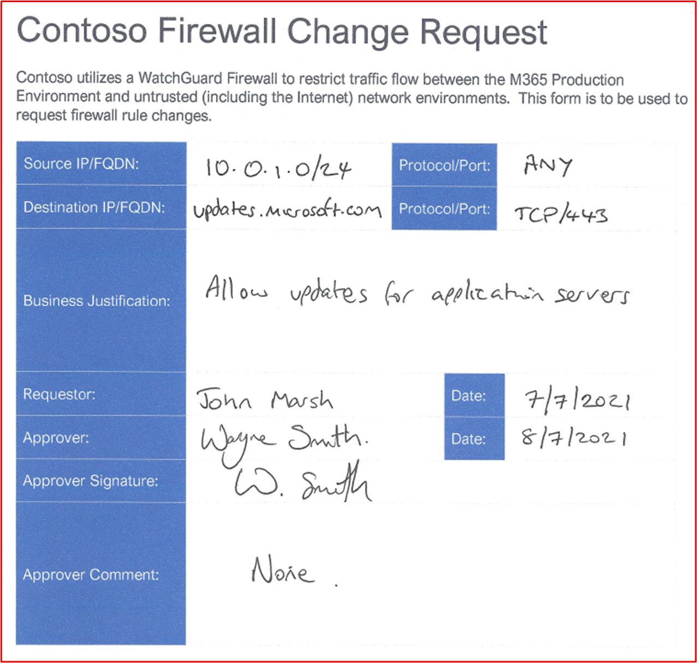

**コントロール番号 23:** 明示的に定義されていないトラフィックをドロップするようにファイアウォール規則ベースが構成されていることを示す実証可能な証拠を提供します。

- 意図: ほとんどのファイアウォールは、一致するルールを試して見つけるために、トップダウン アプローチでルールを処理します。 ルールが一致すると、そのルールのアクションが適用され、ルールのそれ以降のすべての処理が停止します。 一致するルールが見つからない場合、既定ではトラフィックは拒否されます。 この制御の目的は、一致するルールが見つからない場合にファイアウォールが既定でトラフィックをドロップ&#39;場合、ルール ベースに **[すべての** ファイアウォール リストの末尾にすべて&quot;拒否ルールを含める]を含&quot;める必要があります。 これは、ルールを処理するときにファイアウォールが既定の許可状態に&#39;しないようにするため、&#39;明示的に定義されていないトラフィックを許可します。

- 証拠のガイドラインの例: 証拠は、ファイアウォール構成を使用して提供できます。または、最後にすべてのファイアウォール規則を示すファイアウォール規則をすべて示す&quot;&quot;スクリーンショット、またはファイアウォールが既定でルールと一致しないトラフィック&#39;ドロップした場合は、すべてのファイアウォール規則のスクリーンショットを提供し、既定ではファイアウォールが一致しないすべてのトラフィックをドロップすることを示すベンダー管理ガイドへのリンクを指定します。

- 証拠の例: すべてのトラフィックを許可するルールが構成されていないことを示す WatchGuard ファイアウォール規則ベースのスクリーンショットを次に示します。 WatchGuard は既定で一致しないトラフィックをドロップするため、最後に拒否ルール&#39;ありません。

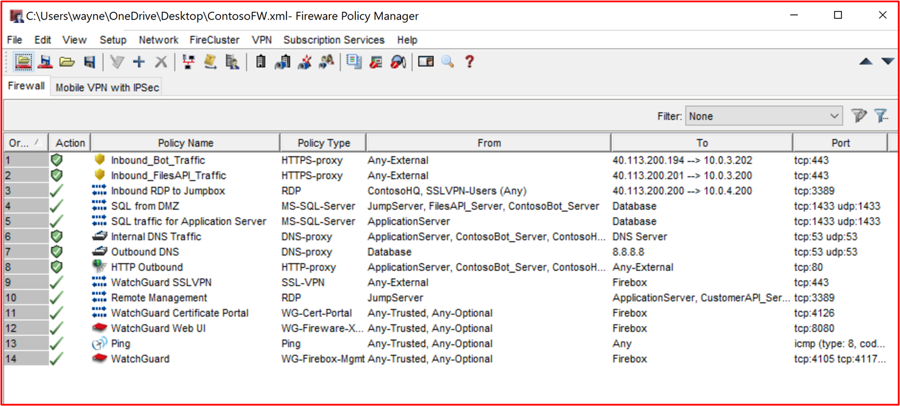

次の WatchGuard ヘルプ センターのリンク。 [https://www.watchguard.com/help/docs/help-center/en-US/Content/en-US/Fireware/policies/policies\_about\_c.html](https://www.watchguard.com/help/docs/help-center/en-US/Content/en-US/Fireware/policies/policies_about_c.html) には、次の情報が含まれます。

**コントロール番号 24:** ファイアウォールが、すべてのコンソール以外の管理インターフェイスで強力な暗号化のみをサポートしていることを示す実証可能な証拠を提供します。

- 意図: 管理トラフィックの中間者攻撃を軽減するには、コンソール以外のすべての管理インターフェイスで強力な暗号化のみをサポートする必要があります。 このコントロールの主な目的は、コンソール以外の接続がセットアップされるときに管理者資格情報を保護することです。 さらに、これは接続への盗聴から保護したり、デバイスを再構成したり、偵察の一部として管理機能を再生したりするのにも役立ちます。

- 証拠のガイドラインの例: 構成がコンソール以外の管理インターフェイスの暗号化構成を提供する場合は、ファイアウォール構成を指定します (構成可能なオプションとして、すべてのデバイスにこれを含めるわけではありません)。 構成内でこれが&#39;場合は、デバイスにコマンドを発行して、これらの接続用に構成されている内容を表示できる場合があります。 一部のベンダーは、この情報を記事内で公開する場合があるため、この情報を証明する方法でもあります。 最後に、サポートされている暗号化を出力するためのツールの実行が必要になる場合があります。

- 証拠の例: 次のスクリーンショットは、TCP ポート 8080 上の WatchGuard ファイアウォールの Web 管理インターフェイスに対する [SSLScan](https://github.com/rbsec/sslscan) の出力を示しています。 これは、AES-128 ビットの最小暗号化暗号を使用した TLS 1.2 以降を示しています。

**注**: WatchGuard ファイアウォールでは、SSH (TCP ポート 4118) と WatchGuard System Manager (TCP ポート 4105 &amp; 4117) を使用した管理機能もサポートされています。 これらのコンソール以外の管理インターフェイスの証拠も提供する必要があります。

**コントロール番号 25:** 少なくとも 6 か月ごとにファイアウォール規則のレビューを実行していることを示す証拠を提供します。

- 意図: 時間の経過と共に、スコープ内環境のシステム コンポーネントに構成が入り込むリスクがあります。 これにより、多くの場合、環境への侵害のリスクを高めることができるセキュリティの問題や構成ミスが発生する可能性があります。 トラブルシューティングを支援するための一時的な変更、アドホック機能変更の一時的な変更など、さまざまな理由で構成の概要が導入され、クイック 修正の導入の圧力が原因で過度に許容される可能性がある問題に対する迅速な修正が導入される場合があります。 たとえば、一時的なファイアウォール規則 &quot;Allow All&quot; を導入して、緊急の問題を克服できます。 この制御の目的は 2 つあります。最初に、セキュリティ上の問題を引き起こす可能性のある構成ミスがある場所を特定し、2 つ目は、不要になったファイアウォール規則を特定するのに役立つため、つまり、サービスが廃止されたがファイアウォール規則が取り残されている場合に削除できます。

- 証拠のガイドラインの例: 証拠は、レビュー会議が発生していることを示すことができる必要があります。 これは、ファイアウォール レビューの会議の議事録と、レビューから実行されたアクションを示す追加の変更制御証拠を共有することによって行うことができます。 これらの会議の少なくとも 2 つ (つまり、6 か月ごと) を確認する必要&#39;、日付が存在することを確認します。

- 証拠の例: 次のスクリーンショットは、2021 年 1 月にファイアウォールレビューが行われた証拠を示しています。

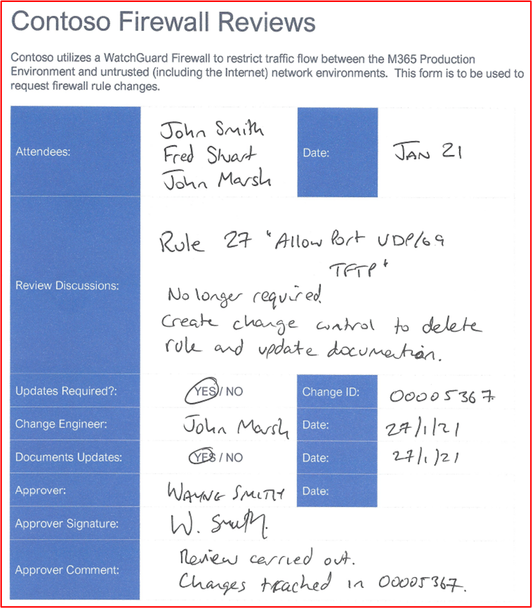

次のスクリーンショットは、2021 年 7 月にファイアウォール レビューが行われた証拠を示しています。

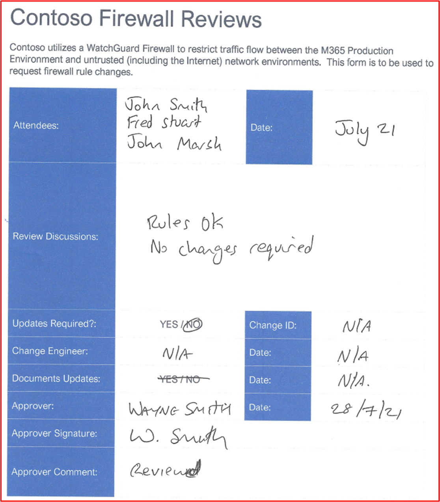

### ファイアウォール – WAF

ソリューションに Web Application Firewall (WAF) をデプロイすることは省略可能です。 WAF が使用されている場合、これは、&#39;Operational Security&#39; セキュリティ ドメイン内のスコアリング マトリックスの追加クレジットとしてカウントされます。 WAF では、Web トラフィックを検査して、インターネットと公開された Web アプリケーション間の Web トラフィックをフィルター処理して監視し、Web アプリケーション固有の攻撃を特定できます。 Web アプリケーションは、SQL インジェクション (SQLi)、クロス サイト スクリプティング (XSS)、クロス サイト要求フォージェリ (CSRF/XSRF)、WAF などの Web アプリケーションに固有の多くの攻撃に苦しまれ、WEB アプリケーションを攻撃や潜在的な侵害から保護するために、このような種類の悪意のあるペイロードから保護するように設計されています。

**コントロール番号 26:** 悪意のあるトラフィックを積極的に監視、アラート、ブロックするようにWeb Application Firewall (WAF) が構成されていることを示す証拠を提供します。

- 意図: このコントロールは、すべての受信 Web 接続に対して WAF が配置されていること、および悪意のあるトラフィックをブロックまたはアラートするように構成されていることを確認するために用意されています。 Web トラフィックに対して防御レイヤーを追加するには、すべての受信 Web 接続用に WAF を構成する必要があります。それ以外の場合、外部脅威アクターは、この追加の保護レイヤーを提供するように設計された WAF をバイパスできます。 WAF が悪意のあるトラフィックを積極的にブロックするように構成されていない&#39;場合、WAF は、潜在的な悪意のあるトラフィックに迅速に対応して環境のセキュリティを維持し、攻撃を停止できるスタッフに即時のアラートを提供できる必要があります。

- 証拠のガイドラインの例: WAF からの構成出力を提供します。これは、提供される受信 Web 接続を強調表示し、構成が悪意のあるトラフィックを積極的にブロックするか、監視とアラートを行っていることを示します。 また、組織がこのコントロールを満たしていることを示すために、特定の設定のスクリーンショットを共有することもできます。

- 証拠の例: 次のスクリーンショットは、Contoso Production Azure Application Gateway WAF ポリシーが有効になっており、悪意のあるトラフィックを積極的にドロップする&#39;防止&#39; モード用に構成されていることを示しています。

次のスクリーンショットは、フロントエンド IP 構成を示しています

**メモ：** 証拠は、すべてのイングレス ポイントが確実にカバーされるように環境で使用されるすべてのパブリック IP を示す必要があります。このスクリーンショットも含まれる理由です。

次のスクリーンショットは、この WAF を使用した受信 Web 接続を示しています。

次のスクリーンショットは、これが api.contoso.com サービス用であることを示す ContosoAppGWCoreRules\_\_ を示しています。

**コントロール番号 27:** WAF が SSL オフロードをサポートしていることを示す実証可能な証拠を提供します。

- 意図: SSL オフロードをサポートするように WAF を構成する機能は重要です。そうしないと、WAF は HTTPS トラフィックを検査できません。 これらの環境では HTTPS トラフィックをサポートする必要があるため、これは、HTTPS トラフィック内の悪意のあるペイロードを特定して停止できるようにするための WAF にとって重要な機能です。

- 証拠のガイドラインの例: 構成エクスポートまたは SSL オフロードがサポートされ、構成されていることを示すスクリーンショットを使用して構成証拠を提供します。

- 証拠の例: Azure Application Gateway内で、SSL リスナーが有効な SSL オフロードの構成については、MICROSOFT ドキュメント ページ[での TLS 終了とエンド ツー エンド TLS の概要Application Gateway](/azure/application-gateway/ssl-overview)参照してください。 次のスクリーンショットは、Contoso Production Azure Application Gateway用に構成されたこれを示しています。

**コントロール番号 28:** 「OWASP Core ルール セット (3.0 または 3.1) に従って、WAF が次の脆弱性の一部またはすべてのクラスから保護されていることを示す証拠を提供します。
- プロトコルとエンコードの問題、
- ヘッダーの挿入、要求の密輸、応答の分割、
- ファイルとパストラバーサル攻撃、
- リモート ファイル包含 (RFI) 攻撃、
- リモート コード実行攻撃、
- PHP インジェクション攻撃、
- クロスサイト スクリプティング攻撃、
- SQLインジェクション攻撃、
- セッション固定攻撃。

- 意図: 脆弱性の一般的なクラスの攻撃ペイロードを識別するように WAF を構成する必要があります。 このコントロールは、OWASP Core ルール セットを利用して、脆弱性クラスの適切な検出を確実にカバーすることを目的とします。

- 証拠のガイドラインの例: 構成エクスポートを使用して構成証拠を提供するか、上記で特定したほとんどの脆弱性クラスがスキャンによってカバーされていることを示すスクリーンショットを示します。

- 証拠の例: 次のスクリーンショットは、Contoso Production Azure Application Gateway WAF ポリシーが OWASP Core ルール セット バージョン 3.2 に対してスキャンするように構成されていることを示しています。

### コントロールの変更

すべての変更が繰り返し可能な構造化されたプロセスを確実に実行するには、確立された理解された変更制御プロセスが不可欠です。 組織は、すべての変更が構造化されたプロセスを確実に通過するようにすることで、変更が効果的に管理され、ピア レビューされ、サインオフされる前に適切にテストされるようにすることができます。 これは、システム障害のリスクを最小限に抑えるだけでなく、不適切な変更が導入されることで潜在的なセキュリティ インシデントのリスクを最小限に抑えるのにも役立ちます。

**コントロール番号 29:** 変更制御プロセスを管理するポリシー ドキュメントを提供します。

- 意図: セキュリティで保護された環境とセキュリティで保護されたアプリケーションを維持するには、堅牢な変更制御プロセスを確立して、すべてのインフラストラクチャとコードの変更が強力な監視と定義されたプロセスで確実に実行されるようにする必要があります。 これにより、変更が文書化され、セキュリティへの影響が考慮され、変更に与えるセキュリティへの影響などが考えられます。目的は、環境とアプリケーション開発の両方のプラクティス内のすべての変更に対して安全で一貫性のあるアプローチが確実に実行されるように、変更制御プロセスを文書化することです。

- 証拠のガイドラインの例: 文書化された変更制御ポリシー/手順は、認定アナリストと共有する必要があります。

- 証拠の例: 次に、変更管理ポリシーの例の開始を示します。 評価の一環として、完全なポリシーと手順を指定してください。

**メモ：** このスクリーンショットはポリシー/プロセス ドキュメントを示しています。ISV は実際のサポート ポリシー/手順ドキュメントを共有し、単にスクリーンショットを提供する必要はありません。

**コントロール番号 30:** 開発環境とテスト環境が運用環境との職務の分離を強制する実証可能な証拠を提供します。

- 意図: ほとんどの組織&#39;開発環境/テスト環境は、運用環境と同じ勢いで構成されていないため、安全性が低くなります。 さらに、テストは運用環境内で実行しないでください。これはセキュリティの問題を引き発生させたり、顧客のサービス配信に悪影響を与える可能性があるためです。 職務の分離を強制する個別の環境を維持することで、組織は変更が正しい環境に適用されていることを保証し、開発環境およびテスト環境を対象とした運用環境に変更を実装することで、エラーのリスクを軽減できます。

- 証拠のガイドラインの例: 開発/テスト環境と運用環境に使用されているさまざまな環境を示すスクリーンショットを提供できます。 通常、各環境にアクセスできるユーザーやチームが異なる場合や、これが不可能な場合、環境は異なる承認サービスを利用して、ユーザーが誤って間違った環境にログインして変更を適用できないようにします。

- 証拠の例: 次のスクリーンショットは、Contoso&#39;の TEST 環境の Azure サブスクリプションを示しています。

次のスクリーンショットは、Contoso&#39;&#39;PRODUCTION&#39;環境用の個別の Azure サブスクリプションを示しています。

**コントロール番号 31:** 開発環境またはテスト環境内で機密運用データが使用されていないという実証可能な証拠を提供します。

- 意図: 既に説明したように、組織は開発環境と同じ勢いで開発環境/テスト環境のセキュリティ対策を実装しません。 そのため、これらの開発環境/テスト環境で機密運用データを利用することで、侵害のリスクが高まり、これらの開発環境/テスト環境でライブ/機密データを使用しないようにする必要があります。

**メモ：** 開発/テスト環境でライブ データを使用して、開発/テストを評価の範囲内に含め、Microsoft 365認定コントロールに対してセキュリティを評価できるようにします。

- 証拠ガイドラインの例: 同じSQLクエリの出力のスクリーンショットを運用環境データベースに対して共有 (機密情報を編集する) と開発/テスト データベースを共有することで、証拠を提供できます。 同じコマンドの出力によって、異なるデータ セットが生成される必要があります。 ファイルが格納されている場所では、両方の環境内のフォルダーの内容を表示する場合も、異なるデータ セットを示す必要があります。

- 証拠の例: 次のスクリーンショットは、運用データベースから上位 3 件のレコード (証拠の提出については上位 20 件を指定してください) を示しています。

次のスクリーンショットは、開発データベースからの同じクエリを示し、異なるレコードを示しています。

これは、データ セットが異なっていることを示しています。

**コントロール番号 32:** 文書化された変更要求に、変更、バックアウト手順の詳細、実行するテストの影響が含まれていることを示す証拠を提供します。

- 意図: このコントロールの目的は、要求されている変更に確実に考えが入ったことを確認することです。 変更がシステム/環境のセキュリティに与える影響を考慮し、明確に文書化する必要があります。復旧に役立つバックアウト手順はすべて文書化する必要があります。最後に、変更が成功したことを検証するために必要なテストの詳細についても考え、文書化する必要があります。

- 証拠のガイドラインの例: 変更要求のサンプルをエクスポートするか、紙の変更要求を提供するか、変更要求内に保持されているこれら 3 つの詳細を示す変更要求のスクリーンショットを提供することで、証拠を提供できます。

- 証拠の例: 次の図は、新しいクロス サイト スクリプティングの脆弱性 (XSS) が割り当てられ、変更要求に関するドキュメントを示しています。

次のチケットは、解決までの過程でチケットに設定または追加された情報を示しています。

 

次の 2 つのチケットは、システムへの変更の影響と、問題が発生した場合に必要になる可能性があるバックアウト手順を示しています。 変更とバックアウト手順の影響が承認プロセスを通過し、テスト用に承認されたことを確認できます。

画面の左側で、変更のテストが承認されたことを確認できます。右側には、変更が承認され、テストされていることがわかります。

プロセス全体を通して、ジョブを実行しているユーザー、その担当者、および実行する作業を承認するユーザーが異なっていることに注意してください。

上のチケットは、変更が運用環境への実装に対して承認されたことを示しています。 右側のボックスには、テストが機能し、成功し、変更が Prod Environment に実装されたことを示します。

**コントロール番号 33:** 変更要求が承認とサインオフ プロセスを受けるという実証可能な証拠を提供します。

- 意図: プロセスを実装する必要があります。これにより、適切な承認とサインオフなしで変更を実行することが禁止されます。 変更を実装する前に承認する必要があり、変更が完了したらサインオフする必要があります。 これにより、変更要求が適切に確認され、機関の誰かが変更をサインオフしたことが保証されます。

- 証拠のガイドラインの例: 変更要求のサンプルをエクスポートしたり、紙の変更要求を提供したり、変更が承認されたことを示す変更要求のスクリーンショットを実装前に提供したり、変更が完了した後に変更がサインオフされたことを示すスクリーンショットを提供することで、証拠を提供できます。

- 証拠の例: 次のスクリーンショットは、開発者/要求者以外のユーザーによって実装および承認される前に変更を承認する必要があることを示す Jira チケットの例を示しています。 ここでの変更が、権限を持つユーザーによって承認されていることがわかります。 右側では、完了したら DP によって署名されています。

次のチケットでは、変更が完了するとサインオフされ、ジョブの完了と終了が表示されます。

### セキュリティで保護されたソフトウェア開発/展開

ソフトウェア開発活動に関与する組織は、多くの場合、セキュリティと TTM (Time to Market) の間で競合する優先順位に直面していますが、ソフトウェア開発ライフサイクル (SDLC) 全体でセキュリティ関連のアクティビティを実装すると、コストを節約できるだけでなく、時間を節約することもできます。 セキュリティが後回しとして残されている場合、問題は通常、(DSLC) のテスト フェーズ中にのみ特定されます。多くの場合、修正に時間がかかり、コストがかかる場合があります。 このセキュリティ セクションの目的は、開発されたソフトウェアにコーディング上の欠陥が導入されるリスクを軽減するために、セキュリティで保護されたソフトウェア開発プラクティスに従うことを保証することです。 さらに、このセクションでは、ソフトウェアの安全な展開に役立ついくつかのコントロールを含める必要があります。

**コントロール番号 34:** セキュリティで保護されたソフトウェアの開発と展開をサポートするポリシーと手順を提供します。これには、OWASP Top 10 や SANS Top 25 CWE などの一般的な脆弱性クラスに対するセキュリティで保護されたコーディングのベスト プラクティスガイダンスが含まれます。

- 意図: 組織は、ソフトウェアが安全に開発され、脆弱性から解放されるように、あらゆることを行う必要があります。 これを実現するために、セキュリティで保護されたソフトウェア開発ライフサイクル (SDLC) とセキュリティで保護されたコーディングのベスト プラクティスを確立し、ソフトウェア開発プロセス全体を通じてセキュリティで保護されたコーディング手法とセキュリティで保護された開発を促進する必要があります。 目的は、ソフトウェアの脆弱性の数と重大度を減らすことです。

- 証拠のガイドラインの例: セキュリティで保護された開発ライフサイクルが使用中であり、すべての開発者がセキュリティで保護されたコーディングのベスト プラクティスを促進するためのガイダンスが提供されていることを示す、文書化された SDLC やサポート ドキュメントを提供します。 [SDLC の OWASP](https://owasp.org/www-project-integration-standards/writeups/owasp_in_sdlc/) と [OWASP ソフトウェア アシュアランス成熟度モデル](https://owaspsamm.org/model/) (SAMM) を見てみましょう。

- 証拠の例: Contoso&#39;のセキュリティで保護されたソフトウェア開発手順からの抜粋を次に示します。これは、セキュリティで保護された開発とコーディングのプラクティスを示しています。

**メモ：** これらのスクリーンショットは、セキュリティで保護されたソフトウェア開発ドキュメントを示しています。ISV が実際のサポート ドキュメントを共有し、単にスクリーンショットを提供することは期待できません。

**コントロール番号 35:** コード変更が 2 番目の校閲者によってレビューと承認プロセスを受けるという実証可能な証拠を提供します。

- 意図: このコントロールを使用する目的は、別の開発者によるコード レビューを実行して、ソフトウェアに脆弱性が発生する可能性のあるコーディングミスを特定できるようにすることです。 コード レビューの実施、テストの実行などを確実にするために承認を確立する必要があります。 デプロイの前に行います。 承認手順では、上記で定義した SDLC を支える適切なプロセスに従っていることを検証できます。

- 証拠のガイドラインの例: コードがピア レビューを受け、運用環境に適用する前に承認する必要がある証拠を提供します。 この証拠は、変更チケットのエクスポートを介して行われ、コード レビューが実行され、変更が承認されたことを示している場合や、Crucible ([https://www.atlassian.com/software/crucible](https://www.atlassian.com/software/crucible)) などのコード レビュー ソフトウェアを使用している可能性があります。

- 証拠の例

コードの変更が元の開発者以外のユーザーによってレビューと承認プロセスを受けることを示すチケットを次に示します。 これは、コード レビューが担当者から要求され、コード レビューのために他のユーザーに割り当てられることを示しています。

次の図は、次の図の右側の強調表示されたセクションに示すように、コード レビューが元の開発者以外のユーザーに割り当てられたことを示しています。 左側では、コードがレビューされ、コードレビュー担当者によって&#39;PASSED CODE REVIEW&#39;状態が与えられていることがわかります。

チケットは、変更をライブ運用システムに適用する前に、マネージャーの承認を得る必要があります。

 上の図は、レビューされたコードがライブ運用システムに実装される承認を与えられていることを示しています。

 コードの変更が完了すると、上の図に示すように、最終的なジョブがサインオフされます。

プロセス全体を通して、コードの元の開発者、コードレビュー担当者、承認とサインオフを行うマネージャーの 3 人が関与しています。 このコントロールの条件を満たすために、チケットがこのプロセスに従うことを期待します。 コード レビューの変更制御プロセスに関与するユーザーは少なくとも 3 人です。

**コントロール番号 36:** 開発者がセキュリティで保護されたソフトウェア開発トレーニングを毎年受けているという実証可能な証拠を提供します。

- 意図: コーディングのベスト プラクティスと手法は、すべてのプログラミング言語に対して存在し、コードが安全に開発されるようにします。 開発者にさまざまな種類のソフトウェア脆弱性クラスと、ソフトウェアへのこれらの脆弱性の導入を停止するために使用できるコーディング手法を教えるために設計された外部トレーニング コースがあります。 このコントロールの目的は、これらの手法をすべての開発者に教え、これらの技術が忘れ去られないようにすること、または新しい手法を年単位で実行することで学習することです。

- 証拠のガイドラインの例: 外部のトレーニング会社によって実行された場合、または開発者がトレーニングに参加したことを示すトレーニング用のダイアリーやその他の成果物のスクリーンショットを提供することで、証明書を使用して証拠を提供します。 このトレーニングが内部リソースを介して実行される場合は、トレーニング資料の証拠も提供します。

- 証拠の例: 以下は、DevOps チームのスタッフが OWASP Top Ten Training Annual Training に登録されるように要求するメールです

以下は、ビジネス上の理由と承認を得てトレーニングが要求されたことを示しています。 その後、トレーニングから取得したスクリーンショットと、その人が年次トレーニングを終了したことを示す完了レコードが続きます。

**コントロール番号 37:** 多要素認証 (MFA) でコード リポジトリがセキュリティで保護されていることを示す証拠を提供します。

- 意図: 脅威アクターがソフトウェア&#39;のコード ベースにアクセスして変更できる場合、脆弱性、バックドア、または悪意のあるコードをコード ベースに導入し、アプリケーションに導入する可能性があります。 これは既に複数のインスタンスがあり、おそらく最も広く公開されているのは NotPetya ランサムウェア攻撃であり、M.E.Docと呼ばれるウクライナの税ソフトウェアの侵害された更新によって感染したと伝えられます ( [NotPetya の概要](https://www.itpro.co.uk/malware/34381/what-is-notpetya)を参照)。

- 証拠のガイドラインの例: **すべての** ユーザーが MFA を有効にしているコード リポジトリのスクリーンショットを使用して証拠を提供します。

- 証拠の例: 次のスクリーンショットは、すべての 8 人の GitLab ユーザーで MFA が有効になっていることを示しています。

**コントロール番号 38:** コード リポジトリをセキュリティで保護するためにアクセス制御が実施されていることを示す証拠を提供します。

- 意図: 前の制御から先導するアクセス制御を実装して、特定のプロジェクトで作業している個々のユーザーのみにアクセスを制限する必要があります。 アクセスを制限することで、承認されていない変更が実行されるリスクが制限され、セキュリティで保護されていないコード変更が導入されます。 コード リポジトリを保護するには、最小限の特権を持つアプローチを取る必要があります。

- 証拠のガイドラインの例: コード リポジトリのスクリーンショットを使用して、アクセスが必要な個人に制限されていることを示す証拠 (さまざまな特権を含む) を提供します。

- 証拠の例: 次の&quot;スクリーンショットは、Contoso &quot;カスタマー ポータル&quot;である GitLab の Customers&quot; プロジェクトのメンバーを示しています。 スクリーンショットに示されているように、ユーザーはプロジェクトへのアクセスを制限するために異なる &quot;ロール&quot; を持っています。

### アカウントの管理

セキュリティで保護されたアカウント管理プラクティスは、ユーザー アカウントが情報システム、システム環境、データへのアクセスを許可する基礎を形成するために重要です。 ユーザー アカウントは、ユーザー&#39;の資格情報の侵害が環境への足場と機密データへのアクセスを提供できるだけでなく、ユーザー&#39;の資格情報に管理者権限がある場合、環境全体またはキー システムに対する管理制御を提供する可能性があるため、適切にセキュリティで保護する必要があります。

**コントロール番号 39:** アカウント管理のプラクティスと手順を管理するポリシー ドキュメントを提供します。

- 意図: ユーザー アカウントは引き続き脅威アクターの対象であり、多くの場合、データ侵害の原因になります。 過度に許容されるアカウントを構成することで、組織は、脅威アクターがデータ侵害を実行するために利用できる特権&#39;アカウントのプールを&#39;増やすだけでなく、成功するために特定の特権を必要とする脆弱性の悪用が成功するリスクを高めることができます。

-  BeyondTrust は、毎年 Microsoft 脆弱性レポート&quot;を&quot;作成し、前年の Microsoft セキュリティの脆弱性を分析し、管理者権限を持つユーザー アカウントに依存するこれらの脆弱性の詳細パーセンテージを分析します。 新しい Microsoft 脆弱性レポートの最近のブログ投稿&quot;では、[48% YoY 増加の脆弱性&amp;を最小限の特権](https://www.beyondtrust.com/blog/entry/microsoft-vulnerabilities-report)&quot;で軽減する方法、Internet Explorer の重大な脆弱性の 90%、Microsoft Edgeの重大な脆弱性の 85%、Microsoft Outlookの重大な脆弱性の 100% が管理者権限を削除することで軽減されたことを明らかにしています。 セキュリティで保護されたアカウント管理をサポートするには、セキュリティのベスト プラクティスを促進するポリシーと手順をサポートし、これらの脅威を軽減するために従う必要があります。

- 証拠のガイドラインの例: アカウント管理のプラクティスをカバーする文書化されたポリシーと手順ドキュメントを提供します。 少なくとも、説明するトピックは、Microsoft 365認定内のコントロールに合わせる必要があります。

- 証拠の例: 次のスクリーンショットは、Contoso のアカウント管理ポリシーの例を示しています。

**メモ：** このスクリーンショットはポリシー/プロセス ドキュメントを示しています。ISV は実際のサポート ポリシー/手順ドキュメントを共有し、単にスクリーンショットを提供する必要はありません。

**コントロール番号 40:** サンプリングされたシステム コンポーネント全体で既定の資格情報が無効、削除、または変更されていることを示す証拠を提供します。

- 意図: これはあまり普及してきていますが、脅威アクターが既定の十分に文書化されたユーザー資格情報を利用して運用システム コンポーネントを侵害できる場合は依然として存在します。 この一般的な例は、Dell iDRAC (統合 Dell リモート アクセス コントローラー) です。 このシステムを使用すると、Dell Server をリモートで管理できます。これは、脅威アクターがサーバー&#39;のオペレーティング システムを制御するために利用できます。 root::calvin の既定の資格情報は文書化されており、多くの場合、脅威アクターが利用して、組織が使用するシステムにアクセスできます。 このコントロールの目的は、これらの既定の資格情報が無効または削除されていることを確認することです。

- 証拠ガイドラインの例: このコントロールをサポートするために証拠を収集するには、さまざまな方法があります。 すべてのシステム コンポーネントで構成されたユーザーのスクリーンショットは、Linux /etc/shadow ファイルと /etc/passwd ファイルのスクリーンショットなど、アカウントが無効になっているかどうかを示すのに役立ちます。 /etc/shadow ファイルは、パスワードが使用できないことを示す&#39;!&#39;などの無効な文字でパスワード ハッシュが開始されることを確認することで、アカウントが本当に無効になっていることを示すために必要であることに注意してください。 アドバイスは、パスワードの数文字のみを無効にし、残りをやり直す方法です。 その他のオプションは、評価者が既定の資格情報を手動で試すことができたスクリーン共有セッションです。たとえば、Dell iDRAC に関する上記の説明では、評価者は既定の資格情報を使用してすべての Dell iDRAC インターフェイスに対して認証を試みる必要があります。

- 証拠の例: 次のスクリーンショットは、スコープ内のシステム コンポーネント &quot;の、PDBNET-SBU-WM&quot; 用に構成されたユーザー アカウントを示しています。 いくつかの既定のアカウントが表示されます。ただし、管理者、DefaultAccount、Guest は、これらのアカウントが無効になっていることを示す次のスクリーンショットを示しています。

この次のスクリーンショットは、スコープ内システム コンポーネント &quot;の、ADMINISTRATORNET-SBU-WM&quot; で管理者アカウントが無効になっていることを示しています。

この次のスクリーンショットは、スコープ内システム コンポーネント &quot;の「クララネット-SBU-WM&quot;」でゲスト アカウントが無効になっていることを示しています。

この次のスクリーンショットは、スコープ内のシステム コンポーネント &quot;の「PDBNET-SBU-WM&quot;」で DefaultAccount が無効になっていることを示しています。

**コントロール番号 41:** アカウントの作成、変更、削除が確立された承認プロセスを経るという実証可能な証拠を提供します。

- 意図: すべてのアカウント管理アクティビティが承認され、アカウント特権が最小特権の原則を維持し、アカウント管理アクティビティを適切に確認および追跡できるように、確立されたプロセスを確立することを目的としています。

- 証拠のガイドラインの例: 通常、証拠は、変更要求チケット、ITSM (IT サービス管理) 要求、またはアカウントの作成、変更、または削除の要求が承認プロセスを通過したことを示す書類の形式になります。

- 証拠の例: 次の図は、開発環境へのアクセス権を持たない運用環境のアクセス許可と、他のすべてに対する標準の非特権アクセス権に基づいて RBAC 設定を行う必要がある、DevOps チームに対する新しいスターターのアカウント作成を示しています。

アカウントが作成され、チケットが閉じられると、アカウントの作成は承認プロセスとサインオフ プロセスを経ました。

**コントロール番号 42:** 3 か月以内に使用されていないアカウントを無効または削除するためのプロセスが実施されていることを示す証拠を提供します。

- 意図: 非アクティブなアカウントは、ユーザーがアカウントにログインしようとしていないためにフラグが設定されないブルート フォース攻撃の対象になっているか、ユーザーが&#39;パスワードが再利用され、インターネット上のユーザー名/パスワード ダンプ内で使用できるパスワード データベース侵害によって、侵害される可能性があります。 脅威アクターがアカウント侵害アクティビティを実行する必要がある攻撃面を減らすには、未使用のアカウントを無効または削除する必要があります。 これらのアカウントは、休暇プロセスが適切に行われず、スタッフメンバーが長期の病気にかかっているか、またはスタッフメンバーがマティニティ/パターニティ休暇に入っている可能性があります。 これらのアカウントを識別するための四半期ごとのプロセスを実装することで、組織は攻撃面を最小限に抑えることができます。

- 証拠ガイドラインの例: 証拠は 2 倍にする必要があります。 まず、スコープ内環境内のすべてのユーザー アカウントの最後のログオン&quot;を&quot;示すスクリーンショットまたはファイルのエクスポート。 これは、ローカル アカウントと、AAD (Azure Active Directory) などの一元化されたディレクトリ サービス内のアカウントである場合があります。 これは、3 か月より前のアカウントが有効になっていないことを示します。 第 2 に、四半期ごとのレビュー プロセスの証拠です。これは、ADO (Azure DevOps) または JIRA チケット内で、またはサインオフする必要がある紙の記録を通じて、タスクが完了したことを示すドキュメント証拠である可能性があります。

- 証拠の例: この最初のスクリーンショットは、AAD内のユーザーの最後のログオン属性を表示するために四半期ごとに実行されるスクリプトの出力を示しています。

上のスクリーンショットに示されているように、2 人のユーザーがしばらくログインしていないと表示されています。 次の 2 つのスクリーンショットは、これら 2 人のユーザーが無効になっていることを示しています。

**コントロール番号 43:** ユーザー資格情報を保護するための強力なパスワード ポリシーまたはその他の適切な軽減策が実施されていることを示す証拠を提供します。  最小ガイドラインとして、次を使用する必要があります。
- パスワードの最小長は 8 文字
- アカウントロックアウトのしきい値が 10 回を超えないことを示す
- 5 つ以上のパスワードのパスワード履歴
- 強力なパスワードの使用の適用

- 意図: 既に説明したように、多くの場合、ユーザー資格情報は、組織&#39;の環境へのアクセスを試みる脅威アクターによる攻撃の対象となります。 強力なパスワード ポリシーの目的は、脅威アクターが強制的にブルートできる可能性を軽減するために、ユーザーに強力なパスワードを選択させようとすることです。 または他の適切な軽減策&quot;を&quot;追加する目的は、[組織が、NIST Special Publication 800-63B](https://pages.nist.gov/800-63-3/sp800-63b.html)&quot; などの&quot;業界の開発に基づいてユーザー資格情報を保護するために他のセキュリティ対策を実装する可能性があることを認識することです。

- 証拠のガイドラインの例: 強力なパスワード ポリシーを示す証拠は、組織グループ ポリシーオブジェクトまたはローカル セキュリティ ポリシー アカウント ポリシー à パスワード ポリシー&quot;とアカウント ポリシー&quot; à アカウント ロックアウト ポリシー&quot;設定のスクリーンショットの形式&quot;である可能性があります。 証拠は、使用されているテクノロジによって異なります。つまり、Linux の場合は、/etc/pam.d/common-password 構成ファイル、BitBucket &quot;の場合は管理ポータル ([https://support.atlassian.com/security-and-access-policies/docs/manage-your-password-policy/](https://support.atlassian.com/security-and-access-policies/docs/manage-your-password-policy/))内の [認証ポリシー&quot;] セクションなどです。

- 証拠の例: 以下の証拠は、スコープ内 &quot;のシステム コンポーネントの、ローカル セキュリティ ポリシーで構成されたパスワード ポリシー&quot; を示しています。このポリシーは、スコープ内のシステム コンポーネント &quot;の「SYNCHRONIZATIONNET-SBU-WM」です&quot;。

次のスクリーンショットは、WatchGuard ファイアウォールのアカウント ロックアウト設定を示しています。

WatchGaurd ファイアウォールの最小パスフレーズの長さの例を次に示します。

**コントロール番号 44:** 一意のユーザー アカウントがすべてのユーザーに発行されていることを示す証拠を提供します。

- 意図: このコントロールの意図は説明責任です。 独自の一意のユーザー アカウントを持つユーザーを発行すると、ユーザー アクティビティを個々のユーザーに追跡できるため、ユーザーは自分のアクションに対して責任を負います。

- 証拠のガイドラインの例: 証拠は、サーバー、コード リポジトリ、クラウド管理プラットフォーム、Active Directory、ファイアウォールなどを含む、スコープ内のシステム コンポーネント全体で構成されたユーザー アカウントを示すスクリーンショットを介して行われます。

- 証拠の例: 次のスクリーンショットは、スコープ内のシステム コンポーネント &quot;の、PDBNET-SBU-WM&quot; 用に構成されたユーザー アカウントを示しています。

この次のスクリーンショットは、スコープ内システム コンポーネント &quot;の、ADMINISTRATORNET-SBU-WM&quot; で管理者アカウントが無効になっていることを示しています。

この次のスクリーンショットは、スコープ内システム コンポーネント &quot;の「クララネット-SBU-WM&quot;」でゲスト アカウントが無効になっていることを示しています。

この次のスクリーンショットは、スコープ内のシステム コンポーネント &quot;の「PDBNET-SBU-WM&quot;」で DefaultAccount が無効になっていることを示しています。

**コントロール番号 45:** 環境内で最小特権の原則に従っていることを示す証拠を提供します。

- 意図: ユーザーは、ジョブ機能を果たすために必要な特権のみを提供する必要があります。 これは、ユーザーが悪意のある行為を行う必要がないデータに意図的または意図せずにアクセス&#39;リスクを制限するためです。この原則に従うことで、悪意のある脅威アクターの対象となる可能性のある攻撃面 (特権アカウントなど) も減らされます。

- 証拠のガイドラインの例: ほとんどの組織は、グループを利用して、組織内のチームに基づいて特権を割り当てます。 証拠は、さまざまな特権グループと、これらの特権を必要とするチームのユーザー アカウントのみを示すスクリーンショットである可能性があります。 通常、これは、必要な特権とビジネス上の正当な理由を持つ定義された各グループを定義するサポート ポリシー/プロセスと、グループ メンバーシップが正しく構成されていることを検証するためのチーム メンバーの階層でバックアップされます。

- たとえば、Azure 内では、所有者グループは非常に限られている必要があるため、これは文書化する必要があり、そのグループに割り当てられているユーザーの数は限られている必要があります。 別の例として、コードを変更できるスタッフの数が限られている可能性があります。グループは、この権限を構成する必要があると見なされるスタッフのメンバーを使用して、この特権を使用して設定できます。 これは、認定アナリストが構成されたグループなどでドキュメントを相互参照できるように文書化する必要があります。

- 証拠の例: 次のスクリーンショットは、ジョブ関数に従ってグループが割り当てられた環境が構成されていることを示しています。

次のスクリーンショットは、ユーザーがジョブ関数に基づいてグループに割り当てられていることを示しています。

**コントロール番号 46:** サービス アカウントをセキュリティで保護または強化するためのプロセスが実施され、プロセスが実行されていることを示す証拠を提供します。

- 意図: サービス アカウントは、多くの場合、管理者特権で構成されるため、脅威アクターの対象になります。 これらのアカウントは、サービス アカウントのパスワードの有効期限が機能を中断する場合が多いため、標準のパスワード ポリシーに従っていない可能性があります。 そのため、組織内で再利用される脆弱なパスワードまたはパスワードを使用して構成できます。 別の潜在的な問題 (特にWindows環境内) では、オペレーティング システムがパスワード ハッシュをキャッシュしている可能性があります。 これは、サービス アカウントがディレクトリ サービス内で構成されている場合、このアカウントは、構成された特権レベルを持つ複数のシステム間でアクセスを使用できるため、またはサービス アカウントがローカルである場合、同じアカウント/パスワードが環境内の複数のシステムで使用される可能性が高い場合に大きな問題になる可能性があります。 上記の問題は、脅威アクターが環境内のより多くのシステムにアクセスし、特権の昇格や横移動につながる可能性があります。 そのため、サービス アカウントが適切にセキュリティで保護され、脅威アクターによって引き継がれないように保護したり、これらのサービス アカウントの 1 つが侵害された場合にリスクを制限したりすることが目的です。

- 証拠のガイドラインの例: インターネットには、サービス アカウントの強化に役立つ多くのガイドがあります。 証拠は、組織がアカウントのセキュリティで保護されたセキュリティ強化を実装した方法を示すスクリーンショットの形式にすることができます。 いくつかの例 (複数の手法が使用されることを想定しています) には、次のものが含まれます。
- Active Directory 内の一連のコンピューターにアカウントを制限する
- 対話型ログインが許可されないようにアカウントを設定&#39;、
- 非常に複雑なパスワードの設定、
- Active Directory の場合は、アカウントが機密性が &quot;高く、委任&quot; できないフラグを有効にします。 これらの手法については、カード[所有者データ環境のセグメント化と共有 Active Directory に関する記事を](https://pciramblings.com/2019/12/13/segmentation-and-shared-active-directory-of-a-cardholder-data-environment/)参照&quot;してください&quot;。

- 証拠の例: サービス アカウントを強化するには複数の方法があります。これは、個々の環境に依存します。 使用される環境に適したメカニズムは、この証拠を確認するのに役立つアカウント管理ポリシー/手順のドキュメントに記載されています。 使用できるメカニズムの一部を次に示します。

次のスクリーンショットは、&#39;アカウントが機密性が高く、サービス アカウント Prod SQL Service アカウント&quot;\_でオプションが選択&#39;委任される接続を示しています&quot;。

![ スクリーンショットは、サービス アカウント "_Prod SQL サービス アカウント" で [アカウントが機密性が高く、委任される接続] オプションが選択されていることを示しています。](../media/UserGuidePhotos/Control-No-46.png)

次のスクリーンショットは、サービス アカウント &quot;\_Prod SQL Service アカウント&quot;がSQL Serverにロックダウンされ、そのサーバーにのみログオンできることを示しています。

この次のスクリーンショットは、サービス アカウント &quot;\_Prod SQL Service アカウント&quot;がサービスとしてログオンすることのみが許可されていることを示しています。

**コントロール番号 47:** すべてのリモート アクセス接続とすべてのコンソール以外の管理インターフェイスに対して MFA が構成されていることを示す証拠を提供します。

次のように定義された用語:
- **リモート アクセス** – 通常、これはサポート環境へのアクセスに使用されるテクノロジを指します。 たとえば、リモート アクセス IPSec VPN、SSL VPN、ジャンプボックス/バスティアン ホストなどです。
- **非コンソール管理インターフェイス** – 通常、これはシステム コンポーネントへのネットワーク管理接続を介して行われます。 これは、リモート デスクトップ、SSH、または Web インターフェイス経由である可能性があります。

- 意図: この制御の目的は、環境へのセキュリティで保護されたアクセスを持つ特権アカウントとアカウントをブルート強制に対する軽減策を提供することです。 多要素認証 (MFA) を提供することで、MFA メカニズムをセキュリティで保護する必要があるため、侵害されたパスワードを正常なログインから保護する必要があります。 これにより、すべてのアクセス操作と管理アクションが、承認された信頼できるスタッフ メンバーによってのみ実行されるようになります。

- 証拠ガイドラインの例: 証拠は、上記のカテゴリに適合するすべてのテクノロジで MFA が有効になっていることを示す必要があります。 これは、MFA がシステム レベルで有効になっていることを示すスクリーンショットを使用している場合があります。 システム レベルでは、MFA が有効になっているアカウントの例だけでなく、すべてのユーザーに対して有効になっているという証拠が必要です。 このテクノロジが MFA ソリューションにバックアップされている場合は、それが有効で使用中であることを示す証拠が必要です。 これは何を意味するのですか。MFA プロバイダーを指す Radius 認証用にテクノロジがセットアップされている場合は、それが指している Radius Server が MFA ソリューションであり、それを利用するようにアカウントが構成されていることを証明する必要もあります。

- 証拠 1 の例: 次のスクリーンショットは、環境へのリモート アクセスに使用される Pulse Secure で構成された認証領域を示しています。 認証は、MFA サポート用の Duo SaaS サービスによってバックアップされます。

このスクリーンショットは、&#39;Duo - Default Route&#39;認証領域の Duo-LDAP&quot; を指&quot;す追加の認証サーバーが有効になっていることを示しています。

この最後のスクリーンショットは、Duo-LDAP 認証サーバーの構成を示しています。これは、MFA 用の Duo SaaS サービスを指していることを示しています。

証拠 2 の例: 次のスクリーンショットは、すべての Azure ユーザーが MFA を有効にしていることを示しています。

**メモ：** コンソール以外のすべての接続に対して証拠を提供して、MFA が有効になっていることを示す必要があります。 そのため、たとえば、サーバーまたは他のシステム コンポーネント (ファイアウォールなど) に RDP または SSH 接続する場合などです。

**コントロール番号 48:** コード リポジトリやクラウド管理インターフェイスへのアクセスなど、すべてのリモート アクセス接続とすべてのコンソール以外の管理インターフェイスに対して強力な暗号化が構成されていることを示す証拠を提供します。

次のように定義された用語:
- **コード リポジトリ** – アプリのコード ベースは、アプリにマルウェアを導入する可能性のある悪意のある変更から保護する必要があります。 コード リポジトリで MFA を構成する必要があります。
- **クラウド管理インターフェイス** – クラウド サービス プロバイダー (CSP) 内で一部またはすべての環境がホストされている場合は、クラウド管理用の管理インターフェイスがここに含まれます。

- 意図: この制御の目的は、すべての管理トラフィックが中間者攻撃から保護するために適切に暗号化されるようにすることです。

- 証拠のガイドラインの例: 証拠は、リモート アクセス テクノロジ、RDP、SSH、および Web 管理インターフェイスの暗号化設定を示すスクリーンショットによって提供できます。 Web 管理インターフェイスの場合、Qualys SSL Labs スキャナー (パブリックにアクセスできる場合、つまり、クラウド管理インターフェイス、SaaS コード リポジトリ、または SSL VPN 接続) を使用できます。

- 証拠の例: 次の証拠は、Webserver01&quot; の &quot;RDP 暗号化レベルが高&quot;レベルの設定で構成&#39;示しています。 ヘルプ テキストに示されているように、これは強力な 128 ビット暗号化 (Microsoft Windows RDP の最上位レベル) を使用しています。

次の証拠は、RDP トランスポート セキュリティが Webserver01&quot; で &quot;TLS 1.0 を使用するように構成されていることも示しています (Windows Server の場合は最高)。

**コントロール番号 49:** すべてのパブリック ドメイン ネーム サービス (DNS) レコードを管理および管理するために使用する管理ポータルを保護するために MFA が使用されていることを示す証拠を提供します。

- 意図: 悪意のある脅威アクターがパブリック DNS レコードにアクセスできる場合、アプリで使用される URL を変更できるリスクや、マニフェスト ファイルが悪意のあるコードを導入したり、アクターの制御下のエンドポイントにユーザー トラフィックを誘導したりする可能性があります。 これにより、ユーザー データが失われたり、アプリのユーザー ベース全体でマルウェアやランサムウェアの感染が発生したりする可能性があります。

- 証拠ガイドラインの例: パブリック DNS 管理ポータルが MFA によって保護されていることを示す証拠を提供します。 パブリック DNS がスコープ内環境内のサーバー (つまり、組織によって制御および運用されている) でホストされている場合でも、ドメイン名が登録されたどこかに管理ポータルが存在し、DNS レコードがマネージド&#39;&#39;して DNS サーバーを独自のインフラストラクチャにポイントしている可能性があります。 この場合、ドメイン DNS レコードを変更できる場合は、ドメイン レジストラー管理インターフェイスで MFA を有効にする必要があります。 システム レベル (つまり、すべての特権アカウント) で管理インターフェイスが MFA に対して有効になっていることを示すスクリーンショットを提供する必要があります。

- 証拠の例: 次のスクリーンショットは、contoso Corporation のMicrosoft Azure内で DNS が管理されている contoso.com を示しています。

**メモ：** IP アドレスはプライベート RFC 1918 アドレスであり、パブリックにルーティングされません。 これはデモンストレーションのみを目的としています。

次のスクリーンショットは、すべての Azure ユーザーが MFA を有効にしていることを示しています。

### 侵入の検出と防止 (省略可能)

ゲートウェイの侵入検出および防止システム (IDPS) は、無数のインターネット ベースおよび内部の脅威に対する保護の追加レイヤーを提供できます。 これらのシステムは、これらの脅威の成功を防ぐのに役立ち、組織がこれらのアクティブな脅威から環境をさらに保護するための追加の防御戦略を実装できるように、侵害の試みを生きるために組織に警告する重要なアラート機能を提供できます。

**このセクションは追加のクレジット用であるため、省略可能です。これは要件ではありませんが、完了すると、環境と、配置したコントロールと標準の全体像が評価に表示されます。**

**コントロール番号 50:** 侵入検出および防止システム (IDPS) がスコープ内環境の境界にデプロイされていることを示す証拠を提供します。

- 意図: 一部のソースでは、インサイダーの脅威が外部の脅威アクターの脅威を上回るようになったと説明していますが、インサイダーの脅威には過失も含まれ、ヒューマン エラーは年率で増加しています。 スコープ内環境の境界に IDPS をインストールする目的は、このような種類の脅威によって使用される性質と手法により、外部の脅威を IDPS メカニズムを介して検出できることがよくあります。

- 証拠のガイドラインの例: IDPS が境界にインストールされていることを示す証拠を提供する必要があります。これは、NextGen ファイアウォールを実行している場合はファイアウォールに直接存在する可能性があります。また、展開されたセンサーによってすべてのトラフィックが確実に表示されるようにミラー スイッチ ポートに構成された IDPS センサーを展開することもできます。 IDPS センサーが使用されている場合は、センサーがすべての外部トラフィック フローを確認できることを示すために、追加の証拠を提供する必要がある場合があります。

- 証拠の例: 次のスクリーンショットは、WatchGuard ファイアウォールで IDPS 機能が有効になっていることを示しています。

次の追加のスクリーンショットは、WatchGuard Firewall&#39;の構成内のすべてのルールで IDPS が有効になっていることを示しています。

**コントロール番号 51:** IDPS 署名が最新の状態 (24 時間以内) に保持されていることを示す証拠を提供します。

- 意図: IDPS には複数の操作モードがあります。最も一般的なのは、シグネチャを使用して攻撃トラフィックを識別することです。 攻撃が進化し、新しい脆弱性が特定されるにつれて、適切な保護を提供するために IDPS 署名が最新であることが重要です。 このコントロールの目的は、IDPS が維持されていることを確認することです。

- 証拠のガイドラインの例: 証拠は、IDPS が少なくとも毎日署名を更新するように構成されており、最後の更新プログラムが表示されていることを示すスクリーンショットによって行われる可能性があります。

- 証拠の例: このスクリーンショット&#39;過去 24 時間以内に IDPS 署名が更新されたことを示していませんが、1 週間前の最新バージョンがインストールされていることを示しています (_5 月__18__th日に収集された証拠_)。 これは、次のスクリーンショットと組み合わせることで、24 時間以内に署名が最新の状態になることが示されています。

**コントロール番号 52:** IDPS がすべての受信 Web トラフィックの TLS 検査をサポートするように構成されていることを示す証拠を提供します。

- 意図: IDPS は署名に依存しているため、すべてのトラフィック フローを検査して攻撃トラフィックを識別できる必要があります。 TLS トラフィックは暗号化されるため、IDPS はトラフィックを適切に検査できません。 これは、Web サービスに共通するさまざまな脅威があるため、HTTPS トラフィックにとって非常に重要です。 この制御の目的は、暗号化されたトラフィック フローを IDPS についても検査できるようにすることです。

- 証拠のガイドラインの例: 証拠はスクリーンショットを使用して提供する必要があります。暗号化された TLS トラフィックも IDPS ソリューションによって検査されていることを示します。

- 証拠の例: このスクリーンショットは、ファイアウォールの HTTPS ルールを示しています

次のスクリーンショットは、IDPS がこれらのルールで有効になっていることを示しています。

次のスクリーンショットは、&quot;コンテンツ検査を有効にするために使用される&#39;InboundBotTraffic\_\_&#39; ルールにプロキシ アクション&quot;が適用されていることを示しています。

次のスクリーンショットは、コンテンツ検査が有効になっていることを示しています。

**コントロール番号 53:** IDPS がすべての受信トラフィック フローを監視するように構成されていることを示す証拠を提供します。

- 意図: 既に説明したように、すべての受信トラフィック フローを IDPS によって監視して、あらゆる形式の攻撃トラフィックを識別することが重要です。

- 証拠のガイドラインの例: すべての受信トラフィック フローが監視されていることを示すために、スクリーンショットを使用して証拠を提供する必要があります。 これは、NextGen ファイアウォールを使用して、すべての受信規則が IDPS に対して有効になっていることを示すか、IDPS センサーを使用して、すべてのトラフィックが IDPS センサーに到達するように構成されていることを示します。

- 証拠の例: このスクリーンショットは、IDPS がすべての WatchGuard Firewall&#39;のルール (ポリシー) で構成されていることを示しています。

**コントロール番号 54:** IDPS がすべての送信トラフィック フローを監視するように構成されていることを示す証拠を提供します。

- 意図: 既に説明したように、すべての送信トラフィック フローを IDPS によって監視して、あらゆる形式の攻撃トラフィックを識別することが重要です。 一部の IDPS システムでは、すべての送信トラフィックを監視することで、潜在的な内部侵害を特定することもできます。 これを行うには、&#39;コマンドと制御&#39; エンドポイント宛てのトラフィックを識別します。

- 証拠のガイドラインの例: すべての送信トラフィック フローが監視されていることを示すために、スクリーンショットによる証拠を提供する必要があります。 これは、NextGen ファイアウォールを使用して、すべての送信規則が IDPS に対して有効になっていることを示すか、IDPS センサーを使用して、すべてのトラフィックが IDPS センサーに到達するように構成されていることを示すことができます。

- 証拠の例: このスクリーンショットは、IDPS がすべての WatchGuard Firewall&#39;のルール (ポリシー) で構成されていることを示しています。

- 証拠 2 の例: Azure では、サード パーティのアプリを通じて IDPS が提供されています。 次の例では、Netwatcher パケット キャプチャを使用してパケットをキャプチャし、Open-Source IDS ツールである Suricata と共に使用しています。

Network Watcherによって提供されるパケット キャプチャと、Suricata などのオープンソース IDS ツールを組み合わせることで、さまざまな脅威に対してネットワーク侵入検出を実行できます。 次の図は、Suricata インターフェイスを示しています。

署名はアラートをトリガーするために使用され、これらは簡単にインストールおよび更新できます。 次の図は、一部の署名のスナップショットを示しています。

次の図は、Sentinel SIEM/SOAR を使用して、NETwatcher および Suricata サード パーティソフトウェアの IDPS セットアップを監視する方法を示しています。

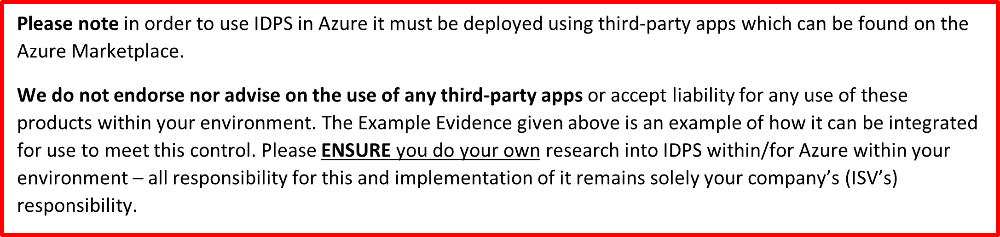

- 例 3: 次の図は、CLI を使用して侵入検出のオーバーライド侵入署名またはバイパス規則を追加する方法を示しています

次の図は、CLI を使用してすべての侵入検出構成を一覧表示する方法を示しています

- 証拠 4 の例: Azure は最近、TLS、脅威インテリジェンス、ポリシーを介した IDPS の構成を許可するAzure Firewall プレミアムという名前の IDPS を提供し始めましたが、受信トラフィックの SSL オフロードには Front Door または application Gateway を引き続き使用する必要があることに注意してくださいAzure Firewall プレミアム は、受信 SSL 接続で IDPS をサポートしていません。

次の例では、ポリシー ルールと TLS 検査 IDPS モードの構成に既定の Premium 設定が使用されています。脅威インテリジェンスはすべて、Vnet の保護と共に有効になっています。

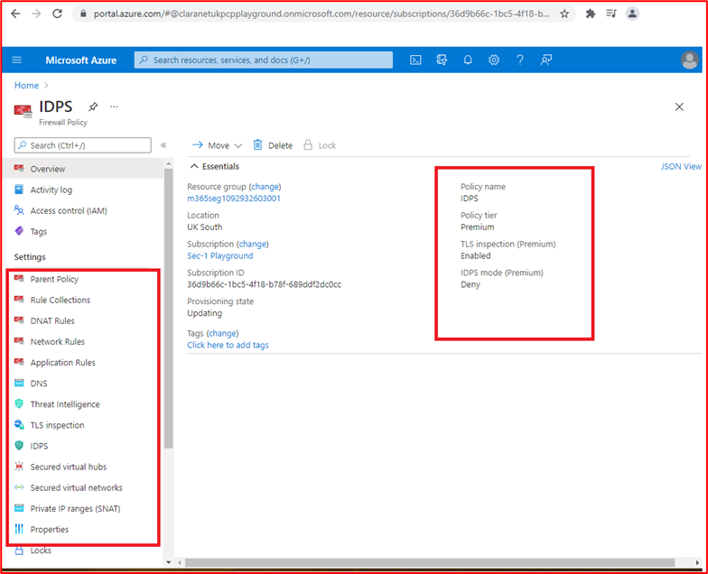

### セキュリティ イベントログ

セキュリティ イベント ログは、組織のセキュリティ プログラム&#39;不可欠な部分です。 調整されたアラートとレビュー プロセスと組み合わせたセキュリティ イベントの適切なログ記録は、組織がセキュリティと防御のセキュリティ戦略を強化するために組織が使用できる侵害または試行された違反を特定するのに役立ちます。 さらに、適切なログ記録は組織のインシデント対応機能に役立ちます。この機能は、侵害されたデータの正確な識別、&#39;侵害の期間、政府機関への詳細な分析レポートの提供など、他のアクティビティに役立ちます。

**コントロール番号 55:** セキュリティ イベントのログ記録を管理するベスト プラクティスと手順に関するポリシー ドキュメントを提供します。

- 意図: セキュリティ イベント ログは、組織&#39;のセキュリティ プログラムの重要な機能です。 組織がベンダーや業界の推奨されるプラクティスに沿ってログ制御を確実に実装できるように、明確さと一貫性を提供するために、ポリシーと手順を実施する必要があります。 これにより、潜在的または実際のセキュリティ イベントの特定に役立つだけでなく、インシデント対応アクティビティによってセキュリティ違反の程度が特定されるだけでなく、関連する詳細なログが確実に使用されるようにすることができます。

- 証拠のガイドラインの例: セキュリティ イベント ログのベスト プラクティスをカバーするポリシーと手順のドキュメントを文書化した組織に提供します。

- 証拠の例: 以下は、ログ ポリシー/プロシージャからの抜粋です。

**メモ：** このスクリーンショットはポリシー/プロセス ドキュメントを示しています。ISV は実際のサポート ポリシー/手順ドキュメントを共有し、単にスクリーンショットを提供する必要はありません。

**コントロール番号 56:** 次のイベントをログに記録するために、サンプリングされたすべてのシステム コンポーネントでセキュリティ イベント ログが設定されていることを示す実証可能な証拠を提供します。
- システム コンポーネントとアプリケーションへのユーザー アクセス
- 高い特権を持つユーザーが実行したすべてのアクション
- 無効な論理アクセス試行
- 特権アカウントの作成または変更
- イベント ログの改ざん
- マルウェア対策やイベント ログなどのセキュリティ ツールの無効化
- マルウェア対策ログ (更新プログラム、マルウェア検出、スキャン エラーなど)
- IDPS イベントと WAF イベント (構成されている場合)

- 意図: 試行された侵害と実際の違反を特定するには、環境を構成するすべてのシステムによって適切なセキュリティ イベント ログが収集されていることが重要です。 このコントロールの目的は、適切な種類のセキュリティ イベントがキャプチャされていることを確認することです。これにより、これらのイベントを特定して対応するために、レビュープロセスとアラート プロセスにフィードできます。

- 証拠のガイドラインの例: スクリーンショットまたは構成設定による証拠は、サンプリングされたすべてのデバイスと関連性のシステム コンポーネント全体に提供し、このような種類のセキュリティ イベントがキャプチャされることを保証するようにログがどのように構成されているかを示す必要があります。

- 証拠 1 の例: 次のスクリーンショットは、VICTIM1-WINDOWS&quot; と呼ばれる&quot;サンプリングされたデバイスの構成設定を示しています。 設定には、&#39;ローカル セキュリティ ポリシー  ローカル ポリシー  監査ポリシー&#39;設定内で有効になっているさまざまな監査設定が表示されます。

この次のスクリーンショットは、ユーザーが VICTIM1-WINDOWS と呼ばれる &quot;サンプリングされたデバイスの 1 つからイベント ログをクリアしたイベントを示しています&quot;。

この最後のスクリーンショットは、ログ メッセージが一元的なログ ソリューション内に表示されることを示しています。

**注**: スクリーンショットは、サンプリングされたすべてのシステム コンポーネントに必要 **であり、** 上記のすべてのセキュリティ イベントを証明 **する必要があります** 。

**コントロール番号 57:** ログに記録されたセキュリティ イベントに次の最小情報が含まれていることを示す証拠を提供します。
- ユーザー
- イベントの種類
- 日時
- 成功または失敗のインジケーター
- 影響を受けるシステムを識別するラベル

- 意図: ログに記録されたセキュリティ イベントは、攻撃トラフィックが成功したかどうか、どの情報にアクセスされたか、どのレベルにアクセスしたか、だれが責任を負ったか、どこから発信されたかなどを判断するのに役立つ十分な情報を提供する必要があります。

- 証拠のガイドラインの例: 証拠には、これらの種類のセキュリティ イベントを示すすべてのシステム コンポーネントからのログのサンプルが表示されている必要があります。 ログには、上記のすべての情報を含める必要があります。

- 証拠の例: 次のスクリーンショットは、スコープ内のシステム コンポーネント &quot;SEGSVR02&quot; からのWindows イベント ビューアー内のセキュリティ イベントからの情報を示しています。

**注**: スクリーンショットは、サンプリングされたすべてのシステム コンポーネント全体で必要であり、上記のコントロールで詳しく説明したすべてのセキュリティ イベントを証明 **する必要があります** 。 上記のコントロールのために収集された証拠もこの制御を満たし、ログ情報の適切な詳細が提供される可能性があります。

**コントロール番号 58:** サンプリングされたすべてのシステム コンポーネントが同じプライマリ サーバーとセカンダリ サーバーに時間同期されていることを示す証拠を提供します。

- 意図: ログ記録の重要なコンポーネントは、すべてのシステム間でログがすべて同期されているシステム クロックを確保することです。これは、侵害やデータ侵害を追跡するために調査が必要な場合に重要です。 重要なログを見逃す可能性があり、追跡が困難になるため、ログにタイムスタンプの程度が異なる場合、さまざまなシステムでイベントを追跡することはほぼ不可能になる可能性があります。

- 証拠のガイドラインの例: 理想的には、資産全体で時刻がどのように同期されるかを示す時刻同期トポロジを維持する必要があります。 その後、サンプリングされたシステム コンポーネント全体の時刻同期設定のスクリーンショットを使用して証拠を提供できます。 これは、すべての時間の同期が同じプライマリ (またはセカンダリ) サーバーに対して行われることを示す必要があります。

- 証拠の例: この図は、使用中の時刻同期トポロジを示しています。

次のスクリーンショットは、NTP サーバーとして構成され、時刻ソース&#39;time.windows.com を指している WatchGuard を示しています。

この最後のスクリーンショットは、スコープ内システム コンポーネントを示しています。このシステム コンポーネントは、 &quot;WATCHGuard Firewall (10.0.1.1) であるプライマリ サーバーを指すように NTP 用に構成&quot; されています。

**コントロール番号 59:** セキュリティ イベント ログが境界ネットワーク内ではなく一元的なログ ソリューションに送信されている、パブリック向けシステムが使用されている場合に、実証可能な証拠を提供します。

- 意図: この制御を使用する目的は、DMZ とログ エンドポイントの間で論理的または物理的な分離を確保することです。 DMZ が公開されている場合、これは外部の脅威アクターにさらされるため、環境内の他のコンポーネントよりもリスクが高くなります。 DMZ コンポーネントが侵害された場合、脅威アクターが侵害を隠すためにログを改ざんするのを防ぐだけでなく、必要なフォレンジック調査作業を支援するために、ログ データの整合性を維持する必要があります。 DMZ 外のシステムにログを記録することで、DMZ からこれらのセキュリティ システムへのトラフィックを制限するために使用されるセキュリティ制御は、悪意のあるアクティビティや改ざんの試みから保護するのに役立つ必要があります。

- 証拠のガイドラインの例: スクリーンショットまたは構成設定を使用して証拠を提供する必要があります。これは、DMZ の外部にある一元的なログ ソリューションにログがすぐに送信 (またはすぐに近づく) するように構成されていることを示します。 ログを一元化されたログ ソリューションに発送する時間が長いほど、処理アクターが出荷が発生する前にローカル ログを改ざんする時間が長くなるため、ログのほぼ即時の発送を探しています。

- 証拠の例: Contoso DMZ システムは、ログ ファイルの配布に NXLog を使用します。 次のスクリーンショットは、DESKTOP-7S65PN&quot; DMZ ジャンプボックスで&quot;実行されている&#39;nxlog&#39; サービスを示しています。これは、すべての DMZ サーバーを管理するために使用されます。

次のスクリーンショットは、nxlog.conf ファイルからの抽出を示しています。宛先が、AlienVault への発送に使用される 10.0.1.250 上のアプリケーション サブネット内の内部ログ コレクターであることを示しています。

NXLog ([https://nxlog.co/documentation/nxlog-user-guide/modes.html](https://nxlog.co/documentation/nxlog-user-guide/modes.html)) の次の URL は、ログ配布が次の抽出によってリアルタイムであることを示しています。

**コントロール番号 60:** ログ データの不正改ざんから一元化されたログ ソリューションが保護されていることを示す実証可能な証拠を提供します。

- 意図: 多くの場合、ログ デバイスと一元化されたログ ソリューションの間で論理的/物理的な分離が行われますが、誰かがログを改ざんしてアクティビティを非表示にするリスクが残っています。 この制御の目的は、一元的なログ ソリューションに対して管理アクションを実行できるユーザーの数を制限するために、適切な承認メカニズムが確実に配置されるようにすることです。

- 証拠のガイドラインの例: 証拠は通常、一元化されたログ ソリューションの承認と認証の構成を示すスクリーンショットを使用して行われ、ユーザーがジョブロール/機能に必要なものに制限されていることを示します。

- 証拠の例: Contoso のアウトソーシングされた SOC は、一元的な SIEM ツールとして AlienVault を利用しています。 AlienVault は 2018 年に ATT&amp; によって買収され、USM Anywhere によって購入されました。 次の Web ページ ([https://cybersecurity.att.com/documentation/usm-anywhere/deployment-guide/admin/usm-anywhere-data-security.htm](https://cybersecurity.att.com/documentation/usm-anywhere/deployment-guide/admin/usm-anywhere-data-security.htm)) では、USM Anywhere が不正な改ざんからデータを保護する方法について説明します。 次のリンク ([https://cybersecurity.att.com/documentation/usm-appliance/raw-logs/raw-log-management.htm](https://cybersecurity.att.com/documentation/usm-appliance/raw-logs/raw-log-management.htm)) は、USM Anywhere 製品がアーカイブされたログの整合性を確保する方法を示しています。

**メモ：** SIEM が内部である場合は、ログ データへのアクセスがジョブのニーズに基づいて選択した数のユーザーに制限されていること、およびプラットフォーム自体が改ざんから保護されていることを示すために証拠を提供する必要があります (ほとんどのソリューションでは、これをログ ソリューションの機能に組み込みます)。

**コントロール番号 61:** 少なくとも 30 日間のセキュリティ イベント ログ データがすぐに使用可能であり、90 日間のセキュリティ イベント ログが保持されていることを示す実証可能な証拠を提供します。

- 意図: 場合によっては、侵害イベントまたはセキュリティ イベントと、それを識別する組織との間に時間の違いがあります。 この制御の目的は、組織がインシデント対応と必要なフォレンジック調査作業に役立つ履歴イベント データにアクセスできるようにすることです。

- 証拠のガイドラインの例: 証拠は通常、データの保持期間を示す一元化されたログ ソリューション&#39;構成設定を示すことによって行われます。 30 日間分のセキュリティ イベント ログ データをソリューション内ですぐに使用できる必要があります。ただし、データがアーカイブされている場合は、90days の価値があることを示す必要があります。 これは、エクスポートされたデータの日付を含むアーカイブ フォルダーを表示する場合があります。

- 例 1: 次のスクリーンショットは、30 日間分のログが AlienVault 内で使用できることを示しています。

**注**: これは公開ドキュメントであるため、ファイアウォールのシリアル番号は編集されましたが、個人用識別情報が含まれていない限り、修正されたスクリーンショットをサポートするように ISV を想定&#39;。

この次のスクリーンショットは、ログ抽出が 5 か月後に表示され、ログが使用可能であることを示しています。

**注**: これは公開ドキュメントであるため、パブリック IP アドレスは編集されましたが、個人用識別可能な情報が含まれていない限り、修正されたスクリーンショットをサポートするように ISV を想定&#39;。

- 証拠 2 の例: 次のスクリーンショットは、ログ イベントがライブで 30 日間、Azure 内のコールド ストレージで 90 日間保持されていることを示しています。

### レビュー (セキュリティ イベント ログ データ)

セキュリティ ログを確認することは、組織がセキュリティ違反や偵察アクティビティを示す可能性のあるセキュリティ イベントを特定するのに役立つ重要な機能です。これは、何かが発生する可能性があることを示している可能性があります。 これは、日常的に手動プロセスを使用するか、または SIEM (セキュリティ情報とイベント管理) ソリューションを使用して行うことができます。これは、監査ログを分析し、手動検査のフラグを設定できる相関関係と異常を探すことで役立ちます。

**コントロール番号 62:** ログ レビューのプラクティスと手順を管理するポリシー ドキュメントを提供します。

- 意図: IBM の「 &quot;[データ侵害のコスト」レポート 2020](https://www.ibm.com/security/digital-assets/cost-data-breach-report/#/)&quot; は、データ侵害を特定して含める平均時間が 280 日かかる可能性があることを強調しています。これは、侵害が 315 日として報告される悪意のある脅威アクターによって行われる場合に大きくなります。 データ侵害の平均コストが数百万ドルに達すると報告されるため、このデータ侵害のライフサイクルは、データの公開期間を最小限に抑えるだけでなく、脅威アクターが環境からデータを流出させる必要がある期間を短縮するために削減することが重要です。 この期間を短縮することで、組織はデータ侵害の全体的なコストを削減できます。

- 堅牢なレビューとアラートプロセスを実装することで、組織はデータ侵害ライフサイクルの中で、組織への影響を最小限に抑えるために、はるかに早く侵害を特定する機能を備えています。 さらに、強力なプロセスは侵害の試行を特定するのに役立つ可能性があり、組織はセキュリティ防御メカニズムを強化して、この増加する脅威を軽減し、攻撃キャンペーンによる侵害の可能性をさらに減らすことができます。

- 証拠のガイドラインの例: ログ レビューのベスト プラクティスに関するポリシーと手順のドキュメントを文書化した組織に提供します。

- 証拠の例: ログ レビュー ポリシー/プロシージャからの抜粋を次に示します。

**メモ：** このスクリーンショットはポリシー/プロセス ドキュメントを示しています。ISV は実際のサポート ポリシー/手順ドキュメントを共有し、単にスクリーンショットを提供する必要はありません。

**コントロール番号 63:** 潜在的なセキュリティ イベントを特定するために、人間または自動化されたツールによってログが日常的にレビューされるという実証可能な証拠を提供します。

- 意図: このコントロールの目的は、毎日のログ レビューが確実に実行されるようにすることです。これは、セキュリティ イベント アラートを提供するように構成されたアラート スクリプトやクエリによって取得されない可能性がある異常を特定するために重要です。

- 証拠ガイドラインの例: 証拠は通常、スクリーンショットまたはスクリーン共有によって提供され、ログ レビューが実施されていることを示します。 これは、毎日完了するフォームを使用するか、JIRA またはDevOpsチケットを使用して、関連するコメントが投稿され、これが毎日実行されることを示す場合があります。 たとえば、毎週の JIRA チケットは、2021&quot; 年 6 月 26 日の日次ログ レビュー W/C で作成&quot;できます。毎日、誰かが毎日ログ レビューの結果を投稿します。 異常にフラグが設定されている場合は、この同じチケット内に文書化して、1 つの JIRA で次のコントロールをすべて示すことができます。

- 自動ツールが使用されている場合は、構成された自動化を示すスクリーンショット証拠を提供し、自動化が実行され、他のユーザーが自動出力を確認していることを示す追加の証拠を提供できます。

- 証拠の例: Contoso は、ログの相関関係とレビューのためにサード パーティの SOC プロバイダーであるクララネット サイバー セキュリティを利用しています。 AlienVault は SOC プロバイダーによって使用されます。このプロバイダーは、潜在的なセキュリティ イベントを強調する可能性がある異常なログとチェーン イベントに対して自動ログ分析を提供する機能を備えています。 次の 3 つのスクリーンショットは、AlienVault 内の関連付け規則を示しています。

この最初のスクリーンショットは、ユーザーが &#39;Domain Admins&#39; グループに追加された場所を示しています。

この次のスクリーンショットは、ログオン試行に失敗した複数の場所を示し、その後に成功したログインが続き、ブルート フォース攻撃が成功したことを強調する可能性があります。

この最後のスクリーンショットは、パスワード ポリシーの変更が発生した場所を示します。これにより、アカウント パスワードの有効期限&#39;切れるわけではありません。

次のスクリーンショットは、SOC&#39;s ServiceNow ツール内でチケットが自動的に発生し、上記のルールがトリガーされることを示しています。

**コントロール番号 64:** 潜在的なセキュリティ イベントと異常が調査および修復されるという実証可能な証拠を提供します。

- 意図: 意図は、毎日のログ レビュー プロセス中に特定されたすべての異常が調査され、適切な修復またはアクションが実行されるということです。通常、これはトリアージ プロセスを伴い、異常にアクションが必要かどうかを特定し、インシデント対応プロセスを呼び出す必要がある場合があります。

- 証拠のガイドラインの例: 毎日のログ レビューの一部として識別される異常がフォローアップされることを示すスクリーンショットを使用して証拠を提供する必要があります。 既に説明したように、これは異常にフラグが付けられていることを示す JIRA チケットを通じて行われ、その後に実行されたアクティビティを詳細に示している可能性があります。 これにより、実行されているすべてのアクティビティを追跡するために特定の JIRA チケットが発生するか、毎日のログ レビュー チケット内に記録される可能性があります。 インシデント対応アクションが必要な場合は、インシデント対応プロセスの一環として文書化する必要があり、これを示すために証拠を提供する必要があります。

- 証拠の例: 次のスクリーンショットの例は、クラネット サイバー セキュリティ MDR (マネージド検出と応答) SOC によって ServiceNow 内で追跡されているセキュリティ アラートを示しています。

この次のスクリーンショットは、ServiceNow カスタマー ポータル内の更新プログラムを通じて David Ashton @ Contoso によってこれが解決されたことを確認します。

### セキュリティ イベント アラート

データと運用環境への影響を最小限に抑えるために、重要なセキュリティ イベントを直ちに調査する必要があります。 アラートは、スタッフに対する潜在的なセキュリティ侵害を直ちに強調表示し、組織ができるだけ早くセキュリティ イベントを含めることができるようにタイムリーな対応を確保するのに役立ちます。 アラートが効果的に機能していることを確認することで、組織はセキュリティ違反の影響を最小限に抑え、重大な違反の可能性を減らすことができます。これにより、組織のブランドに損害を与え、罰金や評判の損害によって金銭的損失を課す可能性があります。

**コントロール番号 65:** セキュリティ イベントアラートのプラクティスと手順を管理するポリシー ドキュメントを提供します。

- 意図: アラートは、環境違反やデータ侵害を示す可能性があるため、組織からの即時対応を必要とする重要なセキュリティ イベントに使用する必要があります。 アラート プロセスに関する強力なプロセスを文書化して、一貫した繰り返し可能な方法で実行されるようにする必要があります。 これは、データ侵害&quot;ライフサイクルのタイムラインを減らすのに&quot;役立ちます。

- 証拠のガイドラインの例: セキュリティ イベント アラートのベスト プラクティスをカバーするポリシーと手順のドキュメントを文書化した組織に提供します。

- 証拠の例: セキュリティ イベントアラート ポリシー/プロシージャからの抜粋を次に示します。 評価をサポートするための完全なポリシーと手順のドキュメントを提供してください。

**メモ：** このスクリーンショットはポリシー/プロセス ドキュメントを示しています。ISV は実際のサポート ポリシー/手順ドキュメントを共有し、単にスクリーンショットを提供する必要はありません。

**コントロール番号 66:** 次の種類のセキュリティ イベントの即時トリアージに対してアラートがトリガーされることを示す実証可能な証拠を提供します。
- 特権アカウントの作成または変更
- ウイルスイベントまたはマルウェア イベント
- イベント ログの改ざん
- IDPS または WAF イベント (構成されている場合)

- 意図: 上記は、環境違反やデータ侵害を指す可能性があるセキュリティ イベントが発生したことを強調できるセキュリティ イベントの一部の種類の一覧です。

- 証拠のガイドラインの例: アラートの構成のスクリーンショット **と** 、受信するアラートの証拠によって証拠を提供する必要があります。 構成スクリーンショットには、アラートをトリガーするロジックと、アラートの送信方法が示されている必要があります。 アラートは、SMS、電子メール、Teams チャネル、Slack チャネルなどを介して送信できます。

- 証拠の例: Contoso は、 [クラネット サイバー セキュリティ](https://www.claranet.co.uk/services/cybersecurity/managed-detection-and-response)によって提供されるサードパーティの SOC を利用しています。 次の例は、SOC によって利用される AlienVault 内のアラートが、SOC チームの Dan Turner at Factory Cyber Security のメンバーにアラートを送信するように構成されていることを示しています。
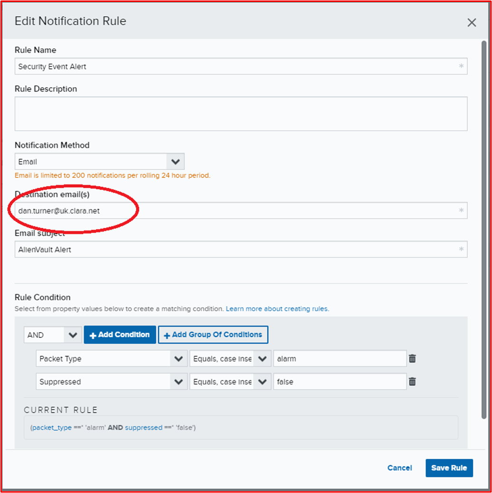

次のスクリーンショットは、Dan によって受信されるアラートを示しています。

**コントロール番号 67:** セキュリティ アラートに対応するために、スタッフが常に毎日利用可能であることを示す実証可能な証拠を提供します。

- 意図: 環境やデータへの公開を制限するために、セキュリティ アラートをできるだけ早くトリアージすることが重要です。 違反が特定された場合、スタッフは常にアラートに対応し、重大な調査作業を行う必要があります。 このプロセスを迅速に開始すれば、データを保護したり、侵害の影響を制限したりするために、セキュリティ インシデントを迅速に含めることができます。

- 証拠のガイドラインの例: セキュリティ アラートに対応するために、スタッフのメンバーが 24 時間利用可能であることを示す証拠を提供する必要があります。 これは、オンコールのロタによって行われる可能性があります。

- 証拠の例: 次のスクリーンショットは、Contoso の 2020 年 12 月のオンコール ロタを示しています。 クララネット Cyber Security SOC チームは、Contoso のオンコール チームのメンバーに警告を発します。

### 情報セキュリティ リスク管理

情報セキュリティ リスク管理は、すべての組織が少なくとも年に 1 回実施する必要がある重要なアクティビティです。 組織は、これらの脅威を効果的に軽減するために、その脅威とリスクを理解する必要があります。 効果的なリスク管理を行わないと、組織は重要であると認識する領域にセキュリティのベスト プラクティスを実装できるため、他の脅威の可能性が高く軽減する必要がある場合に、これらの領域にリソース、時間、コストを投資できます。 効果的なリスク管理は、組織がビジネスに最も脅威を与えるリスクに焦点を当てるのに役立ちます。 これは、セキュリティ環境が変化し続けているため、脅威やリスクによって超過時間が変わる可能性があるため、毎年実行する必要があります。 この良い例は、COVID-19 でフィッシング攻撃が大幅に増加し、数百人または数千人のワーカーに対するリモート作業の大量 (および高速) ロールアウトが見られます。

**コントロール番号 68:** 正式な情報セキュリティ リスク管理プロセスが確立されていることを示す証拠を提供します。

- 意図: 前述したように、組織がリスクを効果的に管理するために、堅牢な情報セキュリティ リスク管理プロセスが重要です。 これは、組織が環境に対する脅威に対する効果的な軽減策を計画するのに役立ちます。

**リスク評価には、一般的 &quot;なビジネス&quot; リスクだけでなく、情報セキュリティ リスクも含まれていることが重要です。**

- 証拠のガイドラインの例: 正式に文書化されたリスク評価管理プロセスを指定する必要があります。

- 証拠の例: 次の証拠は、Contoso&#39;のリスク評価プロセスの一部のスクリーンショットです。

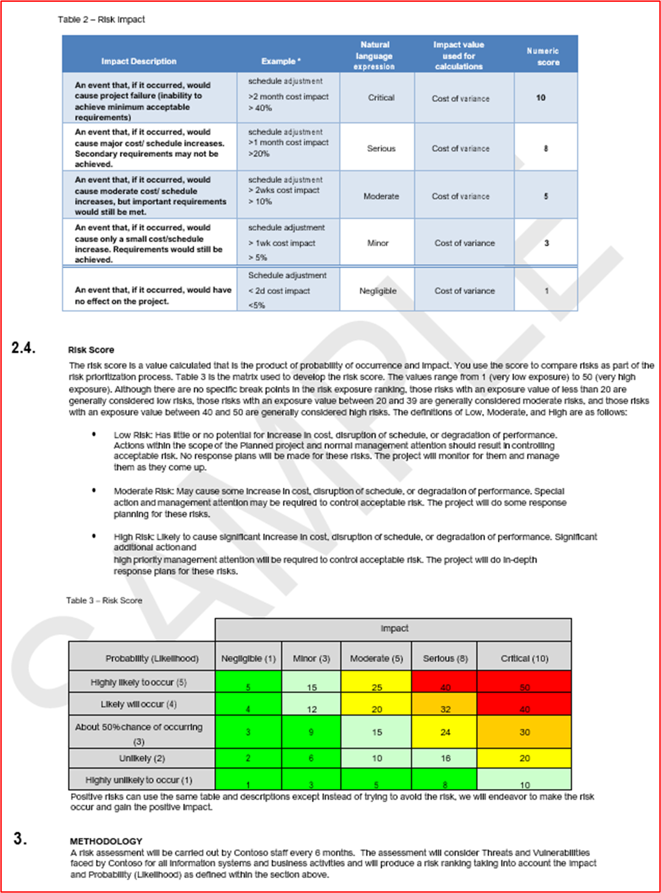

**メモ：** このスクリーンショットはポリシー/プロセス ドキュメントを示しています。ISV は実際のサポート ポリシー/手順ドキュメントを共有し、単にスクリーンショットを提供する必要はありません。

**コントロール番号 69:** 正式なリスク評価が少なくとも毎年行われるという実証可能な証拠を提供します。

- 意図: セキュリティの脅威は、環境の変更、提供されるサービスの変更、外部からの影響、セキュリティの脅威の状況の進化などに基づいて絶えず変化しています。組織は、少なくとも年に 1 回、このプロセスを実行する必要があります。 脅威が変化する可能性があるため、このプロセスは大きな変更に対しても実行することをお勧めします。

- 証拠のガイドラインの例: 証拠は、バージョン追跡または日付付き証拠によって行うことができます。 情報セキュリティ リスク評価プロセス自体に関する情報セキュリティ リスク評価の出力と **日付を** 示す証拠を提供する必要があります。

- 証拠の例: このスクリーンショットは、6 か月ごとに予定されているリスク評価会議を示しています。

この 2 つのスクリーンショットは、2 つのリスク評価会議からの会議の議事録を示しています。

**コントロール番号 70:** 情報セキュリティ リスク評価に脅威、脆弱性、またはそれに相当するものが含まれているという実証可能な証拠を提供します。

- 意図: 情報セキュリティ リスク評価は、環境とデータに対する脅威、および存在する可能性がある可能性のある脆弱性に対して実行する必要があります。 これにより、組織は、重大なリスクを引き起こす可能性のある無数の脅威や脆弱性を特定するのに役立ちます。

- 証拠ガイドラインの例: 証拠は、既に提供されている情報セキュリティ リスク評価プロセスだけでなく、リスクと脆弱性を含むリスク評価の出力 (リスク レジスタ/リスク処理計画を使用) によって提供する必要があります。

- 証拠の例: 次のスクリーンショットは、脅威と脆弱性が含まれていることを示すリスク レジスタを示しています。

**メモ：** スクリーンショットの代わりに、完全なリスク評価ドキュメントを提供する必要があります。

**コントロール番号 71:** 情報セキュリティ リスク評価に影響、尤度リスク マトリックス、またはそれに相当するものが含まれているという実証可能な証拠を提供します。

- 意図: 情報セキュリティ リスク評価は、影響評価と可能性評価を文書化する必要があります。 通常、これらのマトリックスは、リスク値を減らすのに役立つリスク処理の優先順位を付けるために組織が使用できるリスク値を特定するために使用されます。

- 証拠ガイドラインの例: 証拠は、既に提供されている情報セキュリティ リスク評価プロセスだけでなく、影響評価と尤度評価を含むリスク評価の出力 (リスク レジスタ/リスク処理計画を使用) によって提供する必要があります。

- 証拠の例: 次のスクリーンショットは、影響と可能性が含まれていることを示すリスク レジスタを示しています。

**メモ：** スクリーンショットの代わりに、完全なリスク assessment_ _document__ationを指定する必要があります。

**コントロール番号 72:** 情報セキュリティ リスク評価にリスク レジスタと治療計画が含まれているという実証可能な証拠を提供します。

- 意図: 組織はリスクを効果的に管理する必要があります。 これは、適用されている 4 つのリスク処理の 1 つのレコードを提供するために適切に追跡する必要があります。 リスクの処理は次のとおりです。

- **回避/終了** : ビジネスは、リスクに対処するコストがサービスから生成された収益を超えていると判断する場合があります。 したがって、ビジネスはサービスの実行を停止することを選択できます。
- **譲渡/共有** : ビジネスは、処理をサード パーティに移行することで、リスクをサード パーティに譲渡することを選択できます。
- **Accept/Tolerate/Retain** : ビジネスは、リスクが許容可能であると判断する場合があります。 これは、企業のリスクアペタイトに大きく依存し、組織によって異なる場合があります。
- **処理/軽減/変更** : ビジネスは、リスクを許容可能なレベルに減らす軽減コントロールを実装することにしました。

- このコントロールの目的は、組織がリスク評価を実行し、それに応じてこれに基づいて行動していることを保証することです。

- 証拠のガイドラインの例: リスク評価プロセスが適切に実行されていることを示すために、リスク治療計画/リスク レジスタ (または同等のもの) を提供する必要があります。

- 証拠の例: Contoso のリスク レジスタを次に示します。

**メモ：** スクリーンショットの代わりに、完全なリスク評価ドキュメントを提供する必要があります。

次のスクリーンショットは、リスク治療計画を示しています。

### セキュリティ インシデント対応

セキュリティ インシデント対応は、組織がセキュリティ インシデントを含めるために費やされる時間を短縮し、データ流出にさらされる組織レベルを制限できるため、すべての組織にとって重要です。 包括的で詳細なセキュリティ インシデント対応計画を開発することで、この露出を識別時から包含時間まで大幅に削減できます。

IBM の「[データ侵害のコストレポート 2020](https://www.ibm.com/security/digital-assets/cost-data-breach-report/#/)&quot;」というタイトル&quot;のレポートでは、侵害を含めるのにかかる時間が平均で 73 日間であったことが強調されています。 さらに、同じレポートは、侵害を受けた組織の最大のコスト削減を特定し、インシデント対応の準備を行い、平均 2,000,000 ドルのコスト削減を実現しました。

組織は、ISO 27001、NIST、SOC 2、PCI DSS などの業界標準フレームワークを使用して、セキュリティ コンプライアンスのベスト プラクティスに従う必要があります。

**コントロール番号 73:** セキュリティ インシデント対応計画 (IRP) を指定します。

- 意図: 既に説明したように、このコントロールの目的は、正式に文書化されたインシデント対応計画を必要とすることです。 これにより、セキュリティ インシデント対応をより効率的に管理できます。これにより、最終的に組織のデータ損失の露出を制限し、侵害のコストを削減できます。

- 証拠のガイドラインの例: インシデント対応計画/手順の完全なバージョンを指定します。 これには、次のコントロールで説明されている文書化された通信プロセスが含まれている必要があります。

- 証拠の例: 次のスクリーンショットは、Contoso&#39;のインシデント対応計画の開始を示しています。 証拠提出の一環として、インシデント対応計画全体を指定する必要があります。

**メモ：** このスクリーンショットはポリシー/プロセス ドキュメントを示しています。ISV は実際のサポート ポリシー/手順ドキュメントを共有し、単にスクリーンショットを提供する必要はありません。

**コントロール番号 74:** セキュリティ IRP に文書化されたコミュニケーション プロセスが含まれているという実証可能な証拠を提供し、支払いブランドや取得者、規制機関、監督機関、ディレクター、顧客などの主要な利害関係者にタイムリーに通知できるようにします。

- 意図: 組織は、事業を行う国/国 (一般データ保護規則など) に基づいて違反通知義務を負う可能性があります。GDPR)、または提供されている機能 (支払いデータが処理される場合は PCI DSS など) に基づいています。 タイムリーな通知の失敗は重大な影響を及ぼす可能性があるため、通知の義務を確実に満たすため、インシデント対応計画には、すべての利害関係者とのコミュニケーション、メディア通信プロセス、メディアに話すことができる人と話すことができない人を含むコミュニケーション プロセスを含める必要があります。

- 証拠のガイドラインの例: 通信プロセスをカバーするセクションを含める必要があるインシデント対応計画/手順の完全なバージョンを提供します。

- 証拠の例: 次のスクリーンショットは、通信プロセスを示すインシデント対応計画からの抜粋を示しています。

**コントロール番号 75:** インシデント対応チームのすべてのメンバーが年次トレーニングまたはテーブルトップ演習を完了したことを示す実証可能な証拠を提供します。

- 意図: 既に説明したように、組織が侵害を含むのにかかる時間が長いほど、データ流出のリスクが高くなり、流出したデータの量が多くなり、侵害の全体的なコストが大きくなる可能性があります。 組織&#39;インシデント対応チームは、セキュリティ インシデントに適時に対応することが重要です。 定期的なトレーニングを実施し、卓上演習を実施することで、チームはセキュリティ インシデントを迅速かつ効率的に処理できるようになります。

- 推奨事項は、インシデント対応チームの内部インシデント対応トレーニング **と** 、発生する可能性が最も高いセキュリティ インシデントを特定するための情報セキュリティ リスク評価にリンクする必要がある定期的な卓上演習の両方を実行することです。 こうすることで、チームは、最も可能性の高いセキュリティ インシデントを迅速に封じ込め、調査するために実行する手順を把握します。

- 証拠のガイドラインの例: トレーニング コンテンツを共有することによってトレーニングが実行されたことを示す証拠と、参加したユーザーを示すレコード (インシデント対応チームをすべて含める必要があります) を示す証拠を提供する必要があります。 または、卓上演習が実行されたことを示すレコードも含まれます。証拠が提出されてから 12 か月以内に完了している必要があります。

- 証拠の例: Contoso は、クラネット サイバー セキュリティという外部セキュリティ会社を使用して、インシデント対応の卓上演習を実施しました。 コンサルティングの一部として生成されたレポートのサンプルを次に示します。

**メモ：** レポート全体を共有する必要があります。 この演習は、サードパーティの会社が実行するためのMicrosoft 365要件がないため、内部的に実行することもできます。

**コントロール番号 76:** 学習した教訓や組織の変更に基づいてセキュリティ IRP が更新されていることを示す実証可能な証拠を提供します。

- 意図: 時間の経過と共に、インシデント対応計画 (IRP) は、組織の変更に基づいて、または IRP の作成時に学習した教訓に基づいて進化する必要があります。 オペレーティング環境を変更すると、脅威が変更されたり、規制要件が変更されたりするため、IRP の変更が必要になる場合があります。 さらに、卓上演習と実際のセキュリティ インシデントの対応が行われると、これは多くの場合、改善できる IRP の領域を特定できます。 これはプランに組み込む必要があり、このコントロールの目的は、このプロセスが IRP 内に確実に含まれるようにすることです。

- 証拠のガイドラインの例: これは、多くの場合、セキュリティ インシデントの結果や、学習した教訓が特定され、IRP の更新の結果として得られた卓上演習の結果を確認することによって証明されます。 IRP は変更履歴を保持する必要があります。また、学習した教訓や組織の変更に基づいて実装された変更も参照する必要があります。

- 証拠の例: 次のスクリーンショットは、提供された IRP から取得したものです。これには、学習した教訓や組織の変更に基づく IRP の更新に関するセクションが含まれています。

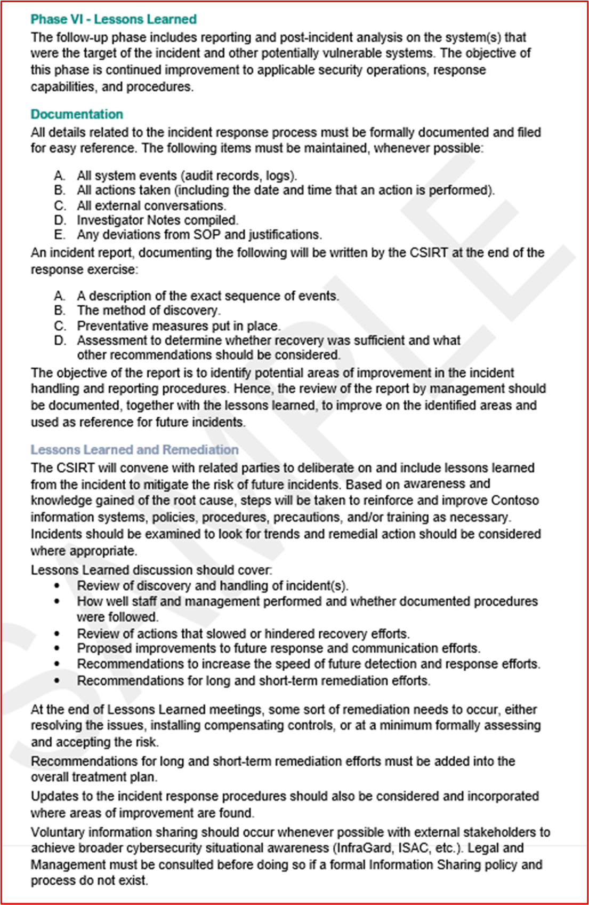

IRP 変更ログには、2021 年 7 月に行われた卓上演習の背面で行われた更新が表示されます。

## セキュリティ ドメイン: データ処理のセキュリティとプライバシー

このセキュリティ ドメインは、M365 から使用されるすべてのデータが転送中と保存中の両方で適切に保護されるようにするために含まれています。 また、このドメインは、EU 市民のプライバシーに関係する一般データ保護規則 (GDPR) に従って、ISV によって消費者 (データ主体) のプライバシーに関する懸念が確実に満たされるようにします。

### 転送中のデータ

M365 で開発されたアプリ/アドインの接続要件により、通信はパブリック ネットワーク (インターネット) 経由で行われます。 このため、転送中のデータを適切に保護する必要があります。 このセクションでは、インターネット経由のデータ通信の保護について説明します。

**コントロール番号 1:** TLS 構成が TLS [プロファイル構成要件](../docs/certification-submission-guide.md#appendix-a)内の暗号化要件を満たしているか、またはそれを超えているという実証可能な証拠を提供します。

- 意図: このコントロールの目的は、組織によって使用されている M365 データが安全に送信されるようにすることです。 TLS プロファイル構成では、中間者攻撃に対してトラフィックがセキュリティで保護されるように TLS 固有の要件が定義されています。

- 証拠のガイドラインの例: これを証明する最も簡単な方法は、標準以外のポートで実行される任意の Web リスナーを含め、**すべての** Web リスナーに対して [Qualys SSL Server Test](https://www.ssllabs.com/ssltest/) ツールを実行することです。

- [ボード&quot;に結果を&quot;表示しない] オプションを必ずオンにしてください。これにより、URL が Web サイトに追加されなくなります。

- TLS プロファイル構成要件内の個々のチェックを示す証拠を提供することもできます。 構成設定は、スクリプトやソフトウェア ツールと共に使用して、特定の設定の一部 (TLS 圧縮が無効) の証拠を提供するのに役立ちます。

- 証拠の例: 次のスクリーンショットは [、www.clara.net:443](http://www.clara.net:443/) Web リスナーの結果を示しています。

**注**: 認定アナリストは、完全な出力を確認して、TLS プロファイル構成要件のすべての要件が満たされていることを確認します (完全なスキャン出力のスクリーンショットを提供してください)。 _what証拠 _が_ 提供されたDepending_、アナリストは独自の Qualys スキャンを実行できます。

- 証拠 2 の例: 次のスクリーンショットは、TLS 1.2 がストレージに構成されていることを示しています。

**メモ：** このスクリーンショットだけでは、この要件を満たすことができません。

- 例 3: 次のスクリーンショットは、TLS V1.3 がサーバーでのみ有効になっていることを示しています。

この例では、レジストリ キーを使用して、次のように値を調整してプロトコルを無効または有効にします。

バイナリ: 0 - off 1 - on

16 進数: 0x00000000 - off 0xffffffff - on

**注意** : - この方法を理解していない場合は、この方法を使用しないでください。この例を使用または従った場合、またはシステムに対する影響については、Microsoft は責任を負いません。 ここでは、TLS が有効か無効かを示す別の方法を示すだけです。

**注**: これらのスクリーンショットだけでは、この要件を満たすことができません。

**コントロール番号 2:** Web 要求を処理するすべての公開サービスで TLS 圧縮が無効になっているという実証可能な証拠を提供します。

- 意図: TLS 圧縮に影響を与える特定の TLS 脆弱性、CRIME ([CVE-2012-4929](https://nvd.nist.gov/vuln/detail/CVE-2012-4929)) があります。 このため、業界の推奨事項は、この機能を無効にすることです。

- 証拠のガイドラインの例: これは、Qualys SSL Labs ツールを使用した証拠です。

- 証拠の例: 次のスクリーンショットは、Qualys SSL Labs ツールを使用してこれを示しています。

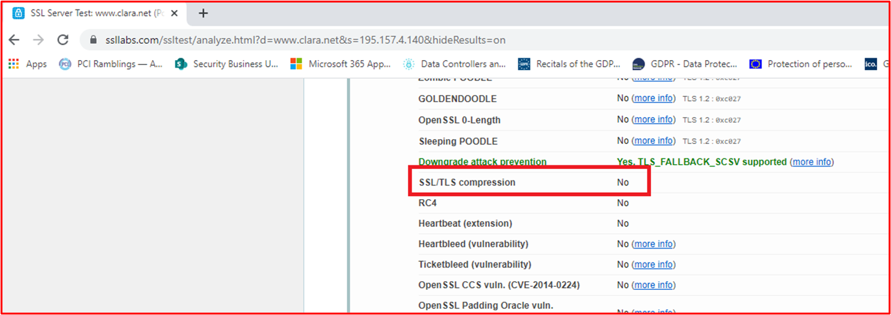

**コントロール番号 3:** TLS HTTP の厳密なトランスポート セキュリティが有効で、すべてのサイトで >= 15552000 に構成されていることを示す証拠を提供します。

- 意図: HTTP Strict Transport Security (HSTS) は、Strict-Transport-Security という名前 &quot;の HTTPS 応答ヘッダー フィールドを使用して TLS 接続を強制することで、中間者攻撃から Web サイトを保護するように設計されたセキュリティ&quot; メカニズムです。

- 証拠のガイドラインの例: これは、Qualys SSL Labs ツールまたはその他のツールや Web ブラウザー アドインを使用した証拠です。

- 証拠の例: 次のスクリーンショットは、 [www.microsoft.com Web サイト](https://www.microsoft.com/) の HTTP ヘッダー Spy&#39;&#39;呼び出された Web ブラウザー アドインを介してこれを示しています。

### 保存データ

Microsoft 365 プラットフォームから使用されるデータが ISV によって格納されている場合、データを適切に保護する必要があります。 このセクションでは、データベースとファイル ストア内に格納されているデータの保護要件について説明します。

**コントロール番号 4:** AES、Blowfish、TDES、128 ビット、256 ビットの暗号化キー サイズなどの暗号化アルゴリズムを使用して、保存データが暗号化プロファイル要件でインラインで暗号化されていることを示す証拠を提供します。

- 意図: 一部の古い暗号化アルゴリズムには、いくつかの暗号化の弱点が含まれていることがわかっています。これにより、脅威アクターがキーを知らなくてもデータを復号化できる可能性が高くなります。 このため、この制御の目的は、保存された M365 データを保護するために業界で受け入れられた暗号化アルゴリズムのみを使用することです。

- 証拠のガイドラインの例: スクリーンショットを使用して証拠を提供できます。これは、データベースやその他のストレージの場所内の M365 データを保護するために使用されている暗号化を示しています。 証拠は、暗号化の構成がMicrosoft 365認定の[暗号化プロファイル構成要件](../docs/certification-submission-guide.md#appendix-b)に沿って行われるという証拠を示す必要があります。

- 証拠の例: 次のスクリーンショットは、Contoso Database で TDE (Transparent Data Encryption) が有効になっていることを示しています。 2 番目のスクリーンショットは、Azure TDE に AES 256 暗号化が使用されていることを示す[SQL Database、SQL Managed Instance、Azure Synapse Analytics&#39;の Transparent データ](/azure/azure-sql/database/transparent-data-encryption-tde-overview?view=sql-server-ver15&amp;tabs=azure-portal)暗号化&#39;Microsoft ドキュメント ページを示しています。

- 証拠 2 の例: 次のスクリーンショットは、BLOB とファイルの暗号化で構成されたAzure Storageを示しています。 次のスクリーンショットは、保存データ&quot;[の暗号化Azure Storage](/azure/storage/common/storage-service-encryption) Microsoft ドキュメント ページ&quot;Azure Storage暗号化に AES-256 を使用していることを示しています。

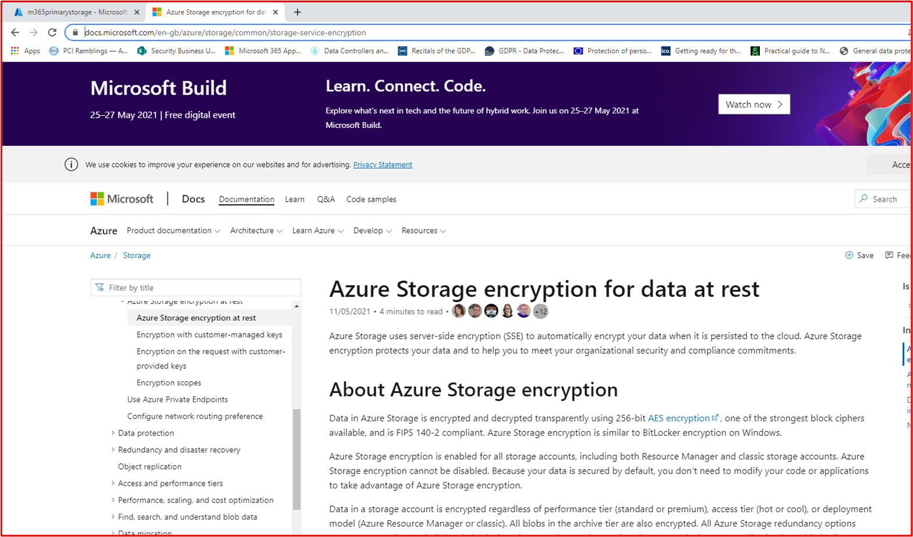

**コントロール番号 5:** ハッシュ関数またはメッセージ認証 (HMAC-SHA1) は、暗号化プロファイルの要件を使用して保存データをインラインで保護するためにのみ使用されるという実証可能な証拠を提供します。

- 意図: 暗号化アルゴリズムと同様に、一部のハッシュ関数とメッセージ認証アルゴリズムは、暗号化の弱点を持つアルゴリズムに基づいています。 このコントロールの目的は、データ保護メカニズムとしてハッシュが使用されている場合に、M365 データが強力なハッシュ関数で保護されるようにすることです。 これが環境やアプリケーションによって使用されない場合は、これを裏付ける証拠を提供する必要があります。

- 証拠ガイドラインの例: 証拠は、ハッシュ関数が機能しているコードのスニペットを示すスクリーンショットの形式である可能性があります。

- 証拠の例: Contoso は、アプリケーション内でハッシュ機能を利用しています。 次のスクリーンショットは、SHA256 がハッシュ関数の一部として使用されていることを示しています。

**コントロール番号 6:** 保存されているすべてのデータのインベントリを提供します。これには、ストレージの場所やデータの保護に使用される暗号化が含まれます。

- 意図: データを適切に保護するには、組織の環境/システムが使用しているデータと、データが格納されている場所を認識する必要があります。 これが完全に理解され文書化されると、組織は適切なデータ保護を実装するだけでなく、データが配置されている場所を統合して保護をより効果的に実装することもできます。 さらに、データをできるだけ少ない場所に統合する場合は、必要な数の従業員にアクセスを制限するための適切な RBAC (ロールベースのアクセス制御) を実装する方がはるかに簡単です。

- 証拠のガイドラインの例: 証拠は、ドキュメントまたは内部システムからのエクスポート (SharePointまたは Confluence) を使用して提供する必要があります。使用されるすべてのデータ、すべてのストレージの場所、および実装される暗号化のレベルを詳しく説明します。

- 証拠の例: 次のスクリーンショットは、データ型を示すドキュメントの例を示しています。

### データの保持と破棄

ISV が M365 データを使用して格納する場合、これは、脅威アクターが ISV 環境を侵害した場合にデータ侵害の危険にさらされます。 このリスクを最小限に抑えるために、組織は、サービスを配信するために必要なデータのみを保持し、将来使用される可能性のある&quot;データ&quot;を保持する必要はありません。 また、データは、データがキャプチャされたサービスを提供するために必要な期間だけ保持する必要があります。 データリテンション期間を定義し、ユーザーと通信する必要があります。 データが定義された保有期間を超えた後は、データを再構築または回復できないように、安全に削除する必要があります。

**コントロール番号 7:** 承認済みおよび文書化されたデータ保持期間が正式に確立されていることを示す証拠を提供します。

- 意図: 文書化された保持ポリシーは、一部の法的義務を満たすだけでなく、一般的なデータ保護規則 (EU GDPR) やデータ保護法 (UK DPA 2018) などのデータ プライバシーに関する法律を満たすだけでなく、組織のリスクを制限するためにも重要です。 組織のデータ要件と、ビジネスがその機能を実行するために必要なデータの期間を理解することで、組織は、その有用性が期限切れになった後にデータが適切に破棄されるようにすることができます。 組織は、格納されるデータの量を減らすことで、データ侵害が発生した場合に公開されるデータの量を減らしています。 これにより、全体的な影響が制限されます。

- 多くの場合、組織は単に念のためデータを格納&#39;&quot;&quot;が、組織がサービスやビジネス機能を実行するためにデータを必要と&#39;場合は、組織のリスクが不必要に増大するため、データを格納しないでください。

- 証拠ガイドラインの例: ビジネスがビジネス機能を実行できるように、データを保持する期間 (すべてのデータ型をカバーする必要があります) を明確に詳細に示す完全なデータ保持ポリシーを指定します。

- 証拠の例: 次のスクリーンショットは、Contoso&#39;のデータ保持ポリシーを示しています。

**メモ：** このスクリーンショットはポリシー/プロセス ドキュメントを示しています。ISV は実際のサポート ポリシー/手順ドキュメントを共有し、単にスクリーンショットを提供する必要はありません。

**コントロール番号 8:** 保持データが定義された保有期間と一致することを示す証拠を提供します。

- 意図: このコントロールの目的は、定義されたデータ保有期間が満たされていることを単に検証することです。 既に説明したように、組織は、これを満たす法的義務を負うだけでなく、必要なデータを保持することで、データ侵害が発生した場合に組織に対するリスクを軽減するのに役立ちます。

- 証拠のガイドラインの例: 保存されたデータ (データベース、ファイル共有、アーカイブなど) が定義されたデータ保持ポリシーを超えていないことを示すスクリーンショット証拠 (またはスクリーン共有経由&#39;) を提供します。 たとえば、日付フィールドを含むデータベース レコードのスクリーンショット、最も古いレコード順で検索された場所、保持期間内のタイムスタンプを示すファイル ストレージの場所などです。

**メモ：** 個人または機密の顧客データは、スクリーンショット内でやり直す必要があります。

- 証拠の例: 次の証拠は、データベース内で最も古いレコードを表示するために、&#39;DATETRANSACTION\_&#39; フィールドで昇順に並べ替えられたデータベース テーブルの内容を示すSQLクエリを示しています。 これは、定義された保有期間を超えていないデータが 2 か月経過&#39;必要があります。

**メモ：** これはテスト データベースであるため、その中に履歴データ&#39;多くはありません。

**コントロール番号 9:** 保持期間後にデータを安全に削除するためにプロセスが実施されていることを示す証拠を提供します。

- 意図: このコントロールの目的は、保持期間を超えるデータを削除するために使用されるメカニズムが安全に行われるようにすることです。 削除されたデータは、回復できる場合があります。そのため、削除後にデータを回復できないように、削除プロセスは十分に堅牢である必要があります。

- 証拠のガイドラインの例: 削除プロセスがプログラムによって行われる場合は、これを実行するために使用されるスクリプトのスクリーンショットを提供します。 スケジュールで実行&#39;場合は、スケジュールを示すスクリーンショットを提供します。 たとえば、ファイル共有内のファイルを削除するスクリプトは CRON ジョブとして構成できます。実行されるスケジュールとスクリプトを示す CRON ジョブをスクリーンショットし、使用されたコマンドを示すスクリプトを提供します。

- 例 1: これは、日付に基づいて保持されているすべてのデータ レコードを削除するために使用できる単純なスクリプトです。WHERE DateAdd は -30 日です。これにより、選択したデータ保持日から 30 日を過ぎたすべての保持レコードが消去されます。 スクリプトだけでなく、実行されているジョブと結果の証拠も必要であることに注意してください。

- 証拠 2 の例: 以下は、コントロール 7 の Contoso データ保有プランから取得されています。これは、データの破棄に使用される手順を示しています。

**メモ：** このスクリーンショットはポリシー/プロセス ドキュメントを示しています。ISV は実際のサポート ポリシー/手順ドキュメントを共有し、単にスクリーンショットを提供する必要はありません。

- 例 3: この例では、Runbook が作成され、データ レコード保持ポリシーの有効期限の 30 日後から作成された終了日を持つレコードを安全に削除するための対応するスケジュールが Azure で作成されています。 このジョブは、月の最後の日に毎月実行するように設定されています。

次のウィンドウは、Runbook がレコードを検索するために編集され、スクリプトのように表示されない削除コマンドがあることを示しています。 これらのスクリーンショットの完全な URL とユーザー名が表示されている必要があります。削除前のレコード数と削除後のレコード数のスクリーンショットを表示するには、ISV&#39;が必要です。 これらのスクリーンショットは、このアプローチのさまざまな方法の純粋な例です。

### データ アクセス管理

データ アクセスは、データが悪意を持って侵害されたり、誤って侵害されたりする可能性を減らすために、必要な人数に制限する必要があります。 データと暗号化キーへのアクセスは、職務の役割を果たすための正当なビジネス ニーズを持つユーザーに限定する必要があります。 これは十分に文書化され、アクセスを要求するための十分に確立されたプロセスを実装する必要があります。 データと暗号化キーへのアクセスは、最小限の特権の原則に従う必要があります。

**コントロール番号 10:** ビジネス上の理由を含め、データまたは暗号化キーへのアクセス権を持つすべての個人の一覧を提供します。

- 意図: 組織は、データと暗号化キーへのアクセスをできるだけ少ない従業員に制限する必要があります。 この制御の目的は、従業員がデータや暗号化キーへのアクセスを、そのアクセスに対して明確なビジネス ニーズを持つ従業員に制限することです。

- 証拠のガイドラインの例: データや暗号化キーへのアクセス権を持つすべての従業員と、これらの個人がアクセスできる理由のビジネス上の正当な理由を文書化する内部システムのドキュメントまたはスクリーンショットを提供する必要があります。 この一覧は、認定アナリストが次のコントロールのユーザーをサンプリングするために使用されます。

- 証拠の例: 次のドキュメントは、データへのアクセス権とビジネス上の理由を持つユーザーの文書化された一覧を示しています。

**コントロール番号 11:** データまたは暗号化キーにアクセスできるサンプリングされた個人が正式に承認されたことを示す証拠を提供し、ジョブ機能に必要な特権を詳しく説明します。

- 意図: データキーや暗号化キーへのアクセスを許可するプロセスには承認を含める必要があります。これにより、個々の&#39;のアクセスがジョブ機能に必要になります。 これにより、アクセスの真の理由がない従業員に、不要なアクセスが与え&#39;なくなります。

- 証拠ガイドラインの例: 通常、前のコントロールに提供された証拠は、このコントロールをサポートするのに役立ちます。 提供されたドキュメント&#39;正式な承認がない場合、証拠は、Azure DevOpsや Jira などのツール内でのアクセスに対する変更要求が発生し、承認される可能性があります。

- 証拠の例: この一連の画像は、機密データや暗号化キーへのアクセスを許可または拒否するために、コントロール 10 で上記のリストに対して作成および承認された Jira Tickets を示しています。

このイメージは、システム バックエンド環境で Sam Daily の暗号化キーの承認を取得するために Jira で要求が作成されたことを示しています。 これは、書面による承認が得られた上記の 10 を制御する次の手順として行われます。

これは、Sam Daily のアクセス権を付与する要求が、管理 10 で確認できる管理の担当者である Jon Smith によって承認されたことを示しています。 (承認は、変更要求を許可するのに十分な権限を持つユーザーから取得する必要があります。別の開発者は許可できません)。

上記は、このプロセスのワークフローを示しています。自動化された承認プロセスを通過していない限り、何も完了として追加できないことに注意してください。

上のProjectボードは、Sam Daily&#39;の暗号化キーへのアクセスに対する承認が与えられていることを示しています。 バックログの下には、Sam Daily&#39;の要求承認と、作業を行うために割り当てられたユーザーが表示されます。

このコントロールの要件を満たすには、コントロール要件を満たしていることを示す説明と共に、これらのスクリーンショットをすべて表示する必要があります。

- 証拠 2 の例: 次の例では、運用 DB へのユーザーに対して管理者アクセスとフル コントロールのアクセス許可が要求されています。 画像の右側に表示されているように、承認のために要求が送信され、これは左側に表示されているように承認されています。

上記では、アクセスが承認され、完了時にサインオフされていることがわかります。

**コントロール番号 12:** データまたは暗号化キーにアクセスできるサンプリングされた個人が、承認に含まれる特権のみを持っていることを示す証拠を提供します。

- 意図: このコントロールの目的は、データや暗号化キーのアクセスが文書化に従って構成されていることを確認することです。

- 証拠のガイドラインの例: 証拠は、サンプリングされた個人に付与されたデータや暗号化キーのアクセス特権を示すスクリーンショットを使用して提供できます。 証拠は、すべてのデータの場所をカバーする必要があります。

- 証拠の例: このスクリーンショットは、前のコントロールの証拠に従って、この同じユーザー &quot;に対する承認要求に対して相互参照されるユーザー John Smith&quot; に付与されたアクセス許可を示しています。

**コントロール番号 13:** 顧客データが共有されているすべてのサード パーティの一覧を指定します。

- 意図: M365 データの格納または処理にサード パーティが使用されている場合、これらのエンティティは重大なリスクを生じる可能性があります。 組織は、これらのサード パーティがデータを安全に保存/処理し、GDPR のデータ プロセッサなど、法的義務を果たせるように、適切なサード パーティの適切な注意と管理プロセスを開発する必要があります。

- 組織は、次の一部またはすべてのユーザーとデータを共有するすべてのサード パーティの一覧を保持する必要があります。

- 提供されているサービスとは何か、
- どのデータが共有されているか、
- データが共有される理由、
- 主要な連絡先情報 (プライマリ連絡先、侵害通知連絡先、DPO など)
- 契約の更新/有効期限
- 法的/コンプライアンス上の義務 (GDPR、HIPPA、PCI DSS、FedRamp など)

- 証拠のガイドラインの例: M365 データが共有 **されているすべての** サード パーティを詳しく説明するドキュメントを提供します。

**メモ：** サード パーティが使用されていない場合は、上級リーダーシップ チームのメンバーが書面 (電子メール) で確認する必要があります。

- 証拠 1 の例

- 例 2: このスクリーンショットは、M365 データの処理にサード パーティが使用されていないことを確認する上級リーダーシップ チームのメンバーの電子メールの例を示しています。

**コントロール番号 14:** 顧客データを使用するすべてのサード パーティが共有契約を結んでいるという実証可能な証拠を提供します。

- 意図: M365 データがサード パーティと共有されている場合は、データが適切かつ安全に処理されていることが重要です。 データ共有契約は、サード パーティが必要な場合にのみデータを処理し、セキュリティ上の義務を理解するために実施する必要があります。 組織のセキュリティは、最も弱いリンクと同じくらい強力です。 このコントロールの目的は、サード パーティが組織の弱いリンクにならないようにすることです。

- 証拠のガイドラインの例: サード パーティと実施されているデータ共有契約を共有します。

- 証拠の例: 次のスクリーンショットは、単純なデータ共有契約の例を示しています。

**メモ：** 完全な契約は、スクリーンショットではなく共有する必要があります。

### GDPR

ほとんどの組織は、ヨーロッパ市民&#39;(データ主体) データである可能性があるデータを処理します。 **任意** のデータ主体のデータが処理される場合、組織は一般的なデータ保護規則 (GDPR) を満たす必要があります。 これは、データ コントローラー (そのデータを直接キャプチャしている) とデータ プロセッサ (データ コントローラーの代わりにこのデータを処理している) の両方に適用されます。 このセクション&#39;規制全体を網羅していませんが、GDPR の重要な要素の一部に取り組み、組織が GDPR を深刻に受け止めているという保証を得るのに役立ちます。

**コントロール番号 15:** 文書化されたサブジェクト アクセス要求 (SAR) プロセスを提供し、データ主体が SAR を発生できることを示す証拠を提供します。

- 意図: GDPR には、データ主体&#39;データを処理する組織が満たす必要がある特定の義務が含まれています。 組織がサブジェクト アクセス要求 (SAR) を管理する義務は、第 12.3 条に基づき、要求に応答するために SAR の 1 か月の受領をデータ コントローラーに与える第 12 条に含まれています。 拡張機能は、必要に応じてさらに 2 か月間許可されます。 組織がデータ プロセッサとして機能している場合でも、顧客 (データ コントローラー) が SAR の義務を果たすのに役立つ必要があります。

- 証拠のガイドラインの例: SAR を処理するための文書化されたプロセスを指定します。

- 証拠の例: 次の例は、SAR を処理するための文書化されたプロセスを示しています。

**メモ：** このスクリーンショットはポリシー/プロセス ドキュメントを示しています。ISV は実際のサポート ポリシー/手順ドキュメントを共有し、単にスクリーンショットを提供する必要はありません。

**コントロール番号 16:** SAR に応答するときに、データ主体のデータのすべての場所を識別できることを示す証拠を提供します。

- 意図: このコントロールの目的は、組織がデータ&#39;すべてのデータ主体を識別するための堅牢なメカニズムを確実に備えできるようにすることです。 これは、すべてのデータ ストレージが十分に文書化されているか、他のツールを使用してすべてのデータが SAR プロセスの一部として確実に配置されるため、手動プロセスである可能性があります。

- 証拠のガイドラインの例: 証拠は、すべてのデータの場所の一覧と、すべてのデータの場所を検索するための文書化されたプロセスによって提供される場合があります。 これには、データを検索するために必要なコマンドが含まれます。つまり、SQL場所が含まれている場合は、データが正しく検出されるように特定のSQLステートメントが詳細に記述されます。

- 証拠の例: 次のスクリーンショットは、データの検出方法を示す上記の SAR&#39;の手順のスニペットです。

次の 4 つの画像は、クエリを実行した ISV データの場所と、SAR 要求に準拠するためにストレージから削除する必要があるファイルまたは BLOB にドリルダウンするために使用されるエクスプローラー Storage方法を示しています。

このクエリは、使用中のストレージ アカウントを確認します。 Resource Graph エクスプローラー (Kusto) または PowerShell (以下を参照) を使用して、ストレージ、BLOB、ファイルのクエリと削除を行うことができます。

上の図は、削除する必要があるクライアントの BLOB コンテナー内で検出されたデータを示しています。以下は、BLOB 内の情報を削除または論理的に削除するアクションを示しています。

**コントロール番号 17:** 次のように、必要なすべての要素を含めるプライバシーに関する通知へのリンクを指定します。

- 会社の詳細 (名前、住所など)。
- 処理される個人データの種類について詳しく説明します。
- 個人データの処理の適法性について詳しく説明します。
- データ主体&#39;権限の詳細:
  - - 通知を受ける権利
  - - データ主体によるアクセス権、
  - - 消去する権利、
  - - 処理の制限を受ける権利、
  - - データの移植性に対する権利。
  - - オブジェクトに対する権利
  - - プロファイリングを含む、自動化された意思決定に関連する権利。
- 個人データを保持する期間について詳しく説明します。

- 意図: GDPR の第 13 条には、個人データが取得された時点でデータ主体に提供する必要がある特定の情報が含まれています。 このコントロールの目的は、組織のデータ プライバシーに関する通知が、第 13 条に含まれる重要な情報の一部をデータ主体に提供することです。

- 証拠のガイドラインの例: これは通常、データプライバシーに関する通知を提供することで提供されます。 認定アナリストはこれを確認して、コントロール内で提供されるすべての情報がデータプライバシー通知に含まれていることを確認します。

- 証拠の例

上記と隣接するプライバシーに関する通知の画像は、GDPR の第 13 条を含むオンライン プライバシー ポリシーの例を示しています。

以下は、前に示したプライバシーに関する通知と組み合わせて使用できるデータ保護ポリシーです。

Azure の上の図は、バックエンド環境に格納されたデータに対する GDPR のコンプライアンス要件を満たすように Azure がどのように構成されているかを示しています。 ポリシー (_Azure Blueprints からカスタムで作成または構築できます_) を使用すると、ISV はクライアント&#39;のデータが正しく保存され、設定されたメトリックとアラートによってのみアクセス可能になり、コンプライアンスが確保されるように設定され、コンプライアンス マネージャー ダッシュボードに非準拠データまたはユーザー アクセスが表示されます。

ブック

Murdoch D. (2018) Blue Team 手引き: インシデント対応エディション: サイバーセキュリティ インシデント レスポンダーのフィールド ガイドです。 第 2 版Publisher: CreateSpace Independent Publishing Platform。

関連情報

- アクション詐欺サイバー犯罪レポートは、次 [https://www.actionfraud.police.uk/](https://www.actionfraud.police.uk/) の時点で利用できます(08/02/21 にアクセス)。
- EU。 (2021) データ コントローラーの GDPR チェックリスト: [https://gdpr.eu/checklist/](https://gdpr.eu/checklist/) (01/02/21 にアクセス)。
- マイクロソフト。 (2018) イベント ログ (Windows インストーラー) で使用できます:docs.microsoft.com/en-us/windows/win32/msi/event-logging (アクセス日: 23/12/20)。
- ポジティブ テクノロジ。 (2020) セキュリティで保護されたソフトウェア開発にアプローチする方法: [https://www.ptsecurity.com/ww-en/analytics/knowledge-base/how-to-approach-secure-software-development/](https://www.ptsecurity.com/ww-en/analytics/knowledge-base/how-to-approach-secure-software-development/)(アクセス: 21/12/20)。
- 個人データの処理およびそのようなデータの自由な移動に関する自然人の保護に関する、2016 年 4 月 27 日の欧州会議および欧州会議の規制 (EU) 2016/679、 ディレクティブ 95/46/EC (一般的なデータ保護規則) (EEA の関連性を持つテキスト) (2016) [https://www.legislation.gov.uk/eur/2016/679/contents](https://www.legislation.gov.uk/eur/2016/679/contents) を廃止します(アクセス日: 2021 年 11 月 11 日)。
- セキュリティ メトリック。 (2020) PCI DSS コンプライアンスに関するセキュリティ メトリック ガイド。 利用可能時間 : [https://info.securitymetrics.com/pci-guide-2020](https://info.securitymetrics.com/pci-guide-2020)(アクセス日: 01/06/21)。
- Williams J. OWASP リスク ランキングは、次 [https://owasp.org/www-community/OWASP\_Risk\_Rating\_Methodology](https://owasp.org/www-community/OWASP_Risk_Rating_Methodology) の時点で使用できます (アクセス: 08/12/20)。
- Qualys。 (2014) SSL Labs: 信頼の新しい成績 (T) と不一致 (M) の問題が利用可能: [https://blog.qualys.com/product-tech/2014/06/17/ssl-labs-new-grades-for-trust-t-and-mismatch-m-issues](https://blog.qualys.com/product-tech/2014/06/17/ssl-labs-new-grades-for-trust-t-and-mismatch-m-issues) (アクセス: 29/01/21)。
- NIST SP800-61r2: コンピューター セキュリティ インシデント処理ガイド ([https://csrc.nist.gov/publications/detail/sp/800-61/rev-2/final](https://csrc.nist.gov/publications/detail/sp/800-61/rev-2/final) 24/01/21 にアクセス) で入手できます。

**Microsoft Documents から取得した画像**

- [https://www.sans.org/information-security-policy/](https://www.sans.org/information-security-policy/)(18/02/21 にアクセス)。
- [https://docs.microsoft.com/cloud-app-security/anomaly-detection-policy](/cloud-app-security/anomaly-detection-policy)(16/02/21 にアクセス)。
- [https://docs.microsoft.com/azure/azure-monitor/alerts/alerts-overview](/azure/azure-monitor/alerts/alerts-overview) (17/02/21 にアクセス)。
- [https://docs.microsoft.com/cloud-app-security/anomaly-detection-policy](/cloud-app-security/anomaly-detection-policy) (22/02/21 にアクセス)。
- [https://docs.microsoft.com/azure/security-center/security-center-managing-and-responding-alerts](/azure/security-center/security-center-managing-and-responding-alerts) (24/02/21 にアクセス)。
- [https://docs.microsoft.com/azure/security-center/security-center-managing-and-responding-alerts](/azure/security-center/security-center-managing-and-responding-alerts) (24/02/21 にアクセス)。
- [https://microsoft.github.io/AzureTipsAndTricks/blog/tip272.html](https://microsoft.github.io/AzureTipsAndTricks/blog/tip272.html)
- [https://docs.microsoft.com/azure/information-protection/what-is-information-protection](/azure/information-protection/what-is-information-protection)
- [https://docs.microsoft.com/azure/azure-sql/database/transparent-data-encryption-tde-overview?tabs=azure-portal](/azure/azure-sql/database/transparent-data-encryption-tde-overview?tabs=azure-portal)
- [https://docs.microsoft.com/azure/governance/policy/assign-policy-portal](/azure/governance/policy/assign-policy-portal)
- [https://docs.microsoft.com/azure/azure-sql/database/threat-detection-configure](/azure/azure-sql/database/threat-detection-configure)
