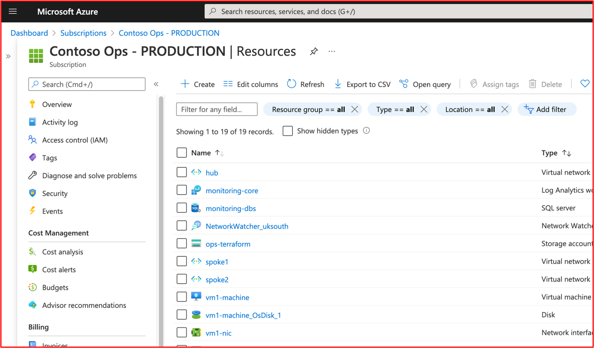
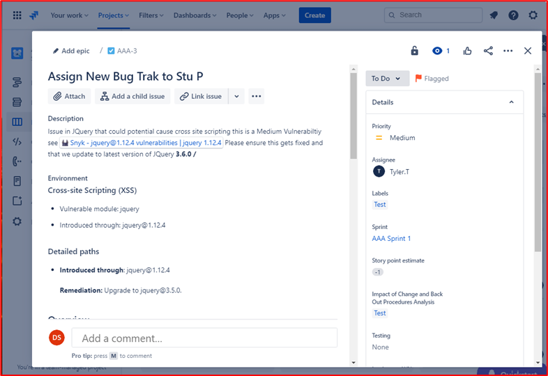
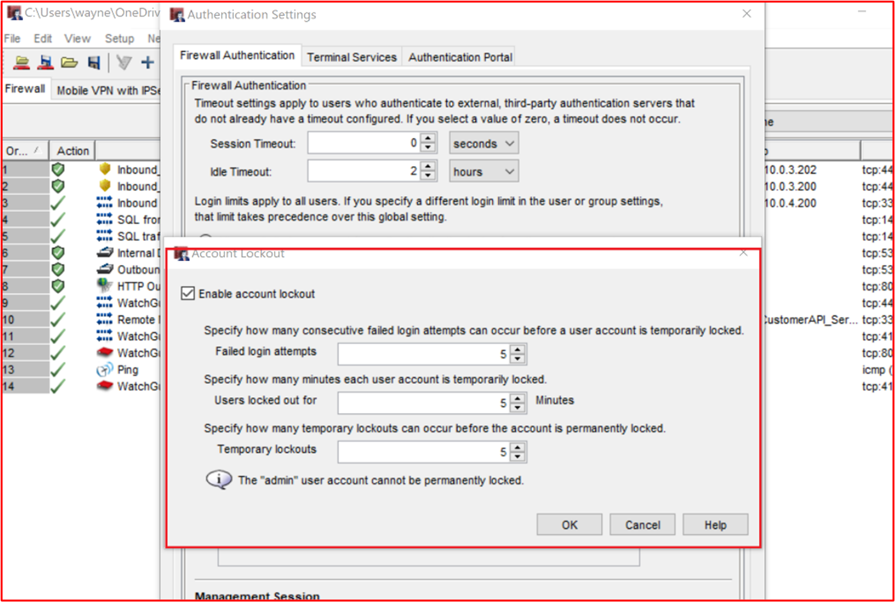
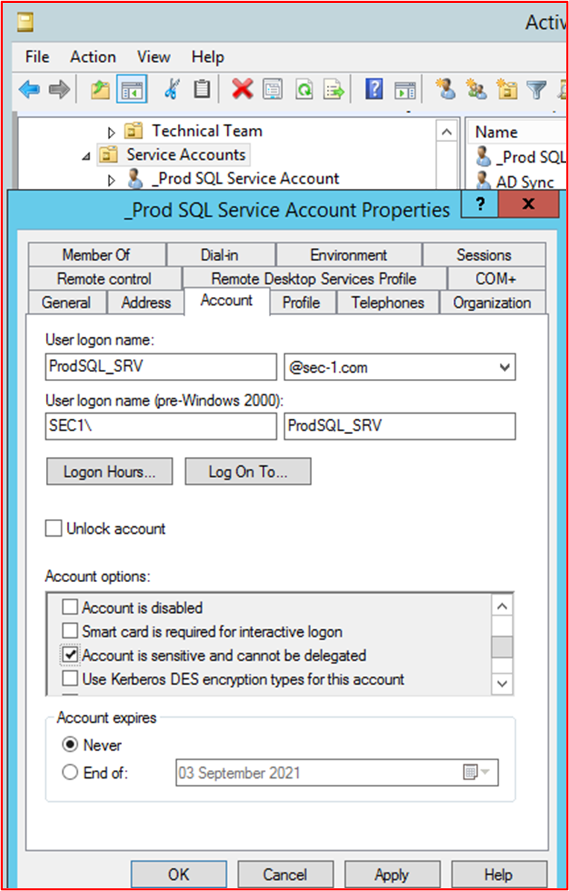
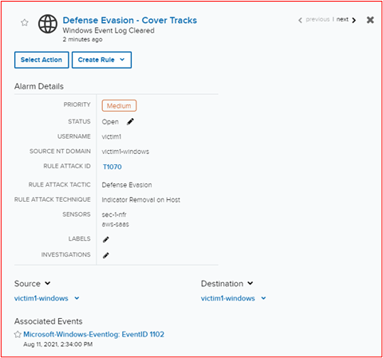
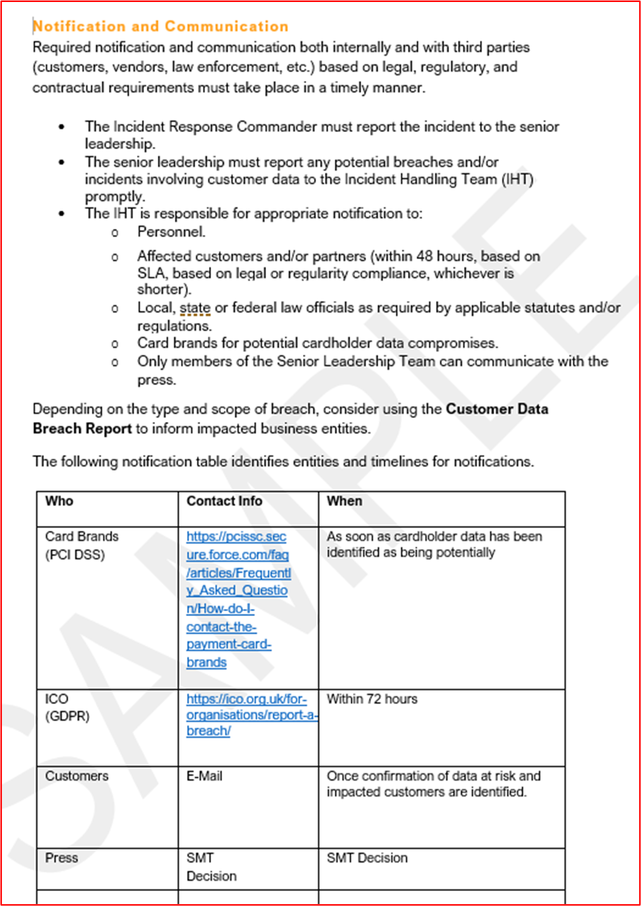
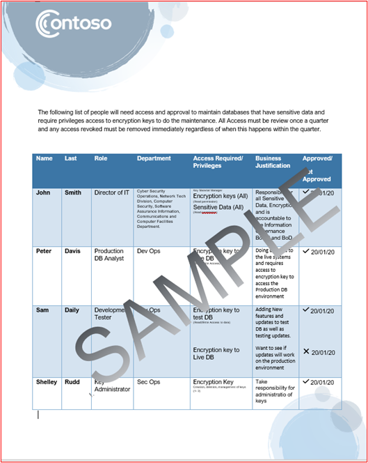

# Microsoft 365認定 - サンプルエビデンス ガイド

## 概要

このガイドは、ISV に対して、各証明書認定コントロールに必要な証拠の種類と詳細レベルの例を提供Microsoft 365されています。 このドキュメントで共有されている例は、コントロールが満たされているが、必要な証拠の種類のガイドラインとしてのみ機能する証拠を示す唯一の証拠を表すのではありません。 

注: 要件を満たすために使用される実際のインターフェイス、スクリーンショット、ドキュメントは、製品の使用、システムセットアップ、内部プロセスによって異なります。 さらに、ポリシーまたは手順のドキュメントが必要な場合は、例の一部に示すように、スクリーンショットではなく、実際のドキュメントを送信するために ISV が必要になります。 

認定には、申請が必要な 2 つのセクションがあります。
1. [**最初のドキュメント提出:**](../docs/initialdocumentsubguide.md) 評価の範囲を設定するために必要な、小さなレベルのドキュメントのセットです。
1. **証拠提出: 認定** 評価のスコープ内の各コントロールに必要な証拠の完全なセット。 

## 構造 

このドキュメントは、パートナー センターでの認定中に表示されるコントロールに直接マップされます。 このドキュメントで提供されるガイダンスの詳細は、次のとおりです。
- セキュリティ ドメイン: すべてのコントロールがグループ化される 3 つのセキュリティ ドメイン:Application Security、Operational Security、Data Security and Privacy。
- Control(s): = Assessment Activity Description - これらのコントロールと関連付けられている番号 (No.) は、認証チェックリストから直接取得Microsoft 365されます。  
- Intent: = セキュリティコントロールがプログラム内に含まれる理由と、セキュリティコントロールが軽減することを目的とした特定のリスクの意図。  この情報は、収集する必要がある証拠の種類と、ISV が証拠を作成する上で注意を払い、認識と理解を持つ必要がある証拠の種類をよりよく理解するために、制御の背後にある理由を ISV に提供します。
- 証拠ガイドラインの例: = Microsoft 365 認定チェックリスト スプレッドシートの証拠収集タスクをガイドするために、ISV は、コントロールが配置され、維持されているという確信を持って判断するために使用する認定アナリストが使用できる証拠の種類の例を明確に確認できます。
- 証拠の例: = このセクションでは、Microsoft 365 認定チェックリスト スプレッドシート内の各コントロールに対してキャプチャされる可能性のある証拠のスクリーンショットと画像の例を示します。特に、操作上のセキュリティとデータ セキュリティおよびプライバシー セキュリティ ドメイン (スプレッドシート内のタブ)。 例の中に赤い矢印とボックスを含む情報は、任意のコントロールを満たすために必要な要件の理解を深めるのに役立つ点に注意してください。

## セキュリティ ドメイン: アプリケーション セキュリティ

**コントロール 1 - コントロール 16**:

Application Security ドメイン コントロールは、アプリに未解決の脆弱性がないという、過去 12 か月以内に発行された侵入テスト レポートを使用して公開できます。 唯一必要な提出は、評判の良い独立した会社によるクリーンレポートです。 

## セキュリティ ドメイン: 運用セキュリティ /セキュリティ保護された開発

「運用セキュリティ/セキュリティ保護開発」セキュリティ ドメインは、ISV が脅威アクターから直面する無数の脅威に対して強力なセキュリティ軽減手法のセットを実装するように設計されています。  これは、安全な環境を構築するために、オペレーティング環境とソフトウェア開発プロセスを保護するように設計されています。

#### マルウェア保護 - ウイルス対策

**コントロール No 1:** ウイルス対策のプラクティスと手順を管理するポリシー ドキュメントを提供します。
- 意図: このコントロールの目的は、コンピューター ウイルスによる脅威を考慮する際に、ISV が直面する問題に対する理解を評価する目的です。 ウイルス対策ポリシーとプロセスの開発に業界のベスト プラクティスを確立して使用することで、ISV は、マルウェアが直面するリスクを軽減し、ウイルスの検出と排除に関するベスト プラクティスを示す組織の能力に合わせたリソースを提供し、文書化されたポリシーが組織とその従業員に推奨されるセキュリティ ガイダンスを提供する証拠を提供します。 ISV がマルウェア対策のデカンスを展開する方法に関するポリシーと手順を文書化することで、このテクノロジの一貫したロールアウトとメンテナンスを行い、マルウェアの環境へのリスクを低減できます。

- 証拠ガイドラインの例: ウイルス対策/マルウェア対策ポリシーのコピーを提供し、ウイルス対策/マルウェアのベスト プラクティスを促進するためにインフラストラクチャ内で実装されるプロセスと手順を詳述します。
証拠の例

- 証拠の例:

**注:** このスクリーンショットは、ポリシー/プロセスドキュメントを示しています。ISVが実際のサポート ポリシー/手順のドキュメントを共有し、単にスクリーンショットを提供するのではなく、期待されています。

**コントロール番号 2:** すべてのサンプル システム コンポーネントでウイルス対策ソフトウェアが実行されているという実証可能な証拠を提供します。

- 意図: セキュリティリスクから保護するために、環境内でウイルス対策 (AV) (またはマルウェア対策防御) を実行することが重要です。 AV をその使用をサポートしているすべてのシステム コンポーネントに展開すると、マルウェア対策が環境に導入されるリスクの一部を軽減できます。 脅威アクターが環境への足がかりを得るために攻撃のベクトルを提供するには、保護されていない単一のエンドポイントしか必要とされません。 したがって、AV は、この種の脅威から保護するために、いくつかの防御層の 1 つとして使用する必要があります。

- 証拠ガイドラインの例: 評価された環境で AV のアクティブ なインスタンスが実行されていることを証明します。 実行中のウイルス対策プロセス、ウイルス対策ソフトウェアがアクティブである、またはウイルス対策用の集中管理コンソールがある場合は、その管理コンソールから、ウイルス対策プロセスの使用をサポートするサンプルのすべてのデバイスのスクリーンショットを提供します。 管理コンソールを使用する場合は、サンプルデバイスが接続され動作しているという証拠をスクリーンショットで確認してください。

- 証拠例 1: 次のスクリーンショットは、Azure セキュリティ センターから取得されています。これは、マルウェア対策拡張機能が MSPGPRODAZUR01 という名前の VM &quot;に展開されたと示しています&quot;。

- 証拠例 2

次のスクリーンショットは、WINDOWS 10デバイスから取得され&quot;&quot;&quot;、ホスト名の CLARANET-SBU-WM&quot; に対してリアルタイム保護がオンに切り替えされています。

**コントロール番号 3:** ウイルス対策署名がすべての環境で最新の (1 日以内) という実証可能な証拠を提供します。

- 意図: 何十万もの新しいマルウェアと望ましくない可能性のあるアプリケーション (PUA) が毎日識別されます。 新しくリリースされたマルウェアに対して適切な保護を提供するには、新しくリリースされたマルウェアを考慮するために AV 署名を定期的に更新する必要があります。

- このコントロールは、ISV が環境のセキュリティと古い AV がセキュリティに与える影響を考慮するために存在します。

- 証拠ガイドラインの例: 各サンプル デバイスからウイルス対策ログ ファイルを提供し、更新プログラムが毎日適用されるのを示します。

- 証拠例: 次のスクリーンショットは、更新プログラムであるイベント 2000 イベント &#39;を表示Windows Defender&#39; Microsoft Defender の更新を示しています。 ホスト名が表示され、スコープ &quot;内システムの CLARANET-SBU-WM から取得されたと表示されます&quot;。

**注:** 提供された証拠には、ログのエクスポートを含めて、より長い期間の毎日の更新を表示する必要があります。 一部のウイルス対策製品では更新ログ ファイルが生成され、これらのファイルを提供するか、イベント ビューアーからログをエクスポートする必要があります。

**コントロール番号 4:** サンプリングされたシステム コンポーネント全体でオンアクセス スキャンまたは定期的なスキャンを実行するようにウイルス対策が構成されていることを示す実証可能な証拠を提供します。

**注:** オンアクセス スキャンが有効になっていない場合は、少なくとも 1 日のスキャンとalerting_ **が有効** _be必要です。

- 意図: この制御の目的は、マルウェアが環境に与える影響を最小限に抑えるために、マルウェアを迅速に識別する目的です。 オンアクセス スキャンが実行され、自動的にブロックされるマルウェアと組み合されている場合は、ウイルス対策ソフトウェアで知られているマルウェア感染を停止するのに役立ちます。 サービスの停止を引き起こす誤検知のリスクが原因でオンアクセス スキャンが望ましくない場合は、適切な毎日 (またはそれ以上) のスキャンとアラートのメカニズムを実装して、マルウェア感染に対する適切な対応を行い、損害を最小限に抑える必要があります。&#39;

- 証拠ガイドラインの例: ウイルス対策をサポートするサンプル内のすべてのデバイスのスクリーンショットを提供し、ウイルス対策がデバイスで実行され、オンアクセス (リアルタイム スキャン) スキャン用に構成されていることを示すスクリーンショットを提供するか、定期的なスキャンが毎日のスキャンで有効になっているか、アラートが構成され、サンプル内のすべてのデバイスの最後のスキャン日を示すスクリーンショットを提供します。

- 証拠例: 次のスクリーンショットは、ホスト &quot;である CLARANET-SBU-WM に対してリアルタイム保護が有効になっているのを示しています&quot;。

**コントロール番号 5:** マルウェアや検疫を自動的にブロックし、サンプリングされたシステム コンポーネント全体で警告するようにウイルス対策が構成されていることを実証可能な証拠として提供します。

- 意図: マルウェアの洗練は、さまざまな程度の荒廃と共に常に進化しています。 この制御の目的は、マルウェアの実行を停止し、潜在的に壊滅的なペイロードの実行を停止するか、自動ブロックがオプションではない場合、マルウェアに警告を発し、潜在的なマルウェア感染に即座に対応することで、マルウェアが大混乱を引き起こす可能性がある時間を制限します。

- 証拠ガイドラインの例: ウイルス対策をサポートするサンプル内のすべてのデバイスにスクリーンショットを提供し、コンピューター上でウイルス対策が実行され、マルウェア、アラート、検疫、警告を自動的にブロックするように構成されていることを示します。

- 例の証拠 1: 次の&quot;スクリーンショットは、ホストの CLARANET-SBU-WM&quot; がリアルタイム保護をオンにして構成されていることを示Microsoft Defender ウイルス対策。 設定が示す通り、マルウェアがデバイスにインストールまたは実行されるのを見つけて停止します。

**コントロール No.6:** アプリケーションが展開される前に承認されたという実証可能な証拠を提供します。

- 意図: アプリケーション制御を使用して、組織はオペレーティング システムでの実行が許可されている各アプリケーション/プロセスを承認します。 このコントロールの目的は、実行できるアプリケーション/プロセスを承認するための承認プロセスを確実に実行します。

- 証拠ガイドラインの例: 承認プロセスが実行されているという証拠を提供できます。 これは、署名されたドキュメント、変更管理システム内での追跡、またはこれらの要求と承認を追跡するために Azure DevOps や JIRA のようなものを使用して提供される場合があります。

- 証拠例: 次のスクリーンショットは、環境内での実行を許可された各アプリケーションが承認プロセスに従う管理による承認を示しています。 これは Contoso のペーパー ベースのプロセスですが、他のメカニズムを使用できます。

**コントロール No.7:** ビジネス上の正当性を持つ承認済みアプリケーションの完全なリストが存在し、維持されているという実証可能な証拠を提供します。

- 意図: 組織は、承認されたアプリケーションの一覧と、アプリケーション/プロセスが承認された理由に関する情報を保持することが重要です。 これにより、構成が最新の状態を確保し、未承認のアプリケーション/プロセスが構成されていない状態を確認するためにベースラインに対して確認できます。

- 証拠ガイドラインの例: ビジネス上の正当性と共に、承認済みのアプリケーション/プロセスの文書化されたリストを指定します。

- 証拠例: 次のスクリーンショットは、ビジネス上の正当性を持つ承認済みアプリケーションの一覧です。

**注:** このスクリーンショットはドキュメントを示しています。ISV は、単にスクリーンショットを提供するのではなく、実際のサポート ドキュメントを共有する必要があります。

**コントロール No.8:** 特定のアプリケーション制御メカニズムに合わせてアプリケーション制御ソフトウェアが構成されていることを詳細に説明するサポート ドキュメントを提供します。

- 意図: アプリケーション制御テクノロジの構成は、テクノロジを維持する方法、つまりアプリケーション/プロセスの追加と削除のプロセスと共に文書化する必要があります。 このドキュメントの一部として、使用するメカニズムの種類は、アプリケーション/プロセスごとに詳細に説明する必要があります。 これにより、テクノロジが文書化済みとして構成されていることを確認するために、次のコントロールにフィードされます。

- 証拠ガイドラインの例: アプリケーション制御がどのようにセットアップされ、各アプリケーション/プロセスがテクノロジ内でどのように構成されているのかについて詳しく説明するサポート ドキュメントを提供します。

- 証拠例: 次のスクリーンショットは、アプリケーション コントロールの実装に使用される制御メカニズムの一覧です。 1 つのアプリが証明書コントロールを使用し、他のアプリがファイル パスを使用しているのを以下に示します。

**注:** このスクリーンショットはドキュメントを示しています。ISV は、単にスクリーンショットを提供するのではなく、実際のサポート ドキュメントを共有する必要があります。

**コントロール番号 9:** サンプル化されたシステム コンポーネントからドキュメント化されたアプリケーションコントロールが構成されていることを示す実証可能な証拠を提供します。

- インテント: この目的は、ドキュメントに基くアプリケーション コントロールがサンプル全体で構成されていることを検証します。

- 証拠ガイドラインの例: サンプル内のすべてのデバイスのスクリーンショットを提供して、アプリケーション コントロールが構成およびアクティブ化されていることを示します。 これにより、コンピューター名、所属するグループ、およびそれらのグループとコンピューターに適用されるアプリケーション制御ポリシーが表示されます。

- 証拠の例: 次のスクリーンショットは、ソフトウェア制限ポリシーが有効になっているグループ ポリシー オブジェクトを示しています。

次のスクリーンショットは、上記のコントロールに沿った構成を示しています。

次のスクリーンショットは、M365 環境と、この GPO オブジェクト オブジェクト に適用されるスコープ内に含まれるコンピューターを示&#39;ドメイン 設定&#39;。

この最後のスクリーンショットは、スコープ内サーバー &quot;DBServer1&quot; が上記のスクリーンショット内の OU 内にあるのを示しています。

### パッチ管理 - リスクランキング

セキュリティの脆弱性を迅速に特定して修復することで、環境やアプリケーションを侵害する脅威アクターのリスクを最小限に抑えるのに役立ちます。 パッチ管理は、リスクランキングとパッチ適用の 2 つのセクションに分割されます。 これら 3 つのコントロールは、セキュリティの脆弱性を特定し、リスクに応じてランク付けを行います。

このセキュリティ制御グループは、アプリケーション/アドインのサード パーティ製ソフトウェア ライブラリとコード ベースにリスクランク付けに基づいて修正プログラムを適用する必要があるから、サービスとしてのプラットフォーム (PaaS) ホスティング環境の対象になります。

**コントロール番号 10:** 新しいセキュリティの脆弱性を特定し、リスク スコアを割り当てる方法を管理するポリシー ドキュメントを提供します。

- 意図: このコントロールの目的は、脅威アクターがこれらの脆弱性を悪用する機会のウィンドウを減らすために、セキュリティの脆弱性を迅速に特定するためのサポート ドキュメントを提供する目的です。 組織が使用しているすべてのシステム コンポーネントをカバーする脆弱性を特定するには、堅牢なメカニズムが必要です。たとえば、オペレーティング システム (Windows Server、Ubuntu など)、アプリケーション (Tomcat、MS Exchange、SolarWinds など)、コードの依存関係 (AngularJS、jQuery など)。 組織は、資産内の脆弱性を適時に特定するだけでなく、脆弱性が存在するリスクに基づいて適切な時間枠内で修復を実行するために、脆弱性を適切にランク付けする必要があります。

**メモ** 純粋なプラットフォーム as a Service 環境内で実行している場合でも、コード ベース内の脆弱性 (つまり、サード パーティ製ライブラリ) を特定する責任があります。

- 証拠ガイドラインの例: サポート ドキュメントを提供する (スクリーンショットではありません)

- 証拠例: このスクリーンショットは、リスクランク付けポリシーのスニペットを示しています。

**注:** このスクリーンショットは、ポリシー/プロセス ドキュメントを示しています。ISV が実際のサポート ポリシー/手順のドキュメントを共有し、単にサポート ポリシーを提供する必要screenshot._

**コントロール番号 11:** 新しいセキュリティの脆弱性がどのように特定されるのかの証拠を提供します。

- 意図: このコントロールの目的は、プロセスが実行され、環境全体で新しいセキュリティ&#39;を識別するのに十分な堅牢性を備えたプロセスを確保する目的です。 これは、オペレーティング システムだけではない可能性があります。環境内で実行されているアプリケーションと、コードの依存関係が含まれる場合があります。

- 証拠ガイドラインの例: 電子メール リストへのサブスクリプションの表示、新しくリリースされた脆弱性のセキュリティ ソースの手動レビュー (JIRA または Azure DevOps など)、古いソフトウェアを検索するツール (たとえば、古いソフトウェア ライブラリを探す場合は Snyk、認証済みスキャンを使用して Nessus である可能性があります) を手動で確認する方法で証拠を提供できます。 古いソフトウェア。)。

**メモ** Nessus を使用する場合は、脆弱性をすばやく特定するために定期的に実行する必要があります。 少なくとも毎週お勧めします。

- 証拠例: このスクリーンショットは、メール グループがセキュリティの脆弱性の通知に使用されているのを示しています。

**コントロール番号 12:** すべての脆弱性が特定されるとリスク ランキングが割り当てられているという証拠を提供します。

- 意図: パッチ適用は、リスクに基づいて行う必要があります。脆弱性がリスクを高くし、修復が必要な方が速い。 特定された脆弱性のリスクランク付けは、このプロセスの不可欠な部分です。 この制御の目的は、文書化されたリスクランク付けプロセスが実行され、特定された脆弱性すべてがリスクに基づいて適切にランク付けされるのを確認する目的です。 組織は通常、ベンダーまたはセキュリティ研究者が提供する CVSS (共通の脆弱性スコアリング システム) 評価を利用します。 組織が CVSS に依存している場合は、組織が内部リスク評価に基づいてランク付けを変更するための再ランク付けメカニズムがプロセス内に含まれる必要があります。 環境内でのアプリケーションの展開方法により、この脆弱性がアプリケーションではない場合があります。 たとえば、組織でJavaライブラリに影響を与える、特定の脆弱性がリリースされる可能性があります。

- 証拠ガイドラインの例: DevOps/Jira など、スクリーンショットなどの手段を使用して証拠を提供します。これは、脆弱性がリスクランク付けプロセスを通過し、組織によって適切なリスクランク付けが割り当てられているのを示しています。

- 証拠例: このスクリーンショットは、組織がリスク評価を実行し、リスクをダウングレードできると判断した場合に、列 D 内で発生するリスクランク付けと列 F と G の再ランク付けを示しています。 リスク評価の再ランク付けの証拠は、証拠として提供する必要があります

### パッチ管理 - パッチ適用

次のコントロールは、Patch Management のパッチ要素用です。 安全な動作環境を維持するには、アプリケーション/アドオンとサポート システムに適切なパッチを適用する必要があります。 脅威のアクターが脆弱性を悪用する機会を減らすには、識別 (またはパブリック リリース) とパッチ適用の適切な時間枠を管理する必要があります。 認定Microsoft 365は、パッチ適用ウィンドウ&#39;規定&#39;定めはしませんが、認定アナリストは妥当ではない時間枠を拒否します。

このセキュリティ制御グループは、アプリケーション/アドインのサード パーティ製ソフトウェア ライブラリとコード ベースにリスクランク付けに基づいて修正プログラムを適用する必要があるから、サービスとしてのプラットフォーム (PaaS) ホスティング環境の対象になります。

**コントロール番号 13:** 重大、高、中規模のリスクの脆弱性に適した最小限のパッチ適用期間を含む、スコープ内のシステム コンポーネントのパッチ適用に関するポリシー ドキュメントを提供します。サポートされていないオペレーティング システムとソフトウェアの使用停止。

- インテント: パッチ管理は、PCI-DSS、ISO 27001、NIST (SP) 800-53 など、多くのセキュリティ コンプライアンス フレームワークで必要です。 適切なパッチ管理の重要性は、ソフトウェア、ファームウェアのセキュリティと機能の問題を修正し、脆弱性を軽減し、悪用の機会を減らすため、過剰に強調することはできません。 このコントロールの目的は、脅威アクターがスコープ内環境内に存在する可能性のある脆弱性を悪用する機会のウィンドウを最小限に抑えるためです。

- 証拠ガイドラインの例: パッチ管理のプロセスを詳述しているすべてのポリシーと手順のコピーを提供します。 これには、最小限のパッチ適用ウィンドウのセクションが含まれる必要があります。サポートされていないオペレーティング システムとソフトウェアを環境内で使用しなける必要があります。

- 証拠例: ポリシー ドキュメントの例を次に示します。

**注:** このスクリーンショットは、ポリシー/プロセス ドキュメントを示しています。ISV が実際のサポート ポリシー/手順のドキュメントを共有し、単にサポート ポリシーを提供する必要screenshot._

**コントロール番号 14:** すべてのサンプリングされたシステム コンポーネントにパッチが適用されているという実証可能な証拠を提供します。

**注:** ソフトウェア/サード パーティ製ライブラリを含める。

- 意図: 修正プログラムの脆弱性により、情報技術インフラストラクチャ (ハードウェア、ソフトウェア、サービス) の一部を構成する異なるモジュールが最新の状態に保たれ、既知の脆弱性から解放されます。 脆弱性の詳細のリリースと修正プログラムの間にセキュリティ インシデントが発生する可能性を最小限に抑えるために、できるだけ早く修正プログラムを実行する必要があります。 これはさらに重要です。ここでは、脆弱性の悪用が悪用される可能性があります。

- 証拠ガイドラインの例: サンプル内のすべてのデバイスにスクリーンショットを提供し、修正プログラムが文書化された修正プログラム プロセスに沿ってインストールされていることを示すサポート ソフトウェア コンポーネントを提供します。

- 証拠例: 次のスクリーンショットは、&quot;スコープ内システム コンポーネントの CLARANET-SBU-WM&quot; がパッチ適用ポリシーに沿ってWindows更新プログラムを実行している場合を示しています。

**注:** スコープ内のすべてのシステム コンポーネントの修正プログラムは証拠である必要があります。 これには、次のような機能が含まれます。OS の更新、アプリケーション/コンポーネントの更新 (i.e__.,_ _Apache Tomcat、OpenSSL_ など)、ソフトウェアの依存関係 (JQuery、AngularJS など) など。

**コントロール番号 15:** サポートされていないオペレーティング システムとソフトウェア コンポーネントが環境内で使用されていないという実証可能な証拠を提供します。

- 意図: ベンダーによって維持されていないソフトウェアは、残業時間が修正されていない既知の脆弱性に苦しむ可能性があります。 したがって、サポートされていないオペレーティング システムとソフトウェア コンポーネントの使用は、実稼働環境内で使用しないでください。

- 証拠ガイドラインの例: 実行中の OS のバージョンを示すサンプルのすべてのデバイスのスクリーンショットを提供します (スクリーンショットのサーバー&#39;名前を含む)。 さらに、環境内で実行されているソフトウェア コンポーネントがサポートされているバージョンを実行しているという証拠を提供します。 これは、内部脆弱性スキャン レポートの出力 (認証されたスキャンが含まれている場合) や、 [Snyk](https://snyk.io/)、 [Trivy](https://github.com/aquasecurity/trivy) 、 [NPM Audit](https://docs.npmjs.com/cli/v7/commands/npm-audit) などのサードパーティ ライブラリをチェックするツールの出力を提供することで実行できます。 PaaS でのみ実行する場合は、修正プログラムを適用するコントロール グループでサード パーティ製ライブラリの修正プログラムを適用する必要があります。

- 証拠例: 次の証拠は、スコープ内のシステム コンポーネント THOR が、Nessus が問題にフラグを立てなかった後、ベンダーがサポートするソフトウェアを実行&#39;示しています。

**注:** 完全なレポートは、認定アナリストと共有する必要があります。

- 例証拠 2

このスクリーンショットは、スコープ内システム コンポーネント&quot;の CLARANET-SBU-WM&quot; がサポートされているバージョンで実行Windows示しています。

- 例証拠 3

次のスクリーンショットは [Trivy](https://github.com/aquasecurity/trivy) 出力で、完全なレポートにはサポートされていない&#39;一覧が表示されません。

**注:** 完全なレポートは、認定アナリストと共有する必要があります。

### 脆弱性スキャン

定期的な脆弱性評価を導入することで、組織は環境内の弱点やセキュリティを検出し、悪意のあるアクターが環境を侵害するエントリ ポイントとなる可能性があります。 脆弱性スキャンは、環境内で不足しているパッチや誤った構成を特定するのに役立ちます。 これらのスキャンを定期的に実行することで、組織は適切な修復を提供して、これらの脆弱性スキャン ツールによって一般的に取り上げらされる問題による侵害のリスクを最小限に抑える可能性があります。

**コントロール番号 16:** 四半期ごとにインフラストラクチャと Web アプリケーションの脆弱性スキャン レポートを提供します。 スキャンは、パブリック フットプリント (IP アドレスと URL) と内部 IP 範囲全体に対して実行する必要があります。

**注:** これには **、環境** の全範囲が含まれる必要があります。

- 意図: 脆弱性スキャンでは、組織のコンピューター システム、ネットワーク、および Web アプリケーションの弱点を探して、セキュリティ侵害や機密データの漏洩につながる可能性のある穴を特定します。 多くの場合、脆弱性スキャンは、PCI DSS (Payment Card Industry Data Security Standard) など、業界標準や政府機関の規制で必要とされます。

- &quot;「[2020 Security Metrics Guide to PCI DSS Compliance](https://info.securitymetrics.com/pci-guide-2020)&quot;」というタイトルのセキュリティ メトリックによるレポートでは、&#39;は、組織が攻撃者がシステムを侵害する脆弱性を持つ可能性があると見なされた時間から平均して 166 日かかったと述べています。 侵害された後、攻撃者は機密データに平均 127 日間アクセスしました&#39; したがって、この制御は、スコープ内環境内の潜在的なセキュリティの弱点を特定することを目的とします。

- 証拠ガイドラインの例: 過去 12 か月間に実行された脆弱性スキャン&#39;四半期ごとに完全なスキャン レポートを提供します。 レポートには、すべてのパブリック フットプリントが含まれており、該当する場合は各内部サブネットが含まれているか検証するために、ターゲットを明確に示す必要があります。 四 **半期ごとにすべての** スキャン レポート **を提供** します。

- 証拠例: 証拠例は、使用するスキャン ツールからスキャン レポートを提供します。 各四半期&#39;のスキャン レポートを確認のために提供する必要があります。 スキャンには、環境システム コンポーネント全体を含める必要があります。すべての内部サブネットと、環境で使用できるすべてのパブリック IP アドレス/URL。

**コントロール番号 17:** 脆弱性スキャン中に特定された脆弱性の修復が、文書化された修正期間に沿って修正されるという実証可能な証拠を提供します。

- 意図: 脆弱性や構成ミスを迅速に特定、管理、修復しない場合、組織&#39;のリスクが増大し、データ侵害の可能性があります。 さまざまなセキュリティ フレームワークのベスト プラクティスに沿った組織&#39;の全体的なセキュリティ体制と環境にとって、問題を正しく特定して修復することが重要と見なされます。たとえば、ISO 27001 と PCI DSS を指定します。

- 証拠ガイドラインの例: 脆弱性スキャンで検出された脆弱性のサンプルが、上記のコントロール 13 で既に提供されている修正プログラムウィンドウに沿って修復された状態を示す適切な成果物 (スクリーンショット) を提供します。

- 証拠例: 次のスクリーンショットは、2021 年 8 月 2 日に脆弱性を示すスコープ内環境 ( &quot;この例では THOR&quot; という名前の単一のコンピューター) のネスス スキャンを示しています。

次のスクリーンショットは、修正プログラム ポリシー内で定義されたパッチ適用ウィンドウ内にある問題が 2 日後に解決されたと示しています。

**注:** この制御のために、認定アナリストは過去 12 か月間の各四半期の脆弱性スキャン レポートと修復を確認する必要があります。

### ファイアウォール

ファイアウォールは、多くの場合、信頼された (内部ネットワーク)、信頼されていない (インターネット) 環境と半信頼 (DMZ) 環境の間のセキュリティ境界を提供します。 通常、これらは、入力および出力サービスのトラフィック フローを制御し、望ましくないトラフィックをブロックするように設計された、組織の防御詳細なセキュリティ戦略の最初の行です。 これらのデバイスは、効果的に動作し、環境を危険にさらす可能性がある誤った構成から解放される状態を確保するために、厳しく制御する必要があります。

**コントロール番号 18:** ファイアウォール管理のプラクティスと手順を管理するポリシー ドキュメントを提供します。

- 意図: ファイアウォールは、層化されたセキュリティ (詳細な防御) 戦略における重要な防御の第 1 行であり、信頼性の低いネットワーク 領域から環境を保護します。 ファイアウォールは通常、IP アドレスとプロトコル/&quot;&quot;ポートに基づいてトラフィック フローを制御します。機能が豊富なファイアウォールでは、アクセスするアプリケーションに基づく誤用、脆弱性、脅威から保護するためにアプリケーション トラフィックを検査することで、アプリケーション層の防御を強化することもできます。 これらの保護はファイアウォールの構成と同じだけなので、内部資産を適切に保護するように構成するには、強力なファイアウォール ポリシーとサポート手順を実行する必要があります。 たとえば、任意の送信元から任意の宛先へのすべてのトラフィックを許可するルールを持つファイアウォールは、単にルーターとして機能しています。

- 証拠ガイドラインの例: 完全なファイアウォール ポリシー/手順のサポート ドキュメントを提供します。 このドキュメントでは、以下のすべての点と、環境に適用されるその他のベスト プラクティスについて説明します。

- 証拠例: 以下に、必要なファイアウォール ポリシー ドキュメントの種類の例を示します (これはデモであり、完全ではない場合があります)。

**コントロール番号 19:** 実稼働環境にインストールする前に、既定の管理資格情報が変更されたという実証可能な証拠を提供します。

- 意図: 組織は、デバイスまたはソフトウェアの構成中に構成されるベンダーが提供する既定の管理資格情報に注意する必要があります。 既定の資格情報は、ベンダーによって一般に公開される場合が多く、外部の脅威アクターに環境を侵害する機会を提供できます。 たとえば、インターネット上で既定の iDrac (統合 Dell リモート アクセス コントローラー) 資格情報を簡単に検索すると、 _root::calvin_ が既定のユーザー名とパスワードとして強調表示されます。 これにより、リモート サーバー管理へのリモート アクセスがユーザーに与わります。 このコントロールの目的は、デバイス/アプリケーションの強化中に変更されていない既定のベンダー資格情報を通じて、環境が攻撃を受けやすい状態になじまなさいという目的です。

- 証拠ガイドラインの例

- これは、認証アナリストが既定の資格情報を使用してスコープ内デバイスに対する認証を試みるスクリーンシェアリング セッションで証明できます。

- 証拠の例

次のスクリーンショットは、WatchGuard ファイアウォールの無効なユーザー名/パスワードから認定アナリストに表示される情報を示しています。

**コントロール番号 20:** スコープ内環境の境界にファイアウォールがインストールされ、境界ネットワーク (DMZ、非武装地帯、スクリーン サブネットとも呼ばれる) と内部信頼されたネットワークの間にインストールされているという実証可能な証拠を提供します。

- 意図: ファイアウォールは、異なるセキュリティ レベルの異なるネットワーク ゾーン間のトラフィックを制御する機能を提供します。 すべての環境がインターネットに接続されている場合、ファイアウォールをインターネットとスコープ内環境の境界にインストールする必要があります。 さらに、信頼性の低い DMZ (De-Militarized Zone) ネットワークと内部信頼済みネットワークの間にファイアウォールをインストールする必要があります。 DMZ は通常、インターネットからのトラフィックを処理するために使用されるため、攻撃の対象です。 DMZ を実装し、ファイアウォールを使用してトラフィック フローを制御することで、DMZ の侵害は必ずしも内部の信頼されたネットワークと企業/顧客データの侵害を意味する&#39;を獲得します。 脅威アクターが内部の信頼できるネットワークをさらに侵害する機会を最小限に抑えるために、組織が迅速に妥協点を特定するのに役立つ適切なログとアラートを実施する必要があります。 この制御の目的は、信頼できるネットワークと信頼されていないネットワークの間に適切な制御があることを確認します。

- 証拠ガイドラインの例: DMZ が配置されているのを示すファイアウォール構成ファイルまたはスクリーンショットを使用して証拠を提供する必要があります。 これは、環境をサポートするさまざまなネットワークを示す付属のアーキテクチャ図と一致する必要があります。 ファイアウォール上のネットワーク インターフェイスのスクリーンショットと、初期ドキュメント提出の一部として既に提供されているネットワークダイアグラムが、この証拠を提供する必要があります。

- 証拠例: 次に示すのは、2 つの DMZ を示す WatchGuard ファイアウォールのスクリーンショットです。1 つは DMZ という名前の受信サービス用で、もう 1 つはジャンプボックス (Bastian Host) を提供しています。

**コントロール番号 21:** 非武装地帯 (DMZ) ですべてのパブリック アクセスが終了したという実証可能な証拠を提供します。

- 意図: パブリックにアクセスできるリソースは、無数の攻撃に対して開きます。 既に説明したように、DMZ の目的は、機密性の高いデータを含む可能性がある信頼できる内部ネットワークから信頼できないネットワークをセグメント化することです。 一般にアクセス可能なホストが外部の脅威アクターによって侵害される危険性が非常に高い場合、DMZ は信頼度が低いとみなされます。 パブリック アクセスは、内部のリソースとデータを保護するためにファイアウォールによって適切にセグメント化された、これらの信頼されていないネットワークで常に終了する必要があります。 この制御の目的は、信頼できる内部ネットワーク上のリソースが公開されている場合と同様に、これらの信頼性の低い DMZ 内ですべてのパブリック アクセスが終了し、これらのリソースの侵害によって、機密データが保持されているネットワークへの脅威アクターの足がかりを提供することです。

- 証拠ガイドラインの例

- この証拠として、パブリック IP アドレスをリソースにルーティングするか、受信トラフィックの NAT (ネットワーク アドレス変換) を提供することで、受信ルールとこれらのルールが終了する場所を示すファイアウォール構成が考えます。

- 証拠の例

次のスクリーンショットでは、3 つの受信ルールがあります。それぞれ、DMZ サブネットである 10.0.3.x サブネットと 10.0.4.x サブネットに NAT を表示します。

**コントロール番号 22:** ファイアウォール経由で許可されたトラフィックすべてが承認プロセスを通過する実証可能な証拠を提供します。

- 意図: ファイアウォールは、信頼されていないトラフィックと内部リソースの間、および異なる信頼レベルのネットワーク間の防御的な障壁であり、ファイアウォールを安全に構成し、ビジネス操作に必要なトラフィックのみを有効にする必要があります。 不要なトラフィック フロー、または過剰に制限されたトラフィック フローを許可すると、これらのさまざまなネットワーク ゾーンの境界で防御の弱点が生じ得る可能性があります。 すべてのファイアウォール変更に対して堅牢な承認プロセスを確立することで、環境に重大なリスクを与えるルールを導入するリスクが軽減されます。 Verizon&#39;[2020](https://enterprise.verizon.com/en-gb/resources/reports/dbir/) &quot;データ侵害調査レポートでは、構成ミスを含むエラー&#39;s&quot; が、一貫して年々増加している唯一のアクションタイプである点が強調されています。

- 証拠ガイドラインの例: 証拠は、承認されているファイアウォール変更要求を示すドキュメント形式で作成できます。これは、CAB (Change Advisor Board) 会議から数分か、すべての変更を追跡する変更管理システムによって行えます。

- 証拠例: 次のスクリーンショットは、紙ベースのプロセスを使用して要求および承認されるファイアウォール ルールの変更を示しています。 これは、たとえば、DevOpsや Jira などによって実現できます。

**コントロール番号 23:** 明示的に定義されていないトラフィックをドロップするようにファイアウォール ルール ベースが構成されていることを示す実証可能な証拠を提供します。

- 意図: ほとんどのファイアウォールは、一致するルールを検索するトップダウンアプローチでルールを処理します。 ルールが一致すると、そのルールのアクションが適用され、ルールのそれ以上の処理はすべて停止します。 一致するルールが見つからない場合、既定ではトラフィックは拒否されます。 このコントロールの目的は、一致するルールが見つからない&quot;場合にファイアウォール&#39;既定でトラフィックをドロップしない場合、ルール ベースには、すべてのファイアウォール リストの末尾に [&quot;すべて拒否] ルールを含める必要があります。 これは、ルールを処理するときにファイアウォール&#39;既定の許可状態に設定し、ルールが明示的に定義されていないトラフィックを許可&#39;するためです。

- 証拠ガイドラインの例: &quot;&quot; 証拠は、ファイアウォール構成を使用するか、最後に [すべて拒否] ルールを示すすべてのファイアウォール ルールを示すスクリーンショットで提供するか、ファイアウォールが既定で&#39;ルールと一致しないトラフィックをドロップする場合は、すべてのファイアウォール ルールのスクリーンショットとベンダー管理ガイドへのリンクを指定し、既定ではファイアウォールが一致していないすべてのトラフィックをドロップします。

- 証拠例: 以下は、すべてのトラフィックを許可するように構成されたルールが設定されていないという WatchGuard ファイアウォール ルール ベースのスクリーンショットです。 WatchGuard は既定で一致しないトラフィックをドロップ&#39;拒否ルールはありません。

次の WatchGuard ヘルプ センター リンク。 [https://www.watchguard.com/help/docs/help-center/en-US/Content/en-US/Fireware/policies/policies\_about\_c.html](https://www.watchguard.com/help/docs/help-center/en-US/Content/en-US/Fireware/policies/policies_about_c.html) には、次の情報が含まれます。

**コントロール番号 24:** コンソール以外のすべての管理インターフェイスでファイアウォールが強力な暗号化のみをサポートしているという実証可能な証拠を提供します。

- 意図: 管理トラフィックの中間者攻撃を軽減するには、コンソール以外のすべての管理インターフェイスで強力な暗号化のみをサポートする必要があります。 このコントロールの主な目的は、コンソール以外の接続がセットアップされている間に管理資格情報を保護します。 また、これは接続への盗聴から保護したり、デバイスを再構成したり、偵察の一部として管理機能を再生したりすることもできます。

- 証拠ガイドラインの例: 構成がコンソール以外の管理インターフェイスの暗号化構成を提供する場合は、ファイアウォール構成を指定します (すべてのデバイスに構成可能なオプションとして含まれる場合は限ります)。 構成内で&#39;場合は、デバイスにコマンドを発行して、これらの接続に対して構成されている情報を表示できます。 一部のベンダーは、この情報を記事内で公開する場合があります。そのため、この情報を証拠にするための方法にもなっている可能性があります。 最後に、サポートされている暗号化を出力するためのツールを実行する必要があります。

- 証拠例: 次のスクリーンショットは、TCP ポート 8080 の WatchGuard ファイアウォールの Web Admin インターフェイスに対する [SSLScan](https://github.com/rbsec/sslscan) の出力を示しています。 これは、AES-128bit の最小暗号化暗号を使用して TLS 1.2 以上を示します。

**注**: WatchGuard ファイアウォールは、SSH (TCP ポート 4118) と WatchGuard System Manager (TCP ポート 4105 &amp; 4117) を使用した管理機能もサポートします。 これらのコンソール以外の管理インターフェイスの証拠も提供する必要があります。

**コントロール番号 25:** 少なくとも 6 か月ごとにファイアウォール ルールレビューを実行しているという実証可能な証拠を提供します。

- 意図: 時間がたつ間に、スコープ内環境のシステム コンポーネントで構成が不気味になります。 これは、多くの場合、環境に対する侵害のリスクを高める可能性がある、セキュリティ上の問題や構成の誤りが発生する可能性があります。 構成クリープは、トラブルシューティングを支援するための一時的な変更、アドホックな機能変更の一時的な変更など、さまざまな理由で導入され、迅速な修正を導入する必要が生じ、過剰に過大な問題に対する迅速な修正を導入できます。 たとえば、緊急の問題を克服するために &quot;、一時的なファイアウォール ルール [すべて許可&quot; ] を導入できます。 このコントロールの目的は 2 つあります。最初に、セキュリティが発生する可能性のある構成ミスがある場所を特定し、次に、不要になったファイアウォール ルールを特定し、サービスが廃止されたがファイアウォール ルールが残っている場合など、削除を行うのに役立ちます。

- 証拠ガイドラインの例: レビュー会議が発生している証拠を実証できる必要があります。 これは、ファイアウォール レビューの会議の議事時間と、レビューから実行されたアクションを示す追加の変更管理証拠を共有することで行うことができます。 これらの会議の少なくとも 2&#39;(つまり、6 か月ごとに) を確認する必要がある場合は、日付が表示されます。

- 証拠例: 次のスクリーンショットは、2021 年 1 月にファイアウォールレビューが行なっている証拠を示しています。

次のスクリーンショットは、2021 年 7 月にファイアウォールレビューが行なっている証拠を示しています。

### ファイアウォール – WAF

ソリューションに Web アプリケーション ファイアウォール (WAF) を展開する場合はオプションです。 WAF を使用する場合、これは、セキュリティ ドメインの運用セキュリティ ドメイン内のスコアリング マトリックス&#39;クレジット&#39;されます。 WAF は、Web トラフィックを検査して、インターネットと公開された Web アプリケーション間の Web トラフィックをフィルター処理および監視して、Web アプリケーション固有の攻撃を識別できます。 Web アプリケーションは、SQL インジェクション (SQLi)、クロス サイト スクリプティング (XSS)、クロス サイト要求フォージェリ (CSRF/XSRF) などの Web アプリケーションに固有の多くの攻撃を受ける可能性があります。WAF は、攻撃や潜在的な侵害から Web アプリケーションを保護するために、これらの種類の悪意のあるペイロードから保護するように設計されています。

**コントロール番号 26:** 悪意のあるトラフィックをアクティブに監視、警告、ブロックするように Web アプリケーション ファイアウォール (WAF) が構成されていることを示す実証可能な証拠を提供します。

- 意図: このコントロールは、すべての受信 Web 接続に対して WAF が配置されていることを確認し、悪意のあるトラフィックをブロックまたは警告するように構成されていることを確認します。 Web トラフィックに追加の防御層を提供するには、すべての着信 Web 接続に対して WAF を構成する必要があります。それ以外の場合、外部脅威アクターは、この追加の保護層を提供するように設計された WAF をバイパスする可能性があります。 悪意のあるトラフィックを積極的にブロックするように WAF が&#39;で構成されていない場合、WAF は、環境のセキュリティを維持し、攻撃を停止するために、潜在的な悪意のあるトラフィックに迅速に対応できるスタッフに直ちにアラートを提供できる必要があります。

- 証拠ガイドラインの例: WAF からの構成出力を提供し、受信 Web 接続が提供され、構成が悪意のあるトラフィックをアクティブにブロックするか、監視および通知を行うのを強調表示します。 または、特定の設定のスクリーンショットを共有して、組織がこのコントロールに対応しているのを示します。

- 証拠例: 次のスクリーンショットは、Contoso Production Azure Application Gateway WAF ポリシーが有効で、悪意のあるトラフィックをアクティブにドロップする &#39;防止&#39; モード用に構成されていることを示しています。

次のスクリーンショットは、Frontend IP 構成を示しています

**注:** 証拠は、すべての入力ポイントがカバーされる環境で使用されるパブリックIPを示す必要があります。これが、このスクリーンショットも含まれている理由です。

次のスクリーンショットは、この WAF を使用した受信 Web 接続を示しています。

次のスクリーンショットは、ContosoAppGWCoreRules\_\_ に、このサービスがサービス用 api.contoso.com 示しています。

**コントロール番号 27:** WAF が SSL オフロードをサポートしているという実証可能な証拠を提供します。

- 意図: SSL オフロードをサポートするように WAF を構成する機能が重要であり、それ以外の場合、WAF は HTTPS トラフィックを検査できません。 これらの環境では HTTPS トラフィックをサポートする必要があります。これは、HTTPS トラフィック内の悪意のあるペイロードを識別および停止できる WAF にとって重要な機能です。

- 証拠ガイドラインの例: SSL オフロードがサポートおよび構成されていることを示す構成エクスポートまたはスクリーンショットを使用して構成証拠を提供します。

- 証拠例: Azure Application Gateway 内で SSL リスナーが SSL オフロードを有効にした構成については、「アプリケーション ゲートウェイ Microsoft ドキュメントを使用した TLS の終了と終了 [の概要](https://docs.microsoft.com/azure/application-gateway/ssl-overview) 」を参照してください。 次のスクリーンショットは、Contoso Production Azure Application Gateway 用に構成されたこの結果を示しています。

**コントロール番号 28:** 「WAF が OWASP コア ルール セット (3.0 または 3.1) に従って、以下の一部またはすべての種類の脆弱性から保護されているという実証可能な証拠を提供します。
- プロトコルとエンコードの問題、
- ヘッダーの挿入、要求の密輸、および応答の分割、
- ファイルとパスのトラバーサル攻撃、
- リモート ファイルの包含 (RFI) 攻撃、
- リモートコード実行攻撃、
- PHP インジェクション攻撃、
- クロスサイト スクリプティング攻撃、
- SQL攻撃、
- セッション固定攻撃。

- 意図: WAF は、一般的な脆弱性クラスの攻撃ペイロードを識別するように構成する必要があります。 このコントロールは、OWASP コア ルール セットを活用して、脆弱性クラスの適切な検出を確実に行う予定です。

- 証拠ガイドラインの例: 構成エクスポートまたはスクリーンショットを使用して構成証拠を提供すると、上記で特定されたほとんどの脆弱性クラスがスキャンの対象となります。

- 証拠例: 次のスクリーンショットは、Contoso Production Azure Application Gateway WAF ポリシーが OWASP コア ルール セット バージョン 3.2 に対してスキャンするように構成されていることを示しています。

### 変更コントロール

すべての変更が繰り返し可能な構造化されたプロセスを通過するには、確立された、理解された変更管理プロセスが不可欠です。 組織は、すべての変更が構造化されたプロセスを確実に通過することで、変更が効果的に管理され、ピア レビューされ、サインオフされる前に十分にテストされます。 これは、システム停止のリスクを最小限に抑えるだけでなく、不適切な変更が導入された場合の潜在的なセキュリティ インシデントのリスクを最小限に抑えるのにも役立ちます。

**コントロール番号 29:** 変更管理プロセスを管理するポリシー ドキュメントを提供します。

- 意図: 安全な環境と安全なアプリケーションを維持するには、強力な監視プロセスと定義されたプロセスですべてのインフラストラクチャとコードの変更を確実に実行するために、堅牢な変更管理プロセスを確立する必要があります。 これにより、変更が文書化され、セキュリティへの影響が考慮され、変更がどのようなセキュリティに与える影響が考えられるかなどが考えられます。環境とアプリケーション開発の両方のプラクティス内のすべての変更に対して、安全で一貫性のあるアプローチが取られるか確認するために、変更管理プロセスが文書化されている必要があります。

- 証拠ガイドラインの例: 文書化された変更管理ポリシー/手順は、認定アナリストと共有する必要があります。

- 証拠例: 変更管理ポリシーの例の開始を以下に示します。 評価の一環として、完全なポリシーと手順を指定してください。

**注:** このスクリーンショットは、ポリシー/プロセスドキュメントを示しています。ISVが実際のサポート ポリシー/手順のドキュメントを共有し、単にスクリーンショットを提供するのではなく、期待されています。

**コントロール番号 30:** 開発環境とテスト環境が実稼働環境から職務を分離しているという実証可能な証拠を提供します。

- 意図: ほとんどの組織&#39;の開発/テスト環境は、実稼働環境と同じ機能に構成されていないので、安全性が低い。 また、セキュリティ上の問題が発生したり、お客様のサービス提供に不利益を生じ得る可能性がある場合など、テストは実稼働環境内で行う必要があります。 業務の分離を強制する個別の環境を維持することにより、組織は変更が正しい環境に適用されていることを確認でき、これにより、開発/テスト環境を対象とした実稼働環境への変更を実装することで、エラーのリスクを軽減できます。

- 証拠ガイドラインの例: 開発/テスト環境と実稼働環境で使用されるさまざまな環境を示すスクリーンショットを提供できます。 通常、各環境にアクセスできるユーザー/チームが異なる場合や、これができない場合、環境は異なる承認サービスを使用して、ユーザーが誤って間違った環境にログインして変更を適用できないことを確認します。

- 証拠例: 次のスクリーンショットは、Contoso の Azure サブスクリプションとテスト&#39;示しています。

この次のスクリーンショットは、Contoso の個別の Azure サブスクリプションを示&#39;PRODUCTION &#39;環境&#39;示しています。

**コントロール番号 31:** 開発環境またはテスト環境内で機密の実稼働データが使用されていないという実証可能な証拠を提供します。

- 意図: 上記で既に説明したように、組織は、開発/テスト環境のセキュリティ対策を実稼働環境と同じ大きな目的に実装しない。 したがって、これらの開発/テスト環境で機密性の高い実稼働データを利用することで、侵害のリスクが高まっているため、これらの開発/テスト環境内でのライブ/機密データの使用を避ける必要があります。

**注:** 開発/テスト環境でライブ データを使用して、開発/テストを評価の範囲内に含め、セキュリティを Microsoft 365 認定管理に対して評価できます。

- 証拠ガイドラインの例: 実稼働データベースに対する同じ SQL クエリの出力のスクリーンショット (機密情報をやり直す) と開発/テスト データベースを共有することで、証拠を提供できます。 同じコマンドの出力によって、異なるデータ セットが生成される必要があります。 ファイルが保存されている場合は、両方の環境内のフォルダーの内容を表示すると、異なるデータ セットも示す必要があります。

- 証拠例: 次のスクリーンショットは、実稼働データベースの上位 3 レコード (証拠提出の場合は、上位 20 件を指定してください) を示しています。

次のスクリーンショットは、開発データベースからの同じクエリを示し、異なるレコードを表示します。

これは、データ セットが異なっているのを示しています。

**コントロール番号 32:** 文書化された変更要求に、変更の影響、バックアウト手順の詳細、実行するテストの詳細が含まれているという実証可能な証拠を提供します。

- 意図: このコントロールの目的は、要求される変更に思考が入ったと確認する目的です。 変更がシステム/環境のセキュリティに与える影響を考慮し、明確に文書化する必要があります。回復を支援するためにバックアウト手順を文書化する必要があります。問題が生じ、最後に変更を検証するために必要なテストの詳細も検討し、文書化する必要があります。

- 証拠ガイドラインの例: 証拠は、変更要求のサンプルをエクスポートしたり、紙の変更要求を提供したり、変更要求内に保持されているこれら 3 つの詳細を示す変更要求のスクリーンショットを提供したりすることで提供できます。

- 証拠例: 次の図は、割り当てられている新しいクロス サイト スクリプティングの脆弱性 (XSS) と変更要求のドキュメントを示しています。

以下のチケットは、解決までの道のりでチケットに設定または追加された情報を示しています。

 

以下の 2 つのチケットは、システムに対する変更の影響と、問題が発生した場合に必要になる可能性があるバックアウト手順を示しています。 変更の影響とバックアウト手順が承認プロセスを通過し、テスト用に承認されているのを確認できます。

画面の左側で、変更のテストが承認されているのが確認できます。右側に変更が承認され、テストされているのが確認できます。

プロセス全体を通して、仕事をしている人、その仕事を報告する人、および実行する作業を承認する人は異なる人々であることに注意してください。

上記のチケットは、変更が実稼働環境への実装に対して承認されたのを示しています。 右側のボックスは、テストが正常に動作し、成功し、変更が Prod 環境に実装されたことを示しています。

**コントロール番号 33:** 変更要求が承認およびサインオフ プロセスを受けているという実証可能な証拠を提供します。

- インテント: プロセスを実装する必要があります。このプロセスでは、適切な承認を受けずに変更を実行し、サインオフする必要があります。 変更を実装する前に承認する必要があります。完了したら、変更をサインオフする必要があります。 これにより、変更要求が適切に確認され、権限を持つユーザーが変更をサインオフします。

- 証拠ガイドラインの例: 証拠は、変更要求のサンプルをエクスポートしたり、紙の変更要求を提供したり、変更が承認された変更要求のスクリーンショットを実装前に提供したり、完了した後に変更がサインオフされた場合に提供できます。

- 証拠例: 以下のスクリーンショットは、開発者/依頼者以外のユーザーによって実装および承認される前に変更を承認する必要がある Jira チケットの例を示しています。 ここで変更が権限を持つユーザーによって承認されているのを確認できます。 右側は、完了すると DP によって署名されています。

以下のチケットでは、完了すると変更がサインオフされ、ジョブの完了と終了が表示されます。

### Secure Software Development/Deployment

ソフトウェア開発活動に関わる組織は、多くの場合、セキュリティと TTM (市場への時間) の間で競合する優先事項に直面していますが、ソフトウェア開発ライフサイクル (SDLC) 全体でセキュリティ関連のアクティビティを実装すると、コストを節約できるだけでなく、時間も節約できます。 セキュリティを後回しとして残す場合、通常、問題は (DSLC) のテスト フェーズ中にのみ特定されます。多くの場合、修正に時間がかかり、コストがかかる場合があります。 このセキュリティ セクションの目的は、開発されたソフトウェアにコーディング上の欠陥が導入されるリスクを軽減するために、セキュリティで保護されたソフトウェア開発プラクティスが実行されるのを確認します。 さらに、このセクションでは、ソフトウェアの安全な展開を支援するコントロールを含める必要があります。

**コントロール番号 34:** OWASP Top 10 や SANS Top 25 CWE などの一般的な脆弱性クラスに対するセキュリティで保護されたコーディングのベスト プラクティス ガイダンスなど、セキュリティで保護されたソフトウェアの開発と展開をサポートするポリシーと手順を提供します。

- 意図: 組織は、ソフトウェアが安全に開発され、脆弱性から解放されるのを保証するために、すべてのことを行う必要があります。 これを実現するために、セキュリティで保護されたソフトウェア開発ライフサイクル (SDLC) とセキュリティで保護されたコーディングのベスト プラクティスを確立し、ソフトウェア開発プロセス全体を通じてセキュリティで保護されたコーディング手法とセキュリティで保護された開発を促進する必要があります。 この目的は、ソフトウェアの脆弱性の数と重大度を減らすことです。

- 証拠ガイドラインの例: セキュリティで保護された開発ライフ サイクルが使用され、すべての開発者が安全なコーディングのベスト プラクティスを促進するためのガイダンスを示す、文書化された SDLC および/またはサポート ドキュメントを提供します。 [SDLC の OWASP と](https://owasp.org/www-project-integration-standards/writeups/owasp_in_sdlc/) OWASP ソフトウェア アシュアランス[成熟度モデル](https://owaspsamm.org/model/) (SAMM) を確認します。

- 証拠例: Contoso&#39;の Secure Software Development Procedure からの抽出を次に示します。これは、セキュリティで保護された開発とコーディングのプラクティスを示しています。

**注:** これらのスクリーンショットは、セキュリティで保護されたソフトウェア開発ドキュメントを示しています。ISV が実際のサポート ドキュメントを共有し、単にスクリーンショットを提供することは期待できません。

**コントロール番号 35:** コードの変更が第 2 レビュー者によるレビューおよび承認プロセスを受けているという実証可能な証拠を提供します。

- 意図: このコントロールの目的は、ソフトウェアに脆弱性が生じかねないコーディングミスを特定するために、別の開発者によるコード レビューを実行する目的です。 コード レビューの実施、テストの実行などを行う認証を確立する必要があります。 展開の前に、次の手順を実行します。 承認手順では、上記で定義した SDLC を支える適切なプロセスが実行されていることを検証できます。

- 証拠ガイドラインの例: コードがピア レビューを受け、実稼働環境に適用する前に承認する必要があるという証拠を提供します。 この証拠は、変更チケットのエクスポートを介して行われ、コード レビューが実施され、変更が承認された場合、または、クルーシブル ([https://www.atlassian.com/software/crucible](https://www.atlassian.com/software/crucible)) などのコード レビュー ソフトウェアを通じて行われる可能性があります。

- 証拠の例

以下は、コードの変更が元の開発者以外のユーザーによるレビューおよび承認プロセスを受けていることを示すチケットです。 これは、コード レビューが割り当て先によって要求され、コード レビューのために他のユーザーに割り当てられるのを示しています。

下の図は、下の画像の右側にある強調表示されているセクションに示すように、コード レビューが元の開発者以外のユーザーに割り当てられたかを示しています。 左側では、コードがレビューされ、コード レビュー&#39;渡されたコード レビュー&#39;が与えられたのを確認できます。

変更を実稼働システムに適用する前に、チケットはマネージャーの承認を受ける必要があります。

 上の図は、レビューされたコードに、実稼働システムに実装する承認が与えられたのを示しています。

 コードの変更が完了すると、上の図に示すように、最終的なジョブがサインオフされます。

プロセス全体を通じて、コードの元の開発者、承認とサインオフを行うコード レビューアー、マネージャーの 3 人が関与しています。 このコントロールの条件を満たすために、チケットはこのプロセスに従う必要があります。 コード レビューの変更管理プロセスに少なくとも 3 人の関係者が含まれる。

**コントロール番号 36:** 開発者が毎年安全なソフトウェア開発トレーニングを受けているという実証可能な証拠を提供します。

- インテント: コードが安全に開発されるのを確実にするための、すべてのプログラミング言語に対してコーディングのベスト プラクティスとテクニックが存在します。 さまざまな種類のソフトウェア脆弱性クラスと、これらの脆弱性のソフトウェアへの導入を停止するために使用できるコーディング手法を開発者に教えるために設計された外部トレーニング コースがあります。 このコントロールの目的は、これらの手法をすべての開発者に教え、これらの手法が忘れられないか、または新しい技術が年単位で実行することで学習されるという目的です。

- 証拠ガイドラインの例: 外部のトレーニング会社が実施した場合、または開発者がトレーニングに参加したという証拠を示すトレーニングダイアリーまたは他の成果物のスクリーンショットを提供することで、証明書を使用して証拠を提供します。 このトレーニングが内部リソースを介して行われる場合は、トレーニング資料の証拠も提供してください。

- 証拠例: 以下は、OWASP トップ 10 トレーニングアニュアル トレーニングに登録DevOpsチームのスタッフを要求するメールです。

以下は、ビジネス上の正当性と承認を得てトレーニングが要求されたと示しています。 その後、トレーニングから取得したスクリーンショットと、その人が年次トレーニングを終了したという完了記録が続きます。

**コントロール番号 37:** コード リポジトリが多要素認証 (MFA) でセキュリティで保護されているという実証可能な証拠を提供します。

- 意図: 脅威アクターがソフトウェア&#39;のコード ベースにアクセスして変更できる場合、脆弱性、バックドア、または悪意のあるコードをコード ベースに導入し、したがってアプリケーションに導入する可能性があります。 この例は既にいくつかありますが、おそらく最も一般的に公開されているのは NotPetya ランサムウェア攻撃で、M.E.Doc と呼ばれるウクライナの税ソフトウェアに対する侵害された更新によって感染したと伝えられている (「What [is NotPetya](https://www.itpro.co.uk/malware/34381/what-is-notpetya)」を参照)。

- 証拠ガイドラインの例: すべてのユーザーが MFA を有効にしているコード リポジトリのスクリーンショットを使用して証拠を提供します。

- 証拠例: 次のスクリーンショットは、8 人の GitLab ユーザーすべてで MFA が有効になっているのを示しています。

**コントロール番号 38:** コード リポジトリをセキュリティで保護するためにアクセス制御が実行されているという実証可能な証拠を提供します。

- 意図: 以前のコントロールから先導して、アクセス制御を実装して、特定のプロジェクトに取り組む個々のユーザーにのみアクセスを制限する必要があります。 アクセスを制限することで、承認されていない変更が実行されるリスクを制限し、安全でないコード変更を導入します。 コード リポジトリを保護するには、特権が最も少ない方法を取る必要があります。

- 証拠ガイドラインの例: コード リポジトリからのスクリーンショットを使用して、アクセスが必要な個人 (さまざまな特権を含む) に制限されている証拠を提供します。

- 証拠例: 次のスクリーンショットは、 &quot;Contoso カスタマー ポータルである GitLab の Customers&quot; プロジェクトのメンバーを &quot;示しています&quot;。 スクリーンショットに示すように、ユーザーはプロジェクトへのアクセスを &quot;制限する異なるロール&quot; を持っています。

### アカウントの管理

ユーザー アカウントが情報システム、システム環境、データへのアクセスを許可する基礎を形成する場合、セキュリティで保護されたアカウント管理プラクティスは重要です。 ユーザー&#39;&#39;の資格情報の侵害として、ユーザー アカウントを適切にセキュリティで保護する必要があります。

**コントロール番号 39:** アカウント管理のプラクティスと手順を管理するポリシー ドキュメントを提供します。

- 意図: ユーザー アカウントは引き続き脅威アクターの対象であり、多くの場合、データ侵害のソースです。 過剰に制限されたアカウントを構成することで、組織は、脅威アクターがデータ侵害を実行するために利用できる &#39;特権&#39; アカウントのプールを増やすだけでなく、成功するために特定の特権を必要とする脆弱性の悪用が成功するリスクも高めます。

-  BeyondTrust は &quot;、毎年 Microsoft の&quot; 脆弱性レポートを作成し、前年の Microsoft セキュリティの脆弱性と、管理者権限を持つユーザー アカウントに依存するこれらの脆弱性の詳細な割合を分析します。 &quot;最近のブログ記事「New Microsoft Vulnerabilities Report」では、最小特権で軽減できる脆弱性の [48% &amp;](https://www.beyondtrust.com/blog/entry/microsoft-vulnerabilities-report)&quot;の増加、Internet Explorer の重大な脆弱性の 90%、Microsoft Edge の重大な脆弱性の 85%、および Microsoft Outlook の重大な脆弱性の 100% が管理者権限を削除することによって軽減された可能性が明らかになります。 セキュリティで保護されたアカウント管理をサポートするために、組織はセキュリティのベスト プラクティスを推進するサポート ポリシーと手順を確実に実施し、これらの脅威を軽減する必要があります。

- 証拠ガイドラインの例: アカウント管理のプラクティスをカバーする文書化されたポリシーと手順ドキュメントを提供します。 少なくとも、対象のトピックは、認定資格内のコントロールに合わせてMicrosoft 365があります。

- 証拠例: 次のスクリーンショットは、Contoso のアカウント管理ポリシーの例を示しています。

**注:** このスクリーンショットは、ポリシー/プロセスドキュメントを示しています。ISVが実際のサポート ポリシー/手順のドキュメントを共有し、単にスクリーンショットを提供するのではなく、期待されています。

**コントロール番号 40:** 既定の資格情報が無効、削除、またはサンプル化されたシステム コンポーネント間で変更されているという実証可能な証拠を提供します。

- インテント: これはあまり人気が低くなっていますが、脅威アクターが既定のユーザー資格情報と十分に文書化されたユーザー資格情報を活用して、実稼働システム コンポーネントを侵害する場合があります。 この一般的な例は、Dell iDRAC (統合 Dell リモート アクセス コントローラー) です。 このシステムを使用すると、Dell Server をリモートで管理できます。これは、脅威のアクターがサーバーサーバーのオペレーティング システムを制御するために利用&#39;できます。 root::calvin の既定の資格情報は文書化され、多くの場合、組織が使用するシステムにアクセスするために脅威のアクターが利用できます。 このコントロールの目的は、これらの既定の資格情報が無効になっているか削除されたかを確認する方法です。

- 証拠ガイドラインの例: この制御をサポートするために証拠を収集できるさまざまな方法があります。 すべてのシステム コンポーネントで構成されたユーザーのスクリーンショットは、Linux /etc/shadow ファイルと /etc/passwd ファイルのスクリーンショットを使用すると、アカウントが無効になっている場合のデモンストレーションに役立ちます。 アカウントを実証するために /etc/shadow ファイルが必要になる場合は、パスワード ハッシュが &#39;!&#39; などの無効な文字で始まり、パスワードが使用不能であることを示す点に注意してください。 アドバイスは、パスワードの数文字のみを無効にし、残りの文字をやり直す方法です。 他のオプションは、査定者が既定の資格情報を手動で試す可能性があるスクリーンシェアリング セッションです 。たとえば、Dell iDRAC に関する上記の説明では、査定者は、既定の資格情報を使用してすべての Dell iDRAC インターフェイスに対して認証を試みる必要があります。

- 証拠例: 次のスクリーンショットは、スコープ内 &quot;システム コンポーネントの CLARANET-SBU-WM 用に構成されたユーザー アカウントを示しています&quot;。 複数の既定のアカウントが表示されます。ただし、管理者、DefaultAccount、ゲストは、次のスクリーンショットは、これらのアカウントが無効になっているのを示しています。

次のスクリーンショットは、スコープ内システム &quot;コンポーネントの CLARANET-SBU-WM で Administrator アカウントが無効になっている状態を示しています&quot;。

次のスクリーンショットは、スコープ内 &quot;システム コンポーネントの CLARANET-SBU-WM でゲスト アカウントが無効になっている状態を示しています&quot;。

次のスクリーンショットは、スコープ内システム コンポーネントの CLARANET-SBU-WM で DefaultAccount &quot;が無効になっている状態を示しています&quot;。

**コントロール番号 41:** アカウントの作成、変更、削除が確立された承認プロセスを通過する実証可能な証拠を提供します。

- インテント: すべてのアカウント管理アクティビティが承認され、アカウント特権が最小特権の原則を維持し、アカウント管理アクティビティを適切に確認および追跡できるよう、確立されたプロセスを確立する目的です。

- 証拠ガイドラインの例: 証拠は、通常、変更要求チケット、ITSM (IT サービス管理) 要求、または作成、変更、または削除するアカウントの要求を示す書類の形式で承認プロセスを行っています。

- 証拠例: 以下の画像は、DevOps チームに対する新しいスターターのアカウント作成を示しています。

アカウントの作成は、アカウントが作成され、チケットが閉じられましたら、承認プロセスとサインオフ プロセスを通過しました。

**コントロール番号 42:** 3 か月以内に使用されていないアカウントを無効または削除するプロセスが実行されているという実証可能な証拠を提供します。

- インテント: 非アクティブなアカウントは、ユーザーがアカウントへのログインを試みないのでフラグが設定されないブルートフォース攻撃を対象としたり、ユーザー&#39;のパスワードが再利用され、インターネット上のユーザー名/パスワード ダンプ内で使用できるパスワード データベース侵害によって、侵害される場合があります。 脅威アクターがアカウント侵害アクティビティを実行する必要がある攻撃表面を減らすには、未使用のアカウントを無効または削除する必要があります。 これらのアカウントは、離職者プロセスが適切に実行されていないか、スタッフが長期病気になったか、または産休/育児休暇に入っているスタッフが原因である可能性があります。 四半期ごとにこれらのアカウントを識別するプロセスを実装することで、組織は攻撃の表面を最小限に抑える可能性があります。

- 証拠ガイドラインの例: 証拠は 2 倍である必要があります。 まず、スコープ内環境内のすべての&quot;&quot;ユーザー アカウントの最後のログオンを示すスクリーンショットまたはファイルのエクスポートです。 これは、ローカル アカウントと、一元化されたディレクトリ サービス内のアカウント (AADなどAzure Active Directory。 これにより、3 か月を超えるアカウントが有効になっていないという結果が示されます。 第 2 に、ADO (Azure DevOps) または JIRA チケット内、またはサインオフする必要がある紙の記録を通じてタスクが完了した記録的証拠である四半期レビュー プロセスの証拠です。

- 証拠例: この最初のスクリーンショットは、四半期ごとに実行されるスクリプトの出力を示し、ユーザーのログオン属性を四半期ごとに表示AAD。

上記のスクリーンショットに示すように、2 人のユーザーが一時ログインしていないと表示されています。 次の 2 つのスクリーンショットは、これら 2 人のユーザーが無効になっているのを示しています。

**コントロール番号 43:** 強力なパスワード ポリシーや、ユーザー資格情報を保護するためのその他の適切な軽減策が適用されているという実証可能な証拠を提供します。  最小ガイドラインとして、次の情報を使用する必要があります。
- パスワードの最小長は 8 文字
- 10 回以下のアカウントロックアウトのしきい値
- 最小 5 つのパスワードのパスワード履歴
- 強力なパスワードの使用の強制

- 意図: 既に説明したように、ユーザー資格情報は、多くの場合、脅威のアクターが組織の環境にアクセスしようとする攻撃&#39;です。 強力なパスワード ポリシーの目的は、ユーザーに強力なパスワードの選択を強制して、脅威アクターが強制的にブルートできる可能性を軽減する方法です。 その他&quot;&quot;&quot;の適切な軽減策を追加する目的は、[組織が NIST Special Publication 800-63B](https://pages.nist.gov/800-63-3/sp800-63b.html)&quot; などの業界の開発に基づいてユーザー資格情報を保護するために他のセキュリティ対策を実装する可能性があるという認識です。

- 証拠ガイドラインの例: &quot;強力なパスワード ポリシーを示す証拠は、組織のグループ ポリシー オブジェクトまたはローカル セキュリティ ポリシー アカウント ポリシー à&quot; &quot;Password Policy and Account Policyes à Account Lockout Policy&quot; settings のスクリーンショットの形式である可能性があります。 証拠は、使用されているテクノロジによって異なります。つまり、Linux の場合は、/etc/pam.d/common-password config ファイル、BitBucket &quot;&quot; の管理ポータル ()内の [認証ポリシー] セクションなど[https://support.atlassian.com/security-and-access-policies/docs/manage-your-password-policy/](https://support.atlassian.com/security-and-access-policies/docs/manage-your-password-policy/)です。

- 証拠例: 以下の証拠は、&quot;&quot;&quot;スコープ内システム コンポーネントの CLARANET-SBU-WM のローカル セキュリティ ポリシー内で構成されたパスワード ポリシーを示しています。&quot;

次のスクリーンショットは、WatchGuard ファイアウォールのアカウント ロックアウト設定を示しています。

次に、WatchGaurd ファイアウォールの最小パスフレーズの長さの例を示します。

**コントロール番号 44:** 一意のユーザー アカウントがすべてのユーザーに発行されるという実証可能な証拠を提供します。

- 意図: このコントロールの目的は説明責任です。 独自の一意のユーザー アカウントを持つユーザーを発行することで、ユーザーアクティビティを個々のユーザーに追跡できるので、ユーザーは自分のアクションに対して責任を持つ必要があります。

- 証拠ガイドラインの例: 証拠は、サーバー、コード リポジトリ、クラウド管理プラットフォーム、Active Directory、ファイアウォールなどを含むスコープ内のシステム コンポーネント全体で構成されたユーザー アカウントを示すスクリーンショットです。

- 証拠例: 次のスクリーンショットは、スコープ内 &quot;システム コンポーネントの CLARANET-SBU-WM 用に構成されたユーザー アカウントを示しています&quot;。

次のスクリーンショットは、スコープ内システム &quot;コンポーネントの CLARANET-SBU-WM で Administrator アカウントが無効になっている状態を示しています&quot;。

次のスクリーンショットは、スコープ内 &quot;システム コンポーネントの CLARANET-SBU-WM でゲスト アカウントが無効になっている状態を示しています&quot;。

次のスクリーンショットは、スコープ内システム コンポーネントの CLARANET-SBU-WM で DefaultAccount &quot;が無効になっている状態を示しています&quot;。

**コントロール番号 45:** 環境内で最小特権原則が従っているという実証可能な証拠を提供します。

- インテント: ユーザーは、ジョブ機能を満たすために必要な特権のみを提供する必要があります。 これは、ユーザーが悪意のある行為を行う必要があるデータに意図的または意図&#39;アクセスするリスクを制限することです。この原則に従って、悪意のある脅威アクターによって標的にされる可能性のある攻撃表面 (特権アカウント) も減少します。

- 証拠ガイドラインの例: ほとんどの組織では、グループを使用して組織内のチームに基づいて特権を割り当てる必要があります。 証拠には、さまざまな特権グループと、これらの特権を必要とするチームのユーザー アカウントのみを示すスクリーンショットがあります。 通常、これは、必要な特権とビジネス上の正当性を持つ各定義されたグループを定義するサポート ポリシー/プロセスと、グループ メンバーシップを検証するためのチーム メンバーの階層が正しく構成されている場合にバックアップされます。

- たとえば、Azure 内では、Owners グループは非常に制限されている必要があります。そのため、これを文書化する必要があり、そのグループに割り当てられているユーザーの数は限られている必要があります。 もう 1 つの例は、コードを変更できる限られた数のスタッフである可能性があります。グループは、この権限を構成する必要があると見なされるスタッフのメンバーと一緒にこの特権でセットアップできます。 このドキュメントは、認定アナリストが構成済みのグループなどとドキュメントを相互参照できるよう文書化する必要があります。

- 証拠例: 次のスクリーンショットは、ジョブ関数に従ってグループが割り当て済みで環境が構成されていることを示しています。

次のスクリーンショットは、ユーザーがジョブ機能に基づいてグループに割り当てられているを示しています。

**コントロール番号 46:** サービス アカウントをセキュリティで保護または強化するためのプロセスが実行され、そのプロセスが実行されているという実証可能な証拠を提供します。

- 意図: サービス アカウントは、管理者特権で構成される場合が多いので、多くの場合、脅威のアクターによって対象とされます。 サービス アカウントのパスワードの有効期限が機能を壊す場合が多いので、これらのアカウントは標準のパスワード ポリシーに従う必要があります。 したがって、組織内で再利用される脆弱なパスワードまたはパスワードを使用して構成される場合があります。 別の潜在的な問題は、特Windows環境内で、オペレーティング システムがパスワード ハッシュをキャッシュしている可能性があります。 サービス アカウントがディレクトリ サービス内で構成されている場合、このアカウントは特権レベルが構成された複数のシステム間でアクセスを使用したり、サービス アカウントがローカルである場合、同じアカウント/パスワードが環境内の複数のシステムで使用される可能性が高い場合、大きな問題になる可能性があります。 上記の問題は、脅威アクターが環境内のより多くのシステムにアクセスし、特権の昇格や横方向の移動につながる可能性があります。 そのため、サービス アカウントが適切に強化され、セキュリティで保護されていることを確認し、脅威アクターによって引き継がれ、またはこれらのサービス アカウントの 1 つが侵害された場合のリスクを制限します。

- 証拠ガイドラインの例: サービス アカウントの強化に役立つ多数のガイドがインターネット上にあります。 証拠は、組織がアカウントのセキュリティで保護された強化を実装した方法を示すスクリーンショットの形式です。 いくつかの例 (複数の手法が使用されるという期待) には、次の例が含まれます。
- Active Directory 内の一連のコンピューターにアカウントを制限する
- 対話型ログインが許可&#39;アカウントを設定する
- 非常に複雑なパスワードを設定する
- Active Directory の場合、アカウントの機密性 &quot;が高く、委任できないフラグを有効&quot; にします。 これらの手法については、カード所有者データ&quot;環境のセグメンテーションと共有 [Active Directory の記事で説明します](https://pciramblings.com/2019/12/13/segmentation-and-shared-active-directory-of-a-cardholder-data-environment/)&quot;。

- 証拠例: サービス アカウントを強化する方法は複数あります。これは、個々の環境に依存します。 使用する環境に適したメカニズムは、この証拠の確認に役立つ、以前のアカウント管理ポリシー/手順のドキュメントに記載されています。 以下に、使用できるメカニズムの一部を示します。

次のスクリーンショットは、&#39;アカウント&quot;\_が機密性が高く、サービス アカウント prod&#39; サービス アカウントで選択されている接続を委任SQL示しています&quot;。

次のスクリーンショットは、&quot;\_サービス アカウント Prod SQLサービス&quot; アカウントが SQL Serverにロックダウンされ、そのサーバーにのみログオンできます。

この次のスクリーンショットは、&quot;\_サービス アカウント Prod SQLサービス&quot; アカウントがサービスとしてログオンするのみ許可されている場合を示しています。

**コントロール番号 47:** MFA がすべてのリモート アクセス接続とコンソール以外のすべての管理インターフェイスに対して構成されていることを示す実証可能な証拠を提供します。

次のように定義される用語:
- **リモート アクセス** – 通常、これはサポート環境にアクセスするために使用されるテクノロジを指します。 たとえば、リモート アクセス IPSec VPN、SSL VPN、または Jumpbox/Bastian Host などです。
- **コンソール以外の管理インターフェイス** – 通常、これはシステム コンポーネントへのネットワーク管理接続を参照します。 リモート デスクトップ、SSH、または Web インターフェイスを超える可能性があります。

- 意図: このコントロールの目的は、特権アカウントとアカウントに対して、環境への安全なアクセスを許可するブルートに対する軽減策を提供します。 多要素認証 (MFA) を提供することで、MFA メカニズムをセキュリティで保護する必要がある場合でも、侵害されたパスワードを正常にログインから保護する必要があります。 これにより、すべてのアクセスおよび管理アクションが、承認された信頼できるスタッフ メンバーのみが実行できます。

- 証拠ガイドラインの例: 上記のカテゴリに収まるすべてのテクノロジで MFA が有効になっている証拠を示す必要があります。 これは、MFA がシステム レベルで有効になっているというスクリーンショットを通じて行う場合があります。 システム レベルでは、MFA が有効になっているアカウントの例ではなく、すべてのユーザーに対して有効になっているという証拠が必要です。 テクノロジが MFA ソリューションにバックオフされる場合は、有効で使用されている証拠が必要です。 これが何を意味するのか。テクノロジが RADIUS 認証用にセットアップされている場合、MFA プロバイダーを指している場合は、ポイントしている Radius Server が MFA ソリューションであり、アカウントがそれを利用するように構成されていることを示す証拠も必要です。

- 例 1: 次のスクリーンショットは、環境へのリモート アクセスに使用される Pulse Secure で構成された認証領域を示しています。 認証は、Duo SaaS Service for MFA サポートによってバックオフされます。

このスクリーンショットは、 &quot;Duo - Default Route &#39;認証領域の Duo-LDAP&quot; を指している追加の認証サーバー&#39;示しています。

この最後のスクリーンショットは、Duo-LDAP 認証サーバーの構成を示しています。これは MFA の Duo SaaS サービスを指しています。

例の証拠 2: 次のスクリーンショットは、すべての Azure ユーザーが MFA を有効にしているのを示しています。

**注:** MFA が有効になっていると証明するには、コンソール以外のすべての接続に関する証拠を提供する必要があります。 たとえば、サーバーや他のシステム コンポーネント (ファイアウォールなど) に RDP または SSH を実行する場合などです。

**コントロール番号 48:** コード リポジトリやクラウド管理インターフェイスへのアクセスを含む、すべてのリモート アクセス接続とコンソール以外のすべての管理インターフェイスに対して強力な暗号化が構成されていることを示す実証可能な証拠を提供します。

次のように定義される用語:
- **コード リポジトリ** – アプリのコード ベースを悪意のある変更から保護する必要があります。アプリにマルウェアが発生する可能性があります。 MFA はコード リポジトリで構成する必要があります。
- **クラウド管理インターフェイス** – 一部またはすべての環境がクラウド サービス プロバイダー (CSP) 内でホストされている場合は、クラウド管理の管理インターフェイスがここに含まれます。

- 意図: この制御の目的は、中間者攻撃から保護するために、すべての管理トラフィックを適切に暗号化する目的です。

- 証拠ガイドラインの例: リモート アクセス テクノロジ、RDP、SSH、Web 管理インターフェイスの暗号化設定を示すスクリーンショットによって証拠を提供できます。 Web 管理インターフェイスの場合、Qualys SSL Labs スキャナー (パブリックアクセス可能な場合、クラウド管理インターフェイス、SaaS コード リポジトリ、SSL VPN 接続など) を使用できます。

- 証拠例: 以下の証拠は、Webserver01&quot; 上の RDP &quot;暗号化レベルが、高レベルの設定で構成&#39;示しています&quot;。 ヘルプ テキストが示すように、これは強力な 128 ビット暗号化を使用しています (これは、Microsoft の RDP の最高レベルWindowsです。

また、以下の証拠は、RDP トランスポート セキュリティが Webserver01&quot; で TLS 1.0 &quot;を使用するように構成されていることを示しています (これは、サーバー上で最も高Windowsです。

**コントロール番号 49:** すべてのパブリック ドメイン ネーム サービス (DNS) レコードを管理および管理するために使用する管理ポータルを保護するために MFA が使用されているという実証可能な証拠を提供します。

- 意図: 悪意のある脅威アクターがパブリック DNS レコードにアクセスできる場合、アプリで使用される URL を変更したり、マニフェスト ファイルが悪意のあるコードを導入したり、アクター制御下のエンドポイントにユーザー トラフィックを送信したりできるリスクがあります。 これにより、ユーザー データが失われるか、アプリのユーザー ベース全体でマルウェアやランサムウェアの感染が発生する可能性があります。

- 証拠ガイドラインの例: パブリック DNS 管理ポータルが MFA によって保護されている証拠を提供します。 パブリック DNS がスコープ内環境内のサーバー (組織による制御と運用) でホストされている場合でも、ドメイン名が登録されたどこかに管理ポータルが存在し、DNS サーバーを独自のインフラストラクチャに向け、DNS レコードが &#39;マネージ&#39; だった可能性があります。 ドメイン DNS レコードを変更できる場合は、ドメイン レジストラー管理インターフェイスで MFA を有効にする必要があります。 システム レベル (つまり、すべての特権アカウント) で MFA に対して管理インターフェイスが有効になっているのを示すスクリーンショットを提供する必要があります。

- 証拠例: 次のスクリーンショットは、Contoso Corporation contoso.com 内で DNS が管理Microsoft Azure示しています。

**注:** IP アドレスはプライベート RFC 1918 アドレスであり、一般にルーティングされません。 これはデモンストレーションのみを目的とします。

次のスクリーンショットは、すべての Azure ユーザーが MFA を有効にしているのを示しています。

### 侵入の検出と防止 (オプション)

ゲートウェイの侵入検出および防止システム (IDPS) は、インターネットベースおよび内部の脅威の無数に対する追加の保護層を提供できます。 これらのシステムは、これらの脅威が成功するのを防ぐのに役立ちます。また、組織がこれらのアクティブな脅威から環境をさらに保護するための追加の防御戦略を実装できるよう、組織に侵害を生き生きと警告する重要なアラート機能を提供できます。

**このセクションは追加のクレジット用であるため、省略可能です。要件ではありません。ただし、完了すると、環境と、実施したコントロールと標準の詳細な画像が評価に表示されます。**

**コントロール番号 50:** 侵入検出および防御システム (IDPS) がスコープ内環境の境界に展開されているという実証可能な証拠を提供します。

- インテント: 一部の情報筋は、外部の脅威アクターによる脅威を上回るインサイダー脅威と説明しますが、内部者の脅威には過失も含まれます。人的エラーは年率で増加しています。 スコープ内環境の境界に IDPS をインストールする目的は、このような種類の脅威で使用される性質と手法により、外部の脅威が IDPS メカニズムを介して検出される場合が多いという目的です。

- 証拠ガイドラインの例: IDPS が境界にインストールされていることを示す証拠を提供する必要があります。これは、NextGen ファイアウォールを実行している場合はファイアウォールに直接インストールするか、展開されたセンサーがすべてのトラフィックを確実に確認するためにミラー スイッチ ポートに構成されている展開 IDPS センサーによって行う可能性があります。 IDPS センサーが使用されている場合は、センサーがすべての外部トラフィック フローを確認できる証拠を追加で提供する必要があります。

- 証拠例: 次のスクリーンショットは、WatchGuard ファイアウォールで IDPS 機能が有効になっているのを示しています。

次の追加のスクリーンショットは、WatchGuard ファイアウォール構成内のすべてのルールで IDPS が有効&#39;示しています。

**コントロール番号 51:** IDPS 署名が最新の状態 (24 時間以内) に保持されているという実証可能な証拠を提供します。

- 意図: IDPS には複数の操作モードがあります。最も一般的な方法は、シグネチャを使用して攻撃トラフィックを識別する方法です。 攻撃が進化し、新しい脆弱性が特定されるにつれて、IDPS 署名が適切な保護を提供するために最新の情報を提供することが重要です。 このコントロールの目的は、IDPS が維持されている状態を確認する目的です。

- 証拠ガイドラインの例: 証拠は、IDPS が少なくとも毎日署名を更新し、最後の更新プログラムを表示するように構成されていることを示すスクリーンショットによって行う可能性があります。

- 証拠例: このスクリーンショットでは、過去 24 時間以内に IDPS 署名が更新されたという&#39;は示されていませんが、最新バージョンがインストールされていることを示しています 。これは 1 週間前のバージョンです (_18__th_ _5_ 月に収集された証拠)。 これは、次のスクリーンショットと組み合わせて、署名が 24 時間内に最新の情報になるのを示しています。

**コントロール番号 52:** IDPS がすべての受信 Web トラフィックの TLS 検査をサポートするように構成されていることを示す実証可能な証拠を提供します。

- 意図: IDPS は署名に依存しますので、攻撃トラフィックを識別するためにすべてのトラフィック フローを検査できる必要があります。 TLS トラフィックは暗号化されるため、IDPS はトラフィックを適切に検査できません。 これは、Web サービスに共通する脅威が無数にあるので、HTTPS トラフィックにとって重要です。 この制御の目的は、暗号化されたトラフィック フローが IDPS の検査も確実に行う目的です。

- 証拠ガイドラインの例: 暗号化された TLS トラフィックも IDPS ソリューションによって検査されているという証拠を、スクリーンショットを使用して提供する必要があります。

- 証拠例: このスクリーンショットはファイアウォールの HTTPS ルールを示しています

次のスクリーンショットは、これらのルールで IDPS が有効になっているのを示しています。

次のスクリーンショットは、&quot;&quot;コンテンツインスペクションを有効&#39;InboundBotTraffic\_\_&#39;ルールにプロキシ アクションが適用されているのを示しています。

次のスクリーンショットは、コンテンツ検査が有効になっているのを示しています。

**コントロール番号 53:** IDPS がすべての受信トラフィック フローを監視するように構成されていることを示す実証可能な証拠を提供します。

- 意図: 既に説明したように、すべての受信トラフィック フローが IDPS によって監視され、任意の形式の攻撃トラフィックを識別することが重要です。

- 証拠ガイドラインの例: すべての受信トラフィック フローが監視されているのを示すスクリーンショットによる証拠を提供する必要があります。 これは、NextGen ファイアウォールを使用して、すべての受信ルールが IDPS に対して有効になっているか、または IDPS センサーを使用して、すべてのトラフィックが IDPS センサーに到達するように構成されていることを示します。

- 証拠の例: このスクリーンショットは、IDPS がすべての WatchGuard ファイアウォール&#39;(ポリシー) で構成されていることを示しています。

**コントロール番号 54:** IDPS がすべての送信トラフィック フローを監視するように構成されていることを示す実証可能な証拠を提供します。

- 意図: 既に説明したように、すべての送信トラフィック フローが IDPS によって監視され、攻撃トラフィックの任意の形式を識別することが重要です。 一部の IDPS システムでは、すべての送信トラフィックを監視することで内部侵害の可能性を特定できます。 これは、コマンドとコントロールのエンドポイントに&#39;トラフィック&#39;できます。

- 証拠ガイドラインの例: すべての送信トラフィック フローが監視されるのを示すスクリーンショットによる証拠を提供する必要があります。 これは、NextGen ファイアウォールを使用して、すべての送信ルールが IDPS に対して有効になっているか、IDPS センサーを使用してすべてのトラフィックが IDPS センサーに到達するように構成されていることを示します。

- 証拠の例: このスクリーンショットは、IDPS がすべての WatchGuard ファイアウォール&#39;(ポリシー) で構成されていることを示しています。

- 例証拠 2: Azure はサード パーティ製アプリを通じて IDPS を提供しています。 次の例では、Netwatcher パケット キャプチャを使用してパケットをキャプチャし、IDS ツールの一部である Suricata Open-Source使用しています。

ネットワーク ウォッチャーが提供するパケット キャプチャと、Suricata などのオープン ソース IDS ツールを組み合わせることで、さまざまな脅威に対してネットワーク侵入検出を実行できます。 次の図は、Suricata インターフェイスを示しています。

署名はアラートのトリガーに使用され、簡単にインストールおよび更新できます。 次の図は、一部の署名のスナップショットを示しています。

次の図は、Sentinel SIEM/SOAR を使用して Netwatcher および Suricata サード パーティ製ソフトウェアの IDPS セットアップを監視する方法を示しています。

- 例証拠 3: 次の図は、侵入の検出に上書き侵入署名またはバイパス ルールを追加する方法を示しています。 CLI の使用

次の図は、CLI を使用してすべての侵入検出構成を一覧表示する方法を示しています。

- 例 4: Azure ファイアウォール プレミアム という名前の IDPS を提供し始めました。ただし、Azure Firewall プレミアム は受信 SSL 接続で IDPS をサポートしていないので、受信トラフィックの SSL オフロードにフロント ドアまたはアプリケーション ゲートウェイを使用する必要があります。

以下の例では、ポリシー ルールの構成と TLS 検査、IDPS モード、脅威インテリジェンスの構成に既定のプレミアム設定が使用されています。脅威インテリジェンスはすべて Vnet の保護と共に有効になっています。

### セキュリティ イベントログ

セキュリティ イベント ログは、セキュリティ プログラムの組織&#39;な部分です。 適切なセキュリティ イベントのログ記録と、調整された警告プロセスとレビュー プロセスを組み合わせ、組織がセキュリティと防御のセキュリティ戦略を強化するために組織が使用できる侵害や試み違反を特定するのに役立ちます。 さらに、適切なログ記録は、組織のインシデント対応機能に有効であり、&#39;のデータが侵害されたデータや侵害の期間、政府機関に詳細な分析レポートを提供するなどの他のアクティビティに送り込む可能性があります。

**コントロール番号 55:** セキュリティ イベント ログを管理するベスト プラクティスと手順に関するポリシー ドキュメントを提供します。

- 意図: セキュリティ イベント ログは、セキュリティ プログラムを使用する組織&#39;機能です。 組織がベンダーや業界の推奨プラクティスに沿ってログ制御を実装するために、明快さと一貫性を提供するために、ポリシーと手順を実施する必要があります。 これにより、潜在的なセキュリティ イベントや実際のセキュリティ イベントを特定するのに役立つだけでなく、インシデント対応アクティビティがセキュリティ侵害の程度を特定するのに役立つ、関連性の高い詳細なログを確実に使用できます。

- 証拠ガイドラインの例: セキュリティ イベント ログのベスト プラクティスをカバーするポリシーと手順のドキュメントを組織に提供します。

- 証拠例: ログ ポリシー/プロシージャからの抽出を以下に示します。

**注:** このスクリーンショットは、ポリシー/プロセスドキュメントを示しています。ISVが実際のサポート ポリシー/手順のドキュメントを共有し、単にスクリーンショットを提供するのではなく、期待されています。

**コントロール番号 56:** 以下のイベントをログに記録するために、すべてのサンプリングされたシステム コンポーネントでセキュリティ イベント ログが設定されているという実証可能な証拠を提供します。
- システム コンポーネントとアプリケーションへのユーザー アクセス
- 高い特権を持つユーザーが実行したすべてのアクション
- 論理アクセスの試行が無効です
- 特権アカウントの作成または変更
- イベント ログの改ざん
- マルウェア対策やイベント ログなどのセキュリティ ツールの無効化
- マルウェア対策ログ (更新プログラム、マルウェア検出、スキャンエラーなど)
- IDPS イベントと WAF イベント (構成されている場合)

- 意図: 試みおよび実際の侵害を特定するには、環境を構成するすべてのシステムによって適切なセキュリティ イベント ログが収集されている必要があります。 このコントロールの目的は、適切な種類のセキュリティ イベントがキャプチャされていることを確認し、これらのイベントの特定と対応を支援するレビューおよびアラート プロセスにフィードします。

- 証拠ガイドラインの例: これらの種類のセキュリティ イベントがキャプチャされる保証を提供するようにログを構成する方法を示す、すべてのサンプル デバイスと関連性のシステム コンポーネントに対して、スクリーンショットまたは構成設定を使用して証拠を提供する必要があります。

- 例の証拠 1: 次のスクリーンショットは、 &quot;VICTIM1-WINDOWS と呼ばれるサンプリングされたデバイスの 1 つからの構成設定を示しています&quot;。 この設定では、ローカル セキュリティ ポリシーの設定で有効&#39;の監査設定を表示します 。 ローカル ポリシーの設定を&#39;します。

次のスクリーンショットは、 &quot;ユーザーが、VICTIM1-WINDOWS と呼ばれるサンプリングされたデバイスの 1 つからイベント ログをクリアしたイベントを示しています&quot;。

この最後のスクリーンショットは、ログ メッセージが集中ログ ソリューション内に表示されるのを示しています。

**注**: スクリーンショットは、サンプリングされたシステム コンポーネント全体で必要であり、上記のすべてのセキュリティ イベントを示す必要があります。

**コントロール番号 57:** ログに記録されたセキュリティ イベントに次の最小情報が含まれているという実証可能な証拠を提供します。
- ユーザー
- イベントの種類
- 日時
- 成功または失敗のインジケーター
- 影響を受けるシステムを識別するラベル

- インテント: ログに記録されたセキュリティ イベントは、攻撃トラフィックが成功したかどうかを判断するのに十分な情報、アクセスされた情報、どのレベルにアクセスしたのか、誰が責任を負ったのか、どこから発生したのかなど、十分な情報を提供する必要があります。

- 証拠ガイドラインの例: これらの種類のセキュリティ イベントを示すすべてのシステム コンポーネントのログのサンプルを証拠に示す必要があります。 ログには、上記のすべての情報が含まれる必要があります。

- 証拠例: 次のスクリーンショットは、&quot;スコープ内のシステム コンポーネント SEGSVR02 Windows イベント ビューアー内のセキュリティ イベントの情報を示しています&quot;。

**注**: スクリーンショットは、サンプリングされたシステム コンポーネント全体で必要であり、上記のコントロールで詳細なすべてのセキュリティ イベントを示す必要があります。 上記のコントロールに対して収集された証拠も、このコントロールを満たす可能性が高く、ログ情報の適切な詳細が提供されています。

**コントロール番号 58:** サンプリングされたシステム コンポーネントすべてが同じプライマリ サーバーとセカンダリ サーバーに時間同期されているという実証可能な証拠を提供します。

- インテント: ログ記録の重要なコンポーネントは、すべてのシステムのログに、すべて同期されているシステム クロックを確保する点です。これは、侵害やデータ侵害を追跡するために調査が必要な場合に重要です。 重要なログが見逃され、追跡が困難になるため、ログのタイム スタンプの程度が異なる場合、さまざまなシステムを介してイベントを追跡することは不可能に近い場合があります。

- 証拠ガイドラインの例: 理想的には、時間の同期トポロジを維持し、不動産全体で時間がどのように同期されるのかを示す必要があります。 その後、サンプル化されたシステム コンポーネント全体で時間同期設定のスクリーンショットを使用して証拠を提供できます。 これは、すべての時間同期が同じプライマリ (またはセカンダリサーバーの場合) に対して行なう必要があります。

- 証拠例: この図は、使用されている時間同期トポロジを示しています。

次のスクリーンショットは、NTP サーバーとして構成され、タイム ソースの time.windows.com を&#39;示しています。

この最後 &quot;のスクリーンショットは、スコープ内のシステム コンポーネントを示しています。CLARANET-SBU-WM&quot; は、NTP が WatchGuard ファイアウォール (10.0.1.1) であるプライマリ サーバーを指すように構成されています。

**コントロール番号 59:** パブリック向けシステムが使用されている場合、セキュリティ イベント ログが境界ネットワーク内ではなく集中ログ ソリューションに送信されているという実証可能な証拠を提供します。

- インテント: このコントロールを使用する目的は、DMZ とログ エンドポイントの論理的または物理的な分離を確保します。 DMZ が公開されている場合、これは外部の脅威アクターに公開されるため、環境内の他のコンポーネントよりもリスクが高い。 DMZ コンポーネントが侵害された場合、脅威アクターがログを改ざんして侵害を隠すのを止めるだけでなく、必要になる可能性のある捜査作業を支援するために、ログ データの整合性を維持する必要があります。 DMZ の外部のシステムにログを記録することで、DMZ からこれらのセキュリティ システムへのトラフィックを制限するために使用されるセキュリティ制御は、悪意のあるアクティビティや改ざんの試みから保護するのに役立つ必要があります。

- 証拠ガイドラインの例: 証拠は、スクリーンショットまたは構成設定を使用して提供する必要があります。ログが DMZ の外部にある集中ログ ソリューションに直ちに (または直ちに近い) 送信するように構成されていることを示します。 ログを集中ログ ソリューションに出荷するのに要する時間が長くなると、扱いアクターが出荷が発生する前にローカル ログを改ざんする時間が長くなるので、ほぼ即座にログの配布を探しています。

- 証拠例: Contoso DMZ システムはログ ファイルの配布に NXLog を使用します。 次のスクリーンショットは、すべての DMZ サーバーの管理に使用&#39;デスクトップ-7S65PN&quot; DMZ ジャンプボックスで実行されている&#39; nxlog &quot;&#39; サービスを示しています。

次のスクリーンショットは、nxlog.conf ファイルからの抽出を示し、宛先が AlienVault への出荷に使用される 10.0.1.250 の Application Subnet 内の内部ログ コレクターです。

NXLog ([https://nxlog.co/documentation/nxlog-user-guide/modes.html](https://nxlog.co/documentation/nxlog-user-guide/modes.html)) の次の URL は、ログ配布がリアルタイムで次の抽出を通じて示しています。

**コントロール番号 60:** 集中ログ ソリューションがログ データの不正な改ざんから保護されているという実証可能な証拠を提供します。

- インテント: ログ デバイスと集中ログ ソリューションの間では、論理的/物理的な分離が行われている場合が多い一方で、ログを改ざんしてアクティビティを非表示にしようとするリスクがまだ残っています。 この制御の目的は、集中ログ ソリューションに対して管理アクションを実行できるユーザーの数を制限するために、適切な承認メカニズムを確実に実行します。

- 証拠ガイドラインの例: 証拠は、通常、集中ログ ソリューションの承認と認証の構成を示すスクリーンショットを使用して、ユーザーが自分のジョブの役割/機能に必要なユーザーに制限されているのを示します。

- 証拠例: Contoso アウトソーシングされた SOC は、一元的な SIEM ツールとして AlienVault を利用します。 AlienVault は 2018 年に ATT&amp; によって購入され、USM Anywhere によって購入されました。 次の Web ページ ([https://cybersecurity.att.com/documentation/usm-anywhere/deployment-guide/admin/usm-anywhere-data-security.htm](https://cybersecurity.att.com/documentation/usm-anywhere/deployment-guide/admin/usm-anywhere-data-security.htm)) では、USM Anywhere が不正な改ざんからデータを保護する方法について説明します。 次のリンク ([https://cybersecurity.att.com/documentation/usm-appliance/raw-logs/raw-log-management.htm](https://cybersecurity.att.com/documentation/usm-appliance/raw-logs/raw-log-management.htm)) は、USM Anywhere 製品がアーカイブログの整合性を確保する方法を示しています。

**注:** SIEM が内部である場合は、ログ データへのアクセスがジョブのニーズに基づいて選択した数のユーザーに制限され、プラットフォーム自体が改ざんから保護されるという証拠を提供する必要があります (ほとんどのソリューションは、ログ ソリューションの機能にこれを組み込むでしょう)。

**コントロール番号 61:** 少なくとも 30 日間のセキュリティ イベント ログ データがすぐに利用可能で、90 日間のセキュリティ イベント ログが保持されているという実証可能な証拠を提供します。

- 意図: 場合によっては、侵害またはセキュリティ イベントとそれを識別する組織との間に時間差があります。 この制御の目的は、インシデント対応と必要になる可能性のある捜査作業を支援するために、組織が歴史的なイベント データにアクセスできる環境を確保することです。

- 証拠ガイドラインの例: 証拠は、通常、データの保持期間を示す&#39;の構成設定を示す集中ログ ソリューションを示す方法です。 30days 相当のセキュリティ イベント ログ データをソリューション内ですぐに利用できる必要があります。ただし、データがアーカイブされている場合は、90days の価値が利用可能である必要があります。 これは、エクスポートされたデータの日付を含むアーカイブ フォルダーを表示する方法です。

- 例の証拠 1: 次のスクリーンショットは、30days 相当のログが AlienVault 内で利用できると示しています。

**注**: これは公開向けドキュメントですから、ファイアウォールのシリアル番号は変更されましたが、&#39;は、個人を特定できる情報が含まれている場合を限り、編集されたスクリーンショットをサポートする ISV を示すわけではありません。

次のスクリーンショットは、5 か月前にログ抽出を表示することでログを利用できる状態を示しています。

**注**: これは公開向けドキュメントですから、パブリック IP アドレスは変更されましたが、個人を特定できる情報が含まれている場合を限り、&#39;は編集されたスクリーンショットをサポートするために ISV を意図しません。

- 例の証拠 2: 次のスクリーンショットは、ログ イベントが 30 日間ライブで、Azure 内のコールド ストレージで 90 日間保持されている状態を示しています。

### レビュー (セキュリティ イベント ログ データ)

セキュリティ ログの確認は、組織がセキュリティ侵害や何かの兆候である可能性のある偵察活動を示す可能性のあるセキュリティ イベントを特定するのに役立つ重要な機能です。 これは、毎日手動で行うプロセスか、または監査ログを分析し、手動検査のフラグを立て可能な相関関係と異常を探すのに役立つ SIEM (セキュリティ情報とイベント管理) ソリューションを使用して行います。

**コントロール番号 62:** ログ レビューのプラクティスと手順を管理するポリシー ドキュメントを提供します。

- 意図: データ侵害のコスト レポート [2020](https://www.ibm.com/security/digital-assets/cost-data-breach-report/#/)&quot; の IBM &quot; によるレポートでは、データ侵害を特定して含める平均時間には 280 日かかる可能性があります。これは、侵害が 315days と報告される悪意のある脅威アクターによる場合に大きくなります。 データ侵害の平均コストが数百万ドルに上るという報告を受け、このデータ侵害ライフサイクルは、データへの露出ウィンドウを最小限に抑えるだけでなく、脅威アクターが環境からデータを漏洩する必要がある期間を短縮するために削減される必要があります。 このウィンドウを削減することで、組織はデータ侵害の全体的なコストを削減できます。

- 堅牢なレビューと警告プロセスを実装することで、組織は、組織への影響を最小限に抑えるために、データ侵害ライフサイクルで侵害をはるかに早く特定する機能がはるかに優れたものになります。 さらに、強力なプロセスは侵害の試みを特定するのに役立つ可能性があります。これにより、組織はセキュリティ防御メカニズムを強化して、攻撃キャンペーンによる侵害の可能性をさらに軽減するために、この増大する脅威を軽減することができます。

- 証拠ガイドラインの例: ログ レビューのベスト プラクティスをカバーするポリシーと手順のドキュメントを文書化した組織に提供します。

- 証拠例: ログ レビュー ポリシー/プロシージャからの抽出を以下に示します。

**注:** このスクリーンショットは、ポリシー/プロセスドキュメントを示しています。ISVが実際のサポート ポリシー/手順のドキュメントを共有し、単にスクリーンショットを提供するのではなく、期待されています。

**コントロール番号 63:** ログが人間または自動ツールによって毎日レビューされ、潜在的なセキュリティ イベントを識別する実証可能な証拠を提供します。

- インテント: このコントロールの目的は、毎日のログ レビューが実行されるのを確認します。これは、セキュリティ イベントアラートを提供するように構成されたアラート スクリプト/クエリによって検出されない可能性のある異常を特定するために重要です。

- 証拠ガイドラインの例: 証拠は通常、スクリーンショットまたはスクリーンシェアによって提供され、ログ レビューが行われているという実証が行われます。 これは、毎日完了するフォームを使用するか、JIRA または DevOps チケットを使用して、関連するコメントが投稿され、これが毎日実行されるのを示します。 たとえば、2021&quot; 年 6 月 26 日の日次ログ レビュー W/C を週 1 回の JIRA &quot;チケットで作成できます。毎日、誰かが毎日ログ レビューの結果を投稿します。 異常にフラグが設定されている場合は、この同じチケット内に文書化して、1 つの JIRA で次のコントロールを示します。

- 自動ツールを使用している場合は、構成されている自動化を示すスクリーンショットの証拠を提供し、自動化が実行されていることを示す追加の証拠を提供し、誰かが自動出力を確認します。

- 証拠例: Contoso は、ログの相関関係とレビューにサードパーティの SOC プロバイダーであるクララネット サイバーセキュリティを利用しています。 AlienVault は SOC プロバイダーによって使用されます。このプロバイダーは、潜在的なセキュリティ イベントを強調する可能性のある異常なログとチェーン イベントに対して自動ログ分析を提供する機能を備えました。 次の 3 つのスクリーンショットは、AlienVault 内の相関ルールを示しています。

この最初のスクリーンショットは、ユーザーがドメイン管理者グループに追加&#39;識別&#39;します。

次のスクリーンショットは、ログオンに失敗した複数の試行の後にログインが成功した場所を識別します。これにより、ブルート フォース攻撃が成功した可能性があります。

この最後のスクリーンショットは、ポリシーの設定でパスワード ポリシーの変更が発生した場所を識別し、アカウント のパスワードが期限切&#39;されません。

次のスクリーンショットは、チケットが S ServiceNow ツールの SOC&#39;自動的に発生し、上記のルールをトリガーします。

**コントロール番号 64:** 潜在的なセキュリティ イベントと異常が調査され、修復されるという実証可能な証拠を提供します。

- 意図: 意図は、毎日のログ レビュー プロセス中に特定された異常が調査され、適切な修復またはアクションが実行されるという意図です。通常、異常がアクションを必要とし、インシデント対応プロセスを呼び出す必要がある場合を特定するトリアージ プロセスが必要になります。

- 証拠ガイドラインの例: 証拠は、毎日のログ レビューの一部として識別される異常がフォローアップされるのを示すスクリーンショットを使用して提供する必要があります。 上記で既に説明したように、これは、異常がフラグ付けされ、その後実行されたアクティビティの詳細を示す JIRA チケットを通じて行われる可能性があります。 これにより、特定の JIRA チケットが発生して、実行されているすべてのアクティビティを追跡するよう求めるメッセージが表示される場合や、日次ログ レビュー チケット内に文書化される場合があります。 インシデント対応アクションが必要な場合は、インシデント対応プロセスの一部として文書化する必要があります。これを示す証拠を提供する必要があります。

- 証拠例: 次のスクリーンショットの例は、クララネット サイバーセキュリティ MDR (Managed Detection and Response) SOC によって ServiceNow 内で追跡されているセキュリティ アラートを示しています。

次のスクリーンショットは、ServiceNow カスタマー ポータル内の更新プログラムを通じて David Ashton @ Contoso によって解決されたという確認を示しています。

### セキュリティ イベントの警告

データと運用環境への影響を最小限に抑えるために、重要なセキュリティ イベントを直ちに調査する必要があります。 アラートは、スタッフに対する潜在的なセキュリティ侵害を即座に強調表示し、組織がセキュリティ イベントを可能な限り迅速に含めできるよう、迅速な対応を保証するのに役立ちます。 アラートが効果的に機能することで、組織はセキュリティ侵害の影響を最小限に抑え、組織ブランドに損害を与え、罰金や評判の損害を通じて金銭的損失を課す可能性のある重大な侵害の可能性を減らします。

**コントロール番号 65:** セキュリティ イベントの警告のプラクティスと手順を管理するポリシー ドキュメントを提供します。

- 意図: アラートは、イベントが環境侵害やデータ侵害を示す可能性がある場合に、組織からの即時の応答を必要とする主要なセキュリティ イベントに使用する必要があります。 警告プロセスに関する強力なプロセスを文書化して、一貫性のある繰り返し可能な方法で実行する必要があります。 これにより、データ侵害のライフサイクル のタイムラインを &quot;短縮できます&quot; 。

- 証拠ガイドラインの例: セキュリティ イベント警告のベスト プラクティスをカバーするポリシーと手順のドキュメントを組織に提供します。

- 証拠例: 以下に、セキュリティ イベント通知ポリシー/プロシージャからの抽出を示します。 評価をサポートするために、ポリシーと手順に関する完全なドキュメントを提供してください。

**注:** このスクリーンショットは、ポリシー/プロセスドキュメントを示しています。ISVが実際のサポート ポリシー/手順のドキュメントを共有し、単にスクリーンショットを提供するのではなく、期待されています。

**コントロール番号 66:** 次の種類のセキュリティ イベントに対してアラートが即時トリアージのためにトリガーされるという実証可能な証拠を提供します。
- 特権アカウントの作成または変更
- ウイルスイベントまたはマルウェア イベント
- イベント ログの改ざん
- IDPS イベントまたは WAF イベント (構成されている場合)

- 意図: 上記は、環境侵害やデータ侵害を指している可能性があるセキュリティ イベントが発生したことを強調する可能性がある、いくつかの種類のセキュリティ イベントの一覧です。

- 証拠ガイドラインの例: アラート構成のスクリーンショットと受信したアラートの証拠を使用して証拠を提供する必要があります。 構成のスクリーンショットには、アラートをトリガーするロジックと、アラートの送信方法が表示されます。 アラートは、SMS、メール、Teams、Slack チャネルなどを介して送信できます。

- 証拠例: Contoso は、クララネット サイバーセキュリティによって提供されるサードパーティ [の SOC を利用します](https://www.claranet.co.uk/services/cybersecurity/managed-detection-and-response)。 次の例は、SOC によって利用される AlienVault 内のアラートが、クララネット サイバーセキュリティの SOC チームのメンバーである Dan Turner にアラートを送信するように構成されていることを示しています。

次のスクリーンショットは、Dan が受信するアラートを示しています。

**コントロール番号 67:** スタッフがセキュリティアラートに対応するために、毎日、常に利用可能な状態を示す実証可能な証拠を提供します。

- 意図: 環境やデータへの露出を制限するために、セキュリティアラートをできるだけ早くトリアージすることが重要です。 違反が特定された場合、スタッフは常にアラートに対応し、重大な調査作業を提供できる必要があります。 このプロセスを迅速に開始すると、データを保護したり、侵害の影響を制限したりするために、セキュリティ インシデントを迅速に含めできます。

- 証拠ガイドラインの例: スタッフのメンバーが 24 時間セキュリティアラートに対応できる証拠を提供する必要があります。 これは、通話中のロタによる場合があります。

- 証拠例: 次のスクリーンショットは、Contoso の 2020 年 12 月の通話中のロタを示しています。 クララネット サイバーセキュリティ SOC チームは、Contoso のオンコール チームのメンバーに警告を出します。

### 情報セキュリティリスク管理

情報セキュリティリスク管理は、すべての組織が少なくとも毎年実施する必要がある重要なアクティビティです。 組織は、これらの脅威を効果的に軽減するために、脅威とリスクを理解する必要があります。 効果的なリスク管理がない場合、組織は、他の脅威の可能性が高く、軽減される可能性が高い場合に、重要と認識される分野でセキュリティのベスト プラクティスを実装し、これらの分野にリソース、時間、お金を投資することができます。 効果的なリスク管理は、組織がビジネスに最も脅威を与えるリスクに焦点を当てるのに役立ちます。 これは、セキュリティ環境が変化し続けているため、脅威やリスクが残業時間を変える可能性があるから、毎年実施する必要があります。 COVID-19 では、フィッシング攻撃が大幅に増加し、数百人または数千人の従業員がリモート作業を大量に (かつ高速に) ロールアウトした例を見ることができます。

**コントロール番号 68:** 正式な情報セキュリティリスク管理プロセスが確立されたという実証可能な証拠を提供します。

- 意図: 上記で説明したように、組織がリスクを効果的に管理するために、堅牢な情報セキュリティリスク管理プロセスが重要です。 これにより、組織は環境に対する脅威に対する効果的な軽減策を計画するのに役立ちます。

**リスク評価には、一般的なビジネス リスクではなく、情報セキュリティ リスクが &quot;含まれる必要&quot; があります。**

- 証拠ガイドラインの例: 正式に文書化されたリスク評価管理プロセスを提供する必要があります。

- 証拠例: 次の証拠は、Contoso のリスク評価プロセスの一部&#39;スクリーンショットです。

**注:** このスクリーンショットは、ポリシー/プロセスドキュメントを示しています。ISVが実際のサポート ポリシー/手順のドキュメントを共有し、単にスクリーンショットを提供するのではなく、期待されています。

**コントロール番号 69:** 少なくとも、正式なリスク評価が毎年行われるという実証可能な証拠を提供します。

- 意図: セキュリティの脅威は、環境の変化、提供されるサービスの変更、外部からの影響、セキュリティ脅威の状況の進化などに基づいて絶えず変化しています。組織は、少なくとも毎年このプロセスを実行する必要があります。 このプロセスは、脅威が変化する可能性があるとして、大きな変更時にも実行する必要があります。

- 証拠ガイドラインの例: エビデンスは、バージョンの追跡または日付の付いた証拠によって行う場合があります。 情報セキュリティ リスク評価プロセス自体の情報セキュリティ リスク評価と **NOT** 日付の出力を示す証拠を提供する必要があります。

- 証拠例: このスクリーンショットは、6 か月ごとにスケジュールされているリスク評価会議を示しています。

これら 2 つのスクリーンショットは、2 つのリスク評価会議の会議の議出席時間を示しています。

**コントロール番号 70:** 情報セキュリティリスク評価に脅威、脆弱性、または同等の情報が含まれるという実証可能な証拠を提供します。

- 意図: 情報セキュリティリスク評価は、環境やデータに対する脅威に対して、および存在する可能性のある脆弱性に対して実行する必要があります。 これにより、組織は、重大なリスクを引き起す可能性のある無数の脅威/脆弱性を特定するのに役立ちます。

- 証拠ガイドラインの例: 既に提供されている情報セキュリティ リスク評価プロセスだけでなく、リスクと脆弱性を含むリスク評価 (リスクレジスタ/リスク処理計画) の出力を使用して証拠を提供する必要があります。

- 証拠例: 次のスクリーンショットは、脅威と脆弱性が含まれているリスク レジスタを示しています。

**注:** 完全なリスク評価のドキュメントは、スクリーンショットの代わりに提供する必要があります。

**コントロール番号 71:** 情報セキュリティ リスク評価に影響、可能性リスクマトリックス、または同等の影響が含まれるという実証可能な証拠を提供します。

- 意図: 情報セキュリティ リスク評価では、影響と可能性評価を文書化する必要があります。 通常、これらのマトリックスは、リスク値の削減に役立つリスク処理の優先順位付けに組織が使用できるリスク値を特定するために使用されます。

- 証拠ガイドラインの例: エビデンスは、既に提供されている情報セキュリティ リスク評価プロセスだけでなく、影響と可能性評価を含むリスク評価 (リスクレジスタ/リスク処理計画による) の出力を使用して提供する必要があります。

- 証拠例: 次のスクリーンショットは、影響と可能性を示すリスク レジスタを示しています。

**注:** スクリーンショットではなくassessment_ _document__ation完全なリスクを提供する必要があります。

**コントロール番号 72:** 情報セキュリティリスク評価にリスクレジスタと治療計画が含まれるという実証可能な証拠を提供します。

- 意図: 組織はリスクを効果的に管理する必要があります。 これは、適用される 4 つのリスク処理の 1 つのレコードを提供するために適切に追跡する必要があります。 リスク処理は次のとおりです。

- **回避/終了** : ビジネスは、リスクに対処するコストがサービスから生成された収益よりも大きいと判断する場合があります。 したがって、ビジネスはサービスの実行を停止する場合があります。
- **転送/共有** : ビジネスは、処理をサードパーティに移動して、リスクをサードパーティに転送する場合があります。
- **Accept/Tolerate/Retain** : ビジネスはリスクを許容できると判断する場合があります。 これは企業のリスクに大きく依存し、組織によって異なる場合があります。
- **Treat/Reduce/Modify** : ビジネスは、リスクを許容可能なレベルに減らすために軽減制御を実装する決定を下します。

- この制御の目的は、組織がリスク評価を実行し、その結果に応じて行動しているという保証を得る方法です。

- 証拠ガイドラインの例: リスク評価プロセスが適切に実行されていることを示すリスク処理計画/リスク レジスタ (または同等の) を提供する必要があります。

- 証拠例: Contoso のリスク レジスタを以下に示します。

**注:** 完全なリスク評価のドキュメントは、スクリーンショットの代わりに提供する必要があります。

次のスクリーンショットは、リスク処理計画を示しています。

### セキュリティ インシデント対応

セキュリティ インシデント対応は、組織がセキュリティ インシデントを含む時間を短縮し、組織がデータの侵入にさらされるレベルを制限することができるので、すべての組織にとって重要です。 包括的で詳細なセキュリティ インシデント対応計画を策定することで、この暴露を識別時から格納時まで大幅に削減できます。

IBM の「Cost &quot;[of a data breach Report 2020](https://www.ibm.com/security/digital-assets/cost-data-breach-report/#/)&quot; 」のレポートは、平均して侵害を含めるのに必要な時間が 73 日である点を強調しています。 さらに、同じレポートは、侵害を受けた組織の最大のコスト削減者を識別し、インシデント対応の準備であり、平均 $2,000,000 のコスト削減を提供します。

組織は、ISO 27001、NIST、SOC 2、PCI DSS などの業界標準のフレームワークを使用してセキュリティ コンプライアンスのベスト プラクティスに従う必要があります。

**コントロール番号 73:** セキュリティ インシデント対応計画 (IRP) を提供します。

- 意図: 既に説明したように、このコントロールの目的は、正式に文書化されたインシデント対応計画を必要とします。 これにより、セキュリティ インシデント対応を効率的に管理し、最終的に組織のデータ損失の露出を制限し、侵害のコストを削減できます。

- 証拠ガイドラインの例: インシデント対応計画/手順の完全なバージョンを提供します。 これには、次のコントロールで説明されている文書化された通信プロセスが含まれる必要があります。

- 証拠例: 次のスクリーンショットは、Contoso のインシデント対応計画&#39;を示しています。 証拠提出の一環として、インシデント対応計画全体を提供する必要があります。

**注:** このスクリーンショットは、ポリシー/プロセスドキュメントを示しています。ISVが実際のサポート ポリシー/手順のドキュメントを共有し、単にスクリーンショットを提供するのではなく、期待されています。

**コントロール番号 74:** セキュリティ IRP に文書化された通信プロセスが含まれるという実証可能な証拠を提供し、支払いブランドや買収者、規制機関、監督当局、ディレクター、顧客などの主要な関係者に適時通知を行います。

- 意図: 組織は、事業を行う国または国 (一般データ保護規則など) に基づいて違反通知義務を負う場合があります。GDPR)、または提供される機能に基づく (たとえば、支払いデータが処理される場合は PCI DSS)。 適切な通知が失敗すると、通知の義務が満たされるため、インシデント対応計画には、すべての関係者とのコミュニケーション、メディア通信プロセス、メディアに話せる人と話せない人などのコミュニケーション プロセスが含まれる必要があります。

- 証拠ガイドラインの例: 通信プロセスをカバーするセクションを含める必要があるインシデント対応計画/手順の完全なバージョンを提供します。

- 証拠例: 次のスクリーンショットは、通信プロセスを示すインシデント対応計画からの抽出を示しています。

**コントロール番号 75:** インシデント対応チームのすべてのメンバーが年次トレーニングまたはテーブルトップ演習を完了したという実証可能な証拠を提供します。

- 意図: 既に説明したように、組織が侵害を含むのにかかる時間が長いほど、データの漏洩のリスクが高くなります。その結果、より大きな量のデータが漏洩し、侵害の全体的なコストが高くなる可能性があります。 インシデント対応チームの組織&#39;、セキュリティ インシデントに迅速に対応することが重要です。 定期的なトレーニングを実施し、卓上演習を実施することで、チームはセキュリティ インシデントを迅速かつ効率的に処理できます。

- インシデント対応チームに対して内部インシデント対応トレーニングを実施し、定期的な卓上演習を実施し、発生する可能性が最も高いセキュリティ インシデントを特定するために、情報セキュリティ リスク評価にリンクする必要があります。 これにより、チームは、最も可能性の高いセキュリティ インシデントを迅速に含め、調査するための手順を知っています。

- 証拠ガイドラインの例: トレーニングコンテンツを共有し、誰が出席したのか (すべてのインシデント対応チームを含める必要がある) 記録によってトレーニングが行われたのを示す証拠を提供する必要があります。 または、卓上演習が実行されたと示すレコード。このすべては、証拠が提出された時点から 12 か月の間に完了している必要があります。

- 証拠例: Contoso 社は、クララネット サイバーセキュリティと呼ばれる外部セキュリティ会社を使用してインシデント対応の卓上演習を実施しました。 以下は、コンサルティングの一部として生成されたレポートのサンプルです。

**注:** 完全なレポートを共有する必要があります。 この演習は、サードパーティ企業が実施Microsoft 365要件が満たされている必要が無い場合に、内部的に実行される場合があります。

**コントロール番号 76:** 学習した教訓や組織の変更に基づいて IRP が更新されたセキュリティを示す実証可能な証拠を提供します。

- 意図: 時間の経過とともに、インシデント対応計画 (IRP) は、組織の変更に基づいて、または IRP の制定時に学んだ教訓に基づいて進化する必要があります。 オペレーティング環境の変更では、脅威が変化したり、規制要件が変更される可能性がある場合に、IRP の変更が必要な場合があります。 さらに、卓上演習と実際のセキュリティ インシデントの応答が実行される場合、これは多くの場合、改善できる IRP の領域を識別できます。 これは計画に組み込む必要があります。このコントロールの目的は、このプロセスが IRP 内に確実に含まれる必要があります。

- 証拠ガイドラインの例: これは、多くの場合、IRP の更新プログラム内で学習した教訓が特定され、結果として得られたセキュリティ インシデントまたは卓上演習の結果を確認することで示されます。 IRP は変更ログを維持する必要があります。また、学習したレッスンや組織の変更に基づいて実装された変更も参照する必要があります。

- 証拠例: 次のスクリーンショットは、提供された IRP のスクリーンショットであり、学習したレッスンや組織の変更に基づいて IRP を更新するセクションが含まれています。

IRP 変更ログには、2021 年 7 月に実行された卓上演習の背面で行われた更新プログラムが表示されます。

## セキュリティ ドメイン: データ処理のセキュリティとプライバシー

このセキュリティ ドメインは、M365 から使用されるデータが、転送中と保存時の両方で適切に保護される必要があります。 また、このドメインは、EU 市民のプライバシーに関する一般データ保護規則 (GDPR) に沿って、消費者 (データ主体) のプライバシーに関する懸念が ISV によって確実に満たされます。

### 転送中のデータ

M365 によって開発されたアプリ/アドインの接続要件により、パブリック ネットワーク、つまりインターネットを通じて通信が行われます。 このため、転送中のデータを適切に保護する必要があります。 このセクションでは、インターネット上でのデータ通信の保護について説明します。

**コントロール番号 1:** TLS 構成が TLS プロファイル構成要件内の暗号化要件を満たすか、または超えているという実証可能な証拠を [提供します](../docs/certification-submission-guide.md#appendix-a)。

- 意図: このコントロールの目的は、組織で使用されている M365 データが安全に送信されるのを確認することです。 TLS プロファイル構成は、トラフィックが中間者攻撃に対して安全に保護されるのに役立つ TLS 固有の要件を定義します。

- 証拠ガイドラインの例: これを示す最も簡単な方法は、標準外のポートで実行される Web リスナーを含むすべての Web リスナーに対して [Qualys SSL Server Test](https://www.ssllabs.com/ssltest/) ツールを実行する方法です。

- [ボードに結果を&quot;&quot;表示しない] オプションにチェックを入れた後、URL が Web サイトに追加されるのを停止します。

- また、TLS プロファイル構成要件内の個々のチェックを示す証拠を提供できます。 構成設定は、スクリプトやソフトウェア ツールと共に使用して、特定の設定の一部 (TLS 圧縮が無効) の証拠を提供するのに役立ちます。

- 証拠例: 次のスクリーンショットは、Web リスナー [の結果 www.clara.net:443](http://www.clara.net:443/) 示しています。

**注**: 認定アナリストは、完全な出力を確認して、TLS プロファイル構成要件のすべての要件が満たしていることを確認します (完全なスキャン出力のスクリーンショットを提供してください)。 Depending_ _が_what_ された場合、アナリストは独自の Qualys スキャンを実行できます。

- 例の証拠 2: 次のスクリーンショットは、TLS 1.2 がストレージで構成されていることを示しています。

**注:** このスクリーンショットだけでは、この要件を満たすことができません。

- 例の証拠 3: 次のスクリーンショットは、TLS V1.3 がサーバー上でのみ有効になっているのを示しています。

この例では、レジストリ キーを使用して、次のように値を調整してプロトコルを無効または有効にします。

バイナリ: 0 - off 1 - on

16 進数: 0x00000000 - off 0xffffffff - on

**注意:** - この方法を理解していない場合は、この例または使用がシステムに与える影響を使用または実行する責任を負いません。 ここでは、TLS が有効か無効かを示す別の方法を説明する必要があります。

**注**: これらのスクリーンショットだけでは、この要件を満たすことができません。

**コントロール番号 2:** Web 要求を処理するパブリック向けサービス全体で TLS 圧縮が無効になっているという実証可能な証拠を提供します。

- 意図: TLS 圧縮に影響する特定の TLS の脆弱性 CRIME ([CVE-2012-4929](https://nvd.nist.gov/vuln/detail/CVE-2012-4929)) があります。 このため、業界の推奨事項では、この機能を無効にしてください。

- 証拠ガイドラインの例: これは、Qualys SSL Labs ツールを使用した証拠になります。

- 証拠例: 次のスクリーンショットは、Qualys SSL Labs ツールを使用してこれを示しています。

**コントロール番号 3:** TLS HTTP の厳密なトランスポート セキュリティが有効で、すべてのサイトで 15552000 = 15552000 に設定>実証可能な証拠を提供します。

- 意図: HTTP Strict Transport Security (HSTS) は、Strict-Transport-Security&quot; という名前の HTTPS 応答ヘッダー フィールドを使用して TLS &quot;接続を強いによる中間者攻撃から Web サイトを保護するように設計されたセキュリティ メカニズムです。

- 証拠ガイドラインの例: これは、Qualys SSL Labs ツールまたは他のツールや Web ブラウザー アドインを通じて証拠になります。

- 証拠例: 次のスクリーンショットは、web サイトの HTTP ヘッダー スパイ &#39;という web ブラウザー [&#39;を www.microsoft.com](https://www.microsoft.com/) しています。

### 保存時のデータ

プラットフォームから使用されるデータMicrosoft 365 ISV によって格納される場合、データを適切に保護する必要があります。 このセクションでは、データベースおよびファイル ストア内に格納されているデータの保護要件について説明します。

**コントロール番号 4:** AES、Blowfish、TDES、128 ビット、256 ビットの暗号化キー サイズなどの暗号化アルゴリズムを使用して、保存中のデータが暗号化プロファイル要件とインラインで暗号化されているという実証可能な証拠を提供します。

- 意図: 一部の古い暗号化アルゴリズムには、いくつかの暗号化の弱点が含まれていると知られているので、脅威のアクターがキーを知らなくてもデータを解読できる可能性が高いです。 このため、このコントロールの目的は、保存された M365 データを保護するために業界で受け入れられる暗号化アルゴリズムのみを使用することです。

- 証拠ガイドラインの例: 証拠はスクリーンショットを使用して提供できます。データベースや他の保存場所内の M365 データを保護するために使用されている暗号化を示します。 証拠は、暗号化の構成が、暗号化証明書の[暗号化プロファイル](../docs/certification-submission-guide.md#appendix-b)構成要件に沿Microsoft 365があります。

- 証拠例: 次のスクリーンショットは、Contoso データベースで TDE (Transparent Data Encryption) が有効になっているのを示しています。 2 番目のスクリーンショットは、Microsoft ドキュメント ページ [&#39;SQL Database、SQL マネージ インスタンス、Azure Synapse Analytics](https://docs.microsoft.com/azure/azure-sql/database/transparent-data-encryption-tde-overview?view=sql-server-ver15&amp;tabs=azure-portal)&#39; の透過的なデータ暗号化を示し、AES 256 暗号化が Azure TDE に使用されています。

- 例の証拠 2: 次のスクリーンショットは、blob とファイルAzure Storage暗号化を使用して構成されたデータを示しています。 次のスクリーンショットは、保存中のデータAzure Storageする Microsoft &quot;&quot; ドキュメント ページを示し、Azure Storageに AES-256 を使用しています。

**コントロール番号 5:** ハッシュ関数またはメッセージ認証 (HMAC-SHA1) が暗号化プロファイル要件でインラインで保存されているデータを保護するためにのみ使用されるという実証可能な証拠を提供します。

- インテント: 暗号化アルゴリズムと同様に、一部のハッシュ関数とメッセージ認証アルゴリズムは、暗号化の弱点を持つアルゴリズムに基づいて行います。 このコントロールの目的は、ハッシュがデータ保護メカニズムとして使用されている場合、M365 データが強力なハッシュ関数で保護されるのを確認することです。 これが環境やアプリケーションで使用されない場合は、これを裏付ける証拠を提供する必要があります。

- 証拠ガイドラインの例: ハッシュ関数が動作しているコードのスニペットを示すスクリーンショットの形式の証拠があります。

- 証拠例: Contoso は、アプリケーション内でハッシュ機能を利用します。 次のスクリーンショットは、SHA256 がハッシュ関数の一部として利用されているのを示しています。

**コントロール番号 6:** データの保護に使用される保存場所や暗号化を含む、すべての保存データのインベントリを提供します。

- 意図: データを適切に保護するには、組織は、環境/システムが使用しているデータと、データの保存場所を認識する必要があります。 これが十分に理解され文書化された後、組織は適切なデータ保護を実装できるだけでなく、データの場所を統合して保護を効果的に実装することができます。 さらに、データをできる限り少ない場所に統合する場合は、必要に応じて少数の従業員にアクセスを制限するために、適切な RBAC (役割ベースのアクセス制御) を実装する方がはるかに簡単です。

- 証拠ガイドラインの例: 証拠は、文書を使用して提供するか、内部システム (SharePoint または Confluence) からエクスポートし、使用されるデータ、すべての保存場所、および実装される暗号化のレベルを詳細に示す必要があります。

- 証拠例: 次のスクリーンショットは、データ型を示すドキュメントの外観の例を示しています。

### データの保持と廃棄

ISV が M365 データを使用して格納する場合、脅威アクターが ISV 環境を侵害した場合、これはデータ侵害の危険にさらされます。 このリスクを最小限に抑えるために&quot;&quot;、組織は配信サービスに必要なデータのみを保持し、将来使用される可能性があるデータは保持しない必要があります。 さらに、データは、データがキャプチャされたサービスを提供するために必要な期間だけ保持する必要があります。 データ保持は定義し、ユーザーと通信する必要があります。 データが定義された保持期間を超えると、データを再構築または回復できない状態で安全に削除する必要があります。

**コントロール番号 7:** 承認済みおよび文書化されたデータ保持期間が正式に確立されているという実証可能な証拠を提供します。

- インテント: 文書化およびフォローされた保持ポリシーは、一般データ保護規則 (EU GDPR) やデータ保護法 (英国 DPA 2018) などのデータプライバシー法など、一部の法的義務を果たすだけでなく、組織のリスクを制限するために重要です。 組織のデータ要件と、ビジネスが機能を実行するために必要なデータの長さを理解することで、組織は、その有用度が期限切れになった後にデータが適切に破棄されていることを確認できます。 保存されているデータの量を減らすことで、組織はデータ侵害が発生した場合に公開されるデータの量を減らしています。 これにより、全体的な影響が制限されます。

- &quot;&quot;多くの場合、組織は、&#39;&#39;がサービスまたはビジネス機能を実行するためにデータを必要としない場合は、組織のリスクを不必要に増やすので、データを保存しなけれとします。

- 証拠ガイドラインの例: ビジネスがビジネス機能を実行できるよう、データの保持期間 (すべてのデータ型をカバーする必要がある) を明確に詳細に説明する完全なデータ保持ポリシーを提供します。

- 証拠例: 次のスクリーンショットは、Contoso&#39;データ保持ポリシーを示しています。

**注:** このスクリーンショットは、ポリシー/プロセスドキュメントを示しています。ISVが実際のサポート ポリシー/手順のドキュメントを共有し、単にスクリーンショットを提供するのではなく、期待されています。

**コントロール番号 8:** 保持されたデータが定義済みの保持期間と一致する実証可能な証拠を提供します。

- 意図: このコントロールの目的は、定義されたデータ保持期間が満たされているのを検証することです。 既に説明したように、組織はこれを満たす法的義務を負うだけでなく、必要なデータを保持し、必要な限りデータを保持することで、データ侵害が発生した場合の組織のリスクを軽減するのに役立ちます。

- 証拠ガイドラインの例: 保存されたデータ (データベース、ファイル共有、アーカイブなど) が、定義済みのデータ保持ポリシーを&#39;超えないというスクリーンショットの証拠 (またはスクリーン共有経由) を提供します。 たとえば、日付フィールドを持つデータベース レコードのスクリーンショット、最も古いレコードの順序で検索される、保持期間内のタイムスタンプを示すファイルストレージの場所などです。

**注:** 個人/機密性の高い顧客データは、スクリーンショット内でやり直す必要があります。

- 証拠例: 次の証拠は、&#39;DATETRANSACTION\_&#39; フィールドに昇順で並べ替え、データベース内で最も古いレコードを表示するデータベース テーブルの内容を示す SQL クエリを示しています。 この場合、データは 2 か月前で、&#39;保持期間を超えない場合があります。

**注:** これはテスト データベースであるため、&#39;履歴データが多く含まれる場合があります。

**コントロール番号 9:** 保持期間後にデータを安全に削除するためのプロセスが実行されているという実証可能な証拠を提供します。

- インテント: このコントロールの目的は、保持期間を超えるデータを削除するために使用されるメカニズムが安全に行われることを確認することです。 削除されたデータは、回復される場合があります。したがって、削除プロセスは、削除後にデータを回復できないほど堅牢である必要があります。

- 証拠ガイドラインの例: 削除プロセスをプログラムで実行する場合は、これを実行するために使用するスクリプトのスクリーンショットを提供します。 スケジュールに&#39;場合は、スケジュールを示すスクリーンショットを提供します。 たとえば、ファイル共有内のファイルを削除するスクリプトを CRON ジョブとして構成し、実行されるスケジュールとスクリプトを示す CRON ジョブのスクリーンショットを作成し、使用するコマンドを示すスクリプトを提供します。

- 例 1: これは、日付 -WHERE DateAdd が -30 日に基づいて保持されているすべてのデータ レコードを削除するために使用できる単純なスクリプトで、選択したデータ保持日から 30 日以上前のすべての保持レコードを削除します。 スクリプトが必要ですが、ジョブの実行と結果の証拠も必要です。

- 例の証拠 2: 以下は、コントロール 7 の Contoso データ保持計画から取得されています。これは、データの破棄に使用される手順を示しています。

**注:** このスクリーンショットは、ポリシー/プロセスドキュメントを示しています。ISVが実際のサポート ポリシー/手順のドキュメントを共有し、単にスクリーンショットを提供するのではなく、期待されています。

- 例の証拠 3: この例では、Runbook が作成され、Azure で対応するスケジュールが作成され、データ レコード保持ポリシーの有効期限の 30 日後から作成された終了日を持つレコードを安全に削除します。 このジョブは、月の最終日に毎月実行されます。

以下のウィンドウは、Runbook がレコードを検索するために編集され、スクリプトのように表示されていない削除コマンドを示しています。 これらのスクリーンショットでは完全な URL とユーザー名が表示されている必要があります。ISV&#39;s は削除前レコード数のスクリーンショットと削除後のレコード数のスクリーンショットを表示する必要があります。 これらのスクリーンショットは、このようなアプローチを行うさまざまな方法の例です。

### データ アクセスの管理

データ アクセスでは、データが悪意のある、または偶然に侵害される可能性を減らすために、必要に応じて少数のユーザーに制限する必要があります。 データキーと暗号化キーへのアクセスは、仕事の役割を果たすためにアクセスする正当なビジネスニーズを持つユーザーに限定する必要があります。 これは十分に文書化され、アクセスを要求する十分に確立されたプロセスを実装する必要があります。 データキーと暗号化キーへのアクセスは、最小特権の原則に従う必要があります。

**コントロール番号 10:** ビジネス上の正当性を含む、データまたは暗号化キーへのアクセス権を持つすべての個人のリストを提供します。

- 意図: 組織は、データキーと暗号化キーへのアクセスを、可能な限り少数の従業員に制限する必要があります。 この制御の目的は、従業員がデータや暗号化キーへのアクセスを、そのアクセスに対する明確なビジネス上の必要性を持つ従業員に限定することです。

- 証拠ガイドラインの例: データや暗号化キーへのアクセス権を持つすべての従業員を文書化する内部システムのドキュメントまたはスクリーンショットと、これらの個人がアクセス権を持つ理由のビジネス上の正当性を提供する必要があります。 このリストは、認定アナリストが次のコントロールのユーザーをサンプリングするために使用されます。

- 証拠例: 次のドキュメントには、データへのアクセス権を持つユーザーの文書化されたリストと、ビジネス上の正当性が示されています。

**コントロール番号 11:** データキーまたは暗号化キーにアクセスできるサンプリングされた個人が正式に承認されたという実証可能な証拠を提供し、ジョブ機能に必要な特権を詳述します。

- インテント: データキーや暗号化キーへのアクセスを許可するプロセスには、承認を含める必要があります。ジョブ機能に対して個々のユーザー&#39;アクセスが必要になります。 これにより、アクセスの真の理由がない従業員は、&#39;アクセスを受け取る必要が生じなくなされます。

- 証拠ガイドラインの例: 通常、前のコントロールに対して提供された証拠は、このコントロールをサポートするのに役立ちます。 提供されたドキュメント&#39;正式な承認が得てない場合、証拠は、Azure DevOps や Jira などのツール内でのアクセスに対する変更要求が発生し、承認される可能性があります。

- 証拠例: この一連の画像は、コントロール 10 で上記のリストに対して作成および承認された Jira Tickets を示し、機密データや暗号化キーへのアクセスを許可または拒否します。

このイメージは、システム バックエンド環境で Sam Daily の暗号化キーの承認を取得する要求が Jira で作成されたというデモンストレーションです。 これは、上記の 10 を制御する次の手順として行われます。この手順は、書面による承認が得られる場所です。

これは、Sam Daily へのアクセス権を与える要求が、管理 10 で確認できる管理からのユーザーである Jon Smith によって承認されたと示しています。 (承認は、変更要求を許可するための十分な権限を持つユーザーから取得する必要があります。別の開発者にすることはできません)。

上記は、このプロセスの Jira のワークフローを示しています。承認プロセスを行っていない限り、何も Done として追加できないので、自動で渡す必要があります。

上記のProjectは、Sam Daily サービスの暗号化キーへのアクセスに対して承認&#39;示しています。 バックログの下には、Sam Daily&#39;の承認と、作業を行う割り当てられたユーザーが表示されます。

このコントロールの要件を満たすには、コントロール要件を満たしていることを示す説明と一緒に、これらすべてのスクリーンショットを表示する必要があります。

- 例の証拠 2: 次の例では、実稼働 DB へのユーザーに対して管理者アクセスとフル コントロールのアクセス許可が要求されています。 この要求は、画像の右側に表示される承認のために送信され、左側に表示されている通り承認されています。

上記では、アクセスが承認され、完了済みとしてサインオフされているのが分かっています。

**コントロール番号 12:** データキーまたは暗号化キーにアクセスできるサンプリングされた個人が、承認に含まれる特権のみを持っているという実証可能な証拠を提供します。

- 意図: このコントロールの目的は、データや暗号化キーのアクセスがドキュメントに基いて構成されていることを確認することです。

- 証拠ガイドラインの例: サンプルの個人に付与されたデータおよび/または暗号化キーアクセス権限を示すスクリーンショットを使用して証拠を提供できます。 証拠は、すべてのデータの場所をカバーする必要があります。

- 証拠例: このスクリーンショットは &quot;、ユーザー John Smith&quot; に付与されたアクセス許可を示しています。これは、前のコントロールの証拠に基じて、この同じユーザーの承認要求に対して相互参照されます。

**コントロール番号 13:** 顧客データが共有されるサードパーティの一覧を提供します。

- 意図: 第三者が M365 データの保存または処理に使用される場合、これらのエンティティは重大なリスクを引き起す可能性があります。 組織は、これらの第三者がデータを安全に保存/処理し、GDPR の下でデータ処理者としてなど、法的義務を果たさねばならなくするために、優れた第三者のデューデリジェンスと管理プロセスを開発する必要があります。

- 組織は、データを次の一部またはすべてと共有しているすべてのサード パーティのリストを維持する必要があります。

- どのサービスが提供されているのか、
- 共有されるデータ
- データが共有される理由
- 主要な連絡先情報 (プライマリ連絡先、違反通知連絡先、DPO など)
- 契約の更新/有効期限
- 法的/コンプライアンス上の義務 (GDPR、HIPPA、PCI DSS、FedRamp など)

- 証拠ガイドラインの例: M365  データが共有されるすべてのサード パーティに関するドキュメントを提供します。

**注:** 第三者が使用されていない場合は、シニア リーダーシップ チームのメンバーが書き込み (電子メール) で確認する必要があります。

- 例証拠 1

- 例証拠 2: このスクリーンショットは、シニア リーダーシップ チームのメンバーが M365 データの処理に第三者を使用しなかっているのを確認する電子メールの例を示しています。

**コントロール番号 14:** 顧客データを使用しているすべてのサード パーティが共有契約を締結しているという実証可能な証拠を提供します。

- 意図: M365 データが第三者と共有される場合、データが適切かつ安全に処理されている必要があります。 第三者が必要に応じてのみデータを処理し、セキュリティ上の義務を理解するために、データ共有契約を締結する必要があります。 組織のセキュリティは、最も弱いリンクと同じだけ強力です。 この制御の目的は、サード パーティが組織の脆弱なリンクにならないことを確認します。

- 証拠ガイドラインの例: 第三者と実施されているデータ共有契約を共有します。

- 証拠例: 次のスクリーンショットは、単純なデータ共有契約の例を示しています。

**注:** 完全な契約は、スクリーンショットではなく共有する必要があります。

### GDPR

ほとんどの組織は、ヨーロッパ市民の可能性のあるデータを処理し、&#39;(データ主体) データを処理します。 任意のデータ **主体のデータ** が処理される場合、組織は一般データ保護規則 (GDPR) を満たす必要があります。 これは、データ コントローラー (ユーザーが直接データをキャプチャしている) またはデータ プロセッサ (データ コントローラーに代わってこのデータを処理している) の両方に適用されます。 このセクションでは&#39;については説明しませんが、GDPR の重要な要素の一部に取り組み、組織が GDPR を真剣に受け止めているという保証を得るために役立ちます。

**コントロール番号 15:** 文書化されたサブジェクト アクセス要求 (SAR) プロセスを提供し、データ主体が SA を発生できる証拠を提供します。

- 意図: GDPR には、データ主体およびデータを処理する組織が満たさなければならない&#39;含まれます。 サブジェクト アクセス要求 (SA) を管理する組織の義務は、第 12 条に含まれており、第 12.3 条に基づくデータ 管理者は、要求に応答するために SAR の受信の 1 か月を与えます。 必要に応じて、さらに 2 か月間延長が許可されます。 組織がデータ プロセッサとして機能している場合でも、顧客 (データ 管理者) が SA の義務を果たすのに役立つ必要があります。

- 証拠ガイドラインの例: SARs を処理するドキュメント化されたプロセスを指定します。

- 証拠例: 次の例は、SA の処理に関する文書化されたプロセスを示しています。

**注:** このスクリーンショットは、ポリシー/プロセスドキュメントを示しています。ISVが実際のサポート ポリシー/手順のドキュメントを共有し、単にスクリーンショットを提供するのではなく、期待されています。

**コントロール番号 16:** SAR に応答する際に、データ主体のデータのすべての場所を特定できるという実証可能な証拠を提供します。

- 意図: このコントロールの目的は、組織がデータに関するデータ主体を識別するための堅牢なメカニズムを&#39;することです。 これは、すべてのデータ ストレージが適切に文書化されている場合や、すべてのデータが SA プロセスの一部として確実に置かれるのに他のツールを使用する場合など、手動のプロセスである可能性があります。

- 証拠ガイドラインの例: 証拠は、すべてのデータの場所の一覧と、データのすべてのデータの場所を検索するための文書化されたプロセスを使用して提供できます。 これには、SQL の場所が含まれている場合など、データを検索するために必要なコマンドが含まれます。その後、特定の SQL ステートメントが詳細に説明され、データが適切に検出されます。

- 証拠例: 次のスクリーンショットは、上記の SAR&#39;データの検出方法を示す手順のスニペットです。

以下の 4 つの画像は、SA 要求に準拠するためにストレージから削除する必要があるファイルまたは BLOB にドリルダウンするために、クエリを実行してから Storage エクスプローラーを使用した ISV データの場所を示しています。

このクエリは、使用されているストレージ アカウントを確認します。 Resource Graph エクスプローラー (Kusto) または PowerShell (以下を参照) を使用して、ストレージ、BLOB、および/またはファイルを照会および削除できます。

上の図は、削除する必要があるクライアントの BLOB コンテナー内で見つかったデータを示し、以下に、BLOB 内の情報を削除またはソフト削除するアクションを示しています。

**コントロール番号 17:** 次のように、必要なすべての要素を含む必要があるプライバシー通知へのリンクを指定します。

- 会社の詳細 (名前、住所など)。
- 処理される個人データの種類を詳細に説明します。
- 個人データの処理の合法性を詳細に示します。
- 詳細データ主体&#39;権限:
  - - 通知を受け取る権利
  - - データ主体によるアクセス権、
  - - 削除する権利、
  - - 処理の制限に対する権利、
  - - データの移植性に対する権利
  - - オブジェクトに対する権利
  - - プロファイリングを含む、意思決定の自動化に関連する権利。
- 個人データを保持する期間の詳細。

- 意図: GDPR の第 13 条には、個人データの取得時にデータ主体に提供する必要がある特定の情報が含まれています。 この制御の目的は、組織のデータプライバシー通知が第 13 条に含まれる重要な情報の一部をデータ主体に提供することです。

- 証拠ガイドラインの例: これは通常、データプライバシーに関する通知を提供することで提供されます。 認定アナリストはこれを確認して、コントロール内で提供される情報すべてがデータプライバシー通知に含まれるか確認します。

- 証拠の例

上記および隣接するプライバシー通知の画像は、GDPR の第 13 条を含むオンライン プライバシー ポリシーの例を示しています。

以下は、前に示したプライバシーに関する通知と組み合わせて使用できるデータ保護ポリシーです。

上記の Azure のイメージは、バックエンド環境に格納されているデータに対する GDPR のコンプライアンス要件を満たすように Azure がどのように構成されたのか示しています。 ポリシー (_Azure Blueprints_ からカスタム作成または構築できます) を使用すると、ISV はクライアント&#39;のデータが正しく保存され、設定されたメトリックとアラートでのみアクセス可能であり、コンプライアンスを確保するように設定され、コンプライアンス マネージャー ダッシュボードに非準拠のデータまたはユーザー アクセスを表示できます。

ブック

Murdoch D. (2018) Blue Team ハンドブック: インシデント対応版: サイバーセキュリティ インシデント レスポンダーの要約フィールド ガイド。 2nd Edition, Publisher: CreateSpace 独立発行プラットフォーム。

関連情報

- Action Fraud Cyber Crime Reporting Available at: [https://www.actionfraud.police.uk/](https://www.actionfraud.police.uk/) (Accessed on 08/02/21)。
- EU。 (2021) データ 管理者向け GDPR チェックリスト [https://gdpr.eu/checklist/](https://gdpr.eu/checklist/) 利用可能: (Accessed on 01/02/21)。
- Microsoft。 (2018) イベント ログ (Windows インストーラー) 利用可能: docs.microsoft.com/en-us/windows/win32/msi/event-logging (Accessed: 23/12/20)。
- 肯定的なテクノロジ。 (2020) セキュリティで保護されたソフトウェア開発にアプローチする方法: [https://www.ptsecurity.com/ww-en/analytics/knowledge-base/how-to-approach-secure-software-development/](https://www.ptsecurity.com/ww-en/analytics/knowledge-base/how-to-approach-secure-software-development/)(Accessed: 21/12/20)。
- 個人データの処理およびそのようなデータの自由な移動に関する自然人の保護に関する欧州議会および2016年4月27日の評議会の規制 (EU) 2016/679、 および廃止ディレクティブ 95/46/EC (一般データ保護規則) (EEA の関連性を持つテキスト) (2016) [https://www.legislation.gov.uk/eur/2016/679/contents](https://www.legislation.gov.uk/eur/2016/679/contents) で利用できます。 (Accessed: 11/01/2021)。
- セキュリティ メトリック。 (2020) PCI DSS コンプライアンスに関するセキュリティ 指標ガイド。 利用できる場所 : [https://info.securitymetrics.com/pci-guide-2020](https://info.securitymetrics.com/pci-guide-2020)(Accessed: 01/06/21)。
- Williams J. OWASP Risk Ranking Available at: [https://owasp.org/www-community/OWASP\_Risk\_Rating\_Methodology](https://owasp.org/www-community/OWASP_Risk_Rating_Methodology) (Accessed: 08/12/20)。
- Qualys。 (2014) SSL Labs: 信頼の新しいグレード (T) と不一致 (M) [https://blog.qualys.com/product-tech/2014/06/17/ssl-labs-new-grades-for-trust-t-and-mismatch-m-issues](https://blog.qualys.com/product-tech/2014/06/17/ssl-labs-new-grades-for-trust-t-and-mismatch-m-issues) の問題 : (Accessed: 29/01/21)。
- NIST SP800-61r2: Computer Security Incident Handling Guide Available at:[https://csrc.nist.gov/publications/detail/sp/800-61/rev-2/final](https://csrc.nist.gov/publications/detail/sp/800-61/rev-2/final) (Accessed on 24/01/21)。

**Microsoft ドキュメントから撮影した画像**

- [https://www.sans.org/information-security-policy/](https://www.sans.org/information-security-policy/)(18/02/21 にアクセス)。
- [https://docs.microsoft.com/cloud-app-security/anomaly-detection-policy](https://docs.microsoft.com/cloud-app-security/anomaly-detection-policy)(16/02/21 にアクセス)。
- [https://docs.microsoft.com/azure/azure-monitor/alerts/alerts-overview](https://docs.microsoft.com/azure/azure-monitor/alerts/alerts-overview) (17/02/21 にアクセス)。
- [https://docs.microsoft.com/cloud-app-security/anomaly-detection-policy](https://docs.microsoft.com/cloud-app-security/anomaly-detection-policy) (22/02/21 にアクセス)。
- [https://docs.microsoft.com/azure/security-center/security-center-managing-and-responding-alerts](https://docs.microsoft.com/azure/security-center/security-center-managing-and-responding-alerts) (24/02/21 にアクセス)。
- [https://docs.microsoft.com/azure/security-center/security-center-managing-and-responding-alerts](https://docs.microsoft.com/azure/security-center/security-center-managing-and-responding-alerts) (24/02/21 にアクセス)。
- [https://microsoft.github.io/AzureTipsAndTricks/blog/tip272.html](https://microsoft.github.io/AzureTipsAndTricks/blog/tip272.html)
- [https://docs.microsoft.com/azure/information-protection/what-is-information-protection](https://docs.microsoft.com/azure/information-protection/what-is-information-protection)
- [https://docs.microsoft.com/azure/azure-sql/database/transparent-data-encryption-tde-overview?tabs=azure-portal](https://docs.microsoft.com/azure/azure-sql/database/transparent-data-encryption-tde-overview?tabs=azure-portal)
- [https://docs.microsoft.com/azure/governance/policy/assign-policy-portal](https://docs.microsoft.com/azure/governance/policy/assign-policy-portal)
- [https://docs.microsoft.com/azure/azure-sql/database/threat-detection-configure](https://docs.microsoft.com/azure/azure-sql/database/threat-detection-configure)
