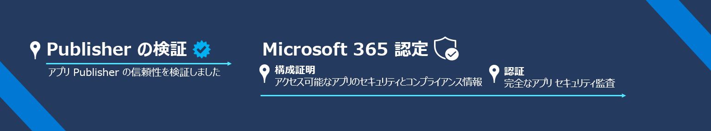

# Microsoft 365 アプリ コンプライアンス プログラム

Microsoft 365 アプリ コンプライアンス プログラムは、アプリのセキュリティとコンプライアンスへの 2 段階のアプローチであり、Publisher の検証と Microsoft 365 認定が含まれています。 各層は次の層に基づいて構築され、Microsoft 365 エコシステムでアプリを使用する際に、ユーザーに求められる信頼性を備えた階層化プログラムを提供します。   

ミッション: Microsoft のお客様に、組織を動かしているアプリケーションを完全に信頼する方法を提供します。

## Publisher の検証

[Publisher の検証](https://docs.microsoft.com/azure/active-directory/develop/publisher-verification-overview)は、管理者とユーザーが、Microsoft ID プラットフォームと統合するアプリ開発者の信頼性について理解する上で役立ちます。 アプリが Publisher の検証済みとしてマークされる場合、それは Publisher が、検証プロセスを完了して、この MPN アカウントをアプリケーション登録に関連付けた Microsoft Partner Network アカウントを使用し ID を検証したことを意味します。
Publisher の検証は、次の条件を満たすアプリに適用されます。  
- OAuth 2.0 と OpenID Connect を使用してユーザーにサインインし、Microsoft Graph などのサービス側の API を使用して、データへのアクセスを要求します。 
- Azure AD にマルチ テナントとして登録されます。  

> [!IMPORTANT]
> Publisher の検証は、アプリ開発者が Publisher の構成証明または Microsoft 365 認証を開始または完了することを防止するものではありません。 アプリの検証に適用されない場合はスキップされ、構成証明を開始することができます。

## Microsoft 365 認定
Microsoft 365 認定プロセスには、**認証** と **認定** の 2 つのフェーズがあります。
1.  **認証** には、お客様にとって最も重要なアプリのセキュリティ、データ処理、コンプライアンス属性に関するアンケートへの回答が含まれます。 その後、すべての情報が 1 つの場所で、一貫性のある読みやすい形式で公開されます。 目標は、アプリの導入プロセスを迅速に行いつつ、テナントで使用するアプリが組織の基準を満たしていることを顧客に保証することです。
1.  **認定** には、主要な業界標準フレームワークから派生した一連のコントロールに対するアプリの徹底的な監査が含まれます。 ISV では、認定を取得する前に、各コントロールを満たしていることを示す証拠を提供するよう求められます。 目標は、Microsoft 365 認定を取得したアプリが強力なセキュリティを備え、データのセキュリティとプライバシーを保護するためのコンプライアンス設定を実施し、アプリが信頼できることを顧客に保証することです。

Microsoft 365 認定は、次の Microsoft 製品と統合されるすべてのアプリに適用されます:
-   Teams
-   Word
-   Excel
-   PowerPoint 
-   Outlook
- SharePoint
- Project
- OneNote
- **Webapps** (パートナー センターの商用マーケットプレースを通じて公開されている SaaS アプリは、現在プライベート プレビュー中です。参加に興味がある場合は、[このフォーム](https://forms.microsoft.com/Pages/ResponsePage.aspx?id=v4j5cvGGr0GRqy180BHbR3Om82jEdWlAkFiVJRhmM_xUQkY0SjVVOVVLR0RUN0RYNlRWMDRTSjVQRy4u)に記入してください。

### はじめに
- [Publisher の検証を完了する方法](https://docs.microsoft.com/azure/active-directory/develop/mark-app-as-publisher-verified)
- [Microsoft 365 認定を完了する方法](https://docs.microsoft.com/microsoft-365-app-certification/docs/certification)

