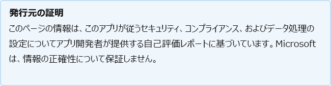

# LucidsparkLucidspark

開発者による最終更新日: 2021 年 5 月 13 日Last updated by the developer on: May 13, 2021

* <a href="https://teams.microsoft.com/l/app/e9ab21fa-5fd5-48bb-a85d-4de7ced89cd1" target="_blank">ストアでの表示Teamsする</a><a href="https://teams.microsoft.com/l/app/e9ab21fa-5fd5-48bb-a85d-4de7ced89cd1" target="_blank">View in Teams store</a>
* <a href="https://appsource.microsoft.com/product/office/WA200002583" target="_blank">AppSource での表示</a><a href="https://appsource.microsoft.com/product/office/WA200002583" target="_blank">View in AppSource</a>

::: zone pivot="general"

### 一般情報General information

Lucid Software から Microsoft に提供される情報:Information provided by Lucid Software to Microsoft:

| **Information****Information** | **応答****Response** |
|:----------------|:-------------|
| アプリ名App name | LucidsparkLucidspark |
| IDID | WA200002583WA200002583 |
| Office 365サポートされているクライアントOffice 365 clients supported | Microsoft TeamsMicrosoft Teams |
| パートナー会社名Partner company name | Lucid SoftwareLucid Software |
| パートナー Web サイトの URLURL of partner website | [https://lucid.co](https://lucid.co) |
| [アプリケーション情報Teamsページの URLURL of Teams application info page | [https://lucidchart.zendesk.com](https://lucidchart.zendesk.com) |
| プライバシー ポリシーの URLURL of Privacy Policy | [https://lucid.co/privacy](https://lucid.co/privacy) |
| 利用規約の URLURL of Terms of Use | [https://lucid.co/tos](https://lucid.co/tos) |

 [!INCLUDE [Corrections or suggestions contact information](../includes/corrections-or-suggestions.md)]

::: zone-end

::: zone pivot="data"

### アプリがデータを処理する方法How the app handles data

この情報は、このアプリが組織データを収集および保存する方法と、アプリが収集するデータに対して組織が持つコントロールに関して、Lucid Software によって提供されています。This information has been provided by Lucid Software about how this app collects and stores organizational data and the control that your organization will have over the data the app collects.

#### Microsoft サービスを使用したデータ アクセスGraphData access using Microsoft Graph

このアプリが[必要とする microsoft Graphアクセス許可](https://docs.microsoft.com/graph/permissions-reference)を一覧表示します。List any [Microsoft Graph permissions](https://docs.microsoft.com/graph/permissions-reference) this app requires.

>| **アクセス許可****Permission**  | **アクセス許可の種類 (委任/アプリケーション)****Type of permission (Delegated/Application)** | **データは収集されますか?収集の正当性****Is data collected? Justification for collecting it?** | **データは保存されますか?それを格納するための正当性?****Is data stored? Justification for storing it?** | **Azure AD アプリ ID****Azure AD App ID** |
>|:----------------|:--------------------|:---------------------------------------------------|:--------------------------|:--------------------------|
>| メールemail | 委任delegated | 名前と電子メール アドレス。Name and email address. | 電子メール、openid、およびプロファイルのアクセス許可を使用すると、Lucidspark はユーザーの openid トークンを生成し、必要に応じてユーザーに対して Lucidspark アカウントを登録するのに十分な基本的な情報を取得できます。The email, openid, and profile permissions enable Lucidspark to generate an openid token for a user and get enough basic info about the user to register a Lucidspark account for them if necessary. Microsoft から返されるデータを確認するために、応答に署名されている公開キーを取得する要求を行います。In order to verify the data that comes back from Microsoft, we make a request to get the public key that their response is signed with. その他のデータは、SSO フローの一部として Microsoft から受信または Microsoft に送信されません。No other data is received from or sent to Microsoft as part of our SSO flow. | 3557d5c0-bcab-410b-8a03-f7045aa48de03557d5c0-bcab-410b-8a03-f7045aa48de0 |
>| openidopenid | 委任delegated | 名前と電子メール アドレス。Name and email address. | 電子メール、openid、およびプロファイルのアクセス許可を使用すると、Lucidspark はユーザーの openid トークンを生成し、必要に応じてユーザーに対して Lucidspark アカウントを登録するのに十分な基本的な情報を取得できます。The email, openid, and profile permissions enable Lucidspark to generate an openid token for a user and get enough basic info about the user to register a Lucidspark account for them if necessary. Microsoft から返されるデータを確認するために、応答に署名されている公開キーを取得する要求を行います。In order to verify the data that comes back from Microsoft, we make a request to get the public key that their response is signed with. その他のデータは、SSO フローの一部として Microsoft から受信または Microsoft に送信されません。No other data is received from or sent to Microsoft as part of our SSO flow. | 3557d5c0-bcab-410b-8a03-f7045aa48de03557d5c0-bcab-410b-8a03-f7045aa48de0 |
>| profileprofile | 委任delegated | 名前と電子メール アドレス。Name and email address. | 電子メール、openid、およびプロファイルのアクセス許可を使用すると、Lucidspark はユーザーの openid トークンを生成し、必要に応じてユーザーに対して Lucidspark アカウントを登録するのに十分な基本的な情報を取得できます。The email, openid, and profile permissions enable Lucidspark to generate an openid token for a user and get enough basic info about the user to register a Lucidspark account for them if necessary. Microsoft から返されるデータを確認するために、応答に署名されている公開キーを取得する要求を行います。In order to verify the data that comes back from Microsoft, we make a request to get the public key that their response is signed with. その他のデータは、SSO フローの一部として Microsoft から受信または Microsoft に送信されません。No other data is received from or sent to Microsoft as part of our SSO flow. | 3557d5c0-bcab-410b-8a03-f7045aa48de03557d5c0-bcab-410b-8a03-f7045aa48de0 |

#### 非使用Microsoft サービスNon-Microsoft services used

アプリが組織データを Microsoft 以外のサービスと転送または共有する場合は、アプリが使用する Microsoft 以外のサービス、転送されるデータを一覧表示し、アプリでこの情報を転送する必要がある理由の理由を説明します。If the app transfers or shares organizational data with non-Microsoft service, list the non-Microsoft service the app uses, what data is transferred, and include a justification for why the app needs to transfer this information.

>| **OII のすべての非Microsoft サービスに転送されます。****All non-Microsoft services OII is transferred to** |  **どのような OII が転送されますか?****What OII is transferred?** | **OII を転送する理由****Justification for transferring OII?** |
>|:-------------------|:--------------------------|:--------------------------|
>| Lucidspark および lucidchart データは AWS と Snowflake に保存されますLucidspark and lucidchart data is stored in AWS and Snowflake | 組織名、連絡先情報、およびライセンス レベルOrganization name, contact info, and license level | Microsoft API は使用しない。We don't use any Microsoft APIs. openID を使用して、SSO を実行するための基本的なユーザー データを取得します。We use openID to get basic user data to perform SSO. ファイル ピッカー API を使用しますが、ピッカーから送信されたファイル以外のユーザーのファイルにアクセスすることはできません。We use their file picker API, but that doesn't give us access to the user's files other than the ones that they submit to us through the picker. |

#### ボット経由のデータ アクセスData access via bots

このアプリにボットまたはメッセージング拡張機能が含まれている場合は、エンド ユーザー識別可能な情報 (EUII) にアクセスできます。チームまたはチャットのチーム メンバーの名簿 (名簿、名、表示名、電子メール アドレス)。If this app contains a bot or a messaging extension, it can access end-user identifiable information (EUII): the roster (first name, last name, display name, email address) of any team member in a team or chat it's added to. このアプリは、この機能を利用しますか?Does this app make use of this capability?

>EUII にはアクセスされません。No EUII is accessed.

#### テレメトリ データTelemetry data

組織識別可能な情報 (OII) またはエンド ユーザー識別可能な情報 (EUII) は、このアプリケーションのテレメトリまたはログに表示されますか?Does any organizational identifiable information (OII) or end-user identifiable information (EUII) appear in this application's telemetry or logs? はいの場合は、保存されているデータと保持ポリシーと削除ポリシーについて説明します。If yes, describe what data is stored and what are the retention and removal policies?

>セキュリティおよびサポート上の理由から、電子メールと IP アドレスをログに記録します。We log email and IP addresses for security and support reasons. ログへのアクセスはすべて、第三者システムでは実際には変更できません &amp; 。All access to logs is recorded &amp; logs are actually unchangeable in a third party system. ログへのアクセスには MFA が必要です。Access to logs requires MFA.

#### パートナーによって保存されるデータの組織的な制御Organizational controls for data stored by partner

組織の管理者がパートナー システムで情報を制御する方法について説明します。削除、保持、監査、アーカイブ、エンドユーザー ポリシーなど。Describe how organization's administrators can control their information in partner systems? e.g. deletion, retention, auditing, archiving, end-user policy, etc.

>Lucidspark および lucidchart データは AWS に保存されます。Lucidspark and lucidchart data is stored in AWS. これは、保存時と転送中に暗号化されます。It is encrypted at rest and in transit. Lucid は、最小特権と MFA のルールを使用します。Lucid uses the rules of least privilege and MFA.

#### 組織情報の人間によるレビューHuman review of organizational information

人間は、このアプリによって収集または保存される組織識別可能な情報 (OII) データの確認または分析に関与していますか?Are humans involved in reviewing or analyzing any organizational identifiable information (OII) data that is collected or stored by this app?

>いいえNo

[!INCLUDE [Corrections or suggestions contact information](../includes/corrections-or-suggestions.md)]

::: zone-end

::: zone pivot="mcas"

以下[に、Microsoft Cloud App Security](https://www.microsoft.com/enterprise-mobility-security/cloud-app-security)カタログの情報が表示されます。Information from the [Microsoft Cloud App Security](https://www.microsoft.com/enterprise-mobility-security/cloud-app-security) catalog appears below.

<iframe height='1020' title='Microsoft Cloud App Security情報Microsoft Cloud App Security Information' src='https://appmcasinfoprod.azurewebsites.net/#/dashboard/39482' frameborder='no' style='width: 100%;'></iframe>

<a href="https://appmcasinfoprod.azurewebsites.net/#/dashboard/39482" target="_blank">新しいタブで表示する</a>

<a href="https://appmcasinfoprod.azurewebsites.net/#/dashboard/39482" target="_blank">View in a new tab</a>

[!INCLUDE [Corrections or suggestions contact information](../includes/corrections-or-suggestions.md)]

::: zone-end

::: zone pivot="identity"

### ID 情報Identity information

この情報は、このアプリが認証、承認、アプリケーション登録のベスト プラクティス、その他の IDENTITY 条件を処理する方法について、Lucid Software によって提供されています。This information has been provided by Lucid Software about how this app handles authentication, authorization, application registration best practices, and other Identity criteria.

| **Information****Information** | **応答****Response** |
|:----------------|:-------------|
| Microsoft Identify Platform (Azure AD) と統合しますか?Do you integrate with Microsoft Identify Platform (Azure AD)?  | なしNo |

[!INCLUDE [Corrections or suggestions contact information](../includes/corrections-or-suggestions.md)]

::: zone-end
