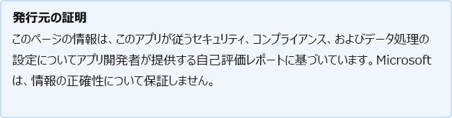

# Org@Work

開発者が最終更新日: 2021 年 8 月 10 日

* <a href="https://teams.microsoft.com/l/app/b9f5d3b0-424e-473d-bcbe-dd01f17f9a41" target="_blank">ストアでの表示Teamsする</a>
* <a href="https://appsource.microsoft.com/product/office/WA200002461" target="_blank">AppSource での表示</a>

::: zone pivot="general"

### 一般情報

Lundano が Microsoft に提供する情報:

| **Information** | **Response** |
|:----------------|:-------------|
| アプリ名 | Org@Work |
| ID | WA200002461 |
| Office 365サポートされているクライアント | Microsoft Teams |
| パートナー会社名 | Lundano |
| パートナー Web サイトの URL | [https://www.lundano.com/en/](https://www.lundano.com/en/) |
| [アプリケーション情報Teamsページの URL | [https://www.lundano.com/orgatwork/index.html#](https://www.lundano.com/orgatwork/index.html#) |
| プライバシー ポリシーの URL | [https://cp.lundano.com/privacy_en.html](https://cp.lundano.com/privacy_en.html) |
| 利用規約の URL | [https://cp.lundano.com/Terms_en.html](https://cp.lundano.com/Terms_en.html) |

 [!INCLUDE [Corrections or suggestions contact information](../includes/corrections-or-suggestions.md)]

::: zone-end

::: zone pivot="data"

### アプリがデータを処理する方法

この情報は、このアプリが組織データを収集して格納する方法と、アプリが収集するデータに対して組織が持つコントロールについて Lundano によって提供されています。

#### Microsoft サービスを使用したデータ アクセスGraph

このアプリが[必要とする microsoft Graphアクセス許可](https://docs.microsoft.com/graph/permissions-reference)を一覧表示します。

>| **アクセス許可**  | **アクセス許可の種類 (委任/アプリケーション)** | **データは収集されますか?収集の正当性** | **データは保存されますか?それを格納するための正当性?** | **Azure AD アプリ ID** |
>|:----------------|:------------------------------------------------|:--------------------------------------------------------|:--------------------------------------------------|:--------------------|
>| User.Read | 委任 | データを格納しています。 データを使用してユーザーにログインOrg@work | なし | [aa1c54a1-f482-424d-9389-dbd131233483](https://docs.microsoft.com/microsoft-365-app-certification/azure/aa1c54a1-f482-424d-9389-dbd131233483) |
>| メール | 委任 | データを格納しています。 データを使用してユーザーにログインOrg@work | なし | [aa1c54a1-f482-424d-9389-dbd131233483](https://docs.microsoft.com/microsoft-365-app-certification/azure/aa1c54a1-f482-424d-9389-dbd131233483) |
>| offline_access | 委任 | データを格納しています。 データを使用してユーザーにログインOrg@work | なし | [aa1c54a1-f482-424d-9389-dbd131233483](https://docs.microsoft.com/microsoft-365-app-certification/azure/aa1c54a1-f482-424d-9389-dbd131233483) |
>| openid | 委任 | データを格納しています。 データを使用してユーザーにログインOrg@work | なし | [aa1c54a1-f482-424d-9389-dbd131233483](https://docs.microsoft.com/microsoft-365-app-certification/azure/aa1c54a1-f482-424d-9389-dbd131233483) |
>| profile | 委任 | データを格納しています。 データを使用してユーザーにログインOrg@work | none | [aa1c54a1-f482-424d-9389-dbd131233483](https://docs.microsoft.com/microsoft-365-app-certification/azure/aa1c54a1-f482-424d-9389-dbd131233483) |

#### 非使用Microsoft サービス

アプリが組織データを Microsoft 以外のサービスと転送または共有する場合は、アプリが使用する Microsoft 以外のサービス、転送されるデータを一覧表示し、アプリでこの情報を転送する必要がある理由の理由を説明します。

>非Microsoft サービスは使用されません。

#### ボット経由のデータ アクセス

このアプリにボットまたはメッセージング拡張機能が含まれている場合は、エンド ユーザー識別可能な情報 (EUII) にアクセスできます。チームまたはチャットのチーム メンバーの名簿 (名簿、名、表示名、電子メール アドレス)。 このアプリは、この機能を利用しますか?

>| **EUII にアクセスする理由**  | **EUII はデータベースに格納されていますか?** | **EUII を格納するための理由** |
>|:---------------------------------------|:-----------------------------------|:------------------------------------|
>| ボット プッシュでは、計画マネージャーの従業員の名前をメンションして確認する必要があります。 | 従業員の名、 &amp; 電子メールアドレス、職場、組織 | これらの情報は、プロセス のワークフロー Org@Work計画マネージャーが必要 &amp; とします。 |

#### テレメトリ データ

組織識別可能な情報 (OII) またはエンド ユーザー識別可能な情報 (EUII) は、このアプリケーションのテレメトリまたはログに表示されますか? はいの場合は、保存されているデータと保持ポリシーと削除ポリシーについて説明します。

>アプリケーションのテレメトリまたはログに OII または EUII は表示されません。

#### パートナーによって保存されるデータの組織的な制御

組織の管理者がパートナー システムで情報を制御する方法について説明します。削除、保持、監査、アーカイブ、エンドユーザー ポリシーなど。

>エンド ユーザー ポリシー、契約契約、削除

#### 組織情報の人間によるレビュー

人間は、このアプリによって収集または保存される組織識別可能な情報 (OII) データの確認または分析に関与していますか?

>いいえ

[!INCLUDE [Corrections or suggestions contact information](../includes/corrections-or-suggestions.md)]

::: zone-end

::: zone pivot="mcas"

以下[に、Microsoft Cloud App Security](https://www.microsoft.com/enterprise-mobility-security/cloud-app-security)カタログの情報が表示されます。

<iframe height='1020' title='Microsoft Cloud App Security情報' src='https://appmcasinfoprod.azurewebsites.net/#/dashboard/36914' frameborder='no' style='width: 100%;'></iframe>

<a href="https://appmcasinfoprod.azurewebsites.net/#/dashboard/36914" target="_blank">新しいタブで表示する</a>

[!INCLUDE [Corrections or suggestions contact information](../includes/corrections-or-suggestions.md)]

::: zone-end

::: zone pivot="identity"

### ID 情報

この情報は、このアプリが認証、承認、アプリケーション登録のベスト プラクティス、その他の Identity 条件を処理する方法について Lundano によって提供されています。

| **Information** | **Response** |
|:----------------|:-------------|
| Microsoft Identify Platform (Azure AD) と統合しますか?  | はい |
| 統合チェックリストの概要に示されている適用可能なすべてのベスト プラクティスを確認し、Microsoft ID プラットフォームしましたか?  | はい |
| アプリで認証に MSAL (Microsoft 認証ライブラリ) を使用していますか? | いいえ |
| アプリは条件付きアクセス ポリシーをサポートしていますか? | はい |
| サポートされているポリシーの種類を一覧表示する | 従業員、計画マネージャー、管理者 |
| アプリがシナリオに対して最小特権のアクセス許可を要求していますか? | はい |
| アプリの静的に登録されたアクセス許可は、アプリが動的かつ段階的に要求するアクセス許可を正確に反映していますか? | はい |
| アプリはマルチテナントをサポートしていますか? | はい |
| アプリに機密クライアントがありますか? | いいえ |
| アプリに登録されているリダイレクト統合リソース識別子 (URI) はすべて所有していますか? | はい |
| アプリの場合、何を使用しないのですか? | - ワイルドカード リダイレクト URI、 - OAuth2 暗黙的Flow SPA に必要な場合を含む場合を含む - リソース所有者パスワード資格情報 (ROPC) フロー |
| アプリは Web API を公開していますか? | いいえ |
| アプリでプレビュー API を使用していますか? | いいえ |
| アプリで非推奨の API を使用していますか? | いいえ |

[!INCLUDE [Corrections or suggestions contact information](../includes/corrections-or-suggestions.md)]

::: zone-end
